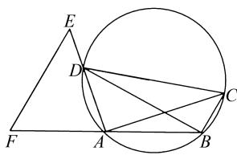
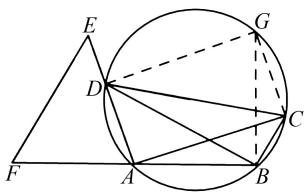
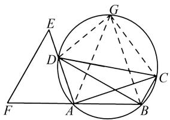
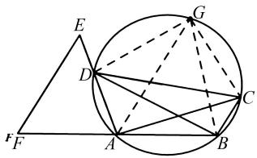
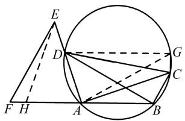
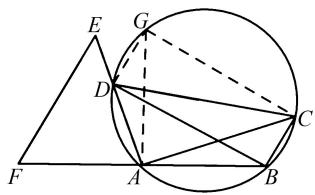
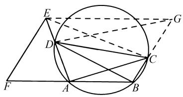
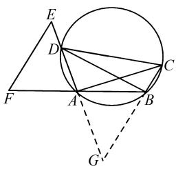
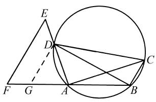

# 巧构造 善推理

——以浙江省 2024 年中考数学第 24 题为例

# 马飞 沈敏辉

(象山县高塘中学, 浙江 宁波 315734)

摘 要:以圆内接四边形为背景的几何综合题是浙江省中考数学试题的常见问题,也是学生解题的难点.在解题过程中,学生通常难以想到辅助线的构造方法,无法自然形成解题思路.笔者针对2024年中考压轴题,基于学情,始于教材,从学生思维出发,自然构造辅助线,教会学生借助图形分析问题,形成解决问题的基本思路,发展学生的模型观念,从而提升其几何推理能力.

关键词: 构造; 模型; 推理; 解法

中图分类号：G632

文献标识码:A

文章编号:1008-0333(2025)14-0029-03

2023 年 10 月 26 日浙江省教育厅发布了《浙江省教育厅关于实施初中学业水平考试全省统一命题的通知》，以此稳步实施浙江省初中学业水平考试全省统一命题工作。笔者认为，考虑到绝大部分地区学生的学情，题目的难度一定会有所下降。为了把握新中考后续的命题方向，笔者对 2024 年浙江省中考数学第 24 题展开分析，供读者参考。

# 1 试题呈现

(浙江省 2024 年中考数学第 24 题) 如图 1, 在圆内接四边形 ABCD 中, AD < AC, $\angle ADC < \angle BAD$ , 延长 AD 至点 E, 使 AE = AC, 延长 BA 至点 F, 连接 EF, 使 $\angle AFE = \angle ADC$ .

(1) 若 $\angle AFE = 60^{\circ}$ , CD 为直径, 求 $\angle ABD$ 的度数;  
(2) 求证: ① $EF \parallel BC$ ; ②EF = BD.

# 2 解法探究

从问题设置来看,第(1)问低起点,非常简单,

text_image

Geometric diagram showing a triangle and a circle with labeled points A, B, C, D, E, F and connecting lines.

图 1 中考数学第 24 题图

起铺垫作用,适合大多数学生.第(2)问是重点,学生需要熟练掌握“圆内接四边形对角互补”性质、平行线判定等知识,并有机结合,适合中等水平学生.第(2)问中的第②小问是难点,其难度较大,考查学生的几何构造能力与推理能力,适合基础较好的学生,具有极强的选拔性功能,限于篇幅,笔者主要研究第②小问.

思路 1 作平行,构全等.

解法 1 如图 2, 过点 C 作 $CG \parallel AD$ , 交圆于点 G, 连接 GD, GB. 因为 $CG \parallel AD$ , 所以 $\angle DAC + \angle ACG = 180^{\circ}$ . 因为四边形 ADCG 内接于圆, 所以 $\angle DAC + \angle DGC = 180^{\circ}$ , 所以 $\angle DGC = \angle ACG$ . 同理可得 $\angle DGC = \angle ACG = \angle ADG = \angle DAG = 90^{\circ}$ . 又因为 AE$= AC$ ，所以 $AE = AC = DG.$ 四边形ADGB内接于圆，所以 $\angle EAF = \angle DGB.$ 又因为 $\angle AFE = \angle ADC$ ，所以 $\triangle EAF\cong \triangle DGB,$ 所以 $EF = BD.$

text_image

Geometric diagram with triangle, circle, and labeled points (A, B, C, D, E, F, G)

图2 解法1示意图

解法 2 如图 3, 过点 B 作 $BG \parallel AD$ , 交圆于点 G, 连接 GA, GC, GD. 因为 $BG \parallel AD$ , 所以 AG = DB. 四边形 ADGB 内接于圆, 所以 $\angle EAF = \angle DGB$ . 因为 AG = DB, 所以 $\angle ACG = \angle DGB$ . 因为 $\angle AFE = \angle ADC$ , 所以 $\angle AFE = \angle ADC = \angle AGC$ . 又 AE = AC, 所以 $\triangle EAF \cong \triangle ACG$ , 所以 EF = AG. 故 EF = BD.

text_image

Geometric diagram showing a triangle and a circle with labeled points and lines, including auxiliary constructions.

图 3 解法 2 示意图

解法 3 如图 4, 过点 A 作 $AG \parallel BC$ , 交圆于点 G, 连接 GB, GC, GD. 四边形 ADGB 内接于圆, 所以 $\angle EAF = \angle DGB$ . 因为 $AG \parallel BC$ , 所以 AC = BG = AE. 因为 AC = BG, 所以 $\angle AGC = \angle GAB$ , 所以 $\angle AGC = \angle ADC = \angle GAB = \angle GDB$ . 又 $\angle AFE = \angle ADC$ , 所以 $\angle AFE = \angle GDB$ , 所以 $\triangle EAF \cong \triangle BGD$ , 故 EF = BD.

text_image

Geometric diagram showing a triangle and a circle with labeled points and lines, likely from a math problem or proof.

图 4 解法 3 示意图

解法 4 如图 5, 过点 D 作 $DG \parallel AB$ , 交圆于点 G, 连接 GA, GC, GD. 在 AF 上取一点 H, 使 EH = EA. 因为 $DG \parallel AB$ , 所以 AG = BD, $\angle ACG = \angle DAB$ . 因为 EH = EA, 所以 $\angle EAH = \angle EHA$ . 因为 $\angle EAH + \angle DAB = 180^{\circ}$ , $\angle EHA + \angle EHF = 180^{\circ}$ , 所以 $\angle EHF = \angle DAB$ , 所以 $\angle EHF = \angle ACG$ . 因为 $\angle AFE = \angle ADC$ , $\angle AGC = \angle ADC$ , 所以 $\angle AGC = \angle AFE$ . 又因为 AE

$= AC = EH$ ，所以 $\triangle EHF\cong \triangle ACG$ ，所以 $EF = AG.$ 从而易知 $EF = BD$

text_image

Geometric diagram showing a triangle and a circle with labeled points and lines, including dashed auxiliary lines.

图 5 解法 4 示意图

解法 5 如图 6, 过点 D 作 $DG \parallel BC$ , 交圆于点 G, 连接 GA, GC, GD. 由解法 1 可知, 四边形 CGDB 是等腰梯形. 因为四边形 ADCB 内接于圆, 所以 $\angle EAF = \angle DCB$ . 因为 $DG \parallel BC$ , 所以 $\angle EAF = \angle DCB = \angle GDC = \angle GAC$ . 又因为 $\angle AFE = \angle ADC = \angle AGC$ , AE = AC, 所以 $\triangle AEF \cong \triangle ACG$ , 所以 EF = CG. 从而易知 EF = BD.

text_image

Geometric diagram with triangle, circle, and labeled points (A, B, C, D, E, F, G) for mathematical analysis

图 6 解法 5 示意图

解法6 如图7, 过点 $E$ 作 $EG \parallel BF$ , 构造平行四边形 $EFBG$ , 连接 $EC, GD$ . 因为 $EG \parallel BF$ , 所以 $\angle G + \angle ABC = 180^\circ$ . 因为 $\angle EDC = \angle ABC$ , 所以 $\angle G + \angle EDC = 180^\circ$ , 即 $E, D, C, G$ 四点共圆, 所以 $\angle DEC = \angle DGC$ . 因为 $AE = AC$ , 所以 $\angle DEC = \angle ACE = \angle DGC$ . 设 $\angle DEC = \angle ACE = \angle DGC = x$ , 则 $\angle EAC = 180^\circ - 2x$ , $\angle DBC = 180^\circ - 2x$ , $\angle GDB = 180^\circ - \angle DGC - \angle DBC = 180^\circ - x - (180^\circ - 2x) = x$ , 所以 $\angle DGB = \angle BDG$ , 所以 $BD = BG$ . 又因为四边形 $EFBG$ 是平行四边形, 所以 $BD = BG = EF$ .

text_image

Geometric diagram with labeled points and lines, showing a circle intersecting a quadrilateral and tangent to a triangle.

图 7 解法 6 示意图

思路 2 作平行,构相似.

解法 7 如图 8, 延长 DA, CB 交于点 G. 易证

$\triangle EFA \sim \triangle GBA$ ，所以 $\frac{EF}{BG} = \frac{AE}{AG}$ ，即 $\frac{AG}{BG} = \frac{AE}{EF}$ 。又因为 $\angle ADB = \angle ACB$ ，所以 $\triangle GAC \sim \triangle GBD$ ，所以 $\frac{AC}{BD} = \frac{AG}{BG}, \frac{AC}{BD} = \frac{AE}{EF}$ 。因为 $AE = AC$ ，所以 $EF = BD$ 。

text_image

Geometric diagram with labeled points and lines, including triangle EFD and circle ABC with auxiliary points A, B, C, D, G.

图8 解法7示意图

解法8 如图9, 过点 $D$ 作 $DG \parallel EF$ . 易证 $\triangle EFA \sim \triangle DGA$ , 故 $\frac{GD}{AD} = \frac{EF}{AE}$ . 因为 $\angle DCA = \angle DBA$ , $\angle AFE = \angle ADC = \angle DGA$ , 所以 $\triangle DAC \sim \triangle GBD$ , 所以 $\frac{GD}{AD} = \frac{BD}{AC}$ , 故 $\frac{AC}{BD} = \frac{AE}{EF}$ . 因为 $AE = AC$ , 所以 $EF = BD$ .

text_image

Geometric diagram showing a triangle and a circle with labeled points and lines, likely from a math problem or proof.

图9 解法8示意图

# 3 试题评价

# 3.1 全面考查“四基”，坚持素养立意

《义务教育数学课程标准(2022年版)》(以下简称《课程标准》)指出,以核心素养为导向的考试命题要关注数学的本质,关注通性通法,综合考查“四基”“四能”等核心素养[1].在本题第(1)问中,“CD为直径”是关键词,容易想到“直径所对圆周角为直角”,结合所给角度 $\angle AFE=60^{\circ}$ ,易得出同弧所对圆周角的度数.第(2)问以 $\angle AFE=\angle ADC$ 为题眼,以 $EF\parallel BC$ 为指引方向,图形结构简单,易于引发联想.一方面考查圆内接四边形圆的性质与平行线的判定等核心知识,另一方面考查学生运用数学思维思考与数学语言表达的能力,让学生“跳一跳”就能够得着,体现了人文关怀,坚持了素养立意.

# 3.2 重点考查四能,凸显育人导向

本题图形结构简单、问题表达清晰,涵盖了几何证明的主要方法,注重考查学生思维过程,渗透了化归思想.本题通过构造全等三角形、相似三角形或平行四边形,让学生经历分析和解决问题的过程,并用数学语言严谨表达思维过程,实现了对核心素养导向的数学课程学业质量的全面考查,具备选拔功能.

# 4 教学导向

# 4.1 强化基础知识,练就基本技能

在初中数学教学中,教师应该研读《课程标准》,注重教学内容的结构化,强化对数学本质的理解,关注数学概念的发生发展.在把握学情的情况下,关注学生解决问题时遇到的实际障碍,采取精准讲解、小组合作等形式培养学生解决问题的能力.

# 4.2 关注一题多解,发展推理能力

一题多解可以开阔思路、发散思维,促进学生多角度分析和解决问题;而多解归一可以加深学生对数学原理、通性通法的认识,提高解题技巧和能力.在教学中,师生需共同对不同解法进行提炼、优化与归纳.与此同时,教师要注重学生参与的广度和深度,在解决问题过程中发展学生逻辑推理能力.

# 4.3 注重反思归纳,确保素养落地

在初中数学教学中,教师应引导学生做好归纳总结:一是引导学生用整体的知识结构整理本题包含的知识点;二是解题路径与方法的总结;三是数学思想的提炼.这样才能确保核心素养真正落地.

# 5 结束语

笔者研究了 2024 年浙江省中考数学试卷的压轴题, 分析了题目中的条件和结论, 并结合知识考点, 从不同角度探究其解答, 还分析了试题所蕴含的数学逻辑, 剖析其所要培养的数学素养, 旨在帮助教师更好地掌握中考数学命题方向.

# 参考文献：

[1] 中华人民共和国教育部. 义务教育数学课程标准(2022年版)[M]. 北京: 北京师范大学出版社, 2022. [责任编辑: 李慧娇]