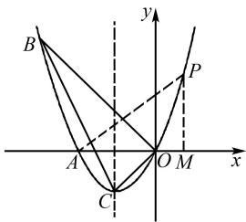

# 巧用数学思想解决运动型问题

蔡龙斌

(福建省永春第二中学, 福建 泉州 362600)

摘 要:运动型问题在初中数学中屡见不鲜,这类问题对学生的数学思维能力要求较高.文章在掌握数学运动型问题类型及特点的基础上,主要阐述分类讨论、转化思想、数形结合、函数方程、类比、建模等数学思想在解决运动型问题中的应用,并结合具体的实例分析运动型问题的解决方法,旨在充分发挥数学思想的作用,提高学生解决运动型问题的能力,提升学生的解题效率.

关键词: 数学思想; 初中数学; 运动型问题

中图分类号：G632

文献标识码:A

随着教育改革的不断深入,数学领域越来越注重培养学生的综合素质,运动型问题的考查方向契合教育改革的要求.运动型问题是初中数学中一类特殊问题,它涵盖代数、几何等多个数学分支的知识点,因涉及变量多、关系复杂而成为学生学习的难点,要求学生具备良好的空间想象能力、逻辑推理能力和实际问题解决能力.数学思想是现实世界的空间形式和数量关系反映到个体的意识之中,经过思维活动而产生的一种结果,体现了数学发展的普遍规律.因此,探索数学思想在解决运动型问题中的应用,对落实新课程改革要求具有重要意义.

# 1 数学运动型问题分析

运动型问题是从运动的观点探究几何图形变化规律的一类数学问题.大致可以分为点运动型、线运动型和图形运动型三类[1].点运动型问题通常涉及点在特定路径上的移动,通过点的运动轨迹和速度等条件,探讨相关几何元素之间的变化规律;线运动型问题关注线段或直线的运动,通过线段的伸缩、旋转或平移等运动方式,研究图形的形状和性质的变化;图形运动型问题更为复杂,涉及整个几何图形的旋转、翻折或平移等运动,要求学生在图形运动的过

文章编号:1008-0333(2025)14-0002-03

程中,捕捉和解析几何元素之间的变化关系.运动型问题具有以下几个显著特点:第一,涉及的知识点多,综合性较强.不仅涉及函数与方程、相似三角形、图形面积等知识,还与相似三角形及解直角三角形等知识有关.第二,蕴含丰富的数学思想.运动型问题的解决过程涉及方程思想、分类讨论思想、数形结合思想等多种数学思想.第三,关注学生的运算能力.运动型问题通常涉及多个变量和复杂的几何关系,因此要求学生具备较强的运算能力 $^{[2]}$ .第四,问题设计循序渐进,难度起伏适度.运动型问题通常包含多个小问题,这些小问题之间存在内在的联系,从简单到复杂,从基础到进阶,逐步引导学生深入探究.

# 2 数学思想在解决运动型问题中的应用

# 2.1 分类讨论思想的应用

分类讨论思想强调,在面对复杂问题时,根据问题的不同情况或条件,将其分成若干个子问题或类别,然后分别对每个子问题或类别进行研究和讨论,最后综合各个子问题或类别的结果,得出原问题的解.在运动型问题中,图形的运动伴随着多种可能情况或条件变化,因此分类讨论思想成为解决这类问题的有效工具 $^{[3]}$ .利用分类讨论思想解决运动型问题,关键在于准确识别问题的分类依据,并合理划分出各个子问题或不同类别.

# 2.2 类比分析思想的应用

类比分析思想强调的是基于事物之间的相似性,通过比较不同对象或情境的共同点和差异点,推导出新的结论或解决问题的方法.在数学、物理、化学、生物等多个学科中都有显著的体现.数学运动型问题通常涉及几何图形的动态变化,如点的移动、线段的伸缩、图形的旋转或平移等,这些变化伴随着复杂的数学关系,导致问题变得复杂且难以直接解决.类比分析思想是解决这类问题的有效工具.在运动型问题中,通过类比已知的简单情境,可以将复杂问题转化为更易于理解的形式,从而为问题解决创造条件.

为了有效利用类比分析思想解决运动型问题,首先需要仔细审题,既要明确问题的类型和特点,又要明确有关运动状态和数学关系.其次需要搜索与问题相似的已知情境,并确定两者之间的共同点和差异点.在找到相似情境后,需要确定类比对象之间的对应关系、数学关系及解题方法的类比,将已知信息和规律应用到未知问题中.最后需要将答案代入原问题中进行检验,如果答案与预期结果相符,则说明类比分析正确;如果答案有误,则需要重新审视类比关系和解题过程,找出错误的原因并进行修正,从而得到完整的解题过程.

# 2.3 函数方程思想的应用

函数方程思想是将实际问题中的关系抽象为函数或方程的形式,揭示出数学问题的本质和规律的一种思想,它能够将运动型问题中的变量关系转化为函数或方程,从而简化问题的求解过程.在利用函数方程思想解决运动型问题时,首先需要明确问题中的变量及变量之间的关系,变量包括点的坐标、线段的长度、图形的面积等;变量之间的关系包括比例关系、函数关系等.其次,根据问题的实际情况,选择合适的函数或方程形式,描述变量之间的关系.例如,在描述点的移动轨迹时,可以选择一次函数或二次函数;在描述图形的面积变化时,需要建立不等式或方程.在确定变量及变量关系后,根据已知条件和变量关系,建立函数或方程准确地反映问题中的实际情况.最后,运用代数运算、方程求解、不等式分析等方法,求解函数或方程问题,最终找到问题的答案.

# 2.4 转化化归思想的应用

在运动型问题中,点线面的动态变化使问题本身呈现出复杂性和不确定性. 在解决此问题时,可以利用转化思想,将动态问题静态化. 在将动态问题静态化的过程中,首先需要明确动态问题的特征,包括图形变化方式、变量变化规律及问题的具体要求. 其次,选择特定的状态,固定动态问题中的图形关系,形成静态的几何图形. 利用已知的静态几何知识和方法分析静态图形,找出其中的几何关系,建立数学模型. 最后,求解模型,得到问题的答案. 例如,在解决涉及图形旋转的动态几何问题时,可以选择特定的旋转角,固定旋转后的图形,再利用静态几何中的角度、边长、面积等关系,建立数学模型并求解.

# 2.5 数形结合思想的应用

数形结合思想强调将数学中的抽象概念、数量关系与直观图形相结合,利用更加直观的图形辅助理解和解决数学问题,其核心在于利用图形的直观性和形象性揭示数学问题的本质,从而简化问题,提高学生的解题效率.例如,对于点的移动问题,可以选择轨迹图;对于线段的伸缩问题,可以选择长度变化图,以此找到问题的关键信息.在观察和分析图形结构特征的基础上,建立数学模型,描述问题的动态变化过程,利用数学模型进行求解,验证结果的正确性和合理性.在求解过程中,利用数形结合思想可以简化计算过程,提高解题效率.

# 3 运动型问题例举

例 1 如图 1, 已知抛物线 $y = ax^{2} + bx + c$ 经过 $A(-2,0)$ , $B(-3,3)$ 及原点 O, 顶点为 C.

(1) 求抛物线的解析式;

(2) 若点 D 在抛物线上, 点 E 在抛物线的对称轴上, 且以 A, O, D, E 为顶点的四边形是平行四边形, 求点 D 的坐标;

(3) P 是抛物线上的第一象限内的动点, 过点 P作 $PM \perp x$ 轴, 垂足为 M, 是否存在点 P, 使得以 P, M, A 为顶点的三角形与三角形 BOC 相似? 若存在, 求出点 P 的坐标; 若不存在, 请说明理由.

text_image

B
y
P
A
O M
x
C

图1 例1图

分析 对于问题(1)，根据已知条件，抛物线 $y = ax^{2} + bx + c$ 经过 $A(-2,0), B(-3,3), O(0,0)$ . 将 $A(-2,0), B(-3,3), O(0,0)$ 分别代入 $y = ax^{2} + bx + c$ ，得 $\begin{cases} 4a - 2b + c = 0, \\ 9a - 3b + c = 3, \\ c = 0, \end{cases}$ 解得 $\begin{cases} a = 1, \\ b = 2, \\ c = 0. \end{cases}$ 即抛物线的解析式为 $y = x^{2} + 2x$ .

对于问题(2)，根据平行四边形的性质和抛物线的解析式，可以通过构建关于点 $D$ 坐标的方程，求解点 $D$ 的坐标.但因题目的已知条件中只说明点 $E$ 在抛物线的对称轴上，并未说明点 $E$ 在 $x$ 轴上方还是 $x$ 轴下方，具体位置不确定.因此，在求解此问题的过程中，需要采用分类讨论思想

第1种情况: 当 OA 为边时, 根据平行四边形的性质可得 DE = OA = 2, 进而得出点 D 在 x 轴上方. 因为抛物线的解析式为 $y = x^{2} + 2x$ , 所以抛物线的对称轴为 x = -1, 进而求得点 D 的横坐标为 1 或 -3, 将点 D 的横坐标代入抛物线的解析式可得点 D 的坐标为 $(-3, 3)$ 或 $(1, 3)$ .

第2种情况: 当OA为平行四边形的对角线时, 由平行四边形的性质可知DE与OA互相平分. 因为 $A(-2,0)$ , $O(0,0)$ 的中点在对称轴上, 点E在对称轴上, 所以点E的横坐标也为-1. 因为DE与OA互相平分, 点D也在对称轴上, 所以点D的横坐标为-1, 将其代入抛物线的解析式可得点D的纵坐标为-1, 所以点D的坐标为 $(-1,-1)$ .

综上所述,点 D 的坐标分别为 $(-3,3)$ , $(1,3)$ , $(-1,-1)$ .

对于问题(3)，判断是否存在点 P，使得 $\triangle PMA$ 与 $\triangle BOC$ 相似，两个三角形相似需要满足对应角相等或对应边成比例，因此需要考虑 $\triangle PMA$ 与 $\triangle BOC$ 的相似条件。根据相似三角形的判定，构建关于点 P 的坐标的方程。因为点 P 在抛物线 $y = x^{2} + 2x$ 上，可以利用抛物线的解析式进一步限制点 P 的可能位置。又因为相似三角形的对应点不固定，所以需要分别讨论，最终得到点 P 的可能坐标。

根据三角形三个顶点的坐标判断 $\triangle BOC$ 的性质. 根据抛物线的解析式易求得 $C(-1, -1)$ , 从而可求得 $BO^2 = 18$ , $CO^2 = 2$ , $BC^2 = 20$ , 根据勾股定理的逆定理可判断 $\triangle BOC$ 为直角三角形. 假设存在点 $P(x, y)$ , 使得 $\triangle PMA$ 与 $\triangle BOC$ 相似, 易得点 $M$ 坐标为 $(x, 0)$ .

第1种情况: 当 $\triangle PMA \sim \triangle BOC$ 时, 根据对应边的比例关系可得 $3\sqrt{2}(x^{2} + 2x) = \sqrt{2}(x + 2)$ , 解得 $x_{1} = \frac{1}{3}$ , $x_{2} = -2$ (不合题意, 舍去), 将 $x = \frac{1}{3}$ 代入 y = $x^{2} + 2x$ , 易求得 $y = \frac{7}{9}$ .

第2种情况: 当 $\triangle PMA \sim \triangle COB$ 时, 根据对应边的比例关系可得 $\sqrt{2}(x^{2} + 2x) = 3\sqrt{2}(x + 2)$ , 解得 $x_{1} = 3, x_{2} = -2$ (不合题意, 舍去), 将 x = 3 代入 $y = x^{2} + 2x$ , 易求得 y = 15.

综上所述,存在点 P, 使得 $\triangle PMA$ 与 $\triangle BOC$ 相似, 点 P 的坐标为 $(\frac{1}{3}, \frac{7}{9})$ 或 (3, 15).

# 4 结束语

数学思想在解决运动型问题的过程中扮演着至关重要的角色. 教师通过引导学生从不同角度思考问题, 不仅能够帮助学生更好地理解数学概念, 还能激发学生的学习兴趣, 培养学生解决问题的能力. 未来, 教师应当更加注重数学思想的应用, 为学生提供更多元、更高效的解题方法. 同时, 学生应该主动探索和实践, 将数学知识与实际问题相结合, 真正做到学以致用, 同步提升综合素养, 为未来的发展奠定基础.

# 参考文献：

[1] 吴震. 突破中考之运动型数学问题研究 [J]. 数理天地 (初中版), 2024(18): 10-11.  
[2] 张颖. 特殊四边形运动型问题探究 [J]. 初中生学习指导, 2023(12): 36-39.  
[3] 韩诗贵, 庞彦福. 运动型问题 [J]. 中学数学教学参考, 2019(Z2): 121-125.

[责任编辑:李慧娇]