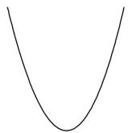
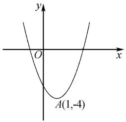
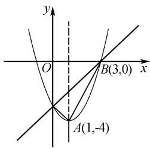
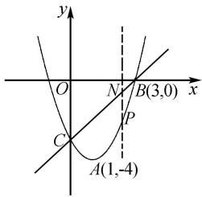
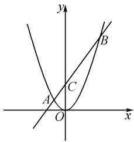
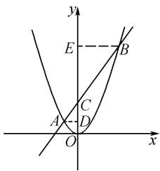

# 探究一幅图生成的二次函数问题

邵浩宇

(江苏省无锡市东北塘中学, 江苏 无锡 214191)

摘 要:二次函数在初中数学中占有重要地位,是历年中考压轴题的重要命题对象.为此,笔者基于一幅简图,逐渐添加已知条件,复习二次函数整章内容,节约教学时长,使二次函数复习过程灵活化、个性化和高效化.同时,在教学过程中,使学生体会“斜化直”转化的数学思想,感受知识间的融会贯通,推动学生基本数学思想和素养的形成.

关键词:二次函数;转化思想;核心素养

中图分类号：G632

文献标识码:A

数学是一门逻辑性很强的学科,能够有效培养学生的发散思维.二次函数是初中数学的重要内容,也是学生比较难掌握的知识,在整个初中阶段有着丰富的内涵和外延,也能为高中曲线的学习奠定基础.波利亚曾说过,学习任何知识的最佳途径都是通过自己去发现,因为这种发现理解最深,也最容易掌握其中的内在规律、性质和联系.因此,在初中数学课堂教学中,教师要给学生思考、探究、互动交流的空间 $^{[1]}$ .基于此,在二次函数复习教学中,笔者通过创设情景、设计师生活动,让学生在活动中发现问题、提出问题并解决问题,在活动中认识数学,以此提升学生的数学核心素养.

# 1 二次函数复习目标

二次函数的复习目标为根据二次函数图象读出符号、性质等信息,会求二次函数解析式,灵活运用二次函数知识解决面积、动点等最值问题;体会“斜化直”转化的数学思想,把不同的问题转化为同一类问题解决.教师通过课堂上的师生活动,激发学生积极参与、自主设计问题,感悟问题之间的联系,体会数学的基本思想.

本节课是一节开放型的复习课,教师从一个简文章编号:1008-0333(2025)14-0069-03

单的二次函数图象入手,逐步添加题目的主干条件,让学生自主设计问题,并解决问题.经过分析讨论,学生能够发现这些问题所蕴含的通性通法,总结解题策略,从而提高分析问题和解决问题的能力.

# 2 教学过程

# 2.1 与二次函数有关的定点问题

师导入:古希腊数学家毕达哥拉斯说,在数学的天地里,重要的不是我们知道什么,而是我们怎么知道的.希望通过这节课的学习,同学们能够对“怎么知道的”有清晰的认识.

如图 1, 这是什么图形?

  
图 1 导入示意图

生: 这是一条抛物线, 它是二次函数的图象.

师:如果把二次函数的图象放在平面直角坐标系中,那么就可以确定其解析式 $y=ax^{2}+bx+c(a\neq0)$ 中的符号,研究二次函数的性质.

收稿日期:2025-02-15

作者简介:邵浩宇,研究生,一级教师,从事初中数学教学研究.

问题 1 如图 2, 观察二次函数的图象, 请问你能得到哪些结论?

生: a > 0, b < 0, c < 0, $\Delta > 0$ , $a + b + c < 0$ , 它有最小值, 能够得到它的增减性.

问题 2 现在能求出该函数的表达式吗？添加一个条件呢？请举例说明.

学生添加一个坐标,如(3,0),然后选择解析式三种形式中的一种求解,得到此函数的表达式为 $y = x^{2} - 2x - 3$ . 最后,生生互评、对比优化方法,发现设顶点式、交点式的求解过程较简单.

通过上述师生活动,复习了二次函数的三种解析式:顶点式、交点式和一般式.在利用待定系数法求解二次函数的解析式时,应注意根据题目的条件选择合适的解析式求解,以此简化解题过程.

问题 3 在图 2 的基础上,作直线 BC,如图 3 所示,请问你能提出哪些问题?

text_image

y
O
x
A(1,-4)

图2 问题1图

text_image

y
O
B(3,0)
x
A(1,-4)

图 3 问题 3 和问题 4 示意图

生:(1)求直线 BC 的解析式;

(2)二次函数与一次函数的函数值相等时,求对应的方程的根;  
(3)二次函数的函数值大于一次函数时,求自变量的取值范围.

学生自主探究,解决上述问题.

问题 4 如图 3, 连 AC, AB, 你能设计哪些问题?

生: $\triangle ABC$ 的面积是多少?

生生互动分析、总结解题方法：“斜”三角形可以用分割的方法或补充的方法求解，或发现该三角形是直角三角形后直接用面积公式求解。师生共同点评，对比优化学生的方法，总结求“斜”三角形面积的最佳解题策略，其面积公式为 $S=\frac{1}{2}\times$ 铅锤高×水平宽。

# 2.2 二次函数的动点问题

师:上述问题都是定点问题,下面研究二次函数的动点问题.

问题 5 如图 4, 设动点 P 为直线 BC 下方抛物线上的点, 过 P 作 $PN \parallel y$ 轴交直线 BC 于 N 点, 则 PN 的最大值是多少?

text_image

y
O
N
B(3,0)
x
C
P
A(1,-4)

图 4 问题 5 图

教师引导学生回顾求线段最值的方法:一个动点找轨迹;两个动点则通过构建目标函数解决.本题中有两个动点,学生自主构建函数模型 $PN = y_{N} - y_{P}$ ,然后配方得 PN 的最大值.

师:你能设计出哪些问题?

问题 6 生: (1) $\triangle PBC$ 面积的最大值是多少?

生生互动,讨论该“斜”三角形面积最值问题的求解策略,教师可适当提示和指导.

生:运用上述活动推导出的面积公式 $S = \frac{1}{2} \times$ 铅锤高 × 水平宽, $\triangle PBC$ 面积的最值问题最终转化为求“直”线段 PN 的最值问题. 当过 P 点的直线与该抛物线相切时, $\triangle PBC$ 的面积最大.

问题 5 和问题 6 相互联系,都是构造函数模型,应把不同问题转化为同一类问题解决. 教师将问题 6 中“斜”三角形面积的最值问题最终转化为问题 5 中的“直”线段 PN 的最值问题求解,让学生体会转化的思想.

问题 7 你还能设计出哪些问题?

生:(2)点 P 到直线 BC 的距离 PM 的最大值是多少?

师:引导学生把“距离”看作三角形的“高”,相当于求问题6中 $\triangle PBC$ 面积的最大值,最终也转化为求问题5中“直”线段PN的最大值.

教师因势利导,引导学生换个思维,易发现 $45^{\circ}$ 角, $\triangle PNM$ 是等腰直角三角形, $PN=\sqrt{2}PM$ ,求PM最大值相当于求PN的最大值,在解题过程中可以运用“斜化直”的数学思想.

师:是否可以求 $\triangle PNM$ 周长及面积的最大值?

学生解答,互评总结,然后引导学生设计问题.

生:(3)是否存在 P 点,使 $\triangle PBC$ 的面积等于 $\triangle ABC$ 的面积?

(4)是否存在 P 点,使 $\triangle PBC$ 为直角三角形?  
(5)是否存在 P 点,使 $\triangle PBC$ 为等腰三角形?

学生自主探究,构建方程模型,解决上述问题.

教师通过求线段的最值,引导学生自主设计问题,探索过程中发现“斜”线段、“斜”三角形面积、周长的最值问题都可以转化为求“直”线段 PN 的最值问题来解决,进而引导学生总结不同问题的通性通法.

# 2.3 学以致用,直击中考题

例 1 （2021 年无锡中考题）如图 5，在平面直角坐标系中，点 C 为 y 轴正半轴上的一个动点，过点 C 的直线与二次函数 $y = x^{2}$ 的图象交于 A, B 两点，且 CB = 3AC, P 为 CB 的中点，设点 P 的坐标为 $P(x, y) (x > 0)$ ，y 关于 x 的函数表达为 \_\_\_\_.

text_image

y
B
C
A
O
x

图5 例1图

分析 本题运用“斜化直”的思想. 过 A 作 $AD \perp y$ 轴于 D, 过 B 作 $BE \perp y$ 轴于 E, 如图 6 所示. 由 CB = 3AC, 得 CE = 3CD, BE = 3AD, 把“斜”线段 CB, AC 转化为“直”线段 CE, CD, BE, AD 求解. 设 AD = m, 可得 $P\left(\frac{3}{2}m, 6m^{2}\right)$ , 所以 $y = \frac{8}{3}x^{2}$ .

text_image

y
E
B
C
A
D
O
x

图 6 例 1 解析示意图

例 2 （2023 年无锡中考题）已知二次函数 y = $\frac{\sqrt{2}}{2}(x^{2} + bx + c)$ 的图象与 y 轴交于 A 点，且经过点

$B(4,\sqrt{2})$ 和点 $C(-1,\sqrt{2})$ .

(1)请直接写出 b, c 的值;  
(2) 直线 BC 交 y 轴于点 D, 点 E 是二次函数 $y = \frac{\sqrt{2}}{2}(x^{2} + bx + c)$ 图象上位于直线 AB 下方的动点, 过点 E 作直线 AB 的垂线于点 F, 求 EF 的最大值.

分析 过点 E 作 y 轴平行线交 AB, BD 于 G, H.
易得 $\cos\angle FEG=\frac{\sqrt{6}}{3}$ ，所以 $EF=\frac{\sqrt{6}}{3}EG$ ，“斜”线段 EF 转化为“直”线段 GE 求解。设出 E 点的横坐标，则可得到 $EG=y_{G}-y_{E}$ ，根据二次函数的性质求解即可。

点评 两道中考题都运用了“斜化直”思想,学生运用所学知识解决问题,既实现了学以致用的目标,又使所学知识得到了及时反馈,起到了巩固提高的作用.

# 3 教学小结

通过研究一幅图生成的二次函数问题,复习了面积问题、最值问题、直角三角形问题、等腰三角形问题等常见题型.学生由此掌握了自主探究构建目标函数和方程模型的解题策略,从二次函数知识点的复习到数学问题的解决,体会到了基本数学思想.同时,这堂复习课教学让学生形成了一个单元知识的闭环,完成了大单元知识的建构 $^{[2]}$ .

# 4 结束语

二次函数的复习探究对提高学生的数学水平具有重要作用. 基于一幅图的个性化、灵活化的复习策略, 与时俱进, 摒弃了传统的复习课教学模式, 更能激发学生的兴趣. 本节课是基于新课程标准背景下的有效课堂教学, 是一节充分发挥教师为引导、学生为主体的复习课, 使学生在探索中敢于创新, 从而提升综合素养.

# 参考文献：

[1] 姚楚舒. 深化课堂教学, 让“创新”之花美丽绽放 [J]. 数理化解题研究, 2015(8): 13.  
[2] 罗文华. 初中数学二次函数问题的解题策略探析 [J]. 数理天地 (初中版), 2024(11): 16-17.

[责任编辑:李慧娇]