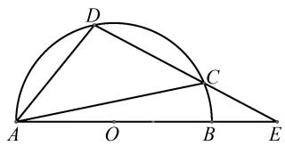
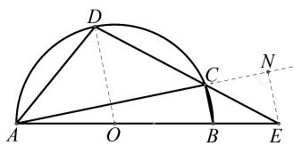
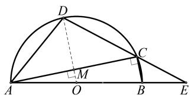
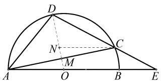
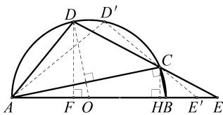
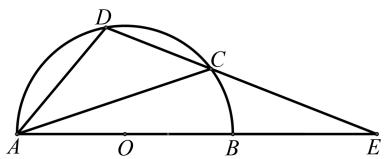
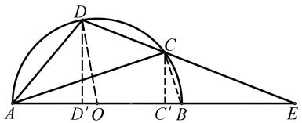

# 探试题之解法 研变式与拓展

——对一道初三质检试题的求解、延伸与拓展

# 林厚暖

(福清市教师进修学校, 福建 福州 350300)

摘 要:笔者从图形的结构特征入手,对福州市九年级一道几何质检试题展开研究.基于网络上的一个复杂解法,得出两个更能彰显问题本质的解法.此外,探讨试题的变式和拓展,能够帮助学生提高运用所学知识分析问题和解决问题的能力,提升数学核心素养.

关键词: 几何问题; 相似三角形; 圆; 解法; 变式

中图分类号：G632

文献标识码：A

文章编号:1008-0333(2025)14-0020-03

2023—2024 学年第一学期福州市九年级质检填空压轴题是一道以半圆为载体的几何问题,笔者在网络上看到一个较为复杂的解法,整个求解过程作了较多的辅助线,思路复杂且不自然,遂考虑能否简化其求解过程,并给出了问题的变式.现将研究过程整理如下,帮助学生提高问题解决能力.

# 1 试题呈现

如图1,AB为半圆O的直径,C为半圆O上一点,D为 $\widehat{AC}$ 的中点,AB,DC的延长线交于点E.若 $\frac{DC}{CE}=\frac{3}{2},AC=2\sqrt{6}$ ,则AB的长是\_\_\_\_.

text_image

Geometric diagram showing a semicircle with points A, B, C, D, E and center O, including chords and triangles.

图 1 福州市质检填空压轴题示意图

本题看似简单,但细品之下,却觉难以入手,题设所给的三个条件比较分散,所求线段与已知条件之间的逻辑关系非常隐蔽,想要将其串联在一起并非易事.本题能够较好地考查学生对数学基础知识的掌握情况及基本数学思想方法的运用能力,其综合性较强,对学生而言具有一定的难度.

# 2 解法探析

解法1 如图2, 连接 $DO, BC$ , 延长 $AC$ , 作 $EN \perp AC$ 于点 $N$ . 因为 $D$ 为 $\widehat{AC}$ 的中点, 所以 $DO \perp AC$ , $AM = MC = \sqrt{6}$ . 因为 $BC \perp AC$ , 所以 $DO \parallel BC \parallel NE$ . 因为 $\triangle DMC \sim \triangle ENC$ , 所以 $\frac{DM}{NE} = \frac{MC}{CN} = \frac{DC}{CE} = \frac{3}{2}$ , 所以 $CN = \frac{2\sqrt{6}}{3}$ . 设 $MO = a$ , 因为 $\triangle AMO \sim \triangle ANE$ , 所以 $\frac{MO}{NE} = \frac{AM}{AN} = \frac{3}{8}$ , 所以 $NE = \frac{8}{3}a$ , 所以 $DM = \frac{3}{2}NE = 4a$ , $AO = DO = 5a$ . 在 Rt $\triangle AMO$ 中, 由勾股定理可得 $AM^2 = AO^2 - MO^2 = 24a^2 = 6$ , 所以 $a = \frac{1}{2}, AB = 10a = 5$ .

text_image

Geometric diagram with labeled points A, B, C, D, E, O, N and a semicircle, showing triangles and auxiliary lines.

图 2 解法 1 示意图

收稿日期:2025-02-15

作者简介:林厚暖,本科,中学高级教师,从事初中数学教学研究.

本题中存在两个关键的条件,其一是“D 为 $\widehat{AC}$ 的中点”,此条件可转化为AD=DC或DO垂直平分AC. AD=DC无法与其他条件构建有效联系,故尝试连接DO,将“D 为 $\widehat{AC}$ 的中点”这一条件转化为“DO垂直平分AC”. 其二是“ $\frac{DC}{CE}=\frac{3}{2}$ ”,该条件又将如何转化?首选将其转化为其他边之比,此时可连接BC,可得 $BC\perp AC$ ,与 $DO\perp AC$ 相结合,即可打开问题的求解思路.或过点C作AE的平行线,将“ $\frac{DC}{CE}=\frac{3}{2}$ ”转化为半径OD上两条线段的长度之比.

解法2 如图3, 连接 $DO$ , 交 $AC$ 于点 $M$ , 连接 $BC$ . 因为 $D$ 为 $\widehat{AC}$ 的中点, 所以 $DO \perp AC$ , $AM = MC = \sqrt{6}$ . 因为 $BC \perp AC$ , 所以 $DO \parallel BC$ . 设 $MO = a$ , 因为 $O$ 为 $AB$ 中点, 且 $DO \parallel BC$ , 所以 $BC = 2MO = 2a$ . 因为 $DO \parallel BC$ , 所以 $\triangle DOE \sim \triangle CBE$ , 所以 $\frac{DO}{BC} = \frac{DE}{CE} = \frac{5}{2}$ , 所以 $DO = 5a$ . 在 Rt $\triangle AMO$ 中, 易得 $AM^2 = AO^2 - MO^2 = 24a^2 = 6$ , 所以 $a = \frac{1}{2}$ , $AB = 10a = 5$ .

text_image

Geometric diagram with labeled points and lines, including a semicircle, triangle ABC, and perpendiculars from D to AB and BC.

图 3 解法 2 示意图

解法3 如图4, 连接 $DO$ , 交 $AC$ 于点 $M$ , 过点 $C$ 作 $AE$ 的平行线交 $OD$ 于点 $N$ . 因为 $D$ 为 $\widehat{AC}$ 的中点, 所以 $DO \perp AC$ , $AM = MC = \sqrt{6}$ . 设 $MO = a$ , 由于 $AM = CM$ , $\angle AMO = \angle CMN$ , $\angle AOM = \angle CNM$ , 所以 $\triangle AMO \cong \triangle CMN$ , 所以 $NO = NM + MO = 2MO = 2a$ . 由 $NC // AE$ 可得 $\frac{DN}{NO} = \frac{DC}{CE} = \frac{3}{2}$ , 故 $DN = 3a$ , $AO = OD = 5a$ , 在 Rt $\triangle AMO$ 中, 由勾股定理可得 $AM^2 = AO^2 - MO^2 = 24a^2 = 6$ , 所以 $a = \frac{1}{2}$ , $AB = 10a = 5$ .

点评 解法 1 构造了 4 条辅助线, 使用了两次三角形相似, 才得到 AO = 5a, 整个求解过程在多个

text_image

Geometric diagram with labeled points and lines, including a semicircle and triangle constructions

图 4 解法 3 示意图

三角形中进行数量转换,求解思路较为复杂,对学生的能力要求极高. 解法2通过对“D 为 $\widehat{AC}$ 的中点”这一条件的转化,得到 $DO \perp AC$ ,结合 $\angle ACB = 90^{\circ}$ ,自然能够得到 $DO \parallel BC$ ,从而得到 $\triangle DOE \sim \triangle CBE$ ,再结合 $\frac{DC}{CE} = \frac{3}{2}$ ,最终构建DO与MO的关系. 解法3类似于解法2,不同之处在于解法3通过构造平行线,将条件 $\frac{DC}{CE} = \frac{3}{2}$ 转化为 $\frac{DN}{NO} = \frac{3}{2}$ . 解法2和解法3充分关注到题设条件与图形的特征,使问题得以简洁求解,体现了“多思少算”这一解题策略,彰显了转化思想和数形结合思想在问题求解中的引领作用.

# 3 试题延伸

从试题的已知条件和所求结论来看,已知条件为“D 为 $\widehat{AC}$ 的中点, $\frac{DC}{CE}=\frac{3}{2},AC=2\sqrt{6}$ ”,求解得到的结论为“AB=5”.将所求结论与三个已知条件逐个互换,所构造得到的三个命题是否成立?

情形 1: 如图 1, 已知 D 为 $\widehat{AC}$ 的中点, 如果 $\frac{DC}{CE} = \frac{3}{2}$ , AB = 5, 那么 $AC = 2\sqrt{6}$ .

由解法2易得 $AO = 5MO$ ，又因为 $AB = 5$ ，所以 $AO = \frac{5}{2},MO = \frac{1}{2}.$ 由垂径定理及勾股定理可得 $AC$ $= 2AM = 2\sqrt{AO^2 - MO^2} = 2\sqrt{6}.$

情形2:如图1,已知D为 $\widehat{AC}$ 的中点,如果AB=5, $AC=2\sqrt{6}$ ,那么 $\frac{DC}{CE}=\frac{3}{2}$ .

与解法 2 类似, 易得 $BC = \sqrt{AB^{2} - AC^{2}} = 1$ . 因为 $\triangle DOE \sim \triangle CBE$ , 所以 $\frac{DO}{BC} = \frac{DE}{CE} = \frac{5}{2}$ , 故 $\frac{DC}{CE} = \frac{3}{2}$ .

情形 3: 如图 1, 如果 AB = 5, $\frac{DC}{CE} = \frac{3}{2}$ , $AC = 2\sqrt{6}$ ,那么无法得到 D 为 $\widehat{AC}$ 的中点.

如图5,分别过点D,C作 $DF\perp AE$ , $CH\perp AE$ ,垂足分别为F,H,可得 $DF\parallel CH$ ,所以 $\triangle DFE\sim\triangle CHE$ ,所以 $\frac{DF}{CH}=\frac{DE}{CE}=\frac{5}{2}$ .在Rt $\triangle ACB$ 中, $AB=5$ , $AC=2\sqrt{6}$ ,由勾股定理得BC=1,从而由 $\frac{1}{2}AC\times BC=\frac{1}{2}AB\times CH$ 得CH= $\frac{2\sqrt{6}}{5}$ ,所以 $DF=\frac{5}{2}CH=\sqrt{6}$ .因为 $DF=\sqrt{6}<\frac{5}{2}$ ,所以D点位置有两处,其一为 $\widehat{AC}$ 的中点,其二为图4中的 $D'$ 点,易知D与 $D'$ 的对称轴过点O且垂直于AB.为此,由 $AB=5,\frac{DC}{CE}=\frac{3}{2},AC=2\sqrt{6}$ ,无法得到D为 $\widehat{AC}$ 的中点.

text_image

Geometric diagram with labeled points and perpendicular lines, likely from a math problem or proof

图 5 情形 3 示意图

点评 《易经》中有这样一句话：“穷则变，变则通，通则久”，意思是说生活中一件事情发展到了极致就需要变化，而这种变化让接下来事物的发展不会受到阻碍 $^{[1]}$ . 这句话映射到数学解题教学中亦是这个道理：解题教学一定要做到灵活变通、活学活用. 教师通过上述试题延伸，能够为学生创造更多的思考机会，提升学生分析问题和解决问题的能力，锻炼学生的理性思维，培养学生数学核心素养.

# 4 试题拓展

在对试题有了较深入理解之后,可以尝试研究更一般的情形.打破“D 为 $\widehat{AC}$ 的中点”这一条件的限制,改变 D 点位置,使得直线 DC 与直线 AB 交点 E 落在点 B 右侧,如图 6,则 D 点的位置、AB 的长度、AC 的长度与 $\frac{DC}{CE}$ 的值存在怎样的联系?

text_image

Geometric diagram showing a semicircle with points A, B, C, D, E and labeled lines forming triangles and chords.

图 6 试题拓展示意图

如图7所示,连接DO,BC,过点D作 $DD'\perp AE$ ,过点C作 $CC'\perp AE$ ,垂足分别为 $D',C'$ ,设直线DO与直线AB的夹角为 $\theta$ .根据已知条件可求得 $DD'= \frac{AB}{2}\sin\theta$ ,在Rt△ACB中,易知 $\frac{1}{2}AC\cdot BC=\frac{1}{2}AB\cdot CC'$ ,所以 $CC'=\frac{AC\cdot BC}{AB}=\frac{AC\cdot\sqrt{AB^{2}-AC^{2}}}{AB}$ .因为 $DD'\parallel CC'$ ,所以 $\frac{CE}{DE}=\frac{CC'}{DD'}$ ,从而可得 $\frac{DC}{CE}=\frac{DE}{CE}-1=\frac{DD'}{CC'}-1=\frac{AB^{2}\sin\theta}{2AC\times\sqrt{AB^{2}-AC^{2}}}-1.$

text_image

Geometric diagram with labeled points and lines, including a semicircle and triangles

图 7 试题拓展解析示意图

点评 式子 $\frac{DC}{CE} = \frac{AB^2\sin\theta}{2AC\times\sqrt{AB^2 - AC^2}} -1$ 建立起了原试题条件与结论之间的数量关系,揭示了问题的本质.给上述式子赋予特殊值并改变问题条件,还可命制一系列相关试题.

# 5 结束语

在初中数学复习教学过程中,教师可以尝试对典型试题进行“一题多解”或“一题多变”,采用从不同角度解决问题,不断变化试题的结构,改变试题的条件或转换试题的问法等策略,让试题变得焕然一新,却又让人感觉似曾相识,引导学生掌握数学思维和方法,使学生面对新的研究对象时,懂得如何去分析,如何去思考,最终在解题中真正做到灵活变通、游刃有余.这样的解法探究和变式研究,能够培养学生独立、质疑的创新意识,引领他们逐步学会分析问题,从而提升数学核心素养.

# 参考文献：

[1] 危志刚. 高三数学复习课应如何开展解题教学: 以“函数值域的求法”为例 [J]. 中学数学月刊, 2022(2):26-29.

[责任编辑:李慧娇]