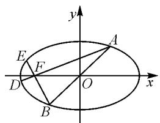
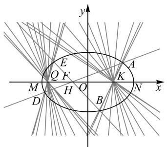

# 一个定点问题的多角度思考与推广\*

# - 四川遂宁涪江中学 唐智

# 1 题目呈现

已知椭圆 $C: \frac{x^{2}}{a^{2}} + y^{2} = 1$ (a > 1) 的左焦点为 F，如图 1 所示，直线 y = kx (k > 0) 与椭圆 C 交于 A, B 两点，且 $\overrightarrow{FA} \cdot \overrightarrow{FB} = 0$ 时， $k = \frac{\sqrt{3}}{3}$ .

text_image

y
E
F
D
O
x
A
B

图 1

(1) 求 a 的值;  
(2)设直线 AF, BF 的延长线分别交椭圆 C 于 D, E 两点, 当 k 变化时, 直线 DE 是否过定点? 若过定点, 求出定点; 若不过定点, 请说明理由.

# 2 题目解析

第(1)问,根据题设易知 $a=\sqrt{3}$ , 则 $F(-\sqrt{2},0)$ , 椭圆 $C:\frac{x^{2}}{3}+y^{2}=1$ . 第(2)问, 首先可取 A, B 分别为上、下顶点时探究出直线 DE 过的定点在 x 轴上, 这样再解答此题就有了明确方向. 本文中主要从不同角度解析第(2)问, 提炼不同的解法, 培养学生分析问题与解决问题的能力.

法一: 设 $A(x_{0}, y_{0})$ ，则 $B(-x_{0}, -y_{0})$ .

设 AD: $x=\frac{x_{0}+\sqrt{2}}{y_{0}}y-\sqrt{2}$ ，代入椭圆 C，得

$$
\left[ 3 + \frac {\left(x _ {0} + \sqrt {2}\right) ^ {2}}{y _ {0} ^ {2}} \right] y ^ {2} - \frac {2 \sqrt {2} \left(x _ {0} + \sqrt {2}\right)}{y _ {0}} y - 1 = 0.
$$

又 $x_0^2 + 3y_0^2 = 3$ ，则

$$
(5 + 2 \sqrt {2} x _ {0}) y ^ {2} - 2 \sqrt {2} (x _ {0} + \sqrt {2}) y _ {0} y - y _ {0} ^ {2} = 0.
$$

所以 $y_{0}y_{D} = \frac{-y_{0}^{2}}{5 + 2\sqrt{2}x_{0}}$ ，则 $y_{D} = \frac{-y_{0}}{5 + 2\sqrt{2}x_{0}}.$

同理 $BE: x = \frac{x_0 - \sqrt{2}}{y_0} y - \sqrt{2}, y_E = \frac{y_0}{5 - 2\sqrt{2}x_0}$ .

于是 $\frac{y_{E}+y_{D}}{y_{E}-y_{D}}=\frac{2\sqrt{2}x_{0}}{5}.$

又 $k_{DE} = \frac{y_E - y_D}{x_E - x_D} = \frac{y_E - y_D}{\frac{x_0 - \sqrt{2}}{y_0} y_E - \frac{x_0 + \sqrt{2}}{y_0} y_D} = \frac{5y_0}{x_0}$

所以 $DE:y - y_{D} = \frac{5y_{0}}{x_{0}} (x - x_{D}).$

令 $y = 0$ ，得 $x = x_{D} - \frac{x_{0}}{5y_{0}}\cdot y_{D} = \frac{x_{0} + \sqrt{2}}{y_{0}}\cdot y_{D}-$ $\sqrt{2} -\frac{x_0}{5y_0} y_D = -\frac{6\sqrt{2}}{5}.$

故直线 DE 过定点 $\left(-\frac{6\sqrt{2}}{5},0\right)$ .

评注:从常规角度,通过 A,B 两点坐标写出直线 AD,BE 方程,联立椭圆方程求出 D,E 坐标,再写出直线 DE 点斜式方程则可求定点.难点在于联立直线 AD 或 BE 与椭圆方程求 D 与 E 两点坐标和直线 DE 的点斜式方程,整理化简计算量非常大.第一,反设直线消 x,比设点斜式消 y 简洁;第二,联立方程组消元后可利用点 A 在椭圆上得 $x_{0}^{2}+3y_{0}^{2}=3$ ,整体代入化简;第三,化简后的二次方程已知一根求另一根用韦达定理(两根之积) $y_{0}y_{D}=\frac{-y_{0}^{2}}{5+2\sqrt{2}x_{0}}$ 较简洁;第四,A,B 两点关于原点对称,求出点 D 坐标后可同理对称得出点 E 坐标,无须硬算;第五,由于取特殊位置已探知定点在 x 轴上,则令 y=0 求出 x 再化简即可.整个过程可谓步步为营,对学生逻辑推理、运算能力等数学基本功有较高要求.

法二: 设 $A(x_{0}, y_{0})$ , AD: $x = my - \sqrt{2}$ ，代入椭圆 C 得 $(m^{2} + 3)y^{2} - 2\sqrt{2}my - 1 = 0$ ，则

$$
y _ {0} + y _ {D} = \frac {2 \sqrt {2} m}{m ^ {2} + 3}, y _ {0} y _ {D} = - \frac {1}{m ^ {2} + 3}.
$$

易得 $x_{0}x_{D}=\frac{3(2-m^{2})}{m^{2}+3}$ .

同理由 $B(-x_0, -y_0), BE: x = ny - \sqrt{2}$ ，可得

$$
- x _ {0} x _ {E} = \frac {3 (2 - n ^ {2})}{n ^ {2} + 3}, - y _ {0} y _ {E} = \frac {- 1}{n ^ {2} + 3}.
$$

所以 $x_0(x_D + x_E) = \frac{3(2 - m^2)}{m^2 + 3} - \frac{3(2 - n^2)}{n^2 + 3}$ ,

$$
y _ {0} \left(y _ {D} + y _ {E}\right) = \frac {- 1}{m ^ {2} + 3} + \frac {1}{n ^ {2} + 3}.
$$

由 $\frac{x_{D}^{2}}{3}+y_{D}^{2}=1,\frac{x_{E}^{2}}{3}+y_{E}^{2}=1$ ，可得

$$
\frac {1}{3} \left(x _ {D} ^ {2} - x _ {E} ^ {2}\right) + \left(y _ {D} ^ {2} - y _ {E} ^ {2}\right) = 0.
$$

所以 $k_{DE} = \frac{y_D - y_E}{x_D - x_E} = -\frac{1}{3}\cdot \frac{x_D + x_E}{y_D + y_E} = \frac{5y_0}{x_0}.$

以下同解法一(略).

评注: 此法在求解直线 DE 斜率时, 从点差法角度思考 $k_{DE} = \frac{y_{D} - y_{E}}{x_{D} - x_{E}} = -\frac{1}{3} \cdot \frac{x_{D} + x_{E}}{y_{D} + y_{E}}$ , 于是设直线 AD 方程, 与联立椭圆方程, 利用韦达定理得 $x_{0} x_{D} = \frac{3(2 - m^{2})}{m^{2} + 3}$ , $y_{0} y_{D} = \frac{-1}{m^{2} + 3}$ , 设直线 BE 方程同理可得 $-x_{0} x_{E} = \frac{3(2 - n^{2})}{n^{2} + 3}$ , $-y_{0} y_{E} = \frac{-1}{n^{2} + 3}$ , 整体代入可解决直线 DE 斜率问题.

法三: 设 $A(m, n)$ , $B(-m, -n)$ , $\overrightarrow{FD} = \lambda \overrightarrow{FA}$ , $\overrightarrow{FE} = \mu \overrightarrow{FB}$ , 则可得到 $D(m\lambda + \sqrt{2}(\lambda - 1), n\lambda)$ , $E(-m\mu + \sqrt{2}(\mu - 1), -n\mu)$ .

将点 D 代入椭圆 C，结合 $m^{2}+3n^{2}=3$ ，得

$$
(2 \sqrt {2} m + 5) \lambda^ {2} - (2 \sqrt {2} m + 4) \lambda - 1 = 0.
$$

易知 $\lambda \neq 1$ ，所以 $\lambda = \frac{-1}{2\sqrt{2}m + 5}$

同理，得 $\mu=\frac{-1}{-2\sqrt{2}m+5}$ .

所以 $\frac{1}{\lambda} +\frac{1}{\mu} = -10.$

易知若 DE 过定点则必在 x 轴上, 设为 $M(x_{0},0)$ .

由 $k_{DM}=k_{EM}$ ，得

$$
\frac {n \lambda}{m \lambda + \sqrt {2} (\lambda - 1) - x _ {0}} = \frac {n \mu}{m \mu - \sqrt {2} (\mu - 1) + x _ {0}},
$$

解得 $x_0 = \frac{2\sqrt{2}\lambda\mu - \sqrt{2}(\lambda + \mu)}{\lambda + \mu} = \frac{2\sqrt{2}}{\frac{1}{\lambda} + \frac{1}{\mu}} - \sqrt{2} = -\frac{6\sqrt{2}}{5}$ .

故直线 DE 过定点 $\left(-\frac{6\sqrt{2}}{5},0\right)$ .

评注:从定比分点角度,分别由 A, D, F 及 B, E, F 三点共线进行向量的坐标运算,又恰好有 $\frac{1}{\lambda} + \frac{1}{\mu} = -10$ , 于是设定点 $M(x_{0}, 0)$ , 由 $k_{DM} = k_{EM}$ 化简可求得 $x_{0}$ . 此法也是解决圆锥曲线综合问题常用思维方式, 即目标问题向量化, 向量问题坐标化. 本题主要涉及三点

共线的两种转化方法,一是向量,二是斜率.

法四: 设椭圆左、右顶点分别为 M, N, 直线 DE 与 x 轴交于点 Q.

由坎迪(蝴蝶)定理 $^{[1]}$ ，知 $\frac{1}{|MF|}-\frac{1}{|NF|}=\frac{1}{|QF|}-\frac{1}{|OF|}$ .(证明略)

所以 $|QF| = \frac{\sqrt{2}}{5}$ ，则 $|OQ| = \frac{6\sqrt{2}}{5}$ .

故直线 DE 过定点 $Q\left(-\frac{6\sqrt{2}}{5},0\right)$ .

评注:预先探知所找定点在 x 轴上,于是可直接利用坎迪(蝴蝶)定理求得此定点.此法的引入,相较前面的方法犹如神之一手,使人眼前一亮,拍案叫绝.此种方法的引入旨在激发学生兴趣,因此并未给出证明,事实上,该定理应用于解答题时需要作简要说明.由兴趣驱动学生展开对坎迪(蝴蝶)定理的原理、推广、应用等知识的自主性学习,收益倍增.

# 3 课后反思

在试卷评讲的教学中,教师需要引导学生不能就题论题.学生要练实、悟透、用活,注重知识迁移、变式应用,促进解题能力的提升,收获一类问题的解决方法.本节课后,笔者进一步引导学生将2020年全国卷I数学理科第20题(文科第21题)改编为“A,B两点为上、下顶点”作为变式训练,并作出如下总结推广.

定点问题的一般策略:首先根据特殊情况探究出定点,再通过推理、运算得出该点与参数无关,或者利用参数求出直线的点斜式方程,观察所得直线方程的特征求出定点,如果有多个参数则需先消去部分参数或找出参数之间的关系.解答此类题目需要运用设而不求、韦达定理、向量、整体思想、同理对称等方法简化运算.

推广 1 椭圆 $C: \frac{x^{2}}{a^{2}} + \frac{y^{2}}{b^{2}} = 1 (a > b > 0, a^{2} = b^{2} + c^{2})$ 的焦点为 F，直线 y = kx 与椭圆 C 交于 A, B 两点，直线 AF, BF 的延长线分别交椭圆 C 于 D, E 两点，则直线 DE 的斜率与 k 的比值是常数 $\frac{1 + e^{2}}{1 - e^{2}}$ ，且直线 DE 过定点，当 F 为左焦点时定点坐标为 $\left(\frac{-2c}{1 + e^{2}}, 0\right)$ ，当 F 为右焦点时定点坐标为 $\left(\frac{2c}{1 + e^{2}}, 0\right)$ .

推广 2 椭圆 $C:\frac{x^{2}}{a^{2}}+\frac{y^{2}}{b^{2}}=1(a>b>0,a^{2}=b^{2}+c^{2})$ ,

当点 F 为左焦点时，过点 $Q\left(\frac{-2c}{1+e^{2}},0\right)$ 的直线交椭圆 C 于 D, E 两点，延长 DF, EF，分别与椭圆 C 交于 A, B 两点，则直线 AB 必过原点，且直线 DE 的斜率（存在时）与直线 AB 的斜率比值是常数 $\frac{1+e^{2}}{1-e^{2}}$ ；当点 F 为右焦点时，过点 $Q\left(\frac{2c}{1+e^{2}},0\right)$ 的直线以上对应结论仍然成立.

推广 3 在椭圆 $C: \frac{x^{2}}{a^{2}} + \frac{y^{2}}{b^{2}} = 1 (a > b > 0)$ 的长轴 MN 上取两定点 H, K, 过点 K 的线束满足（如图 2）：过点 K 任意作一条直线与椭圆 C 交于 A, B（不同于 H, K）两点，直线 AH, BH 的延长线分别交椭圆 C 于 D, E 两点，则直线 AB 的斜率（存在时）与直线 DE 的斜率比值是常数,且直线 DE 过定点.特别地,当 H,K 分别为左焦点、坐标原点,且 $a=\sqrt{3}$ , b=1 时就是所引考题.

text_image

y
E
Q F
M H O K
D B N x
A

图 2

# 参考文献：

[1]方禾.蝴蝶定理[J].科技创新导报,2011(21):255-256.Z

# (上接第81页)

运算量不大,做到了“活而不难”;难题的综合性强,运算量大,思维量大,题目有难度,但不偏不怪,难度不是特别大,优秀学生可做得出来,如第8,12,16题,第21题的第(2)(3)小问.第22题的第(2)小问难度很大,但作为压轴题,这种难度是合理的.这种对难度的有意和有效控制,将引导中学数学教学立足基础,注重提高学生的数学能力,避免超纲学、超量学,能够遏止那种把练习和试卷出得很难,让学生大量去做难题的现象,能避免机械的、无效的、浪费大量时间的学习,能够让更多的学生不怕数学、喜欢数学、有信心学好数学.2022年高考卷,使许多中学师生以为高考数学卷要变得更难了,从而使得2022-2023这一学年高三数学教学更关注难题,不少地方的市质检、省质检的数学卷都相当难.相信23年高考后,这一现象能够得到控制,引导中学数学教学回归基础.

# 2 教学思考

# 2.1 重视基础

高中数学教学应该重视基础,只有重视基础,才能保证更多的学生在基础题上不丢分,少丢分.为此,要加强对基础知识、基本概念、基本运算、基本思想方法及基本应用的教学,要改变中学数学重解题、轻概念的教法,让更多的教师重视概念教学;要改变中学数学重公式和方法的应用、轻公式推导和方法说明的教法,注意展示数学知识的发生发展过程,注意数学逻辑推理,加强学生对基础知识、基本概念等的深入理解和灵活掌握.在具体教学中,对基础题要多讲解,要讲透、讲到位，对一些易错点和关键点，要进行一些变式训练和重复训练.

# 2.2 提高能力

高中数学教学要注重提高学生的数学能力, 只有这样, 才能让学生做好综合题和创新题. 为此, 要帮助学生养成良好的学习习惯和个性品质, 让学生不怕困难和挫折, 能够纠错, 善于总结; 要让学生主动学习, 变“要我学”为“我要学”, 会主动做题, 能独立思考, 有钻研精神; 要引导学生大胆猜想, 小心求证, 培养学生的探究能力; 要重视数学思想方法的教学, 培养和发展学生元认知水平, 提高学生发现问题、提出问题、分析问题、解决问题的能力, 发展学生的数学核心素养. 在具体教学中, 要安排让学生思考、讨论和总结的时间, 要让学生规范书写作答, 提高数学表达能力.

# 2.3 精选题目

高中数学教学中的例题、习题、试题要精心选择。题目的选择要符合教学的需要，符合学生的认知水平，要能帮助突破教学的重点和难点，要针对学生的薄弱点进行设计，一些题目要以变形的形式重复出现，可以多选择一些有生活情境或应用情境的题目，让学生体会数学与生产生活的联系。习题和试卷要突出基础性和综合性，要有灵活性和创新性，要突出数学本质，要符合本校学生的认知水平。要把握好题目的量和难度，不一味追求难题，不搞题海战术，不让学生一味地刷题，不占用学生过多的学习时间。实际工作中，必须充分发挥教研组和备课组的作用，加强教研，统一思想，形成共识，通力合作，只有这样，才能把精选题目落到实处。Z