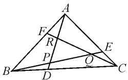
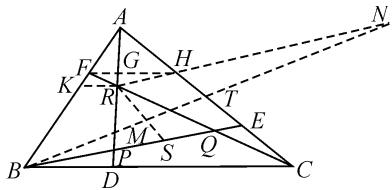
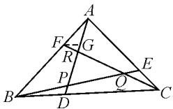
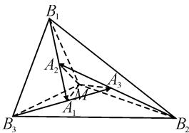
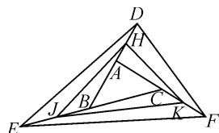

# 一道三角形重心问题的探究与推广\*

● 陕西省汉阴县汉阴中学 梁华  
江苏省溧阳市光华高级中学 钱德全  
四川省雅安市教育科学研究院 高继浩

《数学通报》问题 2505 是一道关于三角形重心的平面几何题目, 经过探究, 得到了《数学通报》问题 2505 的两种新的证法: 从三角形的重心性质出发给出了其平面几何证法, 从三角形的重心坐标公式和线段的定比分点坐标公式出发给出了其解析几何证法. 同时, 将问题 2505 进行了推广.

问题 2505 $^{[1]}$ 如图 1, $\triangle ABC$ 中, D, E, F 分别是边 BC, CA, AB 上的点, 且 BD = mBC, CE = mCA, AF = mAB, 0 < m < 1, AD 与 BE 交于点P, BE 与 CF 交于点 Q, CF 与 AD 交于点 R, 求证: $\triangle ABC$ 与 $\triangle PQR$ 的重心重合.

  
图 1

证法一: 如图2, 作 $FH \parallel BC$ 交 AC 于点 H, 交 AD 于点 G.

作 $RK \parallel BC$ 交 $AB$ 于点 $K$ . 设$\triangle ABC$ 的重心为 $M$ , 连接 $BM$ 并延长交 $AC$ 于点 $T$ , 交 $RH$ 的延长线于点 $N$ . 连接 $RM$ 并延长, 交 $BE$ 于点 $S$ . 又 $FG \parallel BC$ , 则 $\frac{FG}{BD} = \frac{AF}{AB}$ .

text_image

Geometric diagram with labeled points and lines, likely from a math problem or proof

图2

因为 AF=mAB,0<m<1，所以 $\frac{FG}{BD}=m$ . 又因为 BD=mBC，所以 $BD=\frac{m}{1-m}DC$ ，于是 $\frac{FG}{DC}=\frac{m^{2}}{1-m}$ . 因为 $FG\parallel DC$ ，所以 $\frac{FR}{RC}=\frac{FG}{DC}=\frac{m^{2}}{1-m}$ ，所以 $\frac{FR}{FC}=\frac{m^{2}}{1-m+m^{2}}$ . 同理 $\frac{DP}{DA}=\frac{m^{2}}{1-m+m^{2}}$ , $\frac{EQ}{EB}=\frac{m^{2}}{1-m+m^{2}}$ . 因为 $RK\parallel BC$ ，所以 $\frac{KR}{BC}=\frac{FR}{FC}=\frac{m^{2}}{1-m+m^{2}}$ ，所以$\frac{KR}{\frac{1}{m}BD}=\frac{m^{2}}{1-m+m^{2}}$ ，所以 $\frac{KR}{BD}=\frac{m}{1-m+m^{2}}$ ，则 $\frac{AR}{AD}=$

$\frac{KR}{BD} = \frac{m}{1 - m + m^2}$ . 同理 $\frac{BP}{BE} = \frac{m}{1 - m + m^2}$ . 因为 $FH //$

BC, 所以 $\frac{AH}{AC} = \frac{AF}{AB} = m$ . 又 CE = mCA, 所以 AH = CE. 因为 M 是 $\triangle ABC$ 的重心, 所以 T 是 AC 的中点, 则 $\frac{TM}{MB} = \frac{1}{2}$ , 所以点 T 是 HE 的中点. 又因为 AH =

$CE=mCA$ ，所以 $\frac{AH}{HE}=\frac{m}{1-2m}$ 。因为 $\frac{AR}{AD}=\frac{m}{1-m+m^{2}}$ ， $\frac{DP}{DA}=\frac{m^{2}}{1-m+m^{2}}$ ，所以 $\frac{AR}{RP}=\frac{m}{1-2m}$ 。所以 $\frac{AR}{RP}=\frac{AH}{HE}$

则 $RH \parallel PE$ . 所以 $NT = BT, HN = BE$ . 所以 $\frac{MB}{NM} = \frac{1}{2}$ , $\frac{SM}{MR} = \frac{1}{2}, \frac{BS}{RN} = \frac{1}{2}$ . 因为 $BP: PQ: QE = m: (1 - 2m)$ :

$m^{2}$ ，所以 $\frac{PE}{BE} = \frac{1 - 2m + m^{2}}{1 - m + m^{2}}$ 。因为 $\frac{RH}{PE} = \frac{m}{1 - m}$ ，所以 $RH = \frac{m(1 - m)}{1 - m + m^{2}} BE$ ，所以 $RN = RH + HN =$

$\frac{m(1-m)}{1-m+m^{2}}BE+BE=\frac{1}{1-m+m^{2}}BE$ ，所以 $2BS=\frac{1}{1-m+m^{2}}BE$ ，即 $BS=\frac{1}{2(1-m+m^{2})}BE$ .

所以 $PS = BS - BP = \frac{1}{2(1 - m + m^2)} BE - \frac{m}{1 - m + m^2} BE = \frac{1 - 2m}{2(1 - m + m^2)} BE = \frac{1}{2} PQ$ ，即 $S$ 是 $PQ$ 的中点.

连接 PM 并延长, 交 CF 于点 W. 同理可证, W 是 RQ 的中点, 从而得点 M 是 $\triangle PQR$ 的重心.

综上， $\triangle ABC$ 与 $\triangle PQR$ 的重心重合.

证法二: 可建立平面直角坐标系(建系略), 设

$A(x_{1},y_{1}),B(x_{2},y_{2}),C(x_{3},y_{3}),\triangle ABC$ 的重心为 M.根据三角形的重心坐标公式,得点 M 的坐标为

$\left(\frac{x_1 + x_2 + x_3}{3}, \frac{y_1 + y_2 + y_3}{3}\right)$ .

如图3，作 $FG \parallel BC$ 交 $AD$ 于点 $G$ ，则 $\frac{FG}{BD} = \frac{AF}{AB}$ .由 $AF =$ $mAB, 0 < m < 1$ ，得 $\frac{AF}{FB} =$

  
图3

$\frac{m}{1 - m}, \frac{FG}{BD} = m.$ 又 $BD = mBC$ ，则 $BD = \frac{m}{1 - m} DC$ ，所以 $\frac{FG}{DC} = \frac{m^2}{1 - m}$ ，所以 $\frac{FR}{RC} = \frac{FG}{DC} = \frac{m^2}{1 - m}$ . 设 $F(x_F, y_F)$ ， $R(x_R, y_R), P(x_P, y_P), Q(x_Q, y_Q)$ ，根据线段的定比分点坐标公式，可得

$$
x _ {F} = \frac {x _ {1} + \frac {m}{1 - m} x _ {2}}{1 + \frac {m}{1 - m}} = (1 - m) x _ {1} + m x _ {2},
$$

$$
y _ {F} = \frac {y _ {1} + \frac {m}{1 - m} y _ {2}}{1 + \frac {m}{1 - m}} = (1 - m) y _ {1} + m y _ {2}.
$$

所以 $F((1-m)x_{1}+mx_{2},(1-m)y_{1}+my_{2})$ .

再一次运用线段的定比分点坐标公式,可得

$$
\begin{array}{l} x _ {R} = \frac {(1 - m) x _ {1} + m x _ {2} + \frac {m ^ {2}}{1 - m} x _ {3}}{1 + \frac {m ^ {2}}{1 - m}} \\ = \frac {(1 - m) ^ {2} x _ {1} + m (1 - m) x _ {2} + m ^ {2} x _ {3}}{1 - m + m ^ {2}}, \\ y _ {R} = \frac {(1 - m) ^ {2} y _ {1} + m (1 - m) y _ {2} + m ^ {2} y _ {3}}{1 - m + m ^ {2}}. \\ \end{array}
$$

同理，可得

$$
x _ {P} = \frac {(1 - m) ^ {2} x _ {2} + m (1 - m) x _ {3} + m ^ {2} x _ {1}}{1 - m + m ^ {2}},
$$

$$
y _ {P} = \frac {(1 - m) ^ {2} y _ {2} + m (1 - m) y _ {3} + m ^ {2} y _ {1}}{1 - m + m ^ {2}},
$$

$$
x _ {Q} = \frac {(1 - m) ^ {2} x _ {3} + m (1 - m) x _ {1} + m ^ {2} x _ {2}}{1 - m + m ^ {2}},
$$

$$
y _ {Q} = \frac {(1 - m) ^ {2} y _ {3} + m (1 - m) y _ {1} + m ^ {2} y _ {2}}{1 - m + m ^ {2}}.
$$

设 $\triangle PQR$ 的重心 $M'$ 的坐标为 $(x_{M'}, y_{M'})$ ，根据三角形的重心坐标公式，得 $x_{M'} = \frac{1}{3}(x_P + x_Q + x_R) = \frac{(1 - m + m^2)x_1 + (1 - m + m^2)x_2 + (1 - m + m^2)x_3}{3(1 - m + m^2)} = \frac{x_1 + x_2 + x_3}{3}$ .

类似地， $y_{M'}=\frac{y_{1}+y_{2}+y_{3}}{3}$ .

所以 $M'\left(\frac{x_{1}+x_{2}+x_{3}}{3},\frac{y_{1}+y_{2}+y_{3}}{3}\right)$ ，故 $\triangle PQR$ 与 $\triangle ABC$ 的重心重合，命题得证.

通过深入探究,将问题 2505 的结论推广,得到以下定理.

定理 1 若将三角形各边按照逆时针或顺时针呈风轮状依次将其各边延长或缩短至某点(终点)，且延长或缩短所得线段与相应边的长度之比为一定值，则依次连接各终点所得三角形与原三角形的重心重合.

证明：如图4所示，设 $\triangle A_{1}A_{2}A_{3}$ 的重心为 $M$ ， $\overrightarrow{A_{1}B_{1}}=\lambda\overrightarrow{A_{1}A_{2}}$ ， $\overrightarrow{A_{2}B_{2}}=\lambda\overrightarrow{A_{2}A_{3}}$ ， $\overrightarrow{A_{3}B_{3}}=\lambda\overrightarrow{A_{3}A_{1}}$ ( $\lambda\neq0$ ).因为点 $M$ 为 $\triangle A_{1}A_{2}A_{3}$ 的重心，所以 $\overrightarrow{MA_{1}}+\overrightarrow{MA_{2}}+\overrightarrow{MA_{3}}=0$ .

text_image

B₁
A₂
A₃
M
A₁
B₃
B₂

图4

因为 $\overrightarrow{MB_1} = \overrightarrow{A_1B_1} -\overrightarrow{A_1M},\overrightarrow{MB_2} = \overrightarrow{A_2B_2} -\overrightarrow{A_2M},$ $\overrightarrow{MB_3} = \overrightarrow{A_3B_3} -\overrightarrow{A_3M}$ ，所以

$$
\begin{array}{c} \overrightarrow {M B _ {1}} + \overrightarrow {M B _ {2}} + \overrightarrow {M B _ {3}} = \overrightarrow {A _ {1} B _ {1}} + \overrightarrow {A _ {2} B _ {2}} + \overrightarrow {A _ {3} B _ {3}} - \\ \overrightarrow {A _ {1} M} - \overrightarrow {A _ {2} M} - \overrightarrow {A _ {3} M} = \lambda (\overrightarrow {A _ {1} A _ {2}} + \overrightarrow {A _ {2} A _ {3}} + \overrightarrow {A _ {3} A _ {1}}) + \\ (\overrightarrow {M A _ {1}} + \overrightarrow {M A _ {2}} + \overrightarrow {M A _ {3}}) = \lambda \mathbf {0} + \mathbf {0} = \mathbf {0}. \end{array}
$$

所以点 M 也是 $\triangle B_{1}B_{2}B_{3}$ 的重心.

类似地,可推广到任意正多边形的情形.

定理 2 若将正多边形各边呈风轮状依次延长至某点(终点)，且延长所得线段与相应边的长度之比为一定值，则依次连接各终点所得正多边形与原正多边形的重心重合.

运用定理 1 或定理 2, 很容易证明《数学通报》问题 2552 $^{[2]}$ :

如图 5, 已知 $\triangle ABC$ , 分别延长三边 BA, CB, AC 至点 D, E, F, 且 $\frac{DA}{AB} = \frac{EB}{BC} = \frac{FC}{CA}$ , H, J, K 分别是 DA,

text_image

Geometric diagram of a tetrahedron with labeled vertices and internal points, used for mathematical analysis.

图 5

EB, FC 的中点, 连结 HJ, JK, KH, DE, EF, FD.

求证: $\triangle ABC, \triangle HJK, \triangle DEF$ 的重心重合.

事实上，《数学通报》问题 2505 和问题 2552 都是定理 1 的特殊情况.

# 参考文献：

[1] 杨先义. 数学问题 2505[J]. 数学通报, 2019(9).

[2]钱德全,张晓蔚.数学问题2552[J].数学通报,2020(7).Z