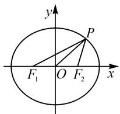
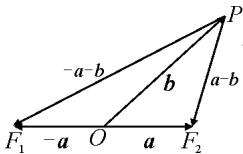

# 一道向量模的最值试题的探究

# 河南省洛阳市洛阳理工学院附属高级中学 姚文涛

摘要: 平面向量自身同时兼备“数”与“形”的双重特征, 这也给平面向量问题的解决提供更加宽广的思维空间. 借助一道平面向量模的最值问题的求解, 合理进行联想, 利用平面解析几何思维、平面几何思维以及平面向量思维等联想结果来切入与应用, 有效指导数学教学与复习备考.

关键词: 平面向量; 最值; 联想; 椭圆; 基本不等式

数学解题就是将数学“四基”与具体问题加以联系,而这个过程中,联想思维是非常重要的.联想是数学思维的翅膀,联想往往能出奇招.抓住数学问题的应用场景、定义或公式等形式进行充分展开联想,让数学思维飞翔,可以为问题的破解提供更加丰富的思路,为问题的切入奠定基础.

# 1 问题呈现

问题〔2024年江西省吉安一中高三(上)期末数学试卷〕已知向量 $a, b$ 满足 $|a| = 1, |a - b| + |a + b| = 4$ , 则 $|b|$ 的最小值为 \_\_\_\_.

此题以两个平面向量的关系为问题背景,借助其中一个向量的模,以及两个向量的和与差的模的和,通过这两个模的场景来创设问题,进而确定另外一个平面向量的模的最值.试题简捷明了,代数中隐含向量的“动态”变化情况.

而实际剖析问题条件,挖掘平面向量关系式(两个向量的和与差的模的和)的结构特征,合理联想到与之相应的平面解析几何思维、平面几何思维以及平面向量思维等,借助相应的技巧与方法来切入与应用,进而实现问题的突破与求解.

# 2 问题破解

# 2.1 平面解析几何思维

解法 1: 椭圆定义法.

作 $\overrightarrow{OF_1} = -\boldsymbol{a},\overrightarrow{OF_2} = \boldsymbol{a},\overrightarrow{OP} =$ $\pmb{b}$ ，则有 $a - b = \overrightarrow{PF_2}, - (a + b) =$ $\overrightarrow{PF_1}$

依题意知， $|a|=1,|a-b|+$ $|a+b|=4$ ，即 $\left|OF_{1}\right|=\left|OF_{2}\right|=1$ $\left|PF_{1}\right|+\left|PF_{2}\right|=4>2=\left|F_{1}F_{2}\right|$ 根据椭圆的定义可知，点 P 的轨迹是以 $F_{1}, F_{2}$ 为焦点，长轴长 2a=4 的椭圆，如图 1.

text_image

y
P
F₁ O F₂ x

图 1

以点 O 为坐标原点, 以 $F_{1}, F_{2}$ 所在直线为 x 轴建立平面直角坐标系, 此时对应椭圆的标准方程为

$$
\frac {x ^ {2}}{4} + \frac {y ^ {2}}{3} = 1.
$$

所以 $|\pmb{b}| = |OP| = \sqrt{x^2 + y^2} = \sqrt{x^2 + 3\left(1 - \frac{x^2}{4}\right)} =$ $\sqrt{\frac{x^2}{4} + 3}\in [\sqrt{3},2]$ ，则知 $|\pmb {b}| = |OP|$ 的最小值是椭圆的短半轴长，即为 $\sqrt{3}$ ，当且仅当 $x = 0$ ，即 $\pmb{a}\bot \pmb{b}$ 时取得最小值.所以 $|\pmb {b}|$ 的最小值为 $\sqrt{3}$

故填答案: $\sqrt{3}$ .

反思:根据题设中的平面向量关系式的结构特征,合理联想其对应的几何意义,进而利用椭圆的定义,巧妙构建椭圆及其相应的方程,利用函数与方程思维来分析与求解.这是解决此类问题中比较常用的一种技巧方法,合理“串联”起平面向量、平面解析几何、函数与方程等知识之间的交汇与融合.而该思维方法产生的一个间接产物——“ $|b|$ 的取值范围”,可为问题的进一步变式与拓展创造条件.

# 2.2 平面几何思维

解法 2: 三角形中线长公式法.

如图2所示，作 $\overrightarrow{OF_1} = -a, \overrightarrow{OF_2} = a, \overrightarrow{OP} = b$ ，则有 $a - b = \overrightarrow{PF_2}, -(a + b) = \overrightarrow{PF_1}$ .

依题意知， $|a|=1,|a-b|+$ $|a+b|=4$ ，即 $\left|OF_{1}\right|=\left|OF_{2}\right|=1$ $\left|PF_{1}\right|+\left|PF_{2}\right|=4.$

  
图 2

利用三角形的中线长公式，可得 $\left|PF_{1}\right|^{2}+\left|PF_{2}\right|^{2}=2\left(\left|OP\right|^{2}+\left|OF_{1}\right|^{2}\right)$ . 结合基本不等式，可得 $\left|OP\right|^{2}+1=\left|b\right|^{2}+1=\frac{1}{2}\left(\left|PF_{1}\right|^{2}+\left|PF_{2}\right|^{2}\right)\geqslant\left[\frac{1}{2}\left(\left|PF_{1}\right|+\left|PF_{2}\right|\right)\right]^{2}=4$ ，当且仅当 $\left|PF_{1}\right|=$ $\left|PF_{2}\right|$ ，即 $a\perp b$ 时，等号成立.

整理有 $|\pmb{b}|^2 \geqslant 3$ ，解得 $|\pmb{b}| \geqslant \sqrt{3}$ ，所以 $|\pmb{b}|$ 的最小值为 $\sqrt{3}$ . 故填答案： $\sqrt{3}$ .

反思:根据平面几何图形的构建,抓住三角形中对应线段的长度,联系起三角形的中线长公式来合理构建关系式,为问题的进一步分析与求解奠定基础.而合理综合基本不等式来巧妙放缩,达到确定向量模的最值的目的.回归平面向量中“形”的结构特征,综合应用三角形中的基本性质等,是解决平面向量综合问题中比较常见的一种思维方式,也是解决问题的技巧与策略.

# 2.3 平面向量思维

解法 3: 数量积公式转化法.

利用平面向量的数量积公式, 可得 $\left|a-b\right|^{2}+\left|a+b\right|^{2}=(a-b)^{2}+(a+b)^{2}=2(\left|a\right|^{2}+\left|b\right|^{2})$ .

结合 $|a-b|+|a+b|=4$ ，利用基本不等式，可得 $|a-b|^{2}+|a+b|^{2}\geqslant\frac{1}{2}(|a-b|+|a+b|)^{2}=8$ ，当且仅当 $|a-b|=|a+b|$ ，即 $a\perp b$ 时，等号成立.

由于 $|a|=1$ ，所以 $2(|a|^{2}+|b|^{2})=|a-b|^{2}+|a+b|^{2}\geqslant8$ ，即 $2(1+|b|^{2})\geqslant8$ ，整理有 $|b|^{2}\geqslant3$ ，解得 $|b|\geqslant\sqrt{3}$ ，所以 $|b|$ 的最小值为 $\sqrt{3}$ 。故填答案： $\sqrt{3}$ 。

反思:根据条件中两个平面向量的和与差的模的关系式,联想到平面向量的数量积公式,直接利用两个平面向量的和与差的平方公式加以转化,利用平面向量的方法来分析与求解,综合基本不等式来合理放缩,是解决该问题中最为简捷的一种技巧方法,也是该问题考查的一个重要基本点.有关向量综合问题,有时借助纯平面向量的方法,可以实现最优化的数学思维与应用.

# 3 变式拓展

# 3.1 深入变式

变式 1 已知向量 a, b 满足 $\left|a\right|=1,\left|a-b\right|+\left|a+b\right|=4$ ，则 $\left|b\right|$ 的取值范围为 \_\_\_\_.

解析:由原问题的方法2或方法3, 可知 $|b| \geqslant \sqrt{3}$ , 当且仅当 $a \perp b$ 时等号成立.

结合 $|a-b|+|a+b|=4$ ，由绝对值不等式的性质可得 $4=|a-b|+|a+b|\geqslant|(a-b)-(a+b)|=2|b|$ ，当且仅当 $(a-b)/|(a+b)$ ，即a与b共线（a与b同向或反向都可以）时，等号成立，进而解得 $|b|\leqslant2$ 。

综上分析, 可得 $\sqrt{3} \leqslant |b| \leqslant 2$ , 即 $|b|$ 的取值范围为 $[\sqrt{3}, 2]$ . 故填答案: $[\sqrt{3}, 2]$ .

当然,该变式 1 是由原问题的方法 1 深入变式拓展而来的,其实也可以直接利用平面解析几何思维来分析与求解.

# 3.2 发散变式

变式 2 （2024 届浙江省杭金湖四校高三上学期第六次联考数学试题 · 8）已知 $\left|a - b\right| = 3, \left|a\right| = 2|b|$ ，则 $\cos\langle a, a - b\rangle$ 的最小值为（）.

A. $\frac{1}{2}$

B. $\frac{\sqrt{2}}{2}$

C. $\frac{\sqrt{3}}{2}$

D.1

解析:依题,由 $|a-b|=3$ , $|a|=2|b|$ ,可得 $|a-b|^{2}=|a|^{2}+|b|^{2}-2a\cdot b=5|b|^{2}-2a\cdot b=9$ ,则 $a\cdot b=\frac{5}{2}|b|^{2}-\frac{9}{2}$ .所以 $a\cdot(a-b)=a^{2}-a\cdot b=4|b|^{2}-\left(\frac{5}{2}|b|^{2}-\frac{9}{2}\right)=\frac{3}{2}|b|^{2}+\frac{9}{2}$ .

结合平面向量的数量积公式与基本不等式,可得

$\cos \langle a, a - b \rangle = \frac{a \cdot (a - b)}{|a| |a - b|} = \frac{\frac{3}{2} |b|^2 + \frac{9}{2}}{2 |b| \times 3} = \frac{1}{4} |b| + \frac{3}{4 |b|} \geqslant 2\sqrt{\frac{1}{4} |b| \times \frac{3}{4 |b|}} = \frac{\sqrt{3}}{2}$ , 当且仅当 $\frac{1}{4} |b| = \frac{3}{4 |b|}$ , 即 $|b| = \sqrt{3}$ 时, 等号成立.

所以 $\cos\langle a,a-b\rangle$ 的最小值为 $\frac{\sqrt{3}}{2}$ . 故选: C.

该变式 2 中,依托平面向量的模之间的关系,进一步创设应用场景,进而确定相关向量的夹角问题,给问题的应用开拓更加宽广的空间与思维层面.

# 3.3 链接高考

变式 3 （2024 年高考数学新高考Ⅱ卷·3）已知向量 a, b 满足 $\left|a\right|=1,\left|a+2b\right|=2$ ，且 $(b-2a)\perp b$ ，则 $\left|b\right|=(\quad)$ .

A. $\frac{1}{2}$

B. $\frac{\sqrt{2}}{2}$

C. $\frac{\sqrt{3}}{2}$

D.1

解析:依题,由 $(b-2a)\perp b$ ,可得 $(b-2a)\cdot b=b^{2}-2a\cdot b=0$ ,即 $2a\cdot b=b^{2}$ .

由 $|a+2b|=2$ ，可得 $a^{2}+4a\cdot b+4b^{2}=4$ 。

将 $2a \cdot b = b^2$ 代入上式，并结合 $|a| = 1$ ，整理可得 $1 + 6b^2 = 4$ ，即 $b^2 = \frac{1}{2}$ ，解得 $|b| = \frac{\sqrt{2}}{2}$ . 故选：B.

# 4 教学启示

平面向量是一个特殊的数学基础知识,其同时兼备“数”与“形”的双重特征,“数”中隐含几何特征,“形”中涉及代数性质,是有效沟通代数与几何之间的一个桥梁,是代数与几何一个完美结合.

基于此,在解决平面向量的综合应用问题时,要抓住平面向量的基本特征,合理从“数”或“形”的视角加以巧妙联想,借助“数”的基本性质联想相应的几何意义或代数模型,借助“形”的基本特征联想相应的几何图形或代数性质,从不同层面构建与题目条件相应的代数模型或几何图形,利用与之相关的数学思维(往往是平面向量思维、三角形思维、平面解析几何思维、函数与导数思维等)切入,进而为问题的解决提供一个更加契合的条件,实现问题的巧妙解决. Z