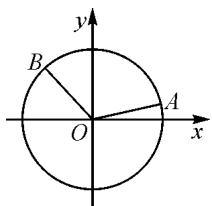
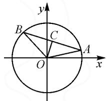

# 一道解析几何取值范围题的探究

# ● 江苏省常熟市海虞高级中学 朱沈瑶

摘要: 涉及圆的综合应用问题, 是近年高考中比较常见的一类基本考点. 结合一道高考数学模拟题, 合理挖掘题设条件与背景, 借助不同思维视角的切入, 多技巧方法应用, 妙推广归纳总结, 多视角变式拓展, 从不同层面探究破解问题的思路与综合应用, 以指导数学教学与解题研究.

关键词: 圆; 动点; 平面向量; 三角函数; 排除

圆的综合应用问题,是高中数学中的一个基本知识点,链接起初中平面几何中的圆的图形性质以及高中平面解析几何中的圆的方程,从圆这一基本图形自身的代数属性或内涵的几何特征等来合理创设,同时又交汇了平面向量、三角函数等模块知识,巧妙吻合高考“在知识交汇点处”命题的基本指导精神,涵盖了数形结合、函数与方程、三角函数等数学思想方法,涉及直观想象、逻辑推理以及数学运算等核心素养,一直成为各级各类考试的必考内容和热点内容之一.

# 1 问题呈现

问题 已知 $A(x_{1},y_{1}),B(x_{2},y_{2})$ 是圆 $O:x^{2} + y^{2} = 2$ 上两个不同点.若 $x_{1}x_{2} + y_{1}y_{2} = -1$ ，则 $x_{1} + x_{2} + y_{1} + y_{2}$ 的取值范围是（ ）.

A. $\left[-\frac{\sqrt{2}}{2},\frac{\sqrt{2}}{2}\right]$

B. $[-1,1]$

C. $\left[-\sqrt{2},\sqrt{2}\right]$

D. $[-2,2]$

此题以圆上的两个动点为问题背景,利用两动点的对应横、纵坐标的乘积之和为定值来确定两动点的相对位置,合理创设情境,进而确定两动点的坐标之和的代数式所对应的取值范围.

解决该问题时,可以借助题设条件以及问题的本质内涵,从三角函数思维、平面向量思维以及特殊思维等不同的数学思维方式切入,结合不同的技巧方法来分析与应用,实现综合问题的突破与解决.

# 2 问题破解

# 2.1 三角函数思维

解法 1: 三角变换法.

依题, 可得 $\overrightarrow{OA} \cdot \overrightarrow{OB} = x_{1}x_{2} + y_{1}y_{2} = -1$ , 又 $|\overrightarrow{OA}| =$ 晕 $|\overrightarrow{OB}| = \sqrt{2}$ . 结合 $\cos\langle\overrightarrow{OA}, \overrightarrow{OB}\rangle = \frac{\overrightarrow{OA} \cdot \overrightarrow{OB}}{|\overrightarrow{OA}| |\overrightarrow{OB}|} =$

$-\frac{1}{2}, 0 \leqslant \langle \overrightarrow{OA}, \overrightarrow{OB} \rangle \leqslant \pi$ ，可得 $\langle \overrightarrow{OA}, \overrightarrow{OB} \rangle = \frac{2\pi}{3}$ ，如图1所示。设 $A(\sqrt{2} \cos \alpha, \sqrt{2} \sin \alpha)$ ，则点 $B$ 坐标为 $\left(\sqrt{2} \cos \left(\alpha + \frac{2\pi}{3}\right), \sqrt{2} \sin \left(\alpha + \frac{2\pi}{3}\right)\right)$ ，其中 $\alpha \in [0, 2\pi)$ 。

text_image

y
B
O
A
x

图1

所以 $x_{1} + x_{2} + y_{1} + y_{2} = \sqrt{2}\cos \alpha +\sqrt{2}\sin \alpha +$ $\sqrt{2}\cos \left(\alpha +\frac{2\pi}{3}\right) + \sqrt{2}\sin \left(\alpha +\frac{2\pi}{3}\right) = \frac{\sqrt{2}}{2} [(1 + \sqrt{3})\cos \alpha+$ $(1 - \sqrt{3})\sin \alpha ] = 2\sin (\alpha +\varphi)\in [-2,2]$ ，其中 $\tan \varphi =$ $\frac{1 + \sqrt{3}}{1 - \sqrt{3}} = -2 - \sqrt{3}.$ 所以 $x_{1} + x_{2} + y_{1} + y_{2}$ 的取值范围是[-2，2].

点评:根据题设条件确定两向量之间的夹角是利用三角变换法解决问题的关键,而利用圆上的点的参数的引入与对应的坐标表示,进而运用三角恒等变换加以变形处理,通过单变量思维,结合三角函数的图象与性质即可实现代数式的取值范围的求解.

# 2.2 平面向量思维

解法 2: 利用向量和.

依题，可得 $\overrightarrow{OA} \cdot \overrightarrow{OB} = x_1x_2 + y_1y_2 = -1$ ，又 $|\overrightarrow{OA}| = |\overrightarrow{OB}| = \sqrt{2}$ . 设 $\overrightarrow{OC} = \overrightarrow{OA} + \overrightarrow{OB}$ ，两边平方可得 $\overrightarrow{OC^2} = (\overrightarrow{OA} + \overrightarrow{OB})^2 = \overrightarrow{OA^2} + \overrightarrow{OB^2} + 2\overrightarrow{OA} \cdot \overrightarrow{OB} = 2 + 2 - 2 = 2$ ，则有 $|\overrightarrow{OC}| = \sqrt{2}$ ，即点 $C$ 也在圆 $O: x^2 + y^2 = 2$ 上. 设 $C(\sqrt{2}\cos \alpha, \sqrt{2}\sin \alpha)$ ，其中 $\alpha \in [0, 2\pi)$ ，则 $\overrightarrow{OC} = \overrightarrow{OA} + \overrightarrow{OB} = (x_1 + x_2, y_1 + y_2) = (\sqrt{2}\cos \alpha, \sqrt{2}\sin \alpha)$ .

所以 $x_{1} + x_{2} + y_{1} + y_{2} = \sqrt{2}\cos \alpha +\sqrt{2}\sin \alpha =$ $2\sin \left(\alpha +\frac{\pi}{4}\right)\in [-2,2].$

解法 3: 利用中点向量.

同解法 1, 可得 $\langle\overrightarrow{OA},\overrightarrow{OB}\rangle=\frac{2\pi}{3}$ .

设 C 为 AB 的中点, 如图 2 所示, 结合平面几何的基本性质可得 $\left|OC\right|=\frac{\sqrt{2}}{2}$ . 设 $C\left(\frac{\sqrt{2}}{2}\cos\alpha,\frac{\sqrt{2}}{2}\sin\alpha\right)$ , 其中 $\alpha\in[0,2\pi)$ , 则有 $2\overrightarrow{OC}=\overrightarrow{OA}+\overrightarrow{OB}=(x_{1}+x_{2},y_{1}+y_{2})=(\sqrt{2}\cos\alpha,\sqrt{2}\sin\alpha)$ .

text_image

y
B
C
O
A
x

图2

下同解法2.

点评: 回归平面解析几何的“形”思维, 借助平面向量的思维与应用来切入, 或通过平面向量的和运算来转化, 或通过平面向量的中点性质来应用, 都给问题的突破与求解提供条件. 利用向量法思维分析与解决该问题, 更加直接明了, 处理起来也更加方便, 同时也方便问题的进一步推广与拓展.

# 2.3 特殊思维.

解法 4: 排除法.

同解法 1, 可得 $\langle\overrightarrow{OA},\overrightarrow{OB}\rangle=\frac{2\pi}{3}$ . 选取特殊点 $A(\sqrt{2},0)$ ，此时可取点 $B\left(\sqrt{2}\cos\frac{2\pi}{3},\sqrt{2}\sin\frac{2\pi}{3}\right)$ ，即 $B\left(-\frac{\sqrt{2}}{2},\frac{\sqrt{6}}{2}\right)$ . 所以 $x_{1}+x_{2}+y_{1}+y_{2}=\sqrt{2}-\frac{\sqrt{2}}{2}+\frac{\sqrt{6}}{2}=\frac{\sqrt{2}+\sqrt{6}}{2}>\sqrt{2}$ ，结合各选项中的数据信息，由此可以排除选项 A, B, C. 故选：D.

点评:根据题设条件确定两向量之间的夹角,而通过特殊点的选取,利用代数式的取值情况进行巧妙排除,处理起来更加简单快捷.特殊思维中,借助特殊元素的确定或选取,往往可以给选项的排除与确定提供条件,这也是解决单项选择题中比较常用的一种“巧技妙法”.

# 3 推广归纳

基于原问题的解析,特别是向量法的应用,可以将问题进一步加以一般化处理,从而得到以下相应的结论.

结论 已知 $A(x_{1},y_{1}),B(x_{2},y_{2})$ 是圆 $O:x^{2} + y^{2} = r^{2}(r > 0)$ 上两个不同点.若 $x_{1}x_{2} + y_{1}y_{2} = \lambda$ ，其中 $\lambda \in (-r^2,r^2)$ ，则 $x_{1} + x_{2} + y_{1} + y_{2}$ 的取值范围是 $[-2\sqrt{r^2 + \lambda},2\sqrt{r^2 + \lambda} ]$

证明:依题,可得 $\overrightarrow{OA}\cdot\overrightarrow{OB}=x_{1}x_{2}+y_{1}y_{2}=\lambda$ ,其中 $\lambda\in(-r^{2},r^{2})$ .又 $|\overrightarrow{OA}|=|\overrightarrow{OB}|=r$ .设 $\overrightarrow{OC}=\overrightarrow{OA}+\lambda$

$\overrightarrow{OB}$ , 两边平方可得 $\overrightarrow{OC^2} = (\overrightarrow{OA} + \overrightarrow{OB})^2 = \overrightarrow{OA}^2 + \overrightarrow{OB}^2 + 2\overrightarrow{OA} \cdot \overrightarrow{OB} = r^2 + r^2 + 2\lambda = 2r^2 + 2\lambda$ , 则有 $|\overrightarrow{OC}| = \sqrt{2r^2 + 2\lambda}$ , 所以点 $C$ 在圆 $x^2 + y^2 = 2r^2 + 2\lambda$ 上. 设 $C(\sqrt{2r^2 + 2\lambda}\cos \alpha, \sqrt{2r^2 + 2\lambda}\sin \alpha)$ , 其中 $\alpha \in [0, 2\pi)$ , 则 $\overrightarrow{OC} = \overrightarrow{OA} + \overrightarrow{OB} = (x_1 + x_2, y_1 + y_2) = (\sqrt{2r^2 + 2\lambda}\cos \alpha, \sqrt{2r^2 + 2\lambda}\sin \alpha)$ . 所以 $x_1 + x_2 + y_1 + y_2 = \sqrt{2r^2 + 2\lambda}\cos \alpha + \sqrt{2r^2 + 2\lambda}\sin \alpha = 2\sqrt{r^2 + \lambda}\sin \left(\alpha + \frac{\pi}{4}\right) \in [-2\sqrt{r^2 + \lambda}, 2\sqrt{r^2 + \lambda}]$ .

所以，可知 $x_{1} + x_{2} + y_{1} + y_{2}$ 的取值范围是 $[-2\sqrt{r^2 + \lambda}, 2\sqrt{r^2 + \lambda}]$ .

该结论中，当 $r^2 = 2, \lambda = -1$ 时， $2\sqrt{r^2 + \lambda} = 2$ ，则 $x_1 + x_2 + y_1 + y_2$ 的取值范围是 $[-2, 2]$ ，即为原问题。原问题只是该结论的一个特例而已。

借助该结论,可以改变 $r^{2}$ 与 $\lambda$ 的值,进而合理改编此问题,实现典型综合问题的推广与应用.

# 4 变式拓展

保留题目场景与条件,改变求解的结果,以另一种方式来创设问题,得到如下对应的变式问题.

变式 已知 $A(x_{1},y_{1}),B(x_{2},y_{2})$ 是圆 $O:x^{2} + y^{2} = 2$ 上两个不同的点.若 $x_{1}x_{2} + y_{1}y_{2} = -1$ ，则 $|x_1 + \sqrt{3} y_1 + 6| + |x_2 + \sqrt{3} y_2 + 6|$ 的取值范围是

答案: $\left[12-2\sqrt{2},12+2\sqrt{2}\right]$ .

# 5 教学启示

# 5.1 合理交汇,巧妙应用

基于圆的综合应用问题,往往能巧妙融合“数”与“形”这两种不同属性与特征.在实际解题过程中,可以从“数”的视角切入进行数学运算,也可以从“形”的视角切入进行数形结合,还可以“数”“形”结合加以综合应用.

# 5.2 动静结合,落实“四基”

基于圆的综合应用问题,往往合理渗透平面解析几何场景中点与圆、直线与圆以及圆与圆等元素之间的“动”与“静”的和谐统一,合理综合数学基础知识,巧妙应用数学基本能力,从而有效落实数学的“四基”,夯实数学的“四能”,使得学生的解题思维更加开阔,解题思路更加活跃,数学知识的掌握更加熟练,问题的破解更加快速有效. Z