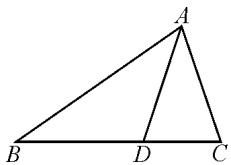
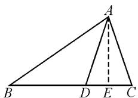
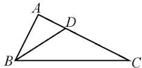
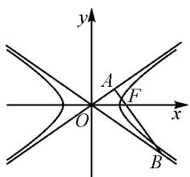

# 利用角平分线定理巧解与平面几何相关的高中试题

江苏省华罗庚中学 王国俊

平面几何中的角平分线定理,是初中平面几何知识中的一个重要基本定理,借助角平分线特征合理构建对应的线段之间的比例关系式,为解决高中数学中的解三角形、平面向量、圆锥曲线以及复数等相关问题指明方向,巧妙化归,合理转化,直观形象,完美解决.

# 1 解决解三角形问题

在解三角形问题中,通过平面几何图形中的特征性质,利用几何图形中同邻边的角相等或对称关系等,充分挖掘角平分线的性质与内涵,借助角平分线定理来构建关系式,为进一步综合利用解三角形中的相关知识提供条件,开拓场景.

例 1 如图 1, 在 $\triangle ABC$ 中, 点 D 在边 BC 上, AD 为 $\angle BAC$ 的平分线, $AC = AD = \sqrt{10}$ , CD = 2.

  
图1

(1) 求 $\sin\angle BAC$ 的值；

(2) 求 AB 的长.

分析:(1)由已知条件,结合余弦定理可以先求 $\cos\angle DAC$ 的值,通过角平分线的性质,结合同角三角函数基本关系式以及二倍角正弦公式加以求解,即可确定 $\sin\angle BAC$ 的值;(2)引入参数,设出AB=x,结合角平分线定理构建相应的比例关系式来表示BD,然后结合勾股定理构建对应的方程,通过解一元二次方程来确定相应边的长度问题.

解析:(1)设 $\angle DAC=\alpha,\triangle ADC$ 中,利用余弦定理,可得 $\cos\alpha=\frac{10+10-4}{2\times\sqrt{10}\times\sqrt{10}}=\frac{4}{5}$ .结合同角三角函数基本关系式,可得 $\sin\alpha=\sqrt{1-\cos^{2}\alpha}=\frac{3}{5}$ .所以 $\sin\angle BAC=\sin 2\alpha=2\sin\alpha\cos\alpha=2\times\frac{4}{5}\times\frac{3}{5}=\frac{24}{25}$ .

(2)如图2所示,过A作 $AE\perp CD$ ,垂足为E.设AB=x>0.

由角平分线定理, 可得 $\frac{AB}{AC} = \frac{BD}{CD}$ , 即 $\frac{x}{\sqrt{10}} = \frac{BD}{2}$ ,

则 $BD=\frac{\sqrt{10}}{5}x$ . 在 Rt△ACE 中，
CE=1, AC= $\sqrt{10}$ ，利用勾股定理可得 $AE=\sqrt{10-1}=3$ . 在 Rt△ABE 中，由勾股定理有$AB^{2}=AE^{2}+BE^{2}$ ，则有 $x^{2}=9+\left(1+\frac{\sqrt{10}}{5}x\right)^{2}$ ，整理可得 $3x^{2}-2\sqrt{10}x-50=0$ .

  
图2

解得 $x=\frac{5\sqrt{10}}{3}$ ，或 $x=-\sqrt{10}$ （舍去）.

所以 AB 的长为 $\frac{5\sqrt{10}}{3}$ .

点评:解三角形问题的本质就是平面几何的三角形问题的深入与升华,结合三角形中同邻边的角相等或对称关系,利用角平分线定理合理构建相应的比例关系式,综合解三角形的正弦定理、余弦定理等相关知识,实现利用角平分线定理巧妙化归与转化解三角形问题,创新应用.

# 2 解决平面向量问题

在平面向量问题中,通过平面几何图形中的特征性质,利用同邻边的角相等或对称关系等,充分挖掘角平分线的性质与内涵,借助角平分线定理来构建关系式,为进一步综合利用平面向量基本知识奠定条件.

例 2 如图 3 所示，在 $\triangle ABC$ 中， $\angle ABC$ 的平分线为 BD，若 BC=2AB=2， $\angle ABC=\frac{\pi}{3}$ ，则 $\overrightarrow{BD} \cdot \overrightarrow{AC}=$ \_\_\_\_.

  
图3

分析:根据题目条件,利用余弦定理确定三角形的第三边,结合勾股定理确定三角形为直角三角形,通过角平分线定理确定线段长度的比例关系,进而确定AD的长度,最后利用平面向量的数量积公式,结合投影加以转化,进而得以求解数量积.

解析: 在 $\triangle ABC$ 中, BC = 2AB = 2, $\angle ABC = \frac{\pi}{3}$ ,

利用余弦定理,可得

$$
A C = \sqrt {1 ^ {2} + 2 ^ {2} - 2 \times 2 \cos \frac {\pi}{3}} = \sqrt {3}.
$$

由 $AC^2 + AB^2 = BC^2$ ，可知 $\angle BAC = \frac{\pi}{2}$

又由 BD 为 $\angle ABC$ 的平分线，结合角平分线定理，可得 $\frac{AB}{BC} = \frac{AD}{CD} = \frac{1}{2}$ ，则 $AD = \frac{1}{3} AC = \frac{\sqrt{3}}{3}$ .

所以 $\overrightarrow{BD} \cdot \overrightarrow{AC} = |\overrightarrow{BD}| |\overrightarrow{AC}| \cos \angle ADB = |\overrightarrow{AD}| |\overrightarrow{AC}| = \frac{\sqrt{3}}{3} \times \sqrt{3} = 1.$

点评:平面向量同时兼备“数”与“形”的双重特征,结合平面向量的条件背景,通过三角形的平面几何性质,特别是利用角平分线定理来合理构建线段长度的比例关系式,从而为进一步解决平面向量中的概念、模、运算、数量积等相关问题提供条件,为问题的解决拓展思维.

# 3 解决圆锥曲线问题

在圆锥曲线问题中,通过圆锥曲线图形中的平面几何特征性质,利用同邻边的角相等或对称关系等,充分挖掘角平分线的性质与内涵,借助其构建关系,为进一步综合利用圆锥曲线知识创造条件.

例 3 椭圆 $C: \frac{x^{2}}{a^{2}} + \frac{y^{2}}{b^{2}} = 1 (a > b > 0)$ 的左顶点、左焦点、上顶点分别为 A, F, B，若原点 O 关于直线 BF 的对称点恰好在直线 AB 上，则椭圆 C 的离心率的取值范围为（）.

A. $\left(0,\frac{1}{4}\right)$

B. $\left(\frac{1}{4},\frac{1}{2}\right)$

C. $\left(\frac{1}{2},\frac{3}{4}\right)$

D. $\left(\frac{3}{4},1\right)$

分析:根据圆锥曲线的背景条件确定平面几何的相关性质,利用角平分线定理构建相应的关系式,进而将问题转化为高次函数问题,结合函数求导,通过判定函数的单调性,以及函数的零点存在性定理的应用来综合分析、处理.

解析:由根据题目条件,坐标原点 O 关于直线 BF 的对称点恰好在直线 AB 上,可得 BF 是 $\angle ABO$ 角平分线,则由角平分线定理得 $\frac{\sqrt{a^{2}+b^{2}}}{b}=\frac{a-c}{c}$ .

将 $b^{2}=a^{2}-c^{2}$ 代入关系式，整理可得 $\frac{2a^{2}-c^{2}}{a^{2}-c^{2}}=\frac{a^{2}-2ac+c^{2}}{c^{2}}$ ，则 $\frac{2-e^{2}}{1-e^{2}}=\frac{1-2e+e^{2}}{e^{2}}$ ，化简得

$$
2 e ^ {3} - 2 e ^ {2} - 2 e + 1 = 0.
$$

令函数 $f(x)=2x^{3}-2x^{2}-2x+1,0<x<1$ ，则

$$
f ^ {\prime} (x) = 2 (x - 1) (3 x + 1) <   0,
$$

则知函数 $f(x)$ 在区间 $(0,1)$ 上单调递减.

因为 $f\left(\frac{1}{4}\right)=\frac{13}{32}>0$ , $f\left(\frac{1}{2}\right)=-\frac{1}{4}<0$ .

由函数的零点存在性定理, 可知 $e \in \left( \frac{1}{4}, \frac{1}{2} \right)$ .

点评:平面解析几何中隐含有平面几何的本质特征,通过角平分线定理中条件的挖掘以及定理的应用,合理沟通平面解析几何与平面几何之间的联系,实现问题的转化与解决.利用角平分线定理构建线段之间的比例关系式,对条件的挖掘与结论的求解更加直接有效,直观形象,灵活巧妙.

例 4 直线 l 过双曲线 $C: \frac{x^{2}}{a^{2}} - \frac{y^{2}}{b^{2}} = 1 (a > 0, b > 0)$ 的右焦点 F，与双曲线 C 的两条渐近线分别交于 A, B 两点，O 为原点， $\overrightarrow{OA} \cdot \overrightarrow{AF} = 0$ ，且 $3 \overrightarrow{AF} = \overrightarrow{FB}$ ，则双曲线 C 的离心率为（）.

A. $\sqrt{2}$

B. $\sqrt{3}$

C. $\frac{\sqrt{5}}{2}$

D. $\frac{\sqrt{6}}{2}$

解析：根据 $\overrightarrow{OA} \cdot \overrightarrow{AF} = 0$ ，则知 $\overrightarrow{OA} \perp \overrightarrow{AF}$ ，即 $\angle OAB = \frac{\pi}{2}$ .

如图 4 所示, 在 Rt△OAB 中, 设 $\angle AOF = \theta$ , 则 $\angle AOF = \angle BOF = \theta$ , 且利用渐近线的基本性质可得 $\tan \theta = \frac{b}{a}$ , 利用三角形的角平分线定理与三角函数的定义, 可得 $\frac{|OA|}{|OB|} = \frac{|\overrightarrow{AF}|}{|\overrightarrow{FB}|} = \frac{1}{3} = \cos 2\theta$ .

text_image

y
A
F
O
x
B

图4

结合三角函数的万能公式 $\cos 2\theta = \frac{1 - \tan^{2}\theta}{1 + \tan^{2}\theta}$ ，可得 $\frac{1 - \tan^{2}\theta}{1 + \tan^{2}\theta} = \frac{1}{3}$ ，变形转化解得 $\tan^{2}\theta = \frac{1}{2} = \frac{b^{2}}{a^{2}}$ ，所以双曲线 C 的离心率 $e = \frac{c}{a} = \sqrt{1 + \frac{b^{2}}{a^{2}}} = \frac{\sqrt{6}}{2}$ .

借助平面几何中的角平分线定理及其应用,对于解决高中数学中的一些相关问题有着非常重要、巧妙的应用.借助三角形的角平分线定理在解决相关问题,抓住问题内涵,回归问题本质,数形直观形象,合理化归转化,使得相关问题的解决更加直观有效,思维更加巧妙灵活,全面养成数学思维品质,提升数学解题能力,培养数学核心素养.Z