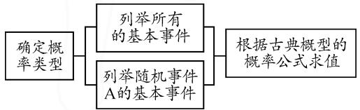
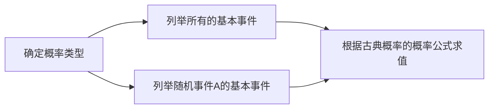
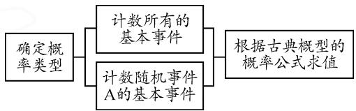
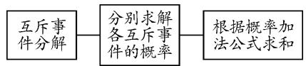
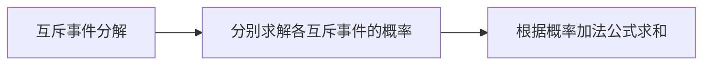
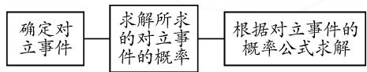
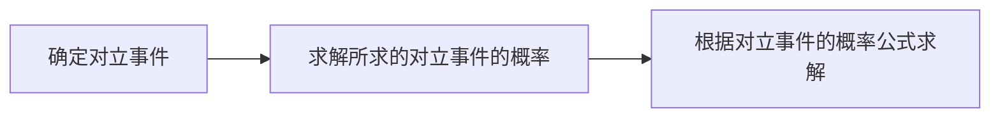

# 古典概型的基本解题方法与解题模板

# ● 江苏省通州高级中学 韩红梅

摘要: 古典概型问题是概率中最常见的一类基本运算问题, 有其自身的规律与解题方法. 结合实例, 就古典概型问题的基本解题方法进行合理归纳, 创设思维导图, 总结解题模板, 构建解题步骤, 有效指导解题研究与复习备考.

关键词: 古典概型; 概率; 列举; 计数

我们知道,解决古典概型问题的关键是分清基本事件总数 n 与事件 A 中包含的结果数 m,而在实际解决问题中,可采用相关的解题方法加以应用.本文中结合实例,剖析古典概型问题的几个常见基本解题方法,归纳解题模板,形成解题步骤,更好地指导学生解决古典概型的应用问题.

# 1 列举法

利用列举法求解古典概型的概率问题时,往往都是通过罗列一次试验包含的所有基本事件与随机事件 A 包含的基本事件进行计算.有一些问题通过列表法、画树形图等方法来列举相关的基本事件,有时可能更加快捷方便.

例 1 已知集合 $A=\{1,2,3,4\}$ ，集合 $B=\{a_{1},a_{2},a_{3},a_{4}\}$ ，且 B=A，定义 A 与 B 的距离为 $d(A,B)=\sum_{i=1}^{4}|a_{i}-i|$ ，则 $d(A,B)=2$ 的概率为 \_\_\_\_.

思维导图如图 1 所示：

flowchart

图1

解析:由题目条件知,这是一个古典概型问题.由于 B=A,则 B 中元素的排列次序 \( (a\_{1},a\_{2},a\_{3},a\_{4}) \) 有 \( (1,2,3,4),(1,2,4,3),(1,3,2,4),(1,3,4,2),(1,4,3,2),(1,4,2,3),(2,1,3,4),(2,1,4,3),(2,3,1,4),(2,3,4,1),(2,4,3,1),(2,4,1,3),(3,1,2,4),(3,1,4,2),(3,2,1,4),(3,2,4,1),(3,4,1,2),(3,4,2,1),(4,1,2,3),(4,1,3,2),(4,2,3,1),(4,2,1,3),(4,3,1,2),(4,3,2,1),共24种.

其中 $d(A,B)=2$ 的事件有 $(1,2,4,3)$ ， $(2,1,3,4)$ ， $(1,3,2,4)$ ，共 3 种.

所以 $d(A,B)=2$ 的概率 $P=\frac{3}{24}=\frac{1}{8}$ . 故填答案: $\frac{1}{8}$ .

解题模板归纳: 在求解古典概型的情况下, 列举法是建立在等可能事件的基础上, 通过列举所有等可能结果来求概率的一种方法. 同时在列举过程中培养学生思维的条理性, 把思考过程有条理、直观、简捷地不重不漏列举出来. 一般的基本步骤如下:

(1)定型,即先根据条件确定概率的类型;   
(2)列举,即把古典概型中相关事件所包含的基本事件列举出来;   
(3)求值,代入古典概型的概率公式即可求得结果.

# 2 计数原理法

利用排列组合及简单的计数原理求解古典概型的概率问题时,根据题目条件在考虑问题时要一致,保证对所有的基本事件的计数与随机事件 A 的基本事件的计数标准统一.

例 2 有 6 个座位连成一排,三人就座,恰有两个空位相邻的概率是().

A. $\frac{4}{5}$

B. $\frac{3}{5}$

C. $\frac{2}{5}$

D. $\frac{1}{5}$

思维导图如图 2 所示:

flowchart

图2

解析:根据题目条件知所求的概率满足古典概型,三人随意就座的不同方法有 $C_{6}^{3}$ 种,而恰有两个空位相邻的就座方法有 $A_{4}^{2}$ 种(从已经就座的三个座位之间的四个空隙中安排两个位置插入,其中有一个位置安排两个空位即可).

所以所求的概率为 $P=\frac{A_{4}^{2}}{C_{6}^{3}}=\frac{3}{5}$ . 故选择答案: B.

解题模板归纳:计数原理法就是将古典概型中基本事件的计数问题转化为基本计数原理以及排列组合中的相关问题进行求解的方法,主要用来解决基本事件个数较多的情况.此种方法对于事件中涉及的元素个数较多的问题特别有效.一般的基本步骤如下：

(1)定型,即先根据条件确定概率的类型;   
(2)转化,即把古典概型的计算转化为两个计数问题;   
(3) 计数, 根据条件利用基本计数原理, 以及排列组合等相关知识来分析并求解基本事件数;  
(4) 求值, 利用古典概型的概率公式即可求得结果.

# 3 求和法

应用求和法结合概率的加法公式来求解古典概型问题的前提有两个:一是所求事件是几个事件的和;二是这几个事件是互斥的.互斥事件的判断至关重要,同时互斥事件可以解决的问题比较广,一般只要满足 $A\cap B=\varnothing$ ,就可以用互斥事件的性质加以解决.

例 3 某射手在一次射击中命中 10 环、9 环、8 环、7 环、7 环以下的概率分别为 0.24, 0.28, 0.19, 0.16, 0.13. 计算这个射手在一次射击中：

(1)命中10环或9环的概率;   
(2) 至少命中 7 环的概率;  
(3)命中环数不足8环的概率.

思维导图如图 3 所示：

flowchart

图3

解析:设命中10环、9环、8环、7环、7环以下的事件分别为A,B,C,D,E,则五个事件两两互斥,且

$$
\begin{array}{c} {P (A) = 0. 2 4, P (B) = 0. 2 8, P (C) = 0. 1 9, P (D) =} \\ {0. 1 6, P (E) = 0. 1 3.} \end{array}
$$

(1) $P(A+B)=P(A)+P(B)=0.24+0.28=0.52$ ，即命中10环或9环的概率为0.52.  
(2) $P(A+B+C+D)=P(A)+P(B)+P(C)+P(D)=0.24+0.28+0.19+0.16=0.87$ ，即至少命中7环的概率为0.87.  
(3) $P(D+E)=0.16+0.13=0.29$ ，即命中环数不是8环的概率为0.29。

解题模板归纳:求和法就是把较为复杂的事件拆分为几个彼此互斥的简单事件来转化与求解.此种方法的依据是,若事件 A 与 B 互斥,则 $P(A \cup B) = P(A) + P(B)$ .其一般的基本步骤是:

(1)分解,即根据事件的性质将其分解为几个彼此互斥的事件;   
(2) 分求, 即分别求出这几个彼此互斥的简单事件的概率;  
(3)求和,即利用互斥事件的概率加法公式,把相

应的概率值代入求和.

# 4 正难则反法

事件 A 的对立事件 $\overline{A}$ 与集合的补集思维相对应, 是正难则反数学思维的理论基础. 特别是碰到一些含有否定意义或含有“至多”“至少”等用语的复杂问题, 以及一些直接求解比较复杂或根本无法解决的问题时, 往往可以借助正难则反法来分析与处理.

例 4 某商场有奖销售中, 购满 100 元商品得 1 张奖券, 多购多得, 每 1 000 张奖券为一个开奖单位. 设特等奖 1 个, 一等奖 10 个, 二等奖 50 个. 设 1 张奖券中特等奖、一等奖、二等奖的事件分别为 A, B, C, 求 1 张奖券不中奖的概率.

思维导图如图 4 所示:

flowchart

图 4

解析:由等可能事件的古典概型模式,可求得

$$
P (A) = \frac {1}{1 0 0 0} = 0. 0 0 1, P (B) = \frac {1 0}{1 0 0 0} = 0. 0 1,
$$

$$
P (C) = \frac {5 0}{1 0 0 0} = 0. 0 5.
$$

“1 张奖券不中奖”是指事件 $\overline{A+B+C}$ .

由于事件 $\overline{A+B+C}$ 与 $A+B+C$ 是对立事件，因此 $P(\overline{A+B+C})=1-P(A+B+C)=1-P(A)-P(B)-P(C)=1-0.001-0.01-0.05=0.939$ ，即1张奖券不奖的概率为0.939。

解题模板归纳:正难则反法是解决数学问题的一种基本思维方式,在解决复杂的古典概型问题时也是非常适用与有效的.特别是古典概型问题中涉及“至少”、“至多”、否定或肯定等词语的复杂问题,或正面求解分类较多与分类有困难等的复杂古典概型问题,经常可以采用正难则反法来化归与转化.其一般的基本步骤如下:

(1)定反,即根据原基本事件 A,从反面视角来确定所求事件的对立事件 $\overline{A}$ ;  
(2) 求反, 即根据问题实质, 从事件本身或对立事件 $\overline{A}$ 的基本性质等层面来分析并求其对应的概率 $P(\overline{A})$ ;  
(3)作差,即利用对立事件的概率公式,确定所求基本事件 A 的概率,可得 $P(A)=1-P(\overline{A})$ .

在数学教学与学习过程中,有必要掌握一些求解古典概型问题的基本策略与技巧,掌握对应的方法及其相关的解题模板与解题步骤,可以更为简单、快捷地解决问题. Z