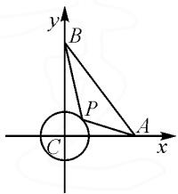
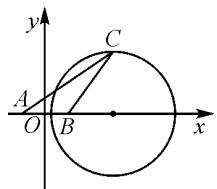
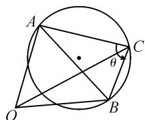
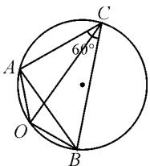
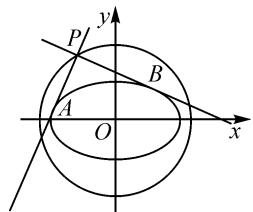
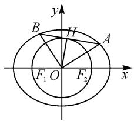

# 多种视角例谈“隐形圆”

# 山东省利津县高级中学 甄天文

摘要: 圆是新高考考查的重要内容, 它是数和形深度结合的很好桥梁. 本文中从多个视角切入, 以典例为依托, 通过有效变形和推理论证, 找到“隐形圆”, 从几何的角度破解试题, 体现了圆在解析几何中的机动灵活和无价值不入题的高考命题要求.

关键词:隐形圆;最值;范围;方程

# 1 问题背景

在一些高考题目中,条件没有直接给出圆方面的信息,而是隐藏在题目中,要通过分析转化,发现圆或圆的方程,从而利用圆的知识求解,一般称此类问题为“隐形圆”问题.人教 B 版教材选修第一册课后习题中也给出了阿波罗尼斯圆——“隐形圆”的典型例子.

# 2 常见视角下的隐形圆

# 2.1 由圆的定义确定隐形圆

例 1 （2022·北京卷）在 $\triangle ABC$ 中 AC = 3，BC = 4， $\angle C = 90^{\circ}$ ，P 为 $\triangle ABC$ 所在平面内的动点，且 PC = 1，则 $\overrightarrow{PA} \cdot \overrightarrow{PB}$ 的取值范围（）.

$$
\mathrm{A.} [ - 5, 3 ] \quad \mathrm{B.} [ - 3, 5 ] \quad \mathrm{C.} [ - 6, 4 ] \quad \mathrm{D.} [ - 4, 6 ]
$$

解析: 因为 P 为动点, PC = 1, 所以点 P 的轨迹是以 C 为圆心, 1 为半径的圆. 建立如图 1 所示的平面直角坐标系. 设 AB 中点为 D, 由极化恒等式得

text_image

y
B
P
C
A
x

图1

$$
\begin{array}{l} \overrightarrow {P A} \cdot \overrightarrow {P B} = \overrightarrow {P D ^ {2}} - \frac {1}{4} \overrightarrow {A B ^ {2}} \\ = \overrightarrow {P D} ^ {2} - \frac {2 5}{4}. \\ \end{array}
$$

$$
\text { 又 } \left| P D \right| _ {\min} = \left| C D \right| - 1 = \frac {3}{2}, \left| P D \right| _ {\max} = \left| C D \right| + 1 = \frac {7}{2},
$$

所以 $-4 \leqslant \overrightarrow{PA} \cdot \overrightarrow{PB} \leqslant 6.$ 故选: D.

# 2.2 由复数的几何意义确定隐形圆

例 2 （2022·北京卷第 5 题变式）已知复数 $z_{1}$ ， $z_{2}$ 满足 $|z_{1}| = 1, z_{2} = 3 + 4i$ ，则 $|z_{1} - z_{2}|$ 的取值范围是 \_\_\_\_.

解析: 设 $z_{1}=x+y\mathrm{i}(x,y\in\mathbf{R})$ ，则 $\left|z_{1}\right|^{2}=x^{2}+y^{2}=1$ ，表示以原点为圆心的单位圆.

所以 $|z_1 - z_2| = |x - 3 + (y - 4)\mathrm{i}| =$

$\sqrt{(x-3)^{2}+(y-4)^{2}}$ ，表示单位圆上的动点 $Z_{1}$ 与点 $Z_{2}(3,4)$ 的距离，则

$$
\left| Z _ {1} Z _ {2} \right| _ {\max} = \left| O Z _ {2} \right| + 1 = 6,
$$

$$
\left| Z _ {1} Z _ {2} \right| _ {\min} = \left| O Z _ {2} \right| - 1 = 4.
$$

所以 $4 \leqslant |z_{1} - z_{2}| \leqslant 6$ .

# 2.3 由三角函数确定隐形圆

例 3 （2018·北京理·7）在平面直角坐标系中，记 d 为点 $P(\cos \theta, \sin \theta)$ 到直线 x-my-2=0 的距离。当 $\theta, m$ 变化时，d 的最大值为（）.

A.1

B.2

C.3

D.4

解析: 设 $P(x, y)$ ，则 $\left\{\begin{aligned} x &= \cos \theta, \\ y &= \sin \theta, \end{aligned}\right.$ 所以 $x^{2} + y^{2} = 1$ ，即点 P 在单位圆上.

所以 $d \leqslant 1 + \frac{|-2|}{\sqrt{1 + m^2}} = 1 + \frac{2}{\sqrt{1 + m^2}} \leqslant 1 + 2 = 3.$

当 m=0 时， $d_{max}=3$ .

故选：C.

# 2.4 由两定点 A, B 及动点 P 满足 $\overrightarrow{PA} \cdot \overrightarrow{PB} = \lambda$ 确定隐形圆(数量积圆)

已知两定点 A, B, 动点 P 满足 $\overrightarrow{PA} \cdot \overrightarrow{PB} = \lambda$ . 以 AB 的中点为原点, AB 所在直线为 x 轴建立平面直角坐标系.

设 $A(m,0),B(-m,0),P(x,y)$ ，则

$$
\overrightarrow {P A} = (m - x, - y), \overrightarrow {P B} = (- m - x, - y).
$$

所以 $\overrightarrow{PA}\cdot\overrightarrow{PB}=(m-x)(-m-x)+y^{2}=\lambda.$

整理, 得 $x^{2} + y^{2} = \lambda + m^{2}$ .

故当 $\lambda + m^{2} > 0$ 时，点 P 的轨迹是圆.

例 4 （2020 · 全国卷Ⅲ · 6）在平面内，A, B 是两个定点，C 是动点，若 $\overrightarrow{AC} \cdot \overrightarrow{BC} = 1$ ，则点 C 的轨迹为（）.(A)

A. 圆

B. 椭圆

C. 抛物线

D. 直线

# 2.5 由两定点 A, B 及动点 P 满足 $\left|AP\right|=\lambda\left|BP\right|$ $(\lambda>0,\lambda\neq1)$ 确定隐形圆(阿波罗尼斯圆)

已知两定点 A, B, 动点 P 满足 $\left|AP\right| = \lambda \left|BP\right|$ $(\lambda > 0, \lambda \neq 1)$ , 设 $|AB| = 2m (m > 0)$ , 以 $AB$ 的中点为原点, $AB$ 所在直线为 $x$ 轴建立平面直角坐标系.

设 $A(-m,0),B(m,0),P(x,y)$ ，由 $\mid AP\mid =$ $\lambda \mid BP|$ ，得 $\sqrt{(x + m)^2 + y^2} = \lambda \sqrt{(x - m)^2 + y^2}$

两边平方化简整理,得

$$
(\lambda^ {2} - 1) x ^ {2} - 2 m (\lambda^ {2} + 1) x + (\lambda^ {2} - 1) y ^ {2} = m ^ {2} (1 - \lambda^ {2}).
$$

配方整理,得 $\left(x-\frac{\lambda^{2}+1}{\lambda^{2}-1}m\right)^{2}+y^{2}=\frac{4\lambda^{2}m^{2}}{(\lambda^{2}-1)^{2}}.$

所以点 $P$ 的轨迹为以点 $\left(\frac{\lambda^2 + 1}{\lambda^2 - 1} m,0\right)$ 为圆心， $\left|\frac{2\lambda m}{\lambda^2 - 1}\right|$ 为半径的圆.

例 5 满足条件 AB = 2, AC = $\sqrt{2}$ BC 的 $\triangle ABC$ 的面积的最大值是 \_\_\_\_.

解析: 以 AB 中点为原点, 直线 AB 为 x 轴建立如图 2 所示的平面直角坐标系. 设 $C(x, y)$ , 则 $(x + 1)^{2} + y^{2} = 2[(x - 1)^{2} + y^{2}]$ , 即 $(x - 3)^{2} + y^{2} = 8$ .

text_image

y
C
A
O
B
x

图2

显然点 $C(x,y)$ 到 x 轴的最大距离为 $2\sqrt{2}$ .

所以 $\triangle ABC$ 的面积的最大值为 $\frac{1}{2} \times 2 \times 2\sqrt{2} = 2\sqrt{2}$ .

# 2.6 平面向量中由 $\langle c-a, c-b\rangle = \theta$ 确定的隐形圆 (定弦定角对定圆)

假设 $\overrightarrow{OA} = a, \overrightarrow{OB} = b, \overrightarrow{OC} = c$ ，则 $c - a = \overrightarrow{OC} -$

$$
\overrightarrow {O A} = \overrightarrow {A C}, \boldsymbol {c} - \boldsymbol {b} = \overrightarrow {O C} - \overrightarrow {O B} = \overrightarrow {B C},
$$

设 $\langle\overrightarrow{CA},\overrightarrow{CB}\rangle=\theta$ (定角), 又 AB=m(定弦), 所以 A, B, C 三点确定一个圆, 如图 3.

  
图3

例6 已知向量 $a, b, c$ 满足 $|a| = |b| = 1$ ，且 $a \cdot b = -\frac{1}{2}$ ，

$\langle c - a, c - b \rangle = 60^{\circ}$ , 则 $|c|$ 的最大值是 \_\_\_\_.

解析：由 $a \cdot b = |a||b| \cos \langle a, b \rangle = -\frac{1}{2}$ ，得 $\cos\langle a,b\rangle=-\frac{1}{2}$ ，所以 $\langle a,b\rangle=120^{\circ}$ .

记 $\overrightarrow{OA}=a,\overrightarrow{OB}=b,\overrightarrow{OC}=c$ ，如图4所示，则 $|\overrightarrow{OA}|=\left|\overrightarrow{OB}\right|=1,\left|AB\right|=\sqrt{3}$ .

又 $c-a=\overrightarrow{OC}-\overrightarrow{OA}=\overrightarrow{AC},c-b=\overrightarrow{OC}-\overrightarrow{OB}=\overrightarrow{BC}$ ，则 $\langle\overrightarrow{CA},\overrightarrow{CB}\rangle=60^{\circ}$ ，所以 O,A,B,C 四点共圆.

  
图4

故 $\left|c\right|_{\max}=\frac{AB}{\sin C}=\frac{\sqrt{3}}{\sin60^{\circ}}=2.$

# 2.7 外准圆(蒙日圆)

定理 如图 5, 过椭圆 $\frac{x^{2}}{a^{2}} + \frac{y^{2}}{b^{2}} = 1 (a > b > 0)$ 外一点 P, 作椭圆的两条切线, 两条切线恰好垂直, 则点 P 的轨迹方程为 $x^{2} + y^{2} = a^{2} + b^{2}$ .

text_image

P
y
B
A
O
x

图5

证明: 设点 $P(x_{0}, y_{0})$ ，两个切点分别为 A, B.

若 PA, PB 中一条直线斜率存在, 另一条直线斜率不存在, 则 $P(a, \pm b)$ 或 $(-a, \pm b)$ .

若 PA, PB 中两条直线斜率都存在, 设过点 P 的直线方程为 $y - y_{0} = k(x - x_{0})$ .

联立 $\left\{\begin{aligned}y-y_{0}&=k(x-x_{0}),\\ \frac{x^{2}}{a^{2}}+\frac{y^{2}}{b^{2}}&=1,\end{aligned}\right.$ 整理，得 $(b^{2}+a^{2}k^{2})x^{2}+2a^{2}k(y_{0}-kx_{0})x+a^{2}y_{0}^{2}+a^{2}k^{2}x_{0}^{2}-2a^{2}kx_{0}y_{0}-a^{2}b^{2}=0.$

由相切含义,令 $\Delta=0$ , 整理得

$$
(a ^ {2} - x _ {0} ^ {2}) k ^ {2} + 2 x _ {0} y _ {0} k + b ^ {2} - y _ {0} ^ {2} = 0.
$$

显然， $k_{PA}, k_{PB}$ 是上式方程的两根，且 $k_{PA}k_{PB} = -1$ ，所以 $\frac{b^{2} - y_{0}^{2}}{a^{2} - x_{0}^{2}} = -1$ ，整理得 $x_{0}^{2} + y_{0}^{2} = a^{2} + b^{2}$ .

综上，点 $P$ 的轨迹方程为 $x^{2} + y^{2} = a^{2} + b^{2}$

例 7 （2022 · 郑州一模）在圆 $C: (x-3)^{2} + (y-4)^{2} = r^{2} (r > 0)$ 上总存在点 P，使得过点 P 能作椭圆 $\frac{x^{2}}{3} + y^{2} = 1$ 的两条相互垂直的切线，则 r 的取值范围是（）.

A.(3,7) B.[3,7] C.(1,9) D.[1,9]

解析: 点 P 的轨迹为圆 $O: x^{2} + y^{2} = 4$ ，若总存在点 P，则两圆有公共点.

又 $d = \sqrt{(3 - 0)^2 + (4 - 0)^2} = 5$ ，所以 $|r - 2|\leqslant 5\leqslant r + 2$ ，解得 $3\leqslant r\leqslant 7.$

故选：B.

推论: 过双曲线 $\frac{x^{2}}{a^{2}} - \frac{y^{2}}{b^{2}} = 1 (a > 0, b > 0)$ 外一点 P 作椭圆的两条切线，两条切线恰好垂直，则点 P 的轨迹方程为 $x^{2} + y^{2} = a^{2} - b^{2}$ .

# 2.8 内准圆

定义: A, B 为椭圆 $\frac{x^{2}}{a^{2}} + \frac{y^{2}}{b^{2}} = 1$ (a > b > 0) 上两点, O 为中心, 且 $OA \perp OB$ , 过点 O 作 AB 的垂线, 垂足为 H, $|OH|$ 为定值, 点 H 的轨迹是圆, 称为内准圆, 如图 6.

text_image

y
B
H
A
F₁ O
F₂
x

图6  
(下转第69页)

例 5 已知数列 $\{a_{n}\}$ 中， $a_{1}=1, a_{2}=\frac{2}{3}$ ，且 $\frac{a_{n+1}+a_{n-1}}{a_{n+1}a_{n-1}}=\frac{2}{a_{n}}(n\geqslant2)$ ，求数列 $\{a_{n}\}$ 的通项公式.

例 5 整体结构繁琐, 对基础知识薄弱的学生而言, 属于错误率较高的类型. 想要解答此类问题, 学生通常会尝试拆分各项, 此时就容易出现一系列遗漏, 导致即使拆分也无法获得等差数列, 影响最终解题正确率. 以此题型为参考, 在计算过程中, 细化分析题具所给递推式的结构以及相关要点, 通过拆项变形, $\frac{a_{n+1} + a_{n-1}}{a_{n+1}a_{n-1}} = \frac{1}{a_{n-1}} + \frac{1}{a_{n+1}} = \frac{2}{a_n}$ , 整理可得 $\frac{1}{a_{n+1}} - \frac{1}{a_n} = \frac{1}{a_n} - \frac{1}{a_{n-1}} (n \geqslant 2)$ . 为降低学生错误率, 笔者在此题教学中, 强调拆项变形的方法, 让学生充分理解并掌握这种处理技巧.

例 5 中, 等差数列 $\{a_{n}\} \Leftrightarrow a_{n+1} - a_{n} = d$ (d 为常数, $n \in N^{*}$ ), 以此为切入点, 能够得到 $\frac{1}{a_{1}} = 1$ , 为 $\frac{1}{a_{2}} - \frac{1}{a_{1}} = \frac{1}{2}$ , 进而得出 $a_{n} = \frac{2}{n+1}$ .

从这道题的解析过程可以看出,拆项构造等差数列对求数列 $\{a_{n}\}$ 的通项十分有效.在运算过程中,笔者重点强调了运算符号、取值范围、条件性质等内容,在不断引导中,让学生明确什么样的式子可以拆分,什么样的式子不能够拆分,拓宽学生的解题思维,加深学生数学迁移思维和运算技能,展现出等差数列的应用价值.

高中数学知识点较为复杂,对学生逻辑思维和转化思维的要求较高.在新高考大环境背景下,教师需要弱化数学知识难度,系统化呈现零散知识点,以此打破传统解题思维.通过整理数列基础概念,巧妙应用构造数列解决与等差和等比有关的问题,完成抽象化知识点的具象化转变、特殊化知识点的大众化转变,提高学生数学洞察力、探究力和解析力,最终深化学生等差、等比数列的整合思维,推动学生数学综合素养全面发展.

# 参考文献：

[1] 张军峰, 阎月奕. 常见数列问题巧解举例 [J]. 保定师范专科学校学报, 2002(4): 49-51. Z

# (上接第66页)

性质 1: $\frac{1}{|OA|^2} + \frac{1}{|OB|^2} = \frac{1}{a^2} + \frac{1}{b^2}$ .

性质 2: 内准圆方程为 $x^{2} + y^{2} = \frac{a^{2}b^{2}}{a^{2} + b^{2}}$ .

证明: 设 $\left|OA\right|=m,\left|OB\right|=n$ , 如图 6, OA 与 x 轴正半轴的夹角为 $\theta$ , 则 $A(m\cos\theta,m\sin\theta)$ , 点 B 坐标为 $\left(n\cos\left(\theta+\frac{\pi}{2}\right),n\sin\left(\theta+\frac{\pi}{2}\right)\right)$ , 即 $B(-n\sin\theta,n\cos\theta)$ . 把点 A, B 的坐标分别代入椭圆方程整理, 得

$$
\frac {1}{m ^ {2}} = \frac {\cos^ {2} \theta}{a ^ {2}} + \frac {\sin^ {2} \theta}{b ^ {2}}, \frac {1}{n ^ {2}} = \frac {\sin^ {2} \theta}{a ^ {2}} + \frac {\cos^ {2} \theta}{b ^ {2}}.
$$

所以 $\frac{1}{|OA|^2} +\frac{1}{|OB|^2} = \frac{1}{m^2} +\frac{1}{n^2} = \frac{1}{a^2} +\frac{1}{b^2}.$

在 Rt△AOB 中， $\frac{1}{2}|OA||OB|=\frac{1}{2}|AB||OH|$ .

所以 $|OH|=\frac{mn}{\sqrt{m^{2}+n^{2}}}=\frac{1}{\sqrt{\frac{1}{m^{2}}+\frac{1}{n^{2}}}}=\frac{1}{\sqrt{\frac{1}{a^{2}}+\frac{1}{b^{2}}}}=$

$\frac{ab}{\sqrt{a^{2}+b^{2}}}$ ，为定长.

故点 H 的轨迹方程为 $x^{2} + y^{2} = \frac{a^{2}b^{2}}{a^{2} + b^{2}}$ .

例 8 （2009·山东卷理）设椭圆 $E: \frac{x^{2}}{a^{2}} + \frac{y^{2}}{b^{2}} = 1$ $(a > b > 0)$ 过 $M(2, \sqrt{2})$ , $N(\sqrt{6}, 1)$ , O 为坐标原点.

(1)求椭圆 E 的方程.

(2)是否存在圆心在原点的圆,使得该圆的任意一条切线与椭圆 E 恒有两个交点 A,B 且 $\overrightarrow{OA} \perp \overrightarrow{OB}$ ? 若存在,写出该圆的方程;若不存在,请说明理由.

解析:(1) $\frac{x^{2}}{8}+\frac{y^{2}}{4}=1$ (过程略).

(2) 存在圆, 方程为 $x^{2} + y^{2} = \frac{8}{3}$ (求解同上述性质证明过程).

另外,如图7,双曲线在 $e>\sqrt{2}$ 的条件下,也有类似性质:

性质 1: $\frac{1}{|OA|^2} + \frac{1}{|OB|^2} = \frac{1}{a^2} - \frac{1}{b^2}$ .

text_image

y
H
A
B
F₁ O F₂ x

图 7

性质 2: 内准圆方程为 $x^{2} + y^{2} = \frac{a^{2}b^{2}}{b^{2} - a^{2}} (b > a)$ .

圆是圆锥曲线框架之下的一种极具对称性的曲线,具有其特殊性,近几年新高考对圆的考查有所侧重,而“隐形圆”又是对圆的进一步深化,是对解析几何轨迹问题的再探究,有利于引导学生深度学习,有利于培养学生的核心素养.总之,唯有注重积累,不断探索,把坐标与几何进行融合,把无形化为有形,把握数学本质,才能立于不败之地. Z