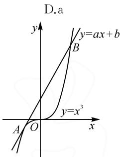
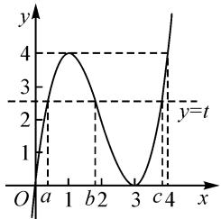

# 实系数一元三次方程韦达定理及其应用\*

# 广东省惠州市第一中学 蔡玲玲 余军

实系数一元三次函数 $y=ax^{3}+bx^{2}+cx+d(a\neq0)$ 是一个重要的函数，该函数的研究是其他函数研究的基础，其图象和性质及应用是高考考查的重点和热点。在代数发展史的一段时间内，解一元多项式方程一直是人们研究的一个中心问题。三次函数的零点即为对应三次方程的根，所以从函数与方程的角度研究三次函数的零点是一个重要的突破点。

# 1 问题引例

(2023年四省联考第22题)椭圆曲线加密算法运用于区块链.

椭圆曲线 $C = \{(x, y) \mid y^2 = x^3 + ax + b, 4a^3 + 27b^2 \neq 0\}$ . $P \in C$ 关于 $x$ 轴的对称点记为 $\widetilde{P}$ . $C$ 在点 $P(x, y)(y \neq 0)$ 处的切线是指曲线 $y = \pm \sqrt{x^3 + ax + b}$ 在点 $P$ 处的切线. 定义“ $\oplus$ ”运算满足: ① 若 $P \in C$ , $Q \in C$ , 且直线 $PQ$ 与 $C$ 有第三个交点 $R$ , 则 $P \oplus Q = \widetilde{R}$ ; ② 若 $P \in C, Q \in C$ , 且 $PQ$ 为 $C$ 的切线, 切点为 $P$ , 则 $P \oplus Q = \widetilde{P}$ ; ③ 若 $P \in C$ , 规定 $P \oplus \widetilde{P} = 0^*$ , 且 $P \oplus 0^* = 0^* \oplus P = P$ .

（Ⅰ）当 $4a^{3}+27b^{2}=0$ 时，讨论函数 $h(x)=x^{3}+ax+b$ 零点的个数；  
（Ⅱ）已知“⊕”运算满足交换律、结合律，若 $P \in C, Q \in C$ ，且 PQ 为 C 的切线，切点为 P，证明： $P \oplus P = \widetilde{Q}$ ;  
（Ⅲ）已知 $P(x_{1},y_{1})\in C,Q(x_{2},y_{2})\in C$ ，且直线 $PQ$ 与 $C$ 有第三个交点，求 $P\oplus Q$ 的坐标.

参考公式： $m^3 - n^3 = (m - n)(m^2 + mn + n^2)$

第(Ⅰ)(Ⅱ)问的解答略;第(Ⅲ)问参考答案(可扫码查看).

该解法首先设直线 PQ 的斜率 $\lambda=\frac{y_{1}-y_{2}}{x_{1}-x_{2}}$ ，再利用点在曲线上结合

因式分解求第三个点的坐标.本质是利用解析法结合方程的基本思想求解,但整个求解过程比较突兀,学生很难想到,教师也难引导.下面给出一种新解法.

新解法: 设 PQ 与 C 的第三个交点为 $(x_{3}, y_{3})$ . 若直线 PQ 的斜率不存在, 则设直线 PQ 的方程为 x = m, 所以 $y^{2} = m^{3} + am + b$ , 此时 PQ 与曲线 C 无第三个交点.

若直线 PQ 的斜率存在, 则设直线 PQ 的方程为 $y = kx + m$ .

联立 $\left\{\begin{aligned}y=kx+m,\\ y^{2}=x^{3}+ax+b,\end{aligned}\right.$ 消去y，得

$$
x ^ {3} - k ^ {2} x ^ {2} + (a - 2 k m) x + b - m ^ {2} = 0. \tag {①}
$$

依题意可知 $x_{1}, x_{2}, x_{3}$ 为方程①的根，由三次方程韦达定理得 $x_{1} + x_{2} + x_{3} = k^{2}$ .

又因为 $k=\frac{y_{1}-y_{2}}{x_{1}-x_{2}}$ ，所以

$$
x _ {3} = k ^ {2} - x _ {1} - x _ {2} = \left(\frac {y _ {1} - y _ {2}}{x _ {1} - x _ {2}}\right) ^ {2} - x _ {1} - x _ {2}.
$$

因为 $\frac{y_3 - y_1}{x_3 - x_1} = \frac{y_1 - y_2}{x_1 - x_2}$ ，所以

$$
y _ {3} = \frac {y _ {1} - y _ {2}}{x _ {1} - x _ {2}} \left[ \left(\frac {y _ {1} - y _ {2}}{x _ {1} - x _ {2}}\right) ^ {2} - 2 x _ {1} - x _ {2} \right] + y _ {1}.
$$

因此， $P \oplus Q$ 的坐标为

$$
\left(\left(\frac {y _ {1} - y _ {2}}{x _ {1} - x _ {2}}\right) ^ {2} - x _ {1} - x _ {2}, \frac {y _ {1} - y _ {2}}{x _ {1} - x _ {2}} \left[ - \left(\frac {y _ {1} - y _ {2}}{x _ {1} - x _ {2}}\right) ^ {2} + 2 x _ {1} + x _ {2} \right] - y _ {1}\right).
$$

比较参考答案与上述新解法,显然用三次方程韦达定理巧解这道压轴题,其解法更加清晰简洁.

# 2 实系数一元三次方程韦达定理及其应用

对于一元三次方程的韦达定理,人教 A 版(2019)数学必修第二册第七章“复数”第 81～82 页“阅读与思考”中,从代数基本定理出发,给出了实系数一元多项式方程的根与系数之间的关系.下面给出实系数一元三次根与系数之间的关系的应用.

# 2.1 韦达定理的正用

利用韦达定理,求与方程的根之和或者根之积有关的代数式的值.

例 1 （2020 年济南一模）已知直线 $y=ax+b$ (b>0) 与曲线 $y=x^{3}$ 有且只有两个公共点 $A(x_{1},y_{1})$ ， $B(x_{2},y_{2})$ ，其中 $x_{1}<x_{2}$ ，则 $2x_{1}+x_{2}=()$ 。

A.-1

B.0

C.1

解法 1: (通法) 画出函数的图象 (如图 1), 可知直线 $y = ax + b (b > 0)$ 与曲线 $y = x^{3}$ 在点 A 处相切, 在点 B 处相交.

由题意得,切线的斜率为 $k=3x_{1}^{2}$ ,切线方程为 $y-x_{1}^{3}=3x_{1}^{2}(x-x_{1})$ ,即 $y=3x_{1}^{2}x-2x_{1}^{3}$ .

所以 $a=3x_{1}^{2}, b=-2x_{1}^{3}$ ,
则直线方程为

text_image

D.a
y=ax+b
B
y=x³
A O x

图1

$$
y = 3 x _ {1} ^ {2} x - 2 x _ {1} ^ {3}.
$$

把直线方程和曲线方程 $y = x^{3}$ 联立，得 $x^{3} = 3x_{1}^{2}x - 2x_{1}^{3}$ ，整理得 $x^{3} - 3x_{1}^{2}x + 2x_{1}^{3} = 0$ .

所以 $(x - x_{1})^{2}(x + 2x_{1}) = 0$ ，则 $x = x_{1}$ 或 $x = -2x_{1}$

所以 $x_{2}=-2x_{1}$ ，于是 $2x_{1}+x_{2}=0$ 。故选：B.

评注:此法从直线和曲线位置关系的角度,主要利用导数的几何意义解决问题,意在考查学生对这些知识的理解掌握水平和分析推理能力,且此法适用于任意的曲线类型,具有一定“通性通法”的应用价值.

解法 2: 问题等价于方程 $x^{3}-ax-b=0(b>0)$ 有且只有两个根 $x_{1}, x_{2}$ ，则必然有一个为重根，即 $x_{1}=x_{3}$ 。由三次方程韦达定理，得 $2x_{1}+x_{2}=0$ 。

评注:此法结合直线与曲线有且只有两个公共点等价于一个一元三次方程有且只有两个不等根,利用三次方程韦达定理得到结果,思路清晰,解法神速.

例 2 （2023 年深圳一模）已知函数 $f(x)=x(x-3)^{2}$ ，若 $f(a)=f(b)=f(c)$ ，其中 a<b<c，则（）.

A.1<a<2

B. $a+b+c=6$

C. $a+b>2$

D. $abc$ 的取值范围是 $(0,4)$

解: 因为 $f(x)=x(x-3)^{2}$ ，所以 $f'(x)=3x^{2}-12x+9=3(x-3)(x-1)$ 。令 $f'(x)=0$ ，解得 x=1 或 x=3。当 $f'(x)>0$ 时，x>3 或 x<1，所以 $f(x)$ 单调递

增区间为 $(-∞,1)$ 和 $(3,+∞)$ ；当 $f'(x)<0$ 时，1<x<3，所以 $f(x)$ 单调递减区间为 $(1,3)$ ；且 $f(3)=0,f(1)=f(4)=4$ ，如图2.

设 $f(a) = f(b) = f(c) = t$ ，则 $0 < t < 4, 0 < a < 1 < b < 3 < c < 4$ ，故选项A错误.

line

| x | y |
|---|---|
| a | 0 |
| b | 2 |
| c | 3 |
| d | 4 |
| e | 5 |
| f | 6 |
| g | 7 |
| h | 8 |
| i | 9 |
| j | 10 |
| k | 11 |
| l | 12 |
| m | 13 |
| n | 14 |
| O | 15 |
| P | 16 |
| Q | 17 |
| R | 18 |
| S | 19 |
| T | 20 |
| U | 21 |
| V | 22 |
| W | 23 |
| X | 24 |
| Y | 25 |
| Z | 26 |
| AA | 27 |
| AB | 28 |
| AC | 29 |
| AD | 30 |
| AE | 31 |
| AF | 32 |
| AG | 33 |
| AH | 34 |
| AI | 35 |
| AJ | 36 |
| AK | 37 |
| AL | 38 |
| AM | 39 |
| AN | 40 |
| AO | 41 |
| AP | 42 |
| AQ | 43 |
| AR | 44 |
| AS | 45 |
| AT | 46 |
| AU | 47 |
| AV | 48 |
| AW | 49 |
| AX | 50 |
| AY | 51 |
| AZ | 52 |
| BA | 53 |
| BB | 54 |
| BC | 55 |
| BD | 56 |
| BE | 57 |
| BF | 58 |
| BG | 59 |
| BH | 60 |
| BI | 61 |
| BJ | 62 |
| BK | 63 |
| BL | 64 |
| BM | 65 |
| BN | 66 |
| BO | 67 |
| BP | 68 |
| BPB | 69 |
| BBA | 70 |
| BBAF | 71 |
| BBAH | 72 |
| BBAU | 73 |
| BBAV | 74 |
| BBAW | 75 |
| BBAZ | 76 |
| BBAUZ | 77 |
| BBAUZB | 78 |
| BBAUZB+BAZLBAZBZBAZLBAZBAZLBAZBAZLBAZBAZLBAZBAZLBAZBAZLBAZBAZLBAZBAZLBAZBAZLBAZLBAZLBAZLBAZLBAZLBAZLBAZLBAZLBAZLBAZLBAZLBAZLBAZLBAZLBAZLBAZLBAZLBAZLBAZLBAZLBAZLBAZLBAZLBAZLBAZLBAZLBAZLBAZLBAZLBAZLBAZLBAZLBAZLMA
y = t
y = t
x = t
y = t
x = t
y = t
x = t
y = t
x = t
y = t
x = t
y = t
x = t
y = t
x = t
y = t
x = t
y = t
x = t
y = t
x = t
y = t
x = t
y = t
x = t
y = t
x = t
x = t
y = t
x = t
y = t
x = t
y = t
x = t
y = t
x = t
y = t
x = t
y = t
x = t
y = t
x = t
y = t
x = t
y = t
x = t
y = t
x = t
y = t
x = t
y = t
X = t
Y = t
X = t
Y = t
X = t
Y = t
X = t
Y = t
X = t
Y = t
X = t
Y = t
X = t
Y = t
X = t
Y = t
X = t
Y = t
X = t
Y = t
X = t
Y = t
X = t
Y = t
X = t
Y = t
x = t
y = t
x = t
y = t
x = t
y = t
x = t
y = t
x = t
y = t
x = t
y = t
x = t
y = t
x = t
y = t
x = t
y = t
x = t
y = t
x = t
y = t
x = t
y = t
t,x,t,x,t,x,t,x,t,x,t,x,t,x,t,x,t,x,t,x,t,x,t,x,t,x,t,x,t,x,t,x,t,x,t,x,t,x,t,x,t,x,t,x,t,x,t,x,t,x,t,x,t,x,t,x,t,x,t,x,t,x,t,x,t,x,t,x,t,x,t,x,t,x,t,x,t,x,t,x,t,x,t,x,t,x,t,x,t,x,t,x,t,x,t,x,t,x,t,x,t,x,u,k,k,k,k,k,k,k,k,k,k,k,k,k,k,k,k,k,k,k,k,k,k,k,k,k,k,k,k,k,k,k,k,k,k,k,k,k,k,k,k,k,k,k,k,k,k,k,k,k,k,k,k,k,k,k,k,k,k,k,k,k,k,k,k,k,k,k,k,k,k,k,k,k,k,k,k,k,k,k,k,k,k,k,k,k,k,k,k,k,k,k,k,k,k,k,k,k,k,k,k,l,n,n,n,n,n,n,n,n,n,n,n,n,n,n,n,n,n,n,n,n,n,n,n,n,n,n,n,n,n,n,n,n,n,n,n,n,n,n,n,n,n,n,n,n,n,n,n,n,n,n,n,n,n,n,n,n,n,n,n,n,n,n,n,n,n,n,n,n,n,n,n,n,n,n,n,n,n,n,n,n,n,n,n,n,n,n,n,n,n,n,n,n,n,n,n,n,n,n,n,n,u,m,m,m,m,m,m,m,m,m,m,m,m,m,m,m,m,m,m,m,m,m,m,m,m,m,m,m,m,m,m,m,m,m,m,m,m,m,m,m,m,m,m,m,m,m,m,m,m,m,m,m,m,m,m,m,m,m,m,m,m,m,m,m,m,m,m,m,m,m,m,m,m,m,m,m,m,m,m,m,m,m,m,m,m,m,m,m,m,m,m,m,m,m,m,m,m,m,m,m,m;m,h,h,h,h,h,h,h,h,h,h,h,h,h,h,h,h,h,h,h,h,h,h,h,h,h,h,h,h,h,h,h,h,h,h,h,h,h,h,h,h,h,h,h,h,h,h,h,h,h,h,h,h,h,h,h,h,h,h,h,h,h,h,h,h,h,h,h,h,h,h,h,h,h,h,h,h,h,h,h,h,h,h,h,h,h,h,h,h,h,h,h,h,h,h,h,h,h,h,h,h:h,a,b,c,d,e,f,g,H,i,j,l,l,l,l,l,l,l,l,l,l,l,l,l,l,l,l,l,l,l,l,l,l,l,l,l,l,l,l,l,l,l,l,l,l,l,l,l,l,l,l,l,l,l,l,l,l,l,l,l,l,l,l,l,l,l,l,l,l,l,l,l,l,l,l,l,l,l,l,l,l,l,l,l,l,l,l,l,l,l,l,l,l,l,l,l,l,l,l,l,l,l,l,l,l,l,l,l,l,l,l,r,s,r,s,r,s,r,s,r,s,r,s,r,s,r,s,r,s,r,s,r,s,r,s,r,s,r,s,r,s,r,s,r,s,r,s,r,s,r,s,r,s,r,s,r,s,r,s,r,s,r,s,r,s,r,s,r,s,r,s,r,s,r,s,r,s,r,s,r,s,r,s,r,s,r,s,r,s,r,s,r,s,r,s,r,s,r,s,r,s,r,s,r,s,r,s,r,s,r,s,r,r,s,r,r,s,r,r,s,r,r,s,r,r,s,r,r,s,r,r,s,r,r,r,s,r,r,r,s,r,r,r,r,r,r,r,r,r,r,r,r,r,r,r,r,r,r,r,r,r,r,r,r,r,r,r,r,r,r,r,r,r,r,r,r,r,r,r,r,r,r,r,r,r,r,r,r,r,r,r,r,r,r,r,r,r,r,r,r,r,r,r,r,r,r,r,r,r,r,r,r,r,r,r,r,r,r,r,r,r,r,r,r,r,r,r,r,r,r,r,r,r,r,u,p,p,p,p,p,p,p,p,p,p,p,p,p,p,p,p,p,p,p,p,p,p,p,p,p,p,p,p,p,p,p,p,p,p,p,p,p,p,p,p,p,p,p,p,p,p,p,p,p,p,p,p,p,p,p,p,p,p,p,p,p,p,p,p,p,p,p,p,p,p,p,p,p,p,p,p,p,p,p,p,p,p,p,p,p,p,p,p,p,p,p,p,p,p,p,p,p,p,p,p,P,P,P,P,P,P,P,P,P,P,P,P,P,P,P,P,P,P,P,P,P,P,P,P,P,P,P,P,P,P,P,P,P,P,P,P,P,P,P,P,P,P,P,P,P,P,P,P,P,P,P,P,P,P,P,P,P,P,P,P,P,P,P,P,P,P,P,P,P,P,P,P,P,P,P,P,P,P,P,P,P,P,P,P,P,P,P,P,P,P,P,P,P,P,P,P,P,P,P,P,D,E,F,G,H,I,J,K,H,I,K,H,I,K,H,I,K,H,I,K,H,I,K,H,I,K,H,I,K,H,I,K,H,I,K,H,I,K,H,I,K,H,I,K,H,I,K,H,I,K,H,I,K,H,I,K,H,I,K,H,I,K,H,I,K,H,I,K,H,I,K,H,I,K,H,I,K,H,I,K,H,I,K,H,I,K,H,I,K,H,I,K,H,I,K,H,I,K,H,I,K,H,I,K,H,I,K,H,I,L,M,M,M,M,M,M,M,M,M,M,M,M,M,M,M,M,M,M,M,M,M,M,M,M,M,M,M,M,M,M,M,M,M,M,M,M,M,M,M,M,M,M,M,M,M,M,M,M,M,M,M,M,M,M,M,M,M,M,M,M,M,M,M,M,M,M,M,M,M,M,M,M,M,M,M,M,M,M,M,M,M,M,M,M,M,M,M,M,M,M,M,M,M,M,M,M,M,M,M,M.M,B,F,G,H,I,J,K,H,I,J,K,H,I,J,K,H,I,J,K,H,I,J,K,H,I,J,K,H,I,J,K,H,I,J,K,H,I,J,K,H,I,J,K,H,I,J,K,H,I,J,K,H,I,J,K,H,I,J,K,H,I,J,K,H,I,J,K,H,I,J,K,H,I,J,K,H,I,J,K,H,I,J,K,H,I,J,K,H,I,J,K,H,I,J,K,H,I,J,K,H,I,J,K,H,I,J,J,K,H,I,J,J,K,H,I,J,J,K,H,I,J,J,K,H,I,J,J,K,H,I,J,J,K,H,I,J,J,K,H,I,J,J,K,H,I,J,J,K,H,I,J,J,K,H,I,J,J,K,H,I,J,J,K,H,I,J,J,K,H,I,J,J,K,H,I,J,J,K,H,I,J,J,K,H,I,J,J,K,H,I,J,J,K,H,I,J,J,K,H,I,J,J,K,H,I,j,L,M,M,M,M,M,M,M,M,M,M,M,M,M,M,M,M,M,M,M,M,M,M,M,M,M,M,M,M,M,M,M,M,M,M,M,M,M,M,M,M,M,M,M,M,M,M,M,M|M,B,F,G,H,I,J,K,H,I,J,K,H,I,J,K,H,I,J,K,H,I,J,K,H,I,J,K,H,I,J,K,H,I,J,K,H,I,J,K,H,I,J,K,H,I,J,K,H,I,J,K,H,I,J,K,H,I,J,K,H,I,J,K,H,I,J,K,H,I,J,K,H,I,J,K,H,I,J,K,H,I,J,K,H,I,J,K,H,I,J,K,H,I,J,K,H,I,J,K,A,B,C,D,E,F,G,H I ,J ,K ,M ,M ,N ,T ,U ,V ,W ,X ,Y ,W ,X ,Y ,W ,X ,Y ,W ,X ,Y ,W ,X ,Y ,W ,X ,Y ,W ,X ,Y ,W ,X ,Y ,W ,X ,Y ,W ,X ,Y ,W ,X ,Y ,W ,X ,Y ,W ,X ,Y ,W ,X ,Y ,W ,X ,Y ,W ,X ,Y ,W ,X ,Y ,W ,Y ,W ,X ,Y ,W ,X ,Y ,W ,X ,Y ,W ,X ,Y ,W ,X ,Y ,W ,X ,Y ,W ,X ,Y ,W ,X ,Y ,W ,X ,Y ,W ,X ,Y ,W ,X ,Y ,W ,X ,Y ,W ,X ,Y ,W ,X ,Y ,W ,X ,Y ,W ,X ,Y ,w,y,y,y,y,y,y,y,y,y,y,y,y,y,y,y,y,y,y,y,y,y,y,y,y,y,y,y,y,y,y,y,y,y,y,y,y,y,y,y,y,y,y,y,y,y,y,y,y,y,y,y,y,y,y,y,y,y,y,y,y,y,y,y,y,y,y,y,y,y,y,y,y,y,y,y,y,y,y,y,y,y,y,y,y,y,y,y,y,y,y,y,y,y,y,y,y,y,Y,a,b,c,d,E,F,G,H I J K H I J K H I J K H I J K H I J K H I J K H I J K H I J K H I J K H I J K H I J K H I J K H I J K H I J K H I J K H I J K H I J K H I J K H I J K H I J K H I J K H I J K H I J K H I J K H I J K H I J KH I J K I J K I J K I J K I J K I J K I J K I J K I J K I J K I J K I J K I J K I J K I J K I J K I J K I J K I J K I J K I J K I J K IJ K IJ K IJ K IJ K IJ K IJ K IJ K IJ K IJ K IJ K IJ K IJ K IJ K IJ K IJ K IJ K IJ K IJ K IJ K IJ K IJ K IJ K IJ K IJ K IJ K IJ K IJ K IJ K IJ K IJ K IJ K IJ K IJ KIJKIJKIJKIJKIJKIJKIJKIJKIJKIJKIJKIJKIJKIJKIJKIJKIJKIJKIJKIJKIJKIJKIJKIJKIJKIJKIJKIJKIJKIJKIJKIJKIJKIJKIJKIJKIJKIJKIJKIJKIJKIJKIJKIJKIJKIJKIJKIJKIJKIJKIJSRJA#KIA##KIA##KIA##KIA##KIA##KIA##KIA##KIA##KIA##KIA##KIA##KIA##KIA##KIA##KIA##KIA##KIA##KIA##KIA##KIA##KIA##KIA##KIA##KIA##KIA##KIA##KIA##KIA##KIA##KIA##KIA##KIA##KIA##KIA##kIIA##kIIA##kIIA##kIIA##kIIA##kIIA##kIIA##kIIA##kIIA##kIIA##kIIA##kIIA##kIIA##kIIA##kIIA##kIIA##kIIA##kIIA##kIIA##kIIA##kIIA##kIIA##kIIA##kIIA##kIIA##kIIAA##kIIA##kIIA##kIIA##kIIA##kIIA##kIIA##kIIA##kIIA##kIIA##kIIA##kIIA##kIIA##kIIA##kIIA##kIIA##kIIA##kIIA##kIIA##kIIA##kIIA##kIIA##kIIA##kIIA##kIIA##kIIABAA###kIIABAA###kIIABAA###kIIABAA###kIIABAA###kIIABAA###kIIABAA###kIIABAA###kIIABAA###kIIABAA###kIIABAA###kIIABAA###kIIABAA###kIIABAA###kIIABAA###kIIABAA###kIIABAA###kIIABAA###kIIABAA###kIIABAA###kIIABAA####kIIIABAA###kIIIABAA###kIIIABAA###kIIIABAA###kIIIABAA###kIIIABAA###kIIIABAA###kIIIABAA###kIIIABAA###kIIIABAA###kIIIABAA###kIIIABAA###kIIIABAA###kIIIABAA###kIIIABAA###kIIIABAA###kIIIABAA###kIIIABAA###kIIIABAA###kIIIABAA###kIIIABAA<nl>

图2

又 $f(x) - t = (x - a)(x -$

$b)(x - b)$ ，所以 $x(x - 3)^2 - t = (x - a)(x - b)(x - c)$ ，即 $x^3 - 6x^2 + 9x - t = x^3 - (a + b + c)x^2 + (ab + ac + bc)x - abc.$ 对比系数，得 $a + b + c = 6, abc = t \in (0,4)$ ，故选项B，D正确.

因为 3<c<4，所以 $3<6-(a+b)<4$ ，解得 $2<a+b<3$ ，故选项 C 正确.

综上,正确答案为:BCD.

评注:本题主要考查利用导数研究函数的单调性、函数的图象等,以“等高线”的形式作为条件,实质以“一元三次方程的韦达定理”作为背景设置选项,故用韦达定理解答极为方便.

# 2.2 韦达定理的逆用

利用韦达定理求一元三次方程的系数.

例 3 实系数函数 $p(x)=x^{3}-224x^{2}+2016x-d$ 的三个零点成等比数列，则 d 的值为 \_\_\_\_.

解: 设函数的三个零点为 a, b, c，且 $b^{2} = ac$ . 由韦达定理，得 $\left\{\begin{aligned}a + b + c &= 224, \\ ab + bc + ca &= 2016, \\ abc &= d.\end{aligned}\right.$ 则 $b = \frac{b(a + b + c)}{a + b + c} = \frac{ab + bc + ac}{a + b + c} = 9$ ，所以 $d = abc = b^{3} = 729$ .

故填答案:729.

评注:本题灵活利用三次方程韦达定理,结合等比中项公式求解,最终巧妙求出 d.

例 4 （2023 年“皖南八校”联考）已知 $x_{1}, x_{2}, x_{3}$ 是函数 $f(x) = x^{3} + ax^{2} + b (a, b \in \mathbb{R})$ 的零点，且 $x_{1} < 0 < x_{2} < x_{3}$ ，若 $|x_{1}| + x_{2} = x_{3}$ ，则当 a, b 变化时， $3a + b$ 的最小值是（）.

A. $-4\sqrt{2}$

B. $-2\sqrt{2}$

C. $4\sqrt{2}$

D. $2\sqrt{2}$

解:由题知 $f'(x)=3x^{2}+2ax$ ，则 $3x^{2}+2ax=0$ 的两根为 0 和 $-\frac{2}{3}a$ .

由 $f(x)=0$ 的三个零点 $x_{1}, x_{2}, x_{3}$ 满足 $x_{1}<0<x_{2}<x_{3}$ ，知函数 $f(x)=x^{3}+ax^{2}+b$ 在极值点 0 右侧有两个零点，所以 $-\frac{2}{3}a>0$ ，则 a<0，且 $f(0)=b>0$ 。

又 $f(x) = x^{3} + ax^{2} + b = (x - x_{1})(x - x_{2})(x - x_{3})$ 所以 $x^{3} + ax^{2} + b = x^{3} + (-x_{1} - x_{2} - x_{3})x^{2} + (x_{1}x_{2} + x_{2}x_{3} + x_{1}x_{3})x - x_{1}x_{2}x_{3}$ .

所以 $\left\{\begin{aligned}a&=-x_{1}-x_{2}-x_{3},\\ x_{1}x_{2}x_{3}&=-b,\\ -x_{1}+x_{2}&=x_{3},\\ x_{1}x_{2}+x_{2}x_{3}+x_{1}x_{3}&=0,\end{aligned}\right.$

得 $\left\{\begin{aligned}a&=-2x_{2},\\ b&=x_{2}^{3}\end{aligned}\right.$ $(x_{2}>0)$ .

故 $3a + b = -6x_{2} + x_{2}^{3}$

设 $g(x)=x^{3}-6x(x>0)$ ，则 $g'(x)=3x^{2}-6$ 。当 $x\in(0,\sqrt{2})$ 时 $g'(x)<0$ ，当 $x\in(\sqrt{2},+\infty)$ 时 $g'(x)>0$ ，所以 $g(x)$ 在 $(0,\sqrt{2})$ 上单调递减，在 $(\sqrt{2},+\infty)$ 单调递增。

因此， $x > 0$ 时， $g(x)_{\min} = g(\sqrt{2}) = -4\sqrt{2}$

所以 $(3a+b)_{\min}=-4\sqrt{2}$ .故选:A.

评注:本题由 $x_{1}<0<x_{2}<x_{3}$ 和函数 $f(x)$ 的单调性可知 a<0, b>0，再根据函数零点即为对应方程的根,结合 $f(x)=x^{3}+ax^{2}+b=(x-x_{1})(x-x_{2})\cdot(x-x_{3})$ ,从而利用三次方程韦达定理代换可得 $3a+b=-6x_{2}+x_{2}^{3}(x_{2}>0)$ ,最后构造函数 $g(x)=x^{3}-6x(x>0)$ ,利用导数即可求得最小值.

# 2.3 与其他知识的融合

例 5 （2023 年南京一模）已知 $f(\theta)=\cos4\theta+\cos3\theta$ ，且 $\theta_{1},\theta_{2},\theta_{3}$ 是 $f(\theta)$ 在 $(0,\pi)$ 内的三个不同零点，则（）.

$$
\mathrm{A.} \frac {\pi}{7} \in \{\theta_ {1}, \theta_ {2}, \theta_ {3} \}
$$

$$
\mathrm{B.} \theta_ {1} + \theta_ {2} + \theta_ {3} = \pi
$$

$$
\mathrm{C.} \cos \theta_ {1} \cos \theta_ {2} \cos \theta_ {3} = - \frac {1}{8}
$$

$$
\mathrm{D}. \cos \theta_ {1} + \cos \theta_ {2} + \cos \theta_ {3} = \frac {1}{2}
$$

评注:此题考查三角函数的化简问题,难度中等偏上.关于化简问题常用的思路有如下三点.

(1) 利用诱导公式将角化为关系比较接近的角；  
(2) 遇见 $\cos \alpha \cos 2\alpha \cos 3\alpha \cos 4\alpha$ 的形式, 分子分母同乘 $\sin \alpha$ , 再用倍角公式化简;  
(3) 利用积化和差公式等.

本题参考答案为: ACD.

对于选项 C, D, 显然利用三角恒等变换化简, 计算量较大, 整个过程复杂易错(具体求解过程略). 但若利用三次方程韦达定理, 则可快速得到结果, 如下:

$$
\begin{array}{c} \cos 4 \theta + \cos 3 \theta = 2 \cos^ {2} 2 \theta - 1 + 4 \cos^ {3} \theta - 3 \cos \theta = \\ 2 (2 \cos^ {2} \theta - 1) ^ {2} - 1 + 4 \cos^ {3} \theta - 3 \cos \theta = 8 \cos^ {4} \theta + \\ 4 \cos^ {3} \theta - 8 \cos^ {2} \theta - 3 \cos \theta + 1 = (\cos \theta + 1) (8 \cos^ {3} \theta - \\ 4 \cos^ {2} \theta - 4 \cos \theta + 1). \end{array}
$$

所以 $\cos\theta_{1},\cos\theta_{2},\cos\theta_{3}$ 是 $8x^{3}-4x^{2}-4x+1=0$ 的三个根，则

$$
\cos \theta_ {1} + \cos \theta_ {2} + \cos \theta_ {3} = \frac {1}{2},
$$

$$
\cos \theta_ {1} \cdot \cos \theta_ {2} \cos \theta_ {3} = - \frac {1}{8}.
$$

故选项 C, D 正确.

例 6 已知抛物线 $y=\frac{1}{2}x^{2}+bx+c$ 与 $y=\frac{1}{x}$ 交于 A, B, C 三点，若 $\triangle ABC$ 为直角三角形，抛物线是否过定点？

解: 设 $A\left(x_{1}, \frac{1}{x_{1}}\right)$ , $B\left(x_{2}, \frac{1}{x_{2}}\right)$ , $C\left(x_{3}, \frac{1}{x_{3}}\right)$ .

联立 $\left\{\begin{aligned}y&=\frac{1}{2}x^{2}+bx+c,\\ y&=\frac{1}{x},\end{aligned}\right.$ 消去 y，得

$$
\frac {1}{2} x ^ {3} + b x ^ {2} + c x - 1 = 0.
$$

由韦达定理, 得 $x_{1}x_{2}x_{3}=2$ .

因为 $\triangle ABC$ 为直角三角形,不妨假设B为直角顶点,则 $AB\perp BC$ ,所以 $k_{AB}\cdot k_{BC}=-1$ .

又 $k_{AB} = \frac{\frac{1}{x_2} - \frac{1}{x_1}}{x_2 - x_1} = \frac{-1}{x_1x_2}, k_{BC} = \frac{\frac{1}{x_2} - \frac{1}{x_3}}{x_2 - x_3} = \frac{-1}{x_2x_3},$

所以 $\frac{1}{x_1x_2^2x_3} = -1$ ，则 $x_{2} = -\frac{1}{2}$ 所以 $y_{2} = -2$ ，即 $B\Big(-\frac{1}{2}, - 2\Big)$ .故抛物线过定点 $B\Big(-\frac{1}{2}, - 2\Big)$

评注:本题利用方程思想,将函数图象交点问题转化为方程根的问题,通过变形得到一个一元三次方程,从韦达定理的角度快速发现 $x_{1}x_{2}x_{3}=2$ , 利用该定值结合直角三角形的代数关系, 巧妙地求出 $x_{2}=-\frac{1}{2}$ , 从而得到抛物线过定点.

# 3 拓展探究

根据代数基本定理,一元 n 次多项式方程有 n 个复数根,它们都满足类似的韦达定理.

若实系数方程 $a_{n}x^{n} + a_{n-1}x^{n-1} + \cdots + a_{1}x + a_{0} = 0 (a_{n} \neq 0)$ 的根为 $x_{1}, x_{2}, x_{3}, \cdots, x_{n}$ 则有

$$
\left\{ \begin{array}{l} x _ {1} + x _ {2} + x _ {3} + \dots \dots + x _ {n} = (- 1) ^ {1} \frac {a _ {n - 1}}{a _ {n}}, \\ x _ {1} x _ {2} + x _ {1} x _ {3} + \dots \dots + x _ {i} x _ {j} + \dots \dots + x _ {n - 1} x _ {n} = \\ (- 1) ^ {2} \frac {a _ {n - 2}}{a _ {n}}, \\ x _ {1} x _ {2} x _ {3} + x _ {1} x _ {2} x _ {4} + \dots \dots + x _ {i} x _ {j} x _ {k} + \dots \dots + \\ x _ {n - 2} x _ {n - 1} x _ {n} = (- 1) ^ {3} \frac {a _ {n - 3}}{a _ {n}}, \\ \dots \dots \\ x _ {1} x _ {2} x _ {3} \dots \dots . x _ {n} = (- 1) ^ {n} \frac {a _ {0}}{a _ {n}}. \end{array} \right.
$$

请读者自己证明,下面给出两道题供进一步练习:

练习1 方程组 $\left\{ \begin{array}{l}a + b + c + d = -2,\\ ab + ac + ad + bc + bd + cd = -3,\\ bcd + acd + abd + abc = 4,\\ abcd = 3 \end{array} \right.$

的一组实数解为 $(a,b,c,d)=$ \_\_\_\_.

练习2 设直线 $y = \sqrt{3}x + b$ 与抛物线 $y^{2} = 2px$ ( $p > 0$ ) 交于 $A, B$ 两点，过 $A, B$ 的圆与抛物线 $y^{2} = 2px$ ( $p > 0$ ) 交于另外两个不同点 $C, D$ . 求直线 $AB$ ， $CD$ 的夹角的大小.

目前,对一元高次方程韦达定理及其应用的考查在竞赛或“强基”中比较常见,但还没有出现在高考中.现在一元三次方程韦达定理已经登上了新教材的大雅之堂,在解题的过程中则可以直接加以应用,为解题带来便利,这应引起老师和同学们的注意.Z