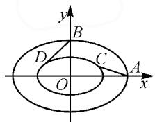

# 巧设曲线系,妙算“解几”题

# 海南省三亚市三亚中学 尹艳波

摘要: 曲线系方程是平面解析几何问题中比较常见的一种特殊方程形式,也是破解问题的一种技巧与方法.综合常见的圆系、椭圆系以及双曲线系等曲线系方程,结合实例加以剖析,总结曲线系的设置方式与应用,引领并指导数学教学与学习以及解题研究.

关键词: 曲线系; 圆; 椭圆; 双曲线; 方程

灵活巧妙设置曲线系是破解平面解析几何中最重要的解题方法和技巧策略之一,涉及直线系、圆系、椭圆系、双曲线系、抛物线系等一些常见的对应曲线系.根据条件,合理巧设平面解析几何中对应的曲线系,可以使得解几问题的破解更加直接,优化解几运算,简捷明快,提升解题效益,事半功倍.

本文中结合平面解析几何中二次曲线系的设置，特别是比较常见的圆系、椭圆系以及双曲线系等曲线系的创设，通过实例加以剖析，总结曲线系的设置规律与解题技巧策略，抛砖引玉.

# 1 巧设圆系

圆系包括同心圆系方程、过已知点的圆系方程、三角形外接圆的圆系方程、过直线与圆的交点的圆系方程、过两圆交点的圆系方程等，类型比较多，其实质就是借助待定系数法设置圆的标准方程或一般方程等，进而结合相关条件加以综合与应用.

例 1 [福建省七地市(厦门、神州、莆田、三明、龙岩、宁德、南平)2023届高中毕业班第一次质量检测数学试卷(2023年1月)]双曲线 $C: \frac{y^{2}}{3} - x^{2} = 1$ 的下焦点为 F，过 F 的直线 l 与 C 交于 A, B 两点，若过 A, B 和点 $M(0, \sqrt{7})$ 的圆的圆心在 x 轴上，则直线 l 的斜率为（）.

$$
\mathrm{A.} \pm \frac {\sqrt {1 0}}{2}
$$

$$
\mathrm{B.} \pm \sqrt {2}
$$

$$
\mathrm{C.} \pm 1
$$

$$
\mathrm{D.} \pm \frac {3}{2}
$$

分析:根据题设,通过设置直线 l 的方程,与双曲线方程联立,利用函数与方程思维,结合韦达定理构建 A,B 两点的横坐标的积的表达式,再通过外接圆的圆系方程的设置,结合待定系数法的应用,抓住相关圆的基本性质以及圆与双曲线的位置关系,通过不同的函数与方程关系中的韦达定理的联系,再次确定 A,B 两点的横坐标的积,等价转换,设而不求,巧妙转化与应用,得以确定直线 l 的斜率.

解析:依题可得 $F(0,-2)$ ，设直线 l 的方程为 $y=kx-2(k\neq\pm\sqrt{3})$ ， $A(x_{1},y_{1})$ ， $B(x_{2},y_{2})$ 。

联立 $\left\{\begin{aligned}y=kx-2,\\ y^{2}-3x^{2}=3,\end{aligned}\right.$ 消去参数y并整理，可得

$$
(k ^ {2} - 3) x ^ {2} - 4 k x + 1 = 0.
$$

显然判别式 $\Delta_{1}=16k^{2}-4(k^{2}-3)=12(k^{2}+1)>0$ ，从而 $x_{1}x_{2}=\frac{1}{k^{2}-3}$ .

设 $\triangle AMB$ 的外接圆的圆系方程为 $x(x - m) + (y - \sqrt{7})(y - n) = 0$ ，展开有

$$
x ^ {2} - m x + y ^ {2} - (n + \sqrt {7}) y + \sqrt {7} n = 0.
$$

结合 $\triangle AMB$ 的外接圆的圆心在 $x$ 轴上，可得 $-(n + \sqrt{7}) = 0$ ，解得 $n = -\sqrt{7}$

将 $x^{2}-mx+y^{2}-7=0$ 与 $y^{2}-3x^{2}=3$ 联立，消去参数 y 并整理，可得 $4x^{2}-mx-4=0$ .

显然判别式 $\Delta_{2}=m^{2}+64>0$ ，从而 $x_{1}x_{2}=-1$ ，

所以 $x_{1}x_{2}=\frac{1}{k^{2}-3}=-1$ ，解得 $k=\pm\sqrt{2}$ 。故选：B.

点评:合理借助三角形的外接圆的圆系方程的设置,抓住直线与双曲线、双曲线与圆的交点均在同一直线来合理联系,应用待定系数法,结合函数与方程思维来合理破解与应用.抓住圆的基本性质、结构特征以及与其他元素的关系等,合理创设圆系方程,可以更加直接联系起圆与其他点、直线、圆锥曲线等元素,解决问题更加简单快捷.

相应的圆系创设类型：

类型 1: 经过点 $M(2, -2)$ 且与圆 $x^{2} + y^{2} + 2x - 4y + 4 = 0$ 同心的圆的方程为 \_\_\_\_.

答案: $x^{2}+y^{2}+2x-4y-20=0.$

类型 2: 已知直线 $l: x - 2y + 4 = 0$ 与圆 $C: x^{2} + y^{2} + 2x + 2y - 8 = 0$ 相交于 A, B 两点，则经过 A 点和 B 点且面积最小的圆的方程为 \_\_\_\_.

答案: $x^{2}+y^{2}+4x-2y=0.$

类型 3 已知圆 $C_{1}: x^{2} + y^{2} = 10$ 与圆 $C_{2}: x^{2} + y^{2} + 2x + 2y - 7 = 0$ ，则经过两圆的交点，且圆心在直线 $x + y - 6 = 0$ 上的圆的方程为 \_\_\_\_.

答案: $x^{2}+y^{2}-6x-6y-19=0.$

# 2 巧设椭圆系

椭圆系包括与已知椭圆 $\frac{x^{2}}{a^{2}}+\frac{y^{2}}{b^{2}}=1(a>b>0)$ 共离心率的椭圆系方程 $\frac{x^{2}}{a^{2}}+\frac{y^{2}}{b^{2}}=\lambda(\lambda>0)$ ;与已知椭圆共焦点的曲线系方程 $\frac{x^{2}}{a^{2}-m}+\frac{y^{2}}{b^{2}-m}=1(m<a^{2}$ 且 $m\neq b^{2})$ ，其中当 $m<b^{2}$ 时为椭圆系，当 $b^{2}<m<a^{2}$ 时为双曲线系.

例 2 如图 1 所示, 设内层椭圆方程为 $\frac{x^{2}}{a^{2}} + \frac{y^{2}}{b^{2}} = 1 (a > b > 0)$ ,内外两个椭圆的离心率均为 $\frac{\sqrt{3}}{2}$ 从外层椭圆顶点向内层椭圆引切线 AC, BD, 则直线 AC 与 BD 的斜率之积为 \_\_\_\_.

  
图1

分析:根据题设条件,内外两层椭圆是变化的,而两切线的斜率之积为定值.因而可以考虑两层椭圆之间的特殊位置来确定定值,结合椭圆系的创设,利用内层椭圆固定,外层椭圆变化的特殊位置,结合对称性并利用直线的斜率公式来转化与应用,合理简化运算,巧妙求解.

解析: 固定内层椭圆, 随着外层椭圆的变化, 从变化规律中寻找特殊位置, 使得切线 AC 恰好经过点 B, 根据曲线的对称性可知, 此时直线 AC 与直线 BD 关于 y 轴对称.

依题可知，椭圆的离心率 $e = \frac{c}{a} = \sqrt{1 - \frac{b^2}{a^2}} = \frac{\sqrt{3}}{2}$ 整理可得 $\frac{b^2}{a^2} = \frac{1}{4}$ .

设外层椭圆方程为 $\frac{x^{2}}{a^{2}}+\frac{y^{2}}{b^{2}}=m^{2}(a>b>0,m>1)$ ，则 $A(ma,0)$ ， $B(0,mb)$ ，那么 $k_{AC}\cdot k_{BD}=\frac{mb}{-ma}\cdot\frac{mb}{ma}=-\frac{b^{2}}{a^{2}}=-\frac{1}{4}$ 。故填答案： $-\frac{1}{4}$ 。

点评:椭圆系方程可以联系起已知椭圆与所求椭圆、已知椭圆与所求双曲线等之间的关系,要利用与已知椭圆具有某一公共特性的曲线系加以合理创设.特别是与已知椭圆共焦点的曲线系方程,要根据参数的不同取值情况确定相应的椭圆方程或双曲线方程,不要产生混淆.

# 3 巧设双曲线系

双曲线系包括与已知双曲线 $\frac{x^2}{a^2} -\frac{y^2}{b^2} = 1(a > 0,$ $b > 0)$ 共渐近线的双曲线系方程 $\frac{x^2}{a^2} -\frac{y^2}{b^2} = \lambda (\lambda \neq 0)$ ，与

已知双曲线共焦点的曲线系方程 $\frac{x^{2}}{a^{2}-m}-\frac{y^{2}}{b^{2}+m}=1$ $(m<a^{2}\text{且}m\neq-b^{2})$ ，其中当 $-b^{2}<m<a^{2}$ 时为双曲线系，当 $m<-b^{2}$ 时为椭圆系等.

例 3 具有某种共同性质的所有曲线的集合, 称为一个曲线系. 已知双曲线 $C_{1}:\frac{x^{2}}{9}-\frac{y^{2}}{3}=1$ 与双曲线 $C_{2}$ 有共同的渐近线, 双曲线 $C_{2}$ 的渐近线方程是 \_\_\_\_; 若双曲线 $C_{2}$ 还经过点 $M(\sqrt{3},4)$ , 则双曲线 $C_{2}$ 的离心率为 \_\_\_\_.

分析:根据题意,直接由已知双曲线方程求解对应的渐近线方程,利用两双曲线有共同的渐近线这一几何性质确定其渐近线方程;再借助共渐近线的双曲线系方程的设置,引入参数,代入已知点的坐标,通过解方程即可确定所求的双曲线方程,为进一步求解相应的离心率提供条件.

解析:依题意知,双曲线 $C_{1}$ 的渐近线方程为 $\frac{x^{2}}{9}-\frac{y^{2}}{3}=0$ , 即 $y=\pm\frac{\sqrt{3}}{3}x$ .

所以双曲线 $C_2$ 的渐近线方程是 $y = \pm \frac{\sqrt{3}}{3} x$ .

根据双曲线系可设双曲线 $C_{2}$ 的方程为 $\frac{x^{2}}{9}-\frac{y^{2}}{3}=\lambda(\lambda\neq0)$ .

将点 $M(\sqrt{3},4)$ 代入，可得 $\lambda=-5$ ，即双曲线 $C_{2}$ 的方程为 $\frac{y^{2}}{15}-\frac{x^{2}}{45}=1$ .

所以 $a = \sqrt{15}$ , $b = 3\sqrt{5}$ ，则有 $c = \sqrt{15 + 45} = 2\sqrt{15}$ . 故离心率 $e = \frac{c}{a} = \frac{2\sqrt{15}}{\sqrt{15}} = 2$ .

故填答案: $y=\pm\frac{\sqrt{3}}{3}x$ ;2.

点评:共渐近线的双曲线系方程是双曲线系方程中最为常见的一种曲线系方程,对应方程的焦点可以同轴也可以不同轴,要结合参数的正负取值情况加以合理判断与应用.而与已知双曲线共焦点的曲线系方程,同样要根据参数的不同取值情况来确定对应相应的椭圆方程或双曲线方程.

借助平面解析几何中相应曲线系的巧妙设置,厘清相关曲线的定义,把握曲线的几何性质,合理灵活转化,更加直接有效地指明破解问题的方向,直达目的.曲线系的引入,避免解几解题过程中复杂的判断、可能产生的分类讨论、繁杂的代数运算等,优化解题过程,减少数学运算,全面提升解题效率与解题效益,能更好地培养学生的数学核心素养.Z