# 探索解题思路 培养直观素养

# 江西省于都中学 李彦峰 刘小林

直观想象是利用空间图形来理解和解决数学问题的素养，对空间图形的理解至关重要.GeoGebra作为一款集几何、代数微积分和统计功能于一体的动态数学软件，具有快速精准作图、测量运算、动态变化等教学功能，通过运用GeoGebra的“3D绘图”功能使得其在立体几何中展示出自己独特的优势，能够精准、动态地展示立体图形，使学生直观地体会立体图形的几何特征.求三棱锥外接球的体积(表面积)在立体几何中属于高频考点，关键是求球的半径，求半径的主要方法有补形法和外心垂线法.本文中主要阐述利用外心垂线法求解三棱锥外接球的体积(表面积)，促进直观想象素养的达成.

# 1 高过外心——顶点的投影是底面外心

三棱锥(以棱锥 P-ABC 为例)的高经过底面三角形的外心,求其外接球的半径过程如下:

(1)先求底面 ABC 的外接圆半径 r，确定底面 ABC 外接圆圆心位置 $O_{1}, O_{1}A = r$ ;  
(2) 把 $O_{1}$ 垂直上(或下)移到点 O, 使得点 O 到顶点 P 的距离与到点 A, B, C 的距离相等, 此时点 O 是三棱锥外接球球心;  
(3) 连接 OA, 若三棱锥的高为 h, 那么 $\left|OP\right| = \left|OA\right| = R, \left|OO_{1}\right| = \left|h - R\right|$ (球心 O 在棱锥 P-ABC 内时 $\left|OO_{1}\right| = h - R$ , 在 P-ABC 外时 $\left|OO_{1}\right| = R - h$ ), 由勾股定理得 $R^{2} = r^{2} + \left|OO_{1}\right|^{2}$ .

用 GeoGebra 软件作出三棱锥 P-ABC，作出高 $PO_{1}$ ，点 O 在 $PO_{1}$ 上，移动点 O，使 P, A, B, C 四点都在球 O 的球面上，点 O 位置有两种情况（在三棱锥内或外），如图 1 和图 2 所示.

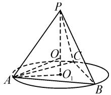

text_image

P
O₁
C
A
O₁
B

图1

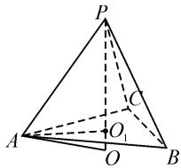  
图2

例 1 [2019 年全国高考新课标 I 卷(理科)] 已知三棱锥 P-ABC 的四个顶点在球 O 的球面上, PA = PB = PC, $\triangle ABC$ 是边长为 2 的正三角形, E, F 分别是 PA, AB 的中点, $\angle CEF = 90^{\circ}$ , 则球 O 的体积为 ( ).

A. $8\sqrt{6}\pi$ B. $4\sqrt{6}\pi$

C. $2\sqrt{6}\pi$ D. $\sqrt{6}\pi$

分析:根据已知条件, 可知三棱锥 P-ABC 是正三棱锥, 其外接球的球心必在三棱锥的高上, 利用 GeoGebra 作出图形, 通过移动球心 O 确定外接球,

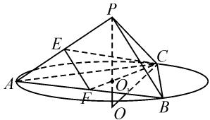

text_image

Geometric diagram of a cone with labeled points and auxiliary lines, likely from a math problem or proof.

图3

得到球心 O 的位置在三棱锥外部, 如图 3.

解: 设 PA = PB = PC = 2x, OP = OC = R, $\triangle ABC$ 的外心为 $O_{1}$ .

因为 E, F 分别为 PA, AB 中点, 所以 $EF \parallel PB$ , 且 $EF = \frac{1}{2}PB = x$ .

由 $\triangle ABC$ 是边长为2的等边三角形，得 $CF = \sqrt{3}$ ， $O_{1}C = \frac{2}{3} CF = \frac{2\sqrt{3}}{3}$ . 在 $\triangle PAC$ 中，由余弦定理，可得 $\cos \angle APC = \frac{2x^2 - 1}{2x^2}$ ，则在 $\triangle PEC$ 中由余弦定理，可得 $CE^2 = PE^2 + PC^2 - 2PE \cdot PC \cdot \cos \angle APC = x^2 + 2$ .

在 Rt△CEF 中，由 $CE^{2} + EF^{2} = CF^{2}$ ，得 $x^{2} + 2 + x^{2} = 3$ ，解得 $x = \frac{\sqrt{2}}{2}$ ，所以 $PC = \sqrt{2}$ .

在 Rt△PO $_{1}$ C 中，由 PO $_{1}^{2}$ + O $_{1}$ C $^{2}$ = PC $^{2}$ ，可得 PO $_{1}$ = $\frac{\sqrt{6}}{3}$ .

在 Rt△O₁OC 中，有 $O_{1}O = R - \frac{\sqrt{6}}{3}$ , OC = R，所以由 $O_{1}O^{2} + O_{1}C^{2} = OC^{2}$ ，解得 $R = \frac{\sqrt{6}}{2}$ .

所以 $V=\sqrt{6}\pi.$ 故选:D.

本题也可以利用补形法，如图4，根据 $PA = PB = PC$ $\triangle ABC$ 为边长为2的等边三角形，得 $P - ABC$ 为正三棱锥，故 $PB\bot AC$ ；又 $E,F$ 分别为PA, AB 中点, 知 $EF \parallel PB$ , 得 $EF \perp AC$ . 又 $EF \perp CE$ , $CE \cap AC = C$ , 知 $EF \perp$ 平面 PAC.

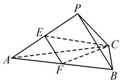

text_image

Geometric diagram of a triangular pyramid with labeled vertices and internal points, used for spatial geometry problems.

图 4

所以 $PB \perp$ 平面 PAC，则 $\angle APB = \angle BPC = 90^{\circ}$ .

于是 $PA = PB = PC = \sqrt{2}$

因此三棱锥 P-ABC 为正方体的一部分, 且 $2R=\sqrt{6}$ , 即 $R=\frac{\sqrt{6}}{2}$ .

所以 $V=\sqrt{6}\pi$ . 故选: D.

反思: 利用 GeoGebra 软件画出图形, 并动态展示图形的变化, 帮助学生发展空间想象能力, 利用通法来解决问题, 另外更直观地得到, 还可以利用补形法解决外接球问题. 可通过直线与平面垂直的判定定理, 得到三条棱两两互相垂直, 快速得到侧棱长, 进而补形成正方体来解决.

# 2 高不过外心——顶点的投影不在底面外心处

# 2.1 侧棱垂直于底面

三棱锥(以棱锥 P-ABC 为例)的高不经过底面三角形的外心,并且侧棱 PA⊥底面 ABC,求其外接球的半径过程如下:

(1)先求底面 ABC 的外接圆半径 r，确定底面 ABC 外接圆圆心位置 $O_{1}, O_{1}A = r$ ;

(2)如图5,过点 $O_{1}$ 作底面的垂线,沿垂线上移点O,使得 $\left|OO_{1}\right|=\frac{1}{2}\left|PA\right|$ ,此时点O是几何体外接球球心;

(3) 连接 OA，那么 $R = |OA|$ ，由勾股定理得 $R^{2} = r^{2} + |OO_{1}|^{2} = r^{2} + \left(\frac{|PA|}{2}\right)^{2}$ .

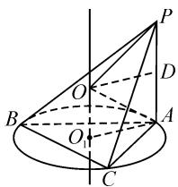

text_image

Geometric diagram of a cone with labeled points and lines, including center O₁ and auxiliary points A, B, C, D, P.

图5

例 2 在三棱锥 P-ABC 中, 平面 $PAB \perp$ 平面 ABC, $AB \perp BC$ , PA = BC = 2, AB = 4, $\triangle PAB$ 的面积为 $2\sqrt{3}$ , 则三棱锥 P-ABC 的外接球的表面积为 \_\_\_\_.

分析: 在三棱锥 P-ABC 中, 平面 $PAB \perp$ 平面 ABC, 平面 $PAB \cap$ 平面 ABC = AB, 结合 $AB \perp BC$ 可知 $BC \perp$ 平面 PAB, 因此可以把三棱锥 P-ABC 重新放置, 以 C 为顶点, $\triangle PAB$ 为底面, 即三棱锥 C-PAB. 由已知 PA = 2, AB = 4, $\triangle PAB$ 的面积为 $2\sqrt{3}$ , 可得 $\angle A = 60^{\circ}$ 或 $120^{\circ}$ 两种情况. 用 GeoGebra 作图, 以 C 为顶点, $\triangle PAB$ 为底面, 作出 $\triangle PAB$ 的外接圆及其圆心 $O_{1}$ , 点 P 可以在外接圆 $O_{1}$ 上移动, 得到 $\angle A = 60^{\circ}$ 或 $120^{\circ}$ 两种情况, 在垂线上移动点 O, 从而得到三棱锥 C-PAB 的外接球, 即外接于三棱锥 P-ABC. 如图 6 和图 7.

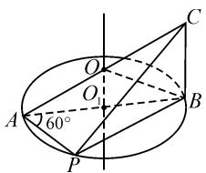

text_image

A
60°
O
O
P
B
C

图6

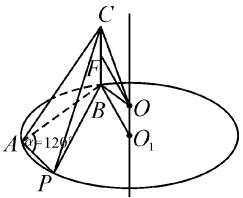

text_image

C
F
B
O
A
120°
P
O₁

图7

解:如截图6和截图7,由平面 $PAB\perp$ 平面ABC, $AB\perp BC$ ,且平面 $PAB\cap$ 平面ABC=AB,可知 $BC\perp$ 平面PAB.由 $S_{\triangle PAB}=\frac{1}{2}PA\cdot AB\sin\angle PAB=2\sqrt{3}$ ,得 $\sin\angle PAB=\frac{\sqrt{3}}{2}$ ,则 $\angle PAB=60^{\circ}$ 或 $120^{\circ}$ .

当 $\angle PAB=60^{\circ}$ 时, 可知 $\triangle PAB$ 为直角三角形, $AB$ 为斜边, 则 $\triangle PAB$ 外接圆的圆心 $O_{1}$ 是 $AB$ 的中点.

由平面 $PAB \perp$ 平面 ABC，且 $BC \perp$ 平面 PAB，得 $\triangle CAB$ 为直角三角形，则 AC 的中点 O 为三棱锥 C-PAB 外接球的球心，此时 $R = \sqrt{5}$ ，则 $S_{球} = 4\pi R^{2} = 20\pi$ .

当 $\angle PAB = 120^{\circ}$ 时，则 $\triangle PAB$ 为钝角三角形，所以 $\triangle PAB$ 外接圆的圆心 $O_{1}$ 在 $\triangle PAB$ 外，由余弦定理，得 $PB^{2} = AB^{2} + PA^{2} - 2AB\cdot PA\cdot \cos \angle PAB = 28$ 即 $PB = 2\sqrt{7}$ .由正弦定理，可得 $\frac{PB}{\sin\angle PAB} = 2r$ ，则 $\triangle PAB$ 的外接圆的半径 $r = \frac{2\sqrt{21}}{3}$

过点 $O_{1}$ 作底面 PAB 的垂线，在垂线上取点 O，使得 OB=OC，则 O 为三棱锥 C-PAB 外接球的球心.

取 BC 的中点 F，连接 OF，则 $OF = r = \frac{2\sqrt{21}}{3}$ .

所以 $OB = OC = \sqrt{OF^{2} + \left(\frac{BC}{2}\right)^{2}} = \sqrt{\frac{31}{3}}$ ，于是有 $R=\sqrt{\frac{31}{3}}$ ，则 $S_{球}=\frac{124}{3}\pi.$

故填: $20\pi$ 或 $\frac{124}{3}\pi.$

反思:本题有一定难度,利用 GeoGebra 作图,以 C 为顶点, $\triangle PAB$ 为底面作三棱锥 C-PAB,作出底面 PAB 的外接圆 $O_{1}$ ,过外接圆的圆心 $O_{1}$ 作底面 PAB 的垂线,在垂线上找到三棱锥 C-PAB 外接的球心 O,从而得到三棱锥 P-ABC 的外接球,由 PA,AB 为定值,P 是外接圆上的动点,移动点 P 发现外接球也在不断地变化,并得到 $\angle A=60^{\circ}$ 或 $120^{\circ}$ ,通过 GeoGebra 动态展示图形的变化,促进学生的直观想象能力的发展.

# 2.2 侧棱不垂直于底面

三棱锥（以棱锥 P-ABC 为例）的高不经过底面三角形的外心，并且侧棱 PA 不垂直于底面 ABC，如截图 8，求其外接球的半径过程如下：

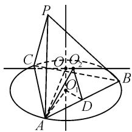

text_image

Geometric diagram with labeled points and lines, likely from a math problem or proof

图8

(1)求底面 $\triangle ABC$ 和一个侧面(如侧面PAB)的外接圆半径 $r_{1}$ ,

$r_{2}$ ，并确定它们的圆心 $O_{1},O_{2}$ ，即 $O_{1}A=r_{1},O_{2}A=r_{2}$ .

(2) 确定三棱锥 P-ABC 的外接球的球心: 分别过 $O_{1}, O_{2}$ 作底面 ABC 和侧面 PAB 的垂线, 两垂线相交

于点 O，则 O 为球心.

(3)求三棱锥 P-ABC 的外接球的半径: 取 AB 的中点 D, 连接 $O_{1}D, O_{2}D$ , 则 $O_{1}D \perp AB, O_{2}D \perp AB, \angle O_{1}DO_{2}$ 为底面 ABC 与侧面 PAB 所成角的平面角 $\theta$ ; 在四边形 $O_{1}DO_{2}O$ 中, 求解 $OO_{1}$ 或 $OO_{2}$ , 则外接球半径 $R = \sqrt{OO_{1}^{2} + r_{1}^{2}}$ 或 $\sqrt{OO_{2}^{2} + r_{2}^{2}}$ .

例 3 已知菱形 ABCD 的边长为 $2\sqrt{3}$ ， $\angle BAD = \frac{\pi}{3}$ ，沿对角线 BD 将 $\triangle BCD$ 折起。若平面 $BCD \perp$ 平面 ABD，则 A, B, C, D 四点所在球的表面积为 \_\_\_\_；若 $AC = 3\sqrt{3}$ ，则 A, B, C, D 四点所在球的表面积为 \_\_\_\_.

分析:用 GeoGebra 作图,菱形 ABCD 由两个全等的等边三角形 CBD 与三角形 ABD 构成,将 $\triangle CBD$ 做成动态,沿 BD 翻折,变为三棱锥 C-ABD, $\triangle ABD$ 为底面,选取侧面 $\triangle CBD$ ,再确定 $\triangle ABD$ 与 $\triangle CBD$ 外接圆的圆心 $O_{1},O_{2}$ ,分别过 $O_{1},O_{2}$ 作平面 ABD 与平面 CBD 的垂线,两垂线相交于点 O,则 O 为三棱锥 C-ABD 外接球的球心.求外接球的半径时,取 BD 的中点 E,则 $\angle O_{1}EO_{2}$ 为平面 ABD 与平面 CBD 所成三面角的平面角.本题中由于两个三角形均为等边三角形,外心即为重心,各线段易求得.如截图 9 和 10.

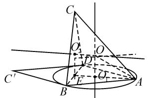

text_image

Geometric diagram showing a cone with labeled points and auxiliary lines, likely from a math problem or proof.

图9

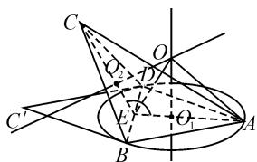

text_image

Geometric diagram with labeled points and lines, likely from a math problem or proof

图10

解:如截图9,由题意得, $\triangle CBD$ 与 $\triangle ABD$ 均为等边三角形,它们的外接圆的圆心 $O_{1},O_{2}$ 与重心重合;E为BD的中点,则 $\angle O_{1}EO_{2}$ 为平面ABD与平面CBD所成二面角的平面角,且 $\angle O_{1}EO_{2}=90^{\circ}$ .所以四边形 $O_{1}EO_{2}O$ 为正方形.由已知可得AE=3,所以有 $OO_{1}=O_{1}E=\frac{1}{3}AE=1,O_{1}A=\frac{2}{3}AE=2$ .在Rt $\triangle OO_{1}A$ 中, $OA=\sqrt{OO_{1}^{2}+O_{1}A^{2}}=\sqrt{5}$ ,即外接球半径 $R=\sqrt{5}$ ,所以球的表面积 $S=20\pi$ .

如截图 10 所示，在 $\triangle CEA$ 中，EC = EA = 3， $AC = 3\sqrt{3}$ ，由余弦定理，得 $\cos\angle CEA = -\frac{1}{2}$ ，即二面角 C-BD-A 的平面角 $\angle CEA = 120^{\circ}$ 。连接 OE，则得 $Rt\triangle OO_{1}E \cong Rt\triangle OO_{2}E$ ，所以 $\angle OEO_{1} = 60^{\circ}$ 。在 $Rt\triangle OEO_{1}$ 中， $O_{1}E = \frac{1}{3}AE = 1$ ，所以 $OO_{1} = O_{1}E \cdot \tan\angle OEO_{1} = \sqrt{3}$ ；在 $Rt\triangle OO_{1}A$ 中， $O_{1}A = 2$ ，则 OA =$\sqrt{OO_{1}^{2}+O_{1}A^{2}}=\sqrt{7}$ ，即外接球半径 $R=\sqrt{7}$ 。所以球的表面积 $S=28\pi$ 。

故填： $20\pi ;28\pi .$

空2的另解:如截图11,由上述求解得 $\angle CEA=120^{\circ}$ ,过点C作底面ABD的垂线,垂足为F,则点F在AE的延长线上,且 $\angle CEF=60^{\circ}$ ,所以 $CF=CE\cdot\sin60^{\circ}=$ $\frac{3\sqrt{3}}{2}, EF = \sqrt{CE^{2} - CF^{2}} = \frac{3}{2}.$ 设 O 为三棱锥 C-ABD 外接球的球心， $OO_{1} = x$ ，过点 O 作 CF 的垂线，垂足为 G，则 $OG = O_{1}F = O_{1}E + EF = \frac{5}{2}.$ 在 Rt $\triangle OO_{1}A$ 中， $OA^{2} = OO_{1}^{2} + O_{1}A^{2} = x^{2} + 4.$

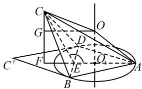

text_image

Geometric diagram with labeled points and lines, likely from a math problem or proof

图11

在 Rt $\triangle OCG$ 中， $OC^{2}=OG^{2}+CG^{2}=\left(\frac{5}{2}\right)^{2}+\left(\frac{3\sqrt{3}}{2}-x\right)^{2}$ .

因为 $OA = OC = R$ ，由 $x^{2} + 4 = \left(\frac{5}{2}\right)^{2} + \left(\frac{3\sqrt{3}}{2} - x\right)^{2}$ 解得 $x = \sqrt{3}$ ，所以 $R^2 = 7.$ 故球的表面积 $S = 28\pi$

反思:运用 GeoGebra 可以精准作出图形,动态展示图形的变化,将立体图形直观地展示出来,有助于理解题意,准确发现空间图形中的点、线、面的位置关系,促进空间感的形成.

# 3 GeoGebra 在立体几何教学中的建议

(1)准确把握 GeoGebra 与教学内容的结合点

学生在学习立体几何内容或解决空间图形问题时,需要具备较强的直观想象和逻辑推理能力.这就要求教师在备课过程中,找准 GeoGebra 软件与教材内容的结合点,用 GeoGebra 软件创设适当的情境,更好地培养学生的直观想象和逻辑推理能力.

(2) 合理把握 GeoGebra 在实际教学中的运用

在使用GeoGebra软件辅助立体几何教学时，并不是教材中的所有知识都适合或都有必要使用这种软件进行演示。在概念形成、命题探究等方面，教师应充分发挥GeoGebra软件的动态功能，通过拖动GeoGebra课件中的滑动条，改变相关参数，直观展示几何体的动态变化过程，将空间几何体变得既直观又生动形象，而对于一些使用GeoGebra软件效果欠佳的内容，则应该选用讲解、板书等教学手段。因此，教师在实际教学中，应该先明确GeoGebra软件的适用对象和使用目的，再根据不同的教学内容选择GeoGebra软件加以使用。Z