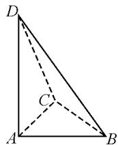

# 构建平面与空间联系,合理类比推理与应用

# 北京市大兴区第一中学 唐娟 林晴宇 闫歌航 王程瑞

摘要:现实生活中常用的一种推理方法就是类比推理,其是分析与解决问题中比较常用的一种创新性思维能力与方法.而“二维”平面到“三维”空间之间的类比推理,是其中最为重要的一种基本类型,结合平面与空间之间联系的一些常见题型,合理归纳总结,巧妙类比推理,剖析推理与运算过程,有效指导数学教学与复习备考.

关键词: 平面; 空间; 类比推理; 向量; 定理

开普勒说过：“我珍视类比胜过任何别的东西，它是我最可信赖的老师，它能揭示自然界的秘密。”

类比推理是合情推理中的一种基本形式,是基于两类相似对象中其中一类对象的某些特征性质,进而分析并推出另一类对象也具有相应的特征性质的推理.借助类比推理的创设及其逻辑思维与应用,可以有效构建平面与空间之间的联系,由平面问题深化并类比到空间问题,合理提出一个新问题,给学生以全新的视角来分析与应用,实现“二维”到“三维”的升维拓展,成为研究空间几何问题中比较常见的一类命题方式,倍受各方关注,要加以高度重视.

# 1 由平面向量到空间向量的类比

例 1 在平面向量中有如下定理：

(1)已知非零向量 $\boldsymbol{a}=(x_{1},y_{1}),\boldsymbol{b}=(x_{2},y_{2})$ ，若 $a\perp b$ ，则 $x_{1}x_{2}+y_{1}y_{2}=0$ ;  
(2)在平面内,若 A,B,C 三点共线,且满足 $\overrightarrow{OA}=x\overrightarrow{OB}+y\overrightarrow{OC}$ ,则 $x+y=1$ .

通过合理类比,试写出空间向量中的相应命题. (只需要写出相应的结论即可,不需要给出命题的证明过程.)

分析:根据题设条件,借助平面向量类比空间向量,合理利用类比推理,通过“二维”的平面向量中有关两向量垂直、三点共线等问题上升到“三维”的空间向量中有关两向量垂直、四点共面等问题,得到空间向量中的相应命题.

解析:借助类比推理,结合平面向量类比空间向量,得到如下命题.

(1)基于平面向量中两向量的垂直关系,类比得到空间向量中两向量的垂直关系:

已知非零向量 $\boldsymbol{a}=(x_{1},y_{1},z_{1}),\boldsymbol{b}=(x_{2},y_{2},z_{2})$ ，若 $a\perp b$ ，则 $x_{1}x_{2}+y_{1}y_{2}+z_{1}z_{2}=0$ 。

(2)基于平面向量中三点共线关系,类比得到空

间向量中四点共面关系：

在空间中，若 A, B, C, D 四点共面，且满足 $\overrightarrow{OA} = x \overrightarrow{OB} + y \overrightarrow{OC} + z \overrightarrow{OD}$ ，则 $x + y + z = 1$ .

点评: 注意由平面向量类比空间向量时, “二维” 平面向量的坐标 $(x, y)$ 必须上升到“三维”空间向量的坐标 $(x, y, z)$ , “二维” 平面向量中的三点共线必须上升到“三维”空间向量中的四点共面等. 类比的维度、广度等方面加以对应, 才能得到更加契合推理方式的新命题.

# 2 由平面定理到空间定理的类比

例 2 在平面几何里,有勾股定理:设 $\triangle ABC$ 的两边AB,AC互相垂直,则有 $AB^{2}+AC^{2}=BC^{2}$ 成立.拓展到空间几何中,类比平面几何的勾股定理:设三棱锥A-BCD的三个侧面ABC,ABD,ACD两两互相垂直,则有().

$$
\begin{array}{l} A. A B ^ {2} + A C ^ {2} + A D ^ {2} = B C ^ {2} + B D ^ {2} + C D ^ {2} \\ \mathrm{B.} A B ^ {2} \times A C ^ {2} \times A D ^ {2} = B C ^ {2} \times B D ^ {2} \times C D ^ {2} \\ \mathrm{C}. S _ {\triangle A B C} ^ {2} + S _ {\triangle A B D} ^ {2} + S _ {\triangle A C D} ^ {2} = S _ {\triangle B C D} ^ {2} \\ \mathrm{D}. S _ {\triangle A B C} ^ {2} \times S _ {\triangle A B D} ^ {2} \times S _ {\triangle A C D} ^ {2} = S _ {\triangle B C D} ^ {2} \\ \end{array}
$$

分析:根据题设条件,由平面几何中的斜边的平方等于两条直角边的平方和,可类比到空间几何中去,就是斜面面积的平方等于三个直角面的面积的平方和,注意类比时二维的“边”对应着三维的“面”.

解析: 结合类比推理, 通过平面几何中的对应边与空间几何中的对应面, 进而由“二维”的边对应着“三维”的面, “二维”的边长对应着“三维”的面积.

如图 1, 结合空间几何体的图形直观, 合理类比, 可得 $S_{\triangle ABC}^{2} + S_{\triangle ABD}^{2} + S_{\triangle ACD}^{2} = S_{\triangle BCD}^{2}$ .

故选：C.

点评: 注意“二维”平面到“三维”空间之间类比时, 对应元素之间的维度变化与上升情况是“点”到“线”，“线”到“面”，“边长”到“面积”，“面积”到“体积”等由“二维”到“三维”的维度情况.

  
图1

# 3 由平面公式到空间公式的类比

例 3 我们已知学过平面内一点 $P(x_{0}, y_{0})$ 到直线 $l: Ax + By + C = 0 (A^{2} + B^{2} \neq 0)$ 的距离公式，合理类比推理，可以推出空间中一点 $P(x_{0}, y_{0}, z_{0})$ 到平面 $E: Ax + By + Cz + D = 0 (A^{2} + B^{2} + C^{2} \neq 0)$ 的距离公式为 d = \_\_\_\_.

分析:根据题设条件,结合平面内点到直线的距离公式(这是要求学生必须熟练掌握的基本公式),通过合理的类比推理,由平面内的直线方程拓展到空间中的平面方程,进而得以确定空间中点到平面的距离公式(这在现行高中数学教材中并没有涉及).

解析:我们已经学过平面内一点 $P(x_{0},y_{0})$ 到直线 $l:Ax+By+C=0(A^{2}+B^{2}\neq0)$ 的距离公式为

$$
d = \frac {\left| A x _ {0} + B y _ {0} + C \right|}{\sqrt {A ^ {2} + B ^ {2}}}.
$$

借助类比推理,由平面解析几何到空间立体几何的相关知识,可得点 $P(x_{0},y_{0},z_{0})$ 到平面 $E:Ax+By+Cz+D=0(A^{2}+B^{2}+C^{2}\neq0)$ 的距离公式

$$
d = \frac {\left| A x _ {0} + B y _ {0} + C z _ {0} + D \right|}{\sqrt {A ^ {2} + B ^ {2} + C ^ {2}}}.
$$

故填答案： $\frac{|Ax_{0}+By_{0}+Cz_{0}+D|}{\sqrt{A^{2}+B^{2}+C^{2}}}$ .

点评:由熟悉的知识点入手加以类比推理,是类比思维的一个重点.这里抓住平面内点到直线的距离公式的结构特征,通过类比推理,即可拓展到空间内点到平面的距离公式.从平面到空间的类比,由“二维”到“三维”合理加以升维处理,进而将平面几何问题中的一些相关结论合理类比到立体几何中去,抓住公式的内容与结构特征是类比的关键.

# 4 由平面方程到空间方程的类比

例 4 我们知道,在平面解析几何中有如下圆的方程:

(1)在平面直角坐标系中,以点 $C(x_{0},y_{0})$ 为圆心,r 为半径的圆的标准方程为 $(x-x_{0})^{2}+(y-y_{0})^{2}=r^{2}$ ;  
(2) 在平面直角坐标系中, 以点 $A(x_{1}, y_{1})$ , $B(x_{2}, y_{2})$ 为直径端点的圆的方程为 $(x - x_{1})(x - x_{2}) + (y - y_{1})(y - y_{2}) = 0$ .

借助类比推理,试写出空间立体几何中的相应球面的方程,并对(2)中的球面的方程加以证明.

分析:根据题设条件,合理利用类比推理,通过“二维”的平面直角坐标系中的圆的方程的确定问题上升到“三维”的空间直角坐标系中的球面的方程的确定问题,得到空间立体几何中的相应球面的方程.而对(2)中的球面的方程的证明,只要借助圆的方程的推导方法即可得以类比与证明.

解析:依题,借助类比推理,可得如下命题.

(1)在空间直角坐标系中，以点 $C(x_0,y_0,z_0)$ 为球心， $r$ 为半径的球面的标准方程为 $(x - x_0)^2 +(y - y_0)^2 +(z - z_0)^2 = r^2$   
(2)在空间直角坐标系中，以点 $A(x_{1},y_{1},z_{1})$ ， $B(x_{2},y_{2},z_{2})$ 为直径端点的球面的方程为 $(x - x_{1})\cdot (x - x_{2}) + (y - y_{1})(y - y_{2}) + (z - z_{1})(z - z_{2}) = 0.$

该球面方程的证明过程如下：

设 $P(x,y,z)$ 为所求球面上的一个动点.

由于 $A(x_{1},y_{1},z_{1}), B(x_{2},y_{2},z_{2})$ 为球面直径的两个端点，则有 $AP \perp BP$ .

所以 $\overrightarrow{AP}\cdot\overrightarrow{BP}=0.$

又 $\overrightarrow{AP} = (x - x_1, y - y_1, z - z_1)$ ,

$$
\overrightarrow {B P} = \left(x - x _ {2}, y - y _ {2}, z - z _ {2}\right).
$$

所以 $\overrightarrow{AP} \cdot \overrightarrow{BP} = (x - x_{1}, y - y_{1}, z - z_{1}) \cdot (x - x_{2}, y - y_{2}, z - z_{2}) = (x - x_{1})(x - x_{2}) + (y - y_{1})(y - y_{2}) + (z - z_{1})(z - z_{2}) = 0.$

因此，即所求的球面的方程为 $(x - x_{1})(x - x_{2}) + (y - y_{1})(y - y_{2}) + (z - z_{1})(z - z_{2}) = 0.$

点评:由平面几何中的相关问题到空间几何中的相关问题的类比过程中,这里将“二维”中的平面直角坐标系场景拓展到“三维”中的空间直角坐标系,而对应平面内的圆就类比成空间中的球面,由此通过“二维”场景下的方程构建类比到“三维”场景下的方程问题.

“类比是一个伟大的引路人。”(波利亚)

类比推理可以为一些相关问题的探索、发现、创新等方面提供一些非常有用的尝试，给问题的分析与解决提供一些思维与方法。从平面问题入手，合理类比推理，上升到空间问题，由此在猜想的基础上加以合理的逻辑推理与数学运算等，很好落实数学“四基”，全面提升数学能力，对于创造性与想象力的培养有很好的效果。Z