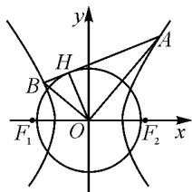

# 造数列 巧解等差、等比问题

# ● 贵州省六盘水市第二十三中学 王书飞

摘要:近年来,新高考话题受到热议,数列模块解题思路、审题方法和公式应用也成了重点研究对象.运用多角度、层次化解题方式,灵活巧妙解析等差或者等比数列问题,对培养学生数学逻辑思维和分析思维具有较强的积极作用.文章就构造数列,变形巧解等差或者等比数列相关问题进行探索.

关键词: 高中; 数列; 等差; 等比

等比、等差数列一直都是高中数学教学的重点和难点所在，也是高考中容易失分的考点之一。部分学生对于数学知识理解能力较弱，无法将数学公式与高考试题内容相互对应，进而影响整体解题效果。教师作为学生学习的引导者和组织者，应该主动更新教学思想，立足新高考要求，运用创新性思路，提高学生解决等差、等比数列问题的能力。

# 1 结合数列概念、性质,同除变形等差解题

等差、等比数列是高中数学的重要概念，是培养学生逻辑思维和迁移应用能力的重要载体。为更好地适应新高考要求，笔者认为应该从教材着手，引导学生在探究等差数列和等比数列性质的基础上，明确高考数学考查重点，并结合数列的相关概念，带领学生重点了解数列的应用价值。从如何对基础数列模式变形着手，借助“同除”思维，在解题过程中培养学生应用思维和变换思维。

例 1 已知将数列 $\{a_{n}\}$ 的前 n 项的和为 $S_{n}$ ，且 $a_{1}=1,\lg\left|a_{n+1}\right|=\lg\left|S_{n+1}\right|+\lg\left|S_{n}\right|$ ，求 $S_{n}$ .

例 1 属于数列中经典变形类题型,也是近几年高考中常见的数学题型.针对例 1 来说,在解析过程中笔者引导学生观察已知条件,明确题目的考查要点,具体分以下几步:

第一,在解题前首先确定学生已经熟练掌握数列相关概念以及通项公式,明确 $a_{n}$ 的推理过程.

第二,在分析阶段要求学生仔细审题,找到 $S_{n}$ , $S_{n+1}a_{n+1}$ 以及 $a_{n+1}$ 之间的关系,并对题目中式子进行简化.学生由此得到关系式 $S_{n}S_{n+1}=S_{n+1}-S_{n}$ 或者 $S_{n}S_{n+1}=S_{n}-S_{n+1}$ .

第三，启发学生分别对两个公式进行变形。对于 $S_{n}S_{n+1}=S_{n+1}-S_{n}$ ，根据“同除”手段，等号两边同时除以 $S_{n}S_{n+1}$ ，则可以得出 $\frac{1}{S_{n+1}}-\frac{1}{S_{n}}=-1$ ，此时根据等差数列的基本概念，可以确定 $\left\{\frac{1}{S_{n}}\right\}$ 是等差数列，求

出 $S_{n} = \frac{1}{2 - n}$ . 对于 $S_{n}S_{n + 1} = S_{n} - S_{n + 1}$ , 两边同时除以 $S_{n}S_{n + 1}$ , 得 $\frac{1}{S_{n + 1}} -\frac{1}{S_n} = 1$ ，求 $S_{n} = \frac{1}{n}$ .

第四,此时已经到了比较关键的环节,笔者不失时机地提出了几个问题来夯实学生对等差数列等知识和内容的理解.问题一:请分析等差数列 $\left\{\frac{1}{S_{n}}\right\}$ 的首项和公差分别为多少?问题二:等差数列 $\left\{\frac{1}{S_{n}}\right\}$ 中, $n\in N^{*}$ 是否正确?引导学生分析 $\frac{1}{S_{n}}=1-(n-1)=2-n$ 不符合 $n\in N^{*}$ ,并非所要答案;而 $\frac{1}{S_{n}}=1+(n-1)\times1=n$ ,则 $S_{n}=\frac{1}{n}$ 与题意相符.

# 2 适当作差调整变形,借助等差数列解题

随着素质教育理念的推行,高中数学更加注重培养学生数学思维,题型考查模式也发生了变化,更加强调学生能否在自主探究和解析中找到解题的方法.以此教育背景,要想提高学生的解题能力,帮助他们找准数列问题的切入点,教师应该主动革新教学模式,运用灵活多样的变形方法,对原有题型进行调整和变形,尝试等差数列解题模式,强化学生对知识的认知和理解,全面提高学生解题积极性和主动性.

例 2 已知正项数列 $\{a_{n}\}$ ，其前 n 项之和为 $S_{n}$ ， $10S_{n}=a_{n}^{2}+5a_{n}+6$ ，其中 $a_{1}, a_{3}, a_{15}$ 为等比数列，求数列 $\{a_{n}\}$ 的通项公式.

这类题型通常以等比数列为“幌子”，考查学生能否在已知条件中找准相关概念、公式以及运算方法，自主处理好正项数列中“项”“和”的递推式。笔者采用了创新的数学推理方法，通过作差，将数列以等差数列模式展现，进而提高教学效果。

学生在解析例 2 时, 首先针对 $S_{n}$ 和 $S_{n+1}$ 进行变形，由 $10S_{n} = a_{n}^{2} + 5a_{n} + 6, 10S_{n + 1} = a_{n + 1}^{2} + 5a_{n + 1} + 6$ 作差得 $(a_{n + 1} + a_n)(a_{n + 1} - a_n - 5) = 0.$ 从已有条件中学生可以得出 $a_{n + 1} + a_n > 0$ ，则 $a_{n + 1} - a_n - 5 = 0$ ，即 $a_{n + 1} - a_n = 5.$ 这表明数列 $\{a_{n}\}$ 是一个公差为5的等差数列.再根据“ $a_1,a_3,a_{15}$ 为等比数列”这一条件，由等比数列的定义可以得出 $a_3^2 = a_1a_{15}$ ，最终得到 $a_1 = 2$ $a_{n} = 2 + 5(n - 1) = 5n - 3.$ 从这道题“作差”的解答中，学生领会到等比数列和等差数列之间可以相互转换，掌握这种转换的技巧和方法.

# 3 挖掘数列换元要点,探究等比数列解题

随着教学改革的深化,高中学生数学实践探究能力也逐渐成了数列考查的重点.教师要注重对学生数学思维品质的培养,总结高中数学或者高考数学知识难点,对比解题方法和思路,深度挖掘数列知识考查重点与难点,利用“换元”变形模式,创设等比数列,全面提高学生多维思考能力 $^{[1]}$ .以教材为出发点,以数列模式为支撑,对于表面上联系性较浅的问题,教师引导学生审题、分析、探究,切实找到等比数列应用和解题方式,提高教学质量,在训练中发展学生数学思维,促使学生更好地掌握数列知识.

例 3 定义一种运算“⊗”，对于任意 $n \in N^{*}$ ，满足以下几种运算性质：(1) $2 \otimes 2022 = 1$ ; (2) $(2n + 2) \otimes 2022 = 3 \times [(2n) \otimes 2022]$ . 请分析 $2022 \otimes 2022$ 的结果为多少？

这道题既考查等比数列基础概念和性质,又考查换元方法,学生要明确解决例3时,“倒数换元法”“三角换元法”“对数换元法”“乘积换元法”或者其他换元法中的哪一种方式比较符合.通过对习题变形,获得等比数列的最终结果,以此增强学生数学运算思维,提高其解析素养.

首先,让学生从题目出发,将运算内容与新定义联系起来,确定解题思路.

其次，启发学生将 $2n \otimes 2022$ 与 $[2(n + 1)] \otimes 2022$ 整体结构做对比，可分别看作一个数列 $\{a_n\}$ 的第 $n$ 项和第 $n + 1$ 项.

最后，套用等比数列基础公式，求解 $2022 \otimes 2022$ 的结果。从题目中(1)(2)可以得出 $a_{n} = 1, a_{n+1} = 3a_{n}$ ，则 $\{a_{n}\}$ 为等比数列，根据等比数列的通项公式可以得出 $a_{n} = 3^{n-1}$ ，即 $(2n) \otimes 2022 = 3^{n-1}$ ，即可得出最终答案为 $a_{1011} = 2022 \otimes 2022 = 3^{1010}$ 。

换元解题方法是现阶段高考数学中的一个热门考点.根据例题内容,教师要让学生学会将未知内容转变为已知内容,结合自身已经掌握的数列知识,依照题型难度,化繁为简,逐步拓宽解题思路,实现高效解题.

# 4 对比总结数列结构,取对数灵活解题

等差和等比方法应用都是解析数列问题的常见模式,对提高学生思维灵活性、增强转变和迁移效果存在积极作用.为能让学生更好地掌握数学知识难点,掌握灵活解题技巧,教师在探究过程中要主动引导学生通过对比分析,提升数学思维,正确区分等差数列和等比数列之间的差异,运用“取对数”方式,研究具体解题方向,提高数学观察、对比、思考、总结、分析等关键能力,进而在灵活解题过程中掌握相关技巧.

例 4 已知数列 $\{a_{n}\}$ 满足以下条件: $a_{1}=2$ , $a_{n+1}=a_{n}^{2}+2a_{n}(n\in\mathbf{N}^{*})$ , 若 $b_{n}=1+a_{n}$ , 求数列 $\{b_{n}\}$ 的前 n 项之积 $T_{n}$ .

例 4 是数列中比较经典的题型,从题目已知条件就能够递推出相关内容,然后根据数列递推式 $a_{n+1}=ka_{n}(k\neq0)$ 求解.一旦出现此种公式类型,在解答过程中基本上就可以锁定解题方式,尝试应用“取对数”变形模式,构造等比数列,提高习题解答效率.

在例 4 中, 笔者还是让学生从审题入手, 首先明确题目给出的条件, 得到 $b_{n+1}=1+a_{n+1}=1+a_{n}^{2}+2a_{n}$ , 通过已知条件推理可得出 $b_{n}>0$ , 综合上述条件可以得出 $b_{n+1}=b_{n}^{2}$ . 此时, 笔者引导学生两边取对数, 得出 $\lg b_{n+1}=\lg b_{n}^{2}=2\lg b_{n}$ , 在求出 $b_{1}=3$ 之后, 进一步得出 $\lg b_{1}=\lg 3$ . 在深度挖掘已知信息并通过计算得到最终答案之后, 学生便可利用取对数变形模式, 获得等比数列 $\{\lg b_{n}\}$ 的首项和公比, 得出 $\lg b_{n}=2^{n-1}\times\lg 3=\lg 3^{2^{n-1}}$ , 所以 $b_{n}=3^{2^{n-1}}$ , 因此 $T_{n}=b_{1}b_{2}b_{3}\cdots\cdots b_{n}=3^{2^{n}}\times3^{2^{1}}\times3^{2^{2}}\times\cdots\cdots\times3^{2^{n-1}}=3^{2^{n}-1}$ .

在完成例 4 之后,笔者进一步引导学生进行反思和总结,理清种类型题目的解题思路和解题技巧.学生通过自主实践探索,逐步感受知识,在研讨的基础上掌握数列的变形模式,梳理总结“取对数”的解题要点,透过现象揭示本质内容,掌握递推式公式应用技巧,能够大幅提高数学核心素养.

# 5 整合梳理解题资源,总结评价改正创新

高考竞争压力越来越大,高中学生作为主体,必然要提高自身主体地位,自觉、自发、自主分析数学素材,以较高的热情整合等差、等比数列解题资源,细致化分析错题,精准找到错误原因,在思考与分析过程中,夯实自身数学观察能力、审题能力、解题能力以及总结和反思能力.此时,为保证教学质量,教师要着重关注并利用多元教学模式,从多个角度出发,对学生提出针对性建议或者意见,对症下药,通过对错题的分析,提高教学效果,帮助学生更好地理解和掌握数学知识.

例 5 已知数列 $\{a_{n}\}$ 中， $a_{1}=1, a_{2}=\frac{2}{3}$ ，且 $\frac{a_{n+1}+a_{n-1}}{a_{n+1}a_{n-1}}=\frac{2}{a_{n}}(n\geqslant2)$ ，求数列 $\{a_{n}\}$ 的通项公式.

例 5 整体结构繁琐, 对基础知识薄弱的学生而言, 属于错误率较高的类型. 想要解答此类问题, 学生通常会尝试拆分各项, 此时就容易出现一系列遗漏, 导致即使拆分也无法获得等差数列, 影响最终解题正确率. 以此题型为参考, 在计算过程中, 细化分析题具所给递推式的结构以及相关要点, 通过拆项变形, $\frac{a_{n+1} + a_{n-1}}{a_{n+1}a_{n-1}} = \frac{1}{a_{n-1}} + \frac{1}{a_{n+1}} = \frac{2}{a_n}$ , 整理可得 $\frac{1}{a_{n+1}} - \frac{1}{a_n} = \frac{1}{a_n} - \frac{1}{a_{n-1}} (n \geqslant 2)$ . 为降低学生错误率, 笔者在此题教学中, 强调拆项变形的方法, 让学生充分理解并掌握这种处理技巧.

例 5 中, 等差数列 $\{a_{n}\} \Leftrightarrow a_{n+1} - a_{n} = d$ (d 为常数, $n \in N^{*}$ ), 以此为切入点, 能够得到 $\frac{1}{a_{1}} = 1$ , 为 $\frac{1}{a_{2}} - \frac{1}{a_{1}} = \frac{1}{2}$ , 进而得出 $a_{n} = \frac{2}{n+1}$ .

从这道题的解析过程可以看出,拆项构造等差数列对求数列 $\{a_{n}\}$ 的通项十分有效.在运算过程中,笔者重点强调了运算符号、取值范围、条件性质等内容,在不断引导中,让学生明确什么样的式子可以拆分,什么样的式子不能够拆分,拓宽学生的解题思维,加深学生数学迁移思维和运算技能,展现出等差数列的应用价值.

高中数学知识点较为复杂,对学生逻辑思维和转化思维的要求较高.在新高考大环境背景下,教师需要弱化数学知识难度,系统化呈现零散知识点,以此打破传统解题思维.通过整理数列基础概念,巧妙应用构造数列解决与等差和等比有关的问题,完成抽象化知识点的具象化转变、特殊化知识点的大众化转变,提高学生数学洞察力、探究力和解析力,最终深化学生等差、等比数列的整合思维,推动学生数学综合素养全面发展.

# 参考文献：

[1] 张军峰, 阎月奕. 常见数列问题巧解举例 [J]. 保定师范专科学校学报, 2002(4): 49-51. Z

# (上接第66页)

性质 1: $\frac{1}{|OA|^2} + \frac{1}{|OB|^2} = \frac{1}{a^2} + \frac{1}{b^2}$ .

性质 2: 内准圆方程为 $x^{2} + y^{2} = \frac{a^{2}b^{2}}{a^{2} + b^{2}}$ .

证明: 设 $\left|OA\right|=m,\left|OB\right|=n$ , 如图 6, OA 与 x 轴正半轴的夹角为 $\theta$ , 则 $A(m\cos\theta,m\sin\theta)$ , 点 B 坐标为 $\left(n\cos\left(\theta+\frac{\pi}{2}\right),n\sin\left(\theta+\frac{\pi}{2}\right)\right)$ , 即 $B(-n\sin\theta,n\cos\theta)$ . 把点 A, B 的坐标分别代入椭圆方程整理, 得

$$
\frac {1}{m ^ {2}} = \frac {\cos^ {2} \theta}{a ^ {2}} + \frac {\sin^ {2} \theta}{b ^ {2}}, \frac {1}{n ^ {2}} = \frac {\sin^ {2} \theta}{a ^ {2}} + \frac {\cos^ {2} \theta}{b ^ {2}}.
$$

所以 $\frac{1}{|OA|^2} +\frac{1}{|OB|^2} = \frac{1}{m^2} +\frac{1}{n^2} = \frac{1}{a^2} +\frac{1}{b^2}.$

在 Rt△AOB 中， $\frac{1}{2}|OA||OB|=\frac{1}{2}|AB||OH|$ .

所以 $|OH|=\frac{mn}{\sqrt{m^{2}+n^{2}}}=\frac{1}{\sqrt{\frac{1}{m^{2}}+\frac{1}{n^{2}}}}=\frac{1}{\sqrt{\frac{1}{a^{2}}+\frac{1}{b^{2}}}}=$

$\frac{ab}{\sqrt{a^{2}+b^{2}}}$ ，为定长.

故点 $H$ 的轨迹方程为 $x^{2} + y^{2} = \frac{a^{2}b^{2}}{a^{2} + b^{2}}.$

例 8 （2009·山东卷理）设椭圆 $E: \frac{x^{2}}{a^{2}} + \frac{y^{2}}{b^{2}} = 1$ $(a > b > 0)$ 过 $M(2, \sqrt{2})$ , $N(\sqrt{6}, 1)$ , O 为坐标原点.

(1)求椭圆 E 的方程.

(2)是否存在圆心在原点的圆,使得该圆的任意一条切线与椭圆 E 恒有两个交点 A,B 且 $\overrightarrow{OA} \perp \overrightarrow{OB}$ ? 若存在,写出该圆的方程;若不存在,请说明理由.

解析:(1) $\frac{x^{2}}{8}+\frac{y^{2}}{4}=1$ (过程略).

(2) 存在圆, 方程为 $x^{2} + y^{2} = \frac{8}{3}$ (求解同上述性质证明过程).

另外,如图7,双曲线在 $e>\sqrt{2}$ 的条件下,也有类似性质:

性质 1: $\frac{1}{|OA|^2} + \frac{1}{|OB|^2} = \frac{1}{a^2} - \frac{1}{b^2}$ .

text_image

y
H
A
B
F₁ O F₂ x

图 7

性质 2: 内准圆方程为 $x^{2} + y^{2} = \frac{a^{2}b^{2}}{b^{2} - a^{2}} (b > a)$ .

圆是圆锥曲线框架之下的一种极具对称性的曲线,具有其特殊性,近几年新高考对圆的考查有所侧重,而“隐形圆”又是对圆的进一步深化,是对解析几何轨迹问题的再探究,有利于引导学生深度学习,有利于培养学生的核心素养.总之,唯有注重积累,不断探索,把坐标与几何进行融合,把无形化为有形,把握数学本质,才能立于不败之地.Z