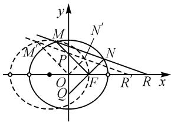
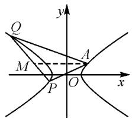
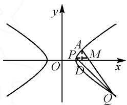
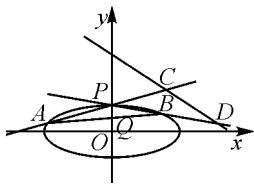

# 齐次化方法在圆锥曲线中的应用举例

# 贵州省织金县第一中学 吴文忠

摘要:对于圆锥曲线中一类斜率之和(或积)及直线过定点、定值问题,本文中从齐次化的角度出发,给出另一种联立方式,再根据题型特点以实例说明齐次化方法在圆锥曲线中的灵活应用.

关键词: 圆锥曲线; 齐次化; 斜率之和; 斜率之积; 定点; 定值

圆锥曲线中的定点、定值问题是高中平面解析几何的重点和难点，也是高考考查的热点。涉及平面内一点与圆锥曲线上两动点连线的斜率之和（或积）的问题，用常规方法计算量大且复杂繁琐，很多学生算到中途便无法进行下去。笔者通过示例构建齐次化方法的模型，简化解题步骤，节省解题时间，为解决直线与圆锥曲线关系问题提供新的视角与思路。

# 1 圆锥曲线上一点与该曲线上两点连线的斜率之和(或积)

例 1 （2020 年全国新高考I卷）已知椭圆 $C: \frac{x^{2}}{a^{2}} + \frac{y^{2}}{b^{2}} = 1 (a > b > 0)$ 的离心率为 $\frac{\sqrt{2}}{2}$ ，且过点 A(2,1).

(1) 求 C 的方程；

(2) 点 M, N 在 C 上, 且 $AM \perp AN, AD \perp MN, D$ 为垂足, 证明: 存在定点 Q, 使得 $|DQ|$ 为定值.

解析:(1) $\frac{x^{2}}{6}+\frac{y^{2}}{3}=1$ (过程略).

(2) 将椭圆 C 为按向量 $a = (-2, -1)$ 平移，使 $A \to$ 原点 $O, M \to M', N \to N'$ ，椭圆 $C \to C': \frac{(x + 2)^2}{6} + \frac{(y + 1)^2}{3} = 1$ ，即 $x^2 + 4x + 2y^2 + 4y = 0$ 。设 $l_{M'N'} : mx + ny = 1$ ，代入上式中，得 $x^2 + 4x (mx + ny) + 2y^2 + 4y (mx + ny) = 0$ ，即 $(2 + 4n)y^2 + (4n + 4m)xy + (1 + 4m)x^2 = 0$ ，两边同时除以 $x^2$ ，得 $(2 + 4n) \cdot \left(\frac{y}{x}\right)^2 + (4n + 4m) \cdot \frac{y}{x} + 1 + 4m = 0$ ，则 $k_{OM'}$ ， $k_{ON'}$ 是关于 $\frac{y}{x}$ 的方程的两根。因为 $AM \perp AN$ ，所以 $k_{AM} \cdot k_{AN} = k_{OM'} \cdot k_{ON'} = \frac{1 + 4m}{2 + 4n} = -1$ ，解得 $-\frac{4}{3}m - \frac{4}{3}n = 1$ ，与 $mx + ny = 1$ 对比知，直线 $M'N'$ 过定点 $\left(-\frac{4}{3}, -\frac{4}{3}\right)$ ，该点平移回去，得直线 MN 过定点 $B\left(\frac{2}{3}, -\frac{1}{3}\right)$ 。取 AB 的中

点 $Q\left(\frac{4}{3},\frac{1}{3}\right)$ ，则点 A, B, D 在以线段 AB 为直径的圆 Q 上，且 $|DQ|=\frac{1}{2}|AB|=\frac{2\sqrt{2}}{3}$ .

故存在定点 $Q\left(\frac{4}{3},\frac{1}{3}\right)$ ，使得 $|DQ|$ 为定值 $\frac{2\sqrt{2}}{3}$ .

评注:齐次化实际上是联立圆锥曲线新方程与直线新方程,以关于x,y的二次形式呈现,其作用是获得直线 $OM'$ , $ON'$ 斜率之和(或积)与直线 $M'N'$ 方程系数的关系,平移回去后,得到直线AM,AN斜率之和(或积)与直线MN方程系数的关系.

# 2 非圆锥曲线上的点(异于坐标原点)与该圆锥曲线上两点连线的斜率之和(或积)

例 2 在平面直角坐标系 xOy 中, 已知 $\triangle ABC$ 的顶点 A(-2,0), B(2,0), C 为平面内一动点, 且满足 $\sin A \sin B + 3 \cos C = 0$ .

(1) 求动点 C 的轨迹 E 的方程；

(2) 已知 $F(1,0)$ ，若直线 $l: y = k(x - 4) (k \neq 0)$ 与曲线 E 交于不同两点 M, N，直线 FM, FN 分别交 y 轴于 P, Q 两点，求证： $|FP| = |FQ|$ .

解析:(1) $\frac{x^{2}}{4}+\frac{y^{2}}{3}=1(y\neq0)$ (过程略).

(2) 曲线 E 的方程 $\frac{x^{2}}{4} + \frac{y^{2}}{3} = 1 (y \neq 0)$ 表示除去长轴两端点的椭圆，易知直线 l 过定点 R(4,0)，将曲线 E 和直线 l 按向量 $\overrightarrow{FO} = (-1, 0)$ 平移，如图 1

text_image

y
M
N'
M'
P
N
O
Q
F
R'
R
x

图1

所示，使 $F\to O,M\to M^{\prime},N\to N^{\prime},R\to R^{\prime}$ .平移后，有 $E^{\prime}:\frac{(x + 1)^{2}}{4} +\frac{y^{2}}{3} = 1,l^{\prime}:y = k(x - 3)$ ，即 $E^{\prime}:3x^{2}+$ $6x + 4y^{2} - 9 = 0,l^{\prime}:\frac{kx - y}{3k} = 1.$ 联立 $E^{\prime}$ 与 $l^{\prime}$ 的方程，得

$3x^{2}+6x\cdot\frac{kx-y}{3k}+4y^{2}-9\left(\frac{kx-y}{3k}\right)^{2}=0$ ，整理可得 $(4k^{2}-1)y^{2}+4k^{2}x^{2}=0$ ，两边同时除以 $x^{2}$ ，得 $(4k^{2}-1)\cdot\left(\frac{y}{x}\right)^{2}+4k^{2}=0$ 。因为 $M^{\prime},N^{\prime}$ 的坐标满足该方程，设 $m=\frac{y}{x}$ ，则 $(4k^{2}-1)m^{2}+4k^{2}=0$ ，所以 $OM^{\prime},ON^{\prime}$ 的斜率 $k_{OM^{\prime}},k_{ON^{\prime}}$ 是关于m的方程的两根，由根与系数的关系，得 $k_{OM^{\prime}}+k_{ON^{\prime}}=0$ 。又 $OM^{\prime}//FM,ON^{\prime}//FN$ ，所以 $k_{FM}+k_{FN}=0$ ，则 $\angle OFP=\angle OFQ$ ，故 $|FP|=|FQ|$ 。

评注: 在 $3x^{2}+6x+4y^{2}-9=0$ 中, 常数项不为零, 所以也应将“9”齐次化, 即 $9=9\times\left(\frac{kx-y}{3k}\right)^{2}$ .

# 3 两斜率之和与积的巧妙联用

例 3 （2022 年全国新高考 I 卷）已知点 A(2,1) 在双曲线 $C: \frac{x^{2}}{a^{2}} - \frac{y^{2}}{a^{2} - 1} = 1 (a > 1)$ 上，直线 l 交 C 于 P, Q 两点，直线 AP, AQ 的斜率之和为 0.

(1) 求 $l$ 的斜率；  
(2) 若 $\tan \angle PAQ = 2\sqrt{2}$ , 求 $\triangle PAQ$ 的面积.

解析:(1)由题设知 $\frac{4}{a^{2}}-\frac{1}{a^{2}-1}=1$ , 解得 $a^{2}=2$ , 所以双曲线方程为 $\frac{x^{2}}{2}-y^{2}=1$ .

将曲线 C 按向量 $\boldsymbol{d}=(-2,-1)$ 平移，使 $A(2,1)\rightarrow O(0,0)$ ， $P(x_{1},y_{1})\rightarrow P'(x_{1}',y_{1}')$ ， $Q(x_{2},y_{2})\rightarrow Q'(x_{2}',y_{2}')$ ，则平移后的双曲线方程为 $\frac{(x+2)^{2}}{2}-(y+1)^{2}=1$ ，即 $x^{2}+4x-2y^{2}-4y=0$ 。

令直线 $P^{\prime}Q^{\prime}$ 的方程为 $mx + ny = 1$ ，则 $x^{2} + 4x \cdot (mx + ny) - 2y^{2} - 4y (mx + ny) = 0$ ，即 $(4n + 2)y^{2} + (4m - 4n)xy - (1 + 4m)x^{2} = 0$ ，化为 $(4n + 2) \cdot \left(\frac{y}{x}\right)^{2} + (4m - 4n) \cdot \left(\frac{y}{x}\right) - (1 + 4m) = 0$ ，所以 $k_{AP} + k_{AQ} = k_{OP'} + k_{OQ'} = \frac{y_{1}'}{x_{1}'} + \frac{y_{2}'}{x_{2}'} = -\frac{4m - 4n}{4n + 2} = 0$ ，解得 m = n，所以 $k_{PQ} = k_{P'Q'} = -\frac{m}{n} = -1$ 。

(2)①当点 P, Q 同在双曲线左支上时, 过点 A 作 x 轴的平行线交 PQ 于点 M, 如图 2 所示.

由题意知 $k_{AQ} + k_{AP} = 0$ ，所以 $\angle PAQ = 2 \angle PAM$ 。又因为 $\tan \angle PAQ = 2 \sqrt{2}$ ，所以可得

text_image

y
Q
M
A
P
O
x

图2

$\frac{2\tan\angle PAM}{1-\tan^{2}\angle PAM}=2\sqrt{2}$ ，解得 $\tan\angle PAM=\frac{\sqrt{2}}{2}$ 或 $-\sqrt{2}$ （舍去）。又C的渐近线 $y=\frac{\sqrt{2}}{2}x$ 的斜率也为 $\frac{\sqrt{2}}{2}$ ，故不合题意，应舍去。

② 当点 P, Q 同在双曲线右支上时，过点 P 作 x 轴的平行线交 AQ 于点 M，如图 3 所示，则 $\angle PAQ = \pi - 2\angle PMA$ . 由 $\tan\angle PAQ = \tan(\pi - 2\angle PMA) = -\frac{2\tan\angle PMA}{1 - \tan^{2}\angle PMA} = 2\sqrt{2}$ ，解得

text_image

y
A
P M
O D x
Q

图3

$\tan \angle PMA = \sqrt{2}$ 或 $-\frac{\sqrt{2}}{2}$ （舍去），则 $\tan \angle MPA = \sqrt{2}$ . 所以 $k_{AP} \cdot k_{AQ} = \sqrt{2} \times (-\sqrt{2}) = -2$ ，则 $k_{OP'} \cdot k_{OQ'} = \frac{y_1'}{x_1'} \cdot \frac{y_2'}{x_2'} = -\frac{1 + 4m}{4n + 2} = -2.$ 又 $m = n$ ，所以 $m = n = -\frac{3}{4}$ ，则 $l_{P'Q'}: x + y = -\frac{4}{3}$ . 将 $l_{P'Q'}$ 平移回去，得 $l_{PQ}: (x - 2) + (y - 1) = -\frac{4}{3}$ ，即 $l_{PQ}: x + y = \frac{5}{3}$ . 过点 $A$ 作 $y$ 轴的平行线，交 $PQ$ 于点 $D$ ，易得 $D\left(2, -\frac{1}{3}\right)$ ，则 $|AD| = 1 - \left(-\frac{1}{3}\right) = \frac{4}{3}$ . 由 $\left\{ \begin{array}{l} x + y = \frac{5}{3}, \\ \frac{x^2}{2} - y^2 = 1, \end{array} \right.$ 可得 $x^2 - \frac{20}{3} x + \frac{68}{9} = 0$ ，所以 $|x_1 - x_2| = \sqrt{(x_1 + x_2)^2 - 4x_1x_2} = \sqrt{\left(\frac{20}{3}\right)^2 - 4 \times \frac{68}{9}} = \frac{8\sqrt{2}}{3}$ ，从而 $S_{\triangle APQ} = \frac{1}{2} |AD|\cdot |x_1 - x_2| = \frac{1}{2} \times \frac{4}{3} \times \frac{8\sqrt{2}}{3} = \frac{16\sqrt{2}}{9}$ .

评注:从本题的求解过程可以看到问题的转化途径.要求 $\triangle APQ$ 的面积,需求出直线PQ的方程,即 $P^{\prime}Q^{\prime}$ 的方程,从而转化为求该方程的系数m,n.而韦达定理建立了两斜率之和与积关于m,n的两个方程,这是求解问题的关键所在,充分体现了齐次化方法的强大作用.

# 4 涉及两直线斜率之差

例 4 （2022 年高考浙江卷）
如图 4, 已知椭圆 $\frac{x^{2}}{12} + y^{2} = 1$ .
设 A, B 是该椭圆上异于 $P(0,1)$ 的两点，且点 $Q\left(0,\frac{1}{2}\right)$

text_image

y
P
C
A
Q
B
D
O
x

图4

在线段 AB 上, 直线 PA, PB 分别交直线 $y = -\frac{1}{2}x + 3$ 于 C, D 两点.

(1)求点 P 到椭圆上点的距离的最大值;  
(2) 求 $\left| CD \right|$ 的最小值.

解析:(1) $\frac{12\sqrt{11}}{11}$ (过程略).

(2) 将椭圆 $\frac{x^{2}}{12} + y^{2} = 1$ 与直线 $y = -\frac{1}{2}x + 3$ 向下平移 1 个单位长度，使 $P(0,1) \rightarrow O(0,0)$ ， $A \rightarrow A'$ ， $B \rightarrow B'$ ， $C \rightarrow C'$ ， $D \rightarrow D'$ ， $Q\left(0, \frac{1}{2}\right) \rightarrow Q'\left(0, -\frac{1}{2}\right)$ 。平移后，椭圆方程为 $\frac{x^{2}}{12} + (y + 1)^{2} = 1$ ，即

$$
x ^ {2} + 1 2 y ^ {2} + 2 4 y = 0. \tag {①}
$$

设直线 $A^{\prime}B^{\prime}$ 的方程为 $mx + ny = 1$ ，又点 $Q\left(0, \frac{1}{2}\right)$ 在直线 AB 上，则直线 $A^{\prime}B^{\prime}$ 过点 $Q^{\prime}\left(0, -\frac{1}{2}\right)$ ，所以 $-\frac{1}{2}n = 1$ ，得 n = -2。将直线 $l_{A^{\prime}B^{\prime}}$ 的方程 mx - 2y = 1 代入①中，可得 $x^{2} + 12y^{2} + 24y (mx - 2y) = 0$ ，显然 $x \neq 0$ ，两边同除以 $x^{2}$ ，整理得 $-36\left(\frac{y}{x}\right)^{2} + 24m \cdot \frac{y}{x} + 1 = 0$ 。设 $A^{\prime}(x_{1}, y_{1})$ ， $B^{\prime}(x_{2}, y_{2})$ ，则 $\frac{y_{1}}{x_{1}}$ ， $\frac{y_{2}}{x_{2}}$ 是以上关于 $\frac{y}{x}$ 的方程的两根。由根与系数的关系，可得 $\frac{y_{1}}{x_{1}} + \frac{y_{2}}{x_{2}} = k_{OA^{\prime}} + k_{OB^{\prime}} = k_{PA} + k_{PB} = \frac{24m}{36} = \frac{2}{3}m$ ， $\frac{y_{1}}{x_{1}} \cdot \frac{y_{2}}{x_{2}} = k_{OA^{\prime}} \cdot k_{OB^{\prime}} = k_{PA} \cdot k_{PB} = -\frac{1}{36}$ 。由 $\left\{\begin{aligned} y &= k_{OA^{\prime}}x + 1, \\ y &= -\frac{1}{2}x + 3, \end{aligned}\right.$ 可得 $x_{C} = \frac{4}{2k_{OA^{\prime}} + 1}$ 。同理得 $x_{D} = \frac{4}{2k_{OB^{\prime}} + 1}$ 。所以 $|C^{\prime}D^{\prime}|$

$$
= \sqrt {1 + \left(- \frac {1}{2}\right) ^ {2}} \cdot | x _ {D} - x _ {C} |
$$

$$
= \frac {\sqrt {5}}{2} \left| \frac {4}{2 k _ {O B ^ {\prime}} + 1} - \frac {4}{2 k _ {O A ^ {\prime}} + 1} \right|
$$

$$
= 4 \sqrt {5} \left| \frac {k _ {O A ^ {\prime}} - k _ {O B ^ {\prime}}}{\left(2 k _ {O B ^ {\prime}} + 1\right) \left(2 k _ {O A ^ {\prime}} + 1\right)} \right|
$$

$$
= 4 \sqrt {5} \cdot \frac {\sqrt {\left(k _ {O A ^ {\prime}} + k _ {O B ^ {\prime}}\right) ^ {2} - 4 k _ {O A ^ {\prime}} k _ {O B ^ {\prime}}}}{\left| 4 k _ {O A ^ {\prime}} k _ {O B ^ {\prime}} + 2 \left(k _ {O A ^ {\prime}} + k _ {O B ^ {\prime}}\right) + 1 \right|}
$$

$$
= 4 \sqrt {5} \cdot \frac {\sqrt {\left(\frac {2 m}{3}\right) ^ {2} - 4 \cdot \left(- \frac {1}{3 6}\right)}}{\left| 4 \left(- \frac {1}{3 6}\right) + 2 \cdot \frac {2 m}{3} + 1 \right|}
$$

$$
= 3 \sqrt {5} \cdot \frac {\sqrt {4 m ^ {2} + 1}}{| 2 + 3 m |}.
$$

令 $2 + 3m = t$ ，即 $m = \frac{t - 2}{3}$ ，则有 $|C'D'| = \sqrt{5} \times \sqrt{25 \cdot \left(\frac{1}{t}\right)^2 - 16 \cdot \frac{1}{t} + 4}$ ，当 $\frac{1}{t} = \frac{8}{25}$ ，即 $m = \frac{3}{8}$ 时，得 $k_{AB} = -\frac{m}{n} = \frac{3}{16}$ ，此时 $|C'D'| = |CD|_{\min} = \sqrt{5} \cdot \sqrt{25 \times \left(\frac{8}{25}\right)^2 - 16 \times \frac{8}{25} + 4} = \frac{6\sqrt{5}}{5}$ .

评注:本题先由距离公式将 $|CD|$ 转化为两横坐标之差,即 $|CD|=\sqrt{k^{2}+1}\cdot|x_{1}-x_{2}|$ ,继而化为两斜率之差及两斜率之和与积,再通过 $\left|k_{PA}-k_{PB}\right|=\sqrt{\left(k_{PA}+k_{PB}\right)^{2}-4k_{PA}\cdot k_{PB}}$ 顺利转化为两斜率之和与积,为使用韦达定理创造了条件.

# 5 含多参的定值或定点问题

例 5 已知抛物线 $M: x^{2} = 2y$ 和点 $C(0, -2)$ . 设直线 $y = kx + 2$ 与抛物线 M 交于 A, B 两点, 直线 CA, CB 的斜率分别为 $k_{1}, k_{2}$ , 求证: $k_{1}k_{2} + k^{2}$ 为定值.

证明: 将抛物线 M 按向量 $\overrightarrow{CO}=(0,2)$ 平移, 使 $C\to O, A\to A', B\to B'$ , 平移后的抛物线方程为 $x^{2}=2(y-2)$ . 设直线 $A'B': mx+ny=1$ , 与 $C'$ 的方程联立, 得 $x^{2}-2y(mx+ny)+4(mx+ny)^{2}=0$ , 整理可得 $(4n^{2}-2n)\cdot\left(\frac{y}{x}\right)^{2}+(8mn-2m)\cdot\frac{y}{x}+(1+4m^{2})=0$ .

因为 $OA', OB'$ 的斜率 $k_{OA'}, k_{OB'}$ 是这个关于 $\frac{y}{x}$ 的方程的两根, 所以 $k_{1}k_{2}=k_{OA'}k_{OB'}=\frac{1+4m^{2}}{4n^{2}-2n}$ . 由 $mx+ny=1$ , 得 $k=-\frac{m}{n}$ . 由直线 AB 过点 $(0,2)$ , 得直线 $A'B'$ 过点 $(0,4)$ , 得 $n=\frac{1}{4}$ . 所以 $m=-kn=-\frac{k}{4}$ , 从而 $k_{1}k_{2}+$

$$
k ^ {2} = \frac {1 + 4 m ^ {2}}{4 n ^ {2} - 2 n} + k ^ {2} = \frac {1 + 4 \left(- \frac {k}{4}\right) ^ {2}}{4 \times \frac {1}{1 6} - 2 \times \frac {1}{4}} + k ^ {2} = - 4.
$$

评注:对于含有多个参变量的定值或定点问题,常见思路是逐个消参,最后获得定值或定点.必要时可采取“以退为进”的策略,即引入新的参变量,建立新参变量与原有参变量的等量关系,最后消掉新旧参变量.Z