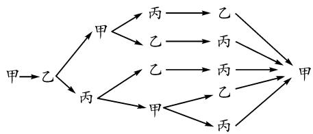
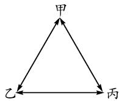
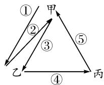
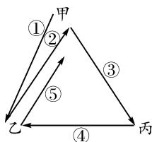
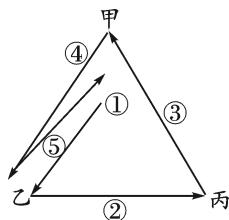
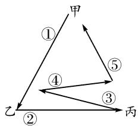
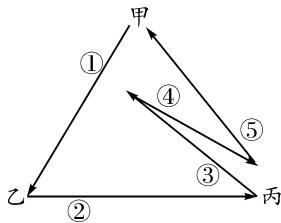
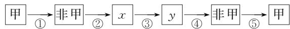

# “传球”问题纵横谈

# 山东省桓台第一中学 苏同安

对于数学问题,不能仅满足于会做或是用了几种方法解出;对于课堂教学容量也不能只是用“题量”或内容的多少,甚至是交流的多少来体现.课堂教学更重要的是在注重过程的基础上产生了多少有价值的“思维量”,是否进行了或“追根求源”或“横纵拓展”的探究活动.下面通过在教学中对一个数学问题的思考和探究来说明这一点.

# 1 问题呈现

问题 甲、乙、丙三人传球，由甲开始发球，并作为第一次传球，经过5次传球后，球仍回到甲手中，则不同的传球方式共有多少种？

下面阐述在课堂教学中,如何引领学生从对问题的各种解决方法入手,由特殊到一般、横向到纵向来进行思考、探究和总结.希望对探究和解决其他数学问题带来一些启迪作用,帮助学生更加深刻地认识数学问题的本质,体悟数学思想方法的价值.

# 2 几种解法

以下是上述问题的几种解决方法.

方法一:树图列举法.

甲第一次传球是给乙的传球方式(如图 1 所示)，共 5 种情况.



<details>
<summary>flowchart</summary>


</details>

图1

同理,甲若第一次传球是给丙,则同样有5种方式.故所有传球方式共10种.

方法二: 分类图解法.

甲、乙、丙三人按图 2 所示位置站立.

下面列出甲第一次传球是给乙的传球方式,共5种情况,如图3-1,3-2,3-3,3-4,3-5所示.

  
图2

  
图3-1



<details>
<summary>flowchart</summary>

```mermaid
graph TD
    甲 --> 乙
    甲 --> 丙
    乙 --> ①
    乙 --> ②
    乙 --> ③
    乙 --> ④
    甲 --> ⑤
    丙 --> ④
    乙 --> ⑤
```
</details>

图3-2



<details>
<summary>flowchart</summary>

```mermaid
graph TD
    甲 --> ①
    甲 --> ②
    甲 --> ③
    甲 --> ④
    乙 --> ⑤
    乙 --> ②
    丙 --> ①
    丙 --> ②
    甲 --> ③
    甲 --> ④
    乙 --> ⑤
    乙 --> ②
```
</details>

图3-3



<details>
<summary>flowchart</summary>

```mermaid
graph TD
    甲 --> 乙
    乙 --> 丙
    乙 --> ①
    乙 --> ②
    乙 --> ③
    乙 --> ④
    甲 --> ⑤
    乙 --> ⑤
```
</details>

图3-4



<details>
<summary>flowchart</summary>

```mermaid
graph TD
    甲 --> 乙
    甲 --> 丙
    乙 --> 丙
    乙 --> ①
    乙 --> ②
    乙 --> ③
    乙 --> ④
    丙 --> ⑤
    甲 --> ⑤
    乙 --> ⑤
```
</details>

图3-5

同理,甲若第一次传球是给丙,则同样有5种方式.故所有传球方式共10种.

方法三: 排列组合法

记“乙”与“丙”为“非甲”，则甲开始传球，经过五次传球，共有六个位置，如图4所示.

  
图 4

第①步有两种可能；后面的 x 和 y 可能都没有甲，也可能只有一个有甲，另一个是丙和乙二选一，所以有 $C_{2}^{0} + C_{2}^{1}C_{2}^{1}$ 种传球方式.

故所有传球方式有 $2(\mathrm{C}_{2}^{0}+\mathrm{C}_{2}^{1}\mathrm{C}_{2}^{1})=10$ 种.

# 3 横向联系

排列组合问题的“实际背景”可能会多种多样,但很多问题的本质是一样的.关注和探究数学问题的本质,会大大促进数学思维能力、抽象概括能力以及解决问题能力的提高.因此,可利用某些典型问题,引领学生“适当”地进行横向联系,探究一些背景不同但本质相同的数学问题.

涂色问题 在如图 5 所示的六个方格里涂上红、黄、蓝三种颜色,要求相邻两个方格不同色,第 1 与第 6 两格均为红色,则涂色方法有多少种?（“第 1 与第 6 两格均为红色”与“球回到甲手中”本质相同。）

<table><tr><td>1</td><td>2</td><td>3</td><td>4</td><td>5</td><td>6</td></tr></table>

图5

排数问题 用 1,2,3 这三个数字排成六位整数，要求首位和末位排 1，且任意相邻的两个数字不相同，则可以得到多少个不同的六位整数？（“首位和末位排 1”与“球回到甲手中”本质相同。）

安排问题 甲、乙、丙三人值班六天,每天一人值班,每个人值两天班.其中,第一天和最后一天由甲值班,且相邻两天不能是同一人.则共有多少种不同的值班方式?

（“第一天和最后一天由甲值班”与“球回到甲手中”本质相同。）

对于上述问题,既可运用传球问题中的解法来解决,又可根据此题的情境,生成贴近问题实际的解法.比如涂色问题,可有如下解法:

解析:(1)若 $\boxed{3}$ 涂红色,则 $\boxed{2}$ 的涂色种数是 $A_{2}^{1}$ , $\boxed{4}$ 和 $\boxed{5}$ 的种数是 $A_{2}^{2}$ ,故有4种方法.

(2) 若 4 涂红色, 则 5 的涂色种数是 $\mathrm{A}_{2}^{1}$ , 2 和 3 的种数是 $\mathrm{A}_{2}^{2}$ , 故有 4 种方法.

(3) 若 3 和 4 均不涂红色, 则涂色种数只能是 $\mathrm{A}_{2}^{2}$ , 2 和 5 就自然确定了.

综上可知,共有 $4+4+2=10$ 种涂色方案.

其他问题,本质相同,就不做详细解答了.

点评:上述给出的几类问题中,有的问题可引导学生编制.这样做不只是为了解几个题,更重要的是让学生通过这个过程,利用不同的背景进一步认识数学知识和数学思想方法的本质,提高数学思维能力、抽象概括能力以及解决问题的能力.

# 4 纵向拓展

上述传球问题中只有3人,传球也只有5次,还应根据学生的实际情况,引领学生将问题“逐步”推广到一般情况,首先将“5次”传球推广到“n次”传球.

拓展问题 1 甲、乙、丙三人开始传球，由甲开始发球，并作为第一次传球，经过 n 次传球后，球仍回到甲手中，则不同的传球方式共有多少种？

解析:设经过 n 次传球后,球在甲手中的不同方法有 $a_{n}$ 种,不在甲手中的方法有 $b_{n}$ 种.

显然 $a_{1}=0$ ，并且 $a_{n}+b_{n}=2^{n}$

经过 n 次传球后，球在甲手中，此时有 $a_{n}$ 种方法。这说明第 n-1 次传球后球没在甲手中，此时有 $b_{n-1}$ 种方法，再从不在甲手中传到甲手中只有一种途径，即 1 种方法。

所以 $b_{n-1} \times 1 = a_{n}$ ，即 $a_{n} = b_{n-1}$ .

又因为 $a_{n - 1} + b_{n - 1} = 2^{n - 1}$ ，所以 $a_{n} + a_{n - 1} = 2^{n - 1}$

又 $a_{1}=0$ ，则问题转化为求数列的通项公式.

设 $a_{n} - \alpha \cdot 2^{n} = -(a_{n - 1} - \alpha \cdot 2^{n - 1})$ ，得 $\alpha = \frac{1}{3}$

于是 $a_{n} - \frac{1}{3}\cdot 2^{n} = -\left(a_{n - 1} - \frac{1}{3}\cdot 2^{n - 1}\right).$

所以 $a_{n} - \frac{1}{3}\cdot 2^{n} = (a_{1} - \frac{2}{3})(-1)^{n - 1}.$

故 $a_{n} = \frac{2^{n} + (-1)^{n}\times 2}{3}.$

因此，符合题意的传球方式共 $\frac{2^n + (-1)^n \times 2}{3}$ 种.

再把问题中的“3人”推广到“m人”，就可把问题纵向推广到更为一般的情况.

拓展问题 2 有 m 个人做传球游戏, 每个人可将球传给任何一人, 由甲开始发球, 并作为第一次传球, 经过 n 次传球后, 球仍回到甲手中, 则不同的传球方式共有多少种?

解析:设经过 n 次传球后,球在甲手中的不同方法有 $a_{n}$ 种,不在甲手中的方法有 $b_{n}$ 种.

显然 $a_{1}=0$ ，并且 $a_{n}+b_{n}=(m-1)^{n}$

经过 n 次传球后，球在甲手中，此时有 $a_{n}$ 种方法。这说明第 n-1 次传球后球没在甲手中，此时有 $b_{n-1}$ 种方法，再从不在甲手中传到甲手中只有一种途径，即 1 种方法。

所以 $b_{n-1} \times 1 = a_{n}$ ，即 $a_{n} = b_{n-1}$ .

又因为 $a_{n - 1} + b_{n - 1} = (m - 1)^{n - 1}$ ，所以

$$
a _ {n} + a _ {n - 1} = (m - 1) ^ {n - 1}.
$$

又 $a_{1}=0$ ，则问题转化为求数列的通项公式.

设 $a_{n} - \alpha (m - 1)^{n} = -\left[a_{n - 1} - \alpha (m - 1)^{n - 1}\right]$ ，易得 $\alpha = \frac{1}{m}$

所以 $a_{n} - \frac{1}{m} (m - 1)^{n} = \left(a_{1} - \frac{m - 1}{m}\right)(-1)^{n - 1}$

故 $a_{n} = \frac{(m - 1)^{n} + (-1)^{n}\times(m - 1)}{m}.$

通过对三人传球问题的横向和纵向的思考和探究,既初步认识到了此类数学问题的本质,又感受到了数学知识之间的广泛联系.这对学习数学知识和解决数学问题有较好的启发作用,同时让学生进一步认识到——对待数学“问题”不能只是孤立地去解决,而应该用“联系”和“运动”的眼光去研究它.退,能得到问题的“本源”;进,可拓展出其“一般性”,从而通过“追根求源”或“横纵拓展”的探究活动,来体现思维过程和思想方法的“全景”.从这样的过程中方可体悟出数学的真谛,从而进入神奇的数学世界中——听数与式奏响的神奇韵律,看图与形编织的美丽彩虹.Z