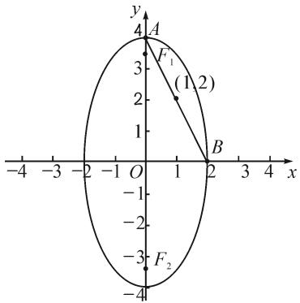

# 一道高考参数方程题的解法分析及教学反思

# ●海南省昌江黎族自治县昌江中学 林瑞记

摘要: 参数方程是高考数学考查的重要模块,本文中结合一道高考参数方程题解法的深入研究,依托高考试题反思教师日常教学,总结不同题型的解法特点,以在教学时真正做到因材施教,进一步落实对学生数学学科核心素养的培养.

关键词: 参数方程; 解法研究; 教学反思

知过去,才能谋未来.我们的高中生从来都不缺乏练习题、高考题的训练,但大多都浅尝辄止,缺乏上下求索的学习态度,导致各个数学知识点之间的联系没有得到很好的构建,知识的外延也没能得到很好的拓展.实际上,很多高考题具有很强的教学意义和研究价值.笔者曾参与海南省2018年高考阅卷工作,现试着从2018年全国Ⅱ卷第22题关于参数方程问题的研究出发,剖析该参数方程题的不同解法,归纳解该类题目的思想方法.首先介绍考生的常见解题思路,并分析不同考生解法的思维特点,然后进一步研究不同的解法,最后揭示不同数学思维水平的考生该如何在考场中“扬长避短”,以及教师在教学中如何做到“因材施教”,落实新课标提出的高中数学学科六大核心素养[1].

# 1 试题呈现

(2018年全国Ⅱ卷第22题)在直角坐标系 $xOy$ 中, 曲线 $C$ 的参数方程为 $\left\{ \begin{array}{l} x = 2\cos \theta, \\ y = 4\sin \theta \end{array} \right.$ ( $\theta$ 为参数), 直线 $l$ 的参数方程为 $\left\{ \begin{array}{l} x = 1 + t\cos \alpha, \\ y = 2 + t\sin \alpha \end{array} \right.$ ( $t$ 为参数).

(1) 求 C 和 l 的直角坐标方程；

(2)若曲线 C 截直线 l 所得线段中点的坐标为 $(1,2)$ ，求 l 的斜率.

答案:(1) $C:\frac{x^{2}}{4}+\frac{y^{2}}{16}=1.$

当 $\cos\alpha\neq0$ 时， $l:y=\tan\alpha\cdot x+2-\tan\alpha$ ；当 $\cos\alpha=0$ 时，l:x=1。(2) 直线 l 的斜率为 -2.

# 2 参数方程问题的解题策略分析

该题在高考中属于选考题,因为其主要考查的内容是三角函数和解析几何,属学生较为熟悉的知识点,故而在高考考场上选择的考生颇多.第(1)问主要考查学生将极坐标方程转化为直角坐标方程、参数方程转化为普通方程的能力,尽管该问较为简单,但是直线l的转换出错较多.对于第(2)问,学生的解法主要是将直线 l 的参数方程代入曲线 C 的直角坐标方程中去求解, 思维的切入点不同, 解题的方法往往就大相径庭 $^{[2]}$ .

解析:(1)由 $\left\{\begin{aligned}x=2\cos\theta,\\ y=4\sin\theta,\end{aligned}\right.$ 得 $\left\{\begin{aligned}\frac{x}{2}&=\cos\theta,\\ \frac{y}{4}&=\sin\theta,\end{aligned}\right.$ 将两式分

别平方再相加,得曲线 C 的直角坐标方程为 $\frac{x^{2}}{4} + \frac{y^{2}}{16} = 1$ .

当 $\cos \alpha \neq 0$ 时，直线 $l$ 的直角坐标方程为 $y = \tan \alpha \cdot x + 2 - \tan \alpha$ ；当 $\cos \alpha = 0$ 时，直线 $l$ 的直角坐标方程为 $x = 1$ .

第(1)问总体来说较简单,失分的同学往往是因为忽略了 $\cos\alpha=0$ 这种特殊情况.当然,如果考生将直线 l 的直角坐标方程写为 $y\cos\alpha=\sin\alpha\cdot x+2\cos\alpha-\sin\alpha$ , 阅卷时也可以得满分,但是如果 l 的直角坐标方程写为 $\frac{x-1}{\cos\alpha}=\frac{y-2}{\sin\alpha}$ , 则至少扣一分.

(2) 解法 1: 把 $\left\{\begin{aligned} x &= 1 + t \cos \alpha, \\ y &= 2 + t \sin \alpha \end{aligned}\right.$ 代入 $\frac{x^{2}}{4} + \frac{y^{2}}{16} = 1$ ，得 $\frac{(1 + t \cos \alpha)^{2}}{4} + \frac{(2 + t \sin \alpha)^{2}}{16} = 1$ ，整理为

$$
(1 + 3 \cos^ {2} \alpha) t ^ {2} + 4 (2 \cos \alpha + \sin \alpha) t - 8 = 0. \tag {①}
$$

因为曲线 C 截得直线 l 所得线段的中点 $(1,2)$ 在 C 内，所以方程①有两解，设为 $t_{1}, t_{2}$ ，根据参数 t 的含义，有 $t_{1} + t_{2} = 0$ 。又 $t_{1} + t_{2} = -\frac{4(2\cos\alpha + \sin\alpha)}{1 + 3\cos^{2}\alpha}$ ，所以 $2\cos\alpha + \sin\alpha = 0$ ，故直线 l 的斜率为 $k = \tan\alpha = -2$ 。

具体策略分析: 解法 1 在阅卷中属于司空见惯的, 由于其解题思路清晰及步骤操作偏模式化, 因此有很多考生青睐这种解法, 也体现了这类考生数学运算素养较强. 因此, 在教学中针对这类学生, 教师应当着重加强计算能力和运算技巧的训练, 这样才能做到有的放矢地教学, 这应该也算是数学学科的“因材施教”吧!

解法 2: (i) 当 $\cos \alpha = 0$ 时, 曲线 C 截直线 l 所得线段的中点为 $(1,0)$ , 不合题意.

(ii) 当 $\cos\alpha\neq0$ 时，由 $\left\{\begin{aligned}\frac{x^{2}}{4}+\frac{y^{2}}{16}=1,\\ y=x\tan\alpha+2-\tan\alpha,\end{aligned}\right.$ 得

$$
\frac {x ^ {2}}{4} + \frac {(x \tan \alpha + 2 - \tan \alpha) ^ {2}}{1 6} = 1.
$$

整理得 $(4+\tan^{2}\alpha)x^{2}+2\tan\alpha(2-\tan\alpha)x+\tan^{2}\alpha-4\tan\alpha-12=0.$

设方程的两个根分别为 $x_{1}, x_{2}$ ，则由韦达定理可得 $x_{1} + x_{2} = -\frac{2\tan\alpha(2 - \tan\alpha)}{4 + \tan^{2}\alpha}$ 。又曲线 C 截直线 l 所得线段的中点坐标为 $(1, 2)$ ，所以 $\frac{x_{1} + x_{2}}{2} = 1$ ，于是 $-\frac{\tan\alpha \cdot (2 - \tan\alpha)}{4 + \tan^{2}\alpha} = 1$ ，解得 $\tan\alpha = -2$ 。

故直线 l 的斜率为 -2.

具体策略分析: 解法 2 较之解法 1, 在思维上走的弯路较少, 联立后整理得到的方程的解本身就是题目所求, 没必要牵涉到参数 t 的含义, 所以考场上运用解法 2 的考生也较多. 但是, 很多学生运用该解法总是拿不到满分, 原因是没有考虑 $\cos \alpha = 0$ 的情况, 即直线 l 的斜率不存在的情况. 针对这类学生, 课堂上教师应该有意识地培养他们的数学抽象素养.

解法3:设直线 l 与椭圆 $\frac{x^{2}}{4}+\frac{y^{2}}{16}=1$ 相交于点 A $(x_{1},y_{1}),B(x_{2},y_{2})$ ，则有 $\left\{\begin{aligned}\frac{x_{1}^{2}}{4}+\frac{y_{1}^{2}}{16}&=1,\\ \frac{x_{2}^{2}}{4}+\frac{y_{2}^{2}}{16}&=1,\end{aligned}\right.$ 两式相减，得

$\frac{(x_{1}+x_{2})(x_{1}-x_{2})}{4}+\frac{(y_{1}+y_{2})(y_{1}-y_{2})}{16}=0.$ 因为 AB 的中点坐标为 $(1,2)$ ，所以 $x_{1}+x_{2}=2, y_{1}+y_{2}=4$ ，则 $\frac{x_{1}-x_{2}}{2}+\frac{y_{1}-y_{2}}{4}=0.$ 当 $x_{1}\neq x_{2}$ 时，线段 AB 的斜率 $k=\frac{y_{1}-y_{2}}{x_{1}-x_{2}}=-2$ ；当 $x_{1}=x_{2}$ 时，线段 AB 的中点坐标为 $(1,0)$ ，不符合题意。故直线 l 的斜率为 -2。

具体策略分析: 解法 3 是常用于解圆锥曲线问题的点差法, 思想就是未知参量设而不求, 最后直接整理得斜率的表达式并求解. 考场上运用该解法的学生思路清晰, 基本都能拿满分, 不过也有部分学生忽略了 $x_{1}=x_{2}$ 时斜率不存在的情况, 导致被扣两分. 从侧面来看, 用解法 3 还出错的学生表现出其逻辑推理及直观想象素养不够强, 教师在教学中应当见微知著, 有目的地补齐这类学生的短板.

解法 4: (i) 当直线 l 的斜率存在时, 设 l 的方程为 $y - 2 = k(x - 1)$ . 联立 $\left\{\begin{aligned}\frac{x^{2}}{4} + \frac{y^{2}}{16} &= 1, \\ y &= k(x - 1) + 2,\end{aligned}\right.$ 整理可得

$(4 + k^{2})x^{2} + 2k(2 - k)x + k^{2} - 4k - 12 = 0.$ 设该方程的两个根分别为 $x_{1}, x_{2}$ ，则由韦达定理可得 $x_{1} + x_{2} = -\frac{2k(2 - k)}{4 + k^{2}}$ 。又曲线 $C$ 截直线 $l$ 所得线段中点坐标为 $(1,2)$ ，则 $\frac{x_1 + x_2}{2} = 1$ ，即 $-\frac{k(2 - k)}{4 + k^2} = 1$ ，解得 $k = -2$ 。

（ii）当直线 l 垂直于 x 轴，即直线 l 的斜率不存在时，曲线 C 截得直线 l 所得线段的中点坐标为 $(1, 0)$ ，不符合题意。

具体策略分析: 解法 4 与解法 2 有着异曲同工之妙, 都是将两方程联立并整理, 再应用韦达定理和线段的中点坐标求解. 这类解法在考场上较为罕见, 主要原因是设直线方程再联立求解, 其中的运算量较大, 很多考生都望而却步. 因此, 在日常教学中, 教师要有意识地强化学生的数学运算素养, 只有夯实基础才能更上一层楼.

解法 5: 如图 1, 曲线 C 是中心在原点、焦点在 y 轴上、长轴长 2a=8、短轴长 2b=4 的椭圆, 上顶点为 A(0,4), 右顶点为 B(2,0), 线段 AB 的中点为 (1,2), 所以直线 AB 满足题目要求. 故直线 l 的斜率为 -2.

scatter

| Point | x | y |
|---|---|---|
| A | 1 | 4 |
| B | 2 | 0 |
| C | -3 | -4 |
| D | 1 | 2 |
| E | 1 | 3 |
| F₁ | 1 | 2 |
| F₂ | 1 | -3 |

图1

具体策略分析: 解法 5 鲜为考生所知, 能用该法解决第(2)问的考生体现了其较强的数学抽象和直观想象素养, 在争分夺秒的高考考场上思维仍能做到简明扼要、抽丝剥茧, 的确令人激赏.

总之,参数方程问题的求解不仅要掌握参数方程中参数的含义,有时还需运用数形结合思想来思考和解答问题.通过这道参数方程题来审视我们的教学效果,确实还有很多需要改进的地方,很多素养需要加强.教师只有终身学习才能站好三尺讲台的岗,对以往高考题解法的回顾,能让思维得到锻炼和发散,能厘清知识间千丝万缕的联系.作为人民教师的我们,应生命不息教与学不止.

# 参考文献：

[1]中华人民共和国教育部.普通高中数学课程标准(2017年版)[S].北京:人民教育出版社,2017.  
[2] 汪生芳.“极坐标系与参数方程”的教学研究[D]. 武汉: 华中师范大学, 2018. Z