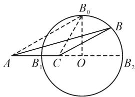

# 代数与几何比翼,技能和素养齐飞

——一道解三角形题的破解

●江苏省丹阳高级中学 陈曦远

摘要: 数学中的“一题多解”, 对于构建数学知识网络, 挖掘题设隐含条件, 开拓数学解题思路, 确定数学解题方向等方面的灵活性、创新性与应用等都有很好的帮助. 利用一道解三角形问题中三角形面积最值的解析, 从代数与几何思维视角切入, 多技巧方法应用与展示, 充分体现“一题多解”的巧妙应用, 引领并指导解题研究与应用.

关键词: 解三角形; 面积; 最大值; 函数; 坐标

解三角形作为高中数学中一个重要基础知识点，也是高考数学解答题重点考查的题型之一，形式各样，变化多端，难度中等。此类解三角形问题，可以有效联系初中平面几何与高中三角函数等相关知识，结合创新场景的创设，构建一个合适的桥梁，形成数学基础知识的延续、深入与拓展，是集数学基础知识、数学思想方法、数学能力技巧、数学核心素养等多方面的一类题型。

# 1 问题呈现

问题 [光大教育广东 2023 届高三综合能力测试(三)数学试卷·19] $\triangle ABC$ 的内角 A, B, C 的对边分别为 a, b, c，且 $c=\sqrt{3}a$ .

(1) 若 $b \cos C = \sqrt{3}$ , $c \sin B = 3$ , 求 A;   
(2) 若 b=4，求 $\triangle ABC$ 面积的最大值.

# 2 问题分析

# 2.1 标准答案

命题者提供的标准答案如下：

(1) 利用正弦定理 $\frac{b}{\sin B} = \frac{c}{\sin C}$ ，可得 $c \sin B = b \sin C = 3$ 。又 $b \cos C = \sqrt{3}$ ，所以 $\tan C = \sqrt{3}$ 。

结合 $C \in (0, \pi)$ , 可得 $C = \frac{\pi}{3}$ .

由 $c = \sqrt{3} a$ ，结合正弦定理有 $\sin C = \sqrt{3}\sin A$ ，从而 $\sin A = \frac{1}{2}$ .由 $c = \sqrt{3} a > a$ ，得 $C > A$ ，则 $A = \frac{\pi}{6}$

(2) 方法 1: 二次函数法.

设 $a = x > 0$ ，则 $c = \sqrt{3} a = \sqrt{3} x$ ，结合三角形的几何性质，可得 $2(\sqrt{3} - 1) < x < 2(\sqrt{3} + 1)$

利用余弦定理,有 $\cos C=\frac{a^{2}+b^{2}-c^{2}}{2ab}=\frac{8-x^{2}}{4x}$ . 结
合同角三角函数基本关系式，有

$$
\sin C = \sqrt {1 - \cos^ {2} C} = \frac {\sqrt {- x ^ {4} + 3 2 x ^ {2} - 6 4}}{4 x}.
$$

所以，可得 $\triangle ABC$ 面积 $S = \frac{1}{2} ab\sin C = \frac{1}{2}\times$ $\sqrt{-x^4 + 32x^2 - 64} = \frac{1}{2}\sqrt{-(x^2 - 16)^2 + 192}$ ，则当 $x^{2} = 16$ ，即 $x = 4$ 时， $\triangle ABC$ 的面积取得最大值，且最大值为 $4\sqrt{3}$

# 2.2 问题剖析

根据三角形问题背景创设,以两边长的线性关系为条件,第(1)问中结合两个边与角的关系式的确定,进而求解相关内角,考查了正弦定理、同角三角函数基本关系式以及三角形的基本性质等;第(2)问结合三角形另一边长的确定,进而求解三角形面积的最大值,考查了三角形的面积公式、余弦定理、同角三角函数基本关系式、三角形的基本性质以及二次函数的图象与性质等.

# 3 多解赏析

以上解三角形问题中的第(2)问,除了上述方法1中的二次函数法这一代数思维方法,还可以在代数层面利用其他的一些方法(如坐标法、三角函数法、海伦公式法等)来分析处理与数学运算;也可以在几何层面通过构建平面几何图形,借助轨迹法等来直观分析与逻辑推理等.

# 3.1 代数思维

方法 2: 坐标法.

以 AC 所在直线为 x 轴, AC 的中垂线为 y 轴建

立平面直角坐标系 $xOy$ ，则 $A(-2,0),C(2,0)$

设 $B(x,y)$ . 由 $c = \sqrt{3} a$ ，得 $c^2 = 3a^2$ ，即 $(x + 2)^2 + y^2 = 3[(x - 2)^2 + y^2]$ ，整理化简，得 $(x - 4)^2 + y^2 = 12 (y \neq 0)$ ，则知 $|y| \leqslant 2\sqrt{3}$ . 所以，可得 $\triangle ABC$ 面积 $S = \frac{1}{2} b |y| \leqslant \frac{1}{2} \times 4 \times 2\sqrt{3} = 4\sqrt{3}$ ，即 $\triangle ABC$ 面积的最大值为 $4\sqrt{3}$ .

解后反思: 解决解三角形中的最值问题, 经常通过平面直角坐标系的构建, 利用三角形中的已知条件来确定对应动点的变化规律, 结合平面解析几何中的轨迹或曲线的确定, 进而借助代数运算与图形直观来综合分析与解决问题.

方法 3: 三角函数法.

利用余弦定理，有 $b^{2} = a^{2} + c^{2} - 2ac\cos B = 16$ ，结合 $c = \sqrt{3} a$ ，整理得 $(2 - \sqrt{3}\cos B)a^2 = 8$ ，则

$$
a ^ {2} = \frac {8}{2 - \sqrt {3} \cos B}.
$$

而 $\sin B + \sqrt{3}\cos B = 2\sin (B + \frac{\pi}{3})\leqslant 2$ ，所以可得 $2 - \sqrt{3}\cos B\geqslant \sin B$ ，当且仅当 $B = \frac{\pi}{6}$ 时，等号成立.

所以， $\triangle ABC$ 面积 $S = \frac{1}{2} ac\sin B = \frac{\sqrt{3}}{2} a^2\sin B = \frac{4\sqrt{3}\sin B}{2 - \sqrt{3}\cos B} \leqslant \frac{4\sqrt{3}\sin B}{\sin B} = 4\sqrt{3}$ ，当且仅当 $B = \frac{\pi}{6}$ 时，等号成立，即 $\triangle ABC$ 面积的最大值为 $4\sqrt{3}$ .

解后反思: 解决解三角形中的最值问题, 经常可以借助三角形的内角以及正弦定理与余弦定理、面积公式等的应用, 将对应的问题转化为三角函数问题, 借助三角函数的公式、图象与性质等的巧妙转化, 得以解决对应的最值.

方法 4: 海伦公式法.

由 $c = \sqrt{3} a, b = 4$ ，利用海伦公式，可知 $p = \frac{a + \sqrt{3} a + 4}{2} = \frac{1 + \sqrt{3}}{2} a + 2$ .

故 $\triangle ABC$ 面积 $S = \sqrt{p(p - a)(p - b)(p - c)} = \sqrt{\left(\frac{1 + \sqrt{3}}{2}a + 2\right)\left(\frac{\sqrt{3} - 1}{2}a + 2\right)\left(\frac{1 + \sqrt{3}}{2}a - 2\right)\left(\frac{1 - \sqrt{3}}{2}a + 2\right)}$ 可得 $S = \sqrt{\left[\left(\frac{1 + \sqrt{3}}{2}a\right)^2 - 4\right]\left[4 - \left(\frac{\sqrt{3} - 1}{2}a\right)^2\right]} = \frac{1}{2}\times \sqrt{-a^4 + 32a^2 - 64} = \frac{1}{2}\sqrt{-(a^2 - 16)^2 + 192}$ ，当 $a^2 = 16$ ，即 $a = 4$ 时， $\triangle ABC$ 的面积取得最大值，且最大值为 $4\sqrt{3}$ .

解后反思: 解决解三角形中与面积有关的最值问题, 可以利用海伦公式来构建对应的表达式, 这也是解决与面积有关的问题经常用来合理构建关系式的一种基本思维方式. 在构建关系式的基础上, 或利用函数性质, 或利用不等式性质等来确定最值.

# 3.2 几何思维

方法 5: 轨迹法.

如图 1 所示, 在线段 AC 上取点 $B_{1}$ , 使得 $AB_{1} = \sqrt{3} \times B_{1}C$ , 在线段 AC 的延长线上取点 $B_{2}$ , 使得 $AB_{2} = \sqrt{3}B_{2}C$ .

根据 AC=a=4，可求得 $B_{1}C=2\sqrt{3}-2, B_{2}C=2\sqrt{3}+2$ ，从而 $B_{1}B_{2}=4\sqrt{3}$ .

text_image

B₀
A B₁ C O B₂

图 1

易知点 B 在以 $B_{1}B_{2}$ 为直径的阿波罗尼斯圆 O 上运动，此时 $OB_{0} \perp AC, OB_{0} = 2\sqrt{3}$ .

设 $\triangle ABC$ 底边 $AC$ 上的高为 $h$ ，则可知 $\triangle ABC$ 面积 $S = \frac{1}{2} bh = 2h \leqslant 2OB_0 = 4\sqrt{3}$ .

故 $\triangle ABC$ 面积的最大值为 $4\sqrt{3}$ .

解后反思: 解决解三角形中的最值问题, 经常回归到平面几何图形的本质, 结合动点的变化规律或轨迹的确定, 利用数形结合, 直观分析与逻辑推理, 进而得以确定最值问题.

# 4 解后总结

# 4.1 规律总结,思考方向

根据以上问题及其解析,解决解三角形中最值问题的常规思考方向有:

(1)用静止的眼光看图形.根据解三角形思维、坐标思维、三角函数思维、公式思维等合理构建相关几何量的解析式,根据函数或方程、三角函数、不等式等思想(或动态)来求解对应的最值问题.  
(2)用动态的眼光看图形.根据三角形中的数量关系,合理构建几何图形,关注相关动点的轨迹,结合对应动点、动直线等运动的轨迹与图形,数形结合,“形”看最值的条件,进而得以确定对应的最值问题.

# 4.2 发散思维,创新意识

解数学题时,要有探究意识、推广意识、拓展意识和创新意识等.如探究问题的解法能否多思维、多方法,问题的特殊场景能否推广到一般形式,问题的变量能否拓展到更多个或一般形式的变量问题,问题的应用能否更加创新与综合,等等.教学中合理引导,开启一个更加多元、更加广阔的平台,进而引导学生利用数学的思维与方法来解决问题,探究现实世界.Z