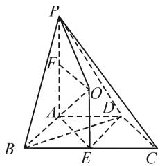
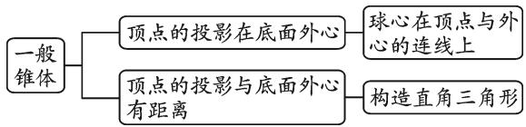
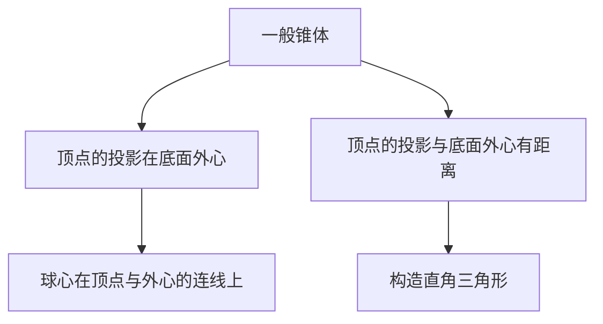
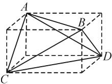
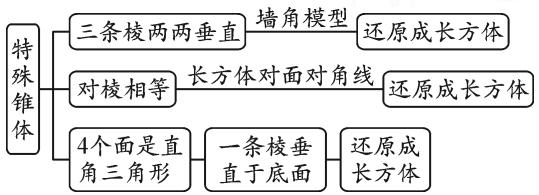
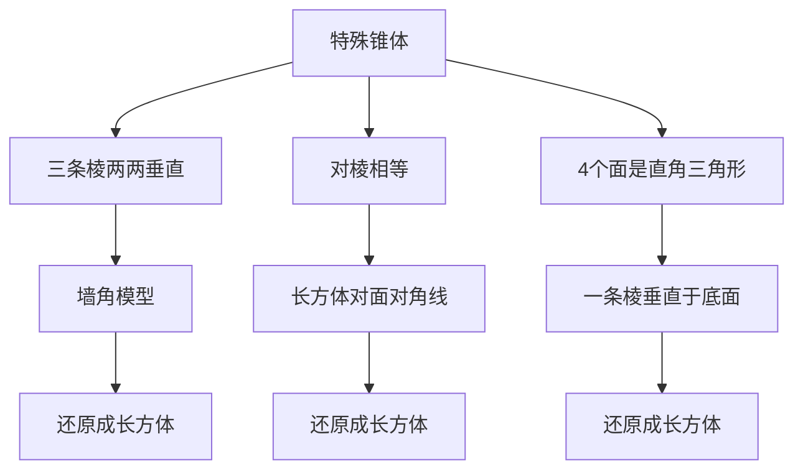
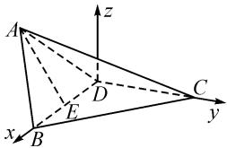

# 几何,模型,坐标:几何体外接球问题的“三大”破解策略

陕西省洛南中学 韩毅

摘要: 空间几何体的外接球问题是高考中的一个基本考点与难点. 从几何策略、模型策略、坐标策略等常见应试策略入手, 结合实例剖析, 归纳问题类型, 理解并掌握破解几何体外接球问题的基本技巧与策略, 有效指导数学教学与复习备考.

关键词: 空间几何体; 外接球; 定义; 几何; 模型; 坐标

空间几何体的外接球问题,一直是立体几何的学习与综合应用中的一个重点与难点,也是模拟联考和高考中的一个命题热点.在具体破解几何体外接球的相关问题时,关键是结合空间几何体的结构特征,以及对应外接球的定义、几何性质等,合理加以联系,从球的定义与几何结构视角(几何策略),几何体的模型构建视角(模型策略)以及空间直角坐标系的构建与应用视角(坐标策略)等技巧策略方面来分析与处理,合理归类,巧妙应用.

# 1 几何策略

几何策略是借助空间几何图形,利用对应的空间几何体与外接球之间的位置关系与结构特征,进行必要的点的构建、辅助线的引入,结合空间几何图形的几何性质、相关定理及对应的逻辑推理与数学运算来分析与处理.

例 1 已知 P, A, B, C, D 是球 O 的球面上的五个点，四边形 ABCD 为梯形， $AD \parallel BC$ ，AB = DC = AD = 2，BC = PA = 4，PA ⊥ 平面 ABCD，那么球 O 的体积为（）.

$$
\mathrm{A.} \frac {6 4 \sqrt {2}}{3} \pi \quad \mathrm{B.} \frac {1 6 \sqrt {2}}{3} \pi \quad \mathrm{C.} 1 6 \sqrt {2} \pi \quad \mathrm{D.} 1 6 \pi
$$

分析:抓住空间几何体的结构特征与对应的数量关系,合理构建相关的点、辅助线等,结合空间图形的几何性质、定理等的应用与逻辑推理,确定几何体的外接球的球心O所在的直线与对应平面的垂直关系,进而引入参数并结合关系式的建立,即可确定球的半径与体积.

解析: 如图 1 所示, 取 BC 的中点 E, 连接 AE, DE, BD.

因为 $AD \parallel BC$ 且 $AD = \frac{1}{2} BC = EC = BE$ ，所以

四边形 ADCE, ABED 均为平行四边形, 故 AE = DC, AB = DE.

又 $DC=\frac{1}{2}BC$ ，所以 AE= $\frac{1}{2}BC=AB$ ，即 AE=DE=BE=EC，所以 E 为四边形 ABCD 外接圆的圆心.

text_image

Geometric diagram of a triangular pyramid with labeled vertices and internal points, used for mathematical analysis.

图1

设 O 为外接球的球心, 则由球的性质可知 $OE \perp$ 平面 ABCD.

作 $OF \perp PA$ ，垂足为 F，则四边形 AEOF 为矩形，于是 OF = AE = 2.

设 AF = x, OP = OA = R，则 $4 + (4 - x)^{2} = 4 + x^{2}$ ，解得 x = 2，所以 $R = \sqrt{4 + 4} = 2\sqrt{2}$ .

所以球 O 的体积为 $V=\frac{4}{3}\pi R^{3}=\frac{64\sqrt{2}}{3}\pi.$

故选择答案:A.

点评:利用几何策略破解几何体外接球问题时,往往是结合空间图形的几何性质、定理等进行必要的推理,合理确定外接球的球心所在的直线或平面,在此基础上结合所有顶点到球心的距离都相等来确定关系式,进而得以分析与求解.如对于一般的锥体的外接球问题,具体应用时的思路过程如图2所示.

flowchart

图2

# 2 模型策略

模型策略是借助特殊空间几何体,通过合理的补形处理,使得补形后的特殊几何体(一般是正方体或长方体等)的外接球与原空间几何体的外接球一致，进而转化为利用特殊几何体的外接球性质来分析与解决问题.

例 2 在四面体 A-BCD 中, AB = CD = 5, AC = BD = $\sqrt{34}$ , AD = BC = $\sqrt{41}$ , 则四面体 A-BCD 外接球的表面积为().

A. $50\pi$

B. $100\pi$

C. $150\pi$

D. $200\pi$

分析:抓住特殊四面体的结构特征,结合其四个面均为全等的三角形这一特征,合理借助模型策略,进行数学建模.采用补形法,构建一个与四面体相对应的长方体,二者的外接球一致,进而利用长方体进行合理转化.

解析:由于四面体 A-BCD 的四个面为全等的三角形,因此可在其每个面补上一个以 $5,\sqrt{34},\sqrt{41}$ 为三边的三角形作为底面,且分别以 a,b,c 为两两垂直的侧棱长的三棱锥，从而可得到一个长、宽、高分别为 $a, b, c$ 的长方体，如图3所示，则有 $a^2 + b^2 = 25$ ， $a^2 + c^2 = 34, b^2 + c^2 = 41$ .

  
图3

设所求外接球的半径为 R，则有 $(2R)^{2}=a^{2}+b^{2}+c^{2}=50$ .

解得 $4R^{2}=50$ .

所以所求外接球的表面积为 $S=4\pi R^{2}=50\pi$ .

故选择答案:A.

点评:利用模型策略破解几何体外接球问题时,往往以构建与题设空间几何体相对应的正方体或长方体的特殊模型为主.以特殊锥体为例,可以通过以下基本模型加以合理构建与应用,如图4所示.

flowchart

图 4

# 3 坐标策略

坐标策略是借助空间直角坐标系的构建,利用空间向量的相关知识与运算来分析与解决问题,巧妙将“形”的问题转化为“数”的运算,实现“形”与“数”的合理结合与转化,通过代数方法来解决几何问题,适当降低立体几何的思维难度.

例 3 已知三棱锥 A-BCD 中， $AB = BD = DA = 2\sqrt{3}$ ， $DC = 2\sqrt{2}$ ， $BC = 2\sqrt{5}$ ，二面角 A-BD-C 的大小为 $135^{\circ}$ ，则三棱锥 A-BCD 外接球的表面积为（）.

A. $64\pi$

B. $52\pi$

C. $40\pi$

D. $32\pi$

分析:抓住空间几何体的结构特征,利用直角三角形的判定,为合理构建空间直角坐标系提供条件.而空间直角坐标系的构建,实现了“形”向“数”的视角转化,合理应用数学运算,有效减少严谨的逻辑推理与抽象的空间想象,对问题的解决有很好的提升与促进作用.

解析:由于 $BD=2\sqrt{3}$ , $CD=2\sqrt{2}$ , $BC=2\sqrt{5}$ ，因此 $BC^{2}=BD^{2}+CD^{2}$ ，则有 $CD\perp BD$ .

如图 5 所示, 以 D 为坐标原点, DB, DC 所在的直线分别为 x 轴, y 轴建立空间直角坐标系, 则 $B(2\sqrt{3}, 0, 0)$ , $C(0, 2\sqrt{2}, 0)$ .

text_image

A
z
D
C
y
x
B
E

图5

过点 A 作 BD 的垂线 AE，由二面角 A-BD-C 的大小为 $135^{\circ}$ ，可知 $A\left(\sqrt{3}, -\frac{3\sqrt{2}}{2}, \frac{3\sqrt{2}}{2}\right)$ .

而 Rt△BCD 外接圆圆心为 BC 的中点，则知三棱锥 A-BCD 外接球的球心 O 在过 BC 的中点且垂直于平面 BCD 的直线上，设 $O(\sqrt{3}, \sqrt{2}, h)$ .

由于 $OD^2 = OA^2$ ，因此 $(\sqrt{3})^2 + (\sqrt{2})^2 + h^2 = 0 + \left(\sqrt{2} + \frac{3\sqrt{2}}{2}\right)^2 + \left(h - \frac{3\sqrt{2}}{2}\right)^2$ ，解得 $h = 2\sqrt{2}$

所以，三棱锥 A-BCD 的外接球的半径 $R = OD = \sqrt{(\sqrt{3})^{2} + (\sqrt{2})^{2} + (2\sqrt{2})^{2}} = \sqrt{13}$ ，外接球的表面积为 $S = 4\pi R^{2} = 52\pi$ .

故选择答案:B.

点评:利用坐标策略破解几何体外接球问题时,基本解题步骤分为五步.(1)寻找合适的坐标原点构建相应的空间直角坐标系;(2)确定各对应点的坐标;(3)设出相关点的坐标;(4)利用向量等的应用来构建关系式,分析并求解对应的参数;(5)结合所求进一步分析与求解等.这里构建空间直角坐标系时,往往结合直角三角形、垂直关系、中点等常规视角进行切入与应用.

解决几何体外接球的相关问题,可以根据不同场景,借助几何策略、模型策略、坐标策略等常见技巧方法与应试策略,综合球的定义与几何性质等,结合空间图形与空间想象,做到“心中有图”,科学构建,“串联”起空间不同元素之间的关系,合理逻辑推理,巧妙数学运算,进而实现空间想象与数学运算能力的提升,以及直观想象与逻辑推理核心素养等的养成.