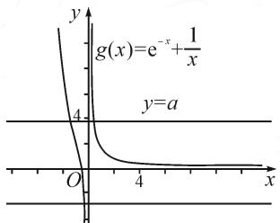

# 函数零点问题的求解路径分析

# ● 江苏省溧阳中学 韩 俊

摘要: 含参的函数零点讨论问题, 是近些年来函数压轴的常见题型, 本文中借此题型分享了几个含参函数零点问题的解题感悟, 找到了使得函数值异号的点大致的三种路径. 路径一, 分离出代数式中已经能判定符号的式子, 将剩余部分视作 “零”, 通过解方程找到所需定号的 “点”; 路径二, 利用自变量取值范围将某些超越式放缩为常数; 路径三, 利用 $y = e^{x}$ 在 x = 0 处的切线进行放缩, 也即利用 $e^{x} \geqslant x + 1$ 及其变形式进行放缩.

关键词: 函数找“点”; 定号; 放缩

众所周知,极限与导数(微积分)紧密相关,很多导数问题与极限思想都息息相关.苏教版教材在高中数学课程中不涉及极限的知识,这给很多涉及导数的函数问题的求解带来了重重困难.例如,含参的函数零点讨论问题,这是近些年来函数压轴的常见题型,笔者就借此题型来分享几个含参函数零点问题的解题感悟.

# 1 引例

讨论 $f(x)=\frac{x}{\mathrm{e}^{x}}-ax+1$ 的零点个数.

# 1.1 分析

初见此题,感觉数形结合较为容易.由于 x=0 不是函数的零点,故分离参数之后,问题等价转化为方程的根的个数问题.令 $\frac{x}{e^{x}}-ax+1=0$ , 则有

$$
\frac {1}{\mathrm{e} ^ {x}} + \frac {1}{x} = a. \tag {①}
$$

text_image

g(x)=e^{-x}+\frac{1}{x}
y=a
O
4
4
x

图1

数形结合,如图1我们发现:

当 $a \leqslant 0$ 时，方程①仅有一解，即 $f(x) = \frac{x}{\mathrm{e}^x} - ax + 1$ 有一个零点；

当 $a > 0$ 时，方程①有两解，即 $f(x) = \frac{x}{\mathrm{e}^x} - ax + 1$ 有两个零点.

再细想,一来学生对函数图象的趋势(极限思想)不一定能准确把握,二来作为解答题,这样的解答似乎略显苍白,因此,需要用文字和数学表达式来准确证明上面的结论,即用零点存在定理来证明零点的存在性.那么,如何取点就变成了学生解决此题的难点.许多学生“为题消得人憔悴”,但依旧不得.重新审视此题,笔者略谈一二,希望能够给此类题型提供一些解题思路.

# 1.2 解析

首先考虑特值: 当 a=0 时, 若 $x \geqslant 0$ , 则 $f(x) > 0$ 恒成立, 故 $f(x)$ 无正数零点; 若 x < 0, 则 $f'(x) = \frac{1 - x}{\mathrm{e}^x} > 0$ 恒成立, 即 $f(x)$ 在 $(-∞, 0)$ 上单调增, 又 $f(-1) = 1 - e < 0$ , $f\left(-\frac{1}{2}\right) = -\frac{\sqrt{e}}{2} + 1 > 0$ , 所以 $f(x)$ 在 $(-∞, 0)$ 上仅有一个零点. 故 a = 0 时, $f(x) = \frac{x}{\mathrm{e}^x} - ax + 1$ 有一个零点.

再考虑非特值：

由于 x=0 不是函数 $f(x)$ 的零点，故分离参数后可等价转化为 $g(x)=\frac{1}{\mathrm{e}^{x}}+\frac{1}{x}-a$ 的零点个数问题。因为 $g'(x)=-\frac{1}{\mathrm{e}^{x}}-\frac{1}{x^{2}}<0$ 恒成立，所以函数 $g(x)$ 在 $(-∞,0),(0,+∞)$ 上单调递减。

(i) a<0 时, 若 x>0, 则 $g(x)>0$ 恒成立, 故 $g(x)$ 无正零点; 若 x<0, 则 $g\left(\frac{1}{a}\right)=\frac{1}{\mathrm{e}^{\frac{1}{a}}}>0$ .

取 $x_0 = \max \{-1, \frac{1}{a - e}\}$ ，则 $g(x_0) \leqslant e - a + \frac{1}{x_0} \leqslant 0$ .

故 $g\left(\frac{1}{a}\right) \cdot g(x_0) \leqslant 0$ ，此时 $g(x)$ 在定义域内仅有一个零点，即 $f(x)$ 仅有一个零点.

(ii) $a > 0$ 时， $g(x) = \frac{1}{\mathrm{e}^x} + \frac{1}{x} - a.$ 若 $x > 0$ ，则

$$
g \left(\frac {1}{a}\right) = \frac {1}{\mathrm{e} ^ {\frac {1}{a}}} + a - a = \frac {1}{\mathrm{e} ^ {\frac {1}{a}}} > 0,
$$

$$
g \left(\frac {2}{a}\right) = \frac {1}{\mathrm{e} ^ {\frac {2}{a}}} + \frac {a}{2} - a <   \frac {a}{2} + \frac {a}{2} - a = 0.
$$

故 $g\left(\frac{1}{a}\right) \cdot g\left(\frac{2}{a}\right) < 0$ ，此时 $g(x)$ 在 $(0, +\infty)$ 内仅有一个零点，即 $f(x)$ 在 $(0, +\infty)$ 内仅有一个零点.

若 $x < 0, g\left(-\frac{1}{2}\right) = \sqrt{\mathrm{e}} - 2 - a < 0$ ，且

$$
\begin{array}{l} g \left(- \frac {a + \sqrt {a ^ {2} + 4}}{2}\right) > - \left(- \frac {a + \sqrt {a ^ {2} + 4}}{2}\right) + \\ \frac {1}{- \frac {a + \sqrt {a ^ {2} + 4}}{2}} - a = 0. \end{array}
$$

故 $g\left(-\frac{1}{2}\right) \cdot g\left(-\frac{a + \sqrt{a^2 + 4}}{2}\right) < 0$ ，此时 $g(x)$ 在 $(- \infty, 0)$ 内仅有一个零点，即 $f(x)$ 在 $(- \infty, 0)$ 内仅有一个零点.

综上: 当 $a \leqslant 0$ 时, $f(x) = \frac{x}{\mathrm{e}^{x}} - ax + 1$ 有一个零点; 当 a > 0 时, $f(x) = \frac{x}{\mathrm{e}^{x}} - ax + 1$ 有两个零点.

# 1.3 总结

从上述解题过程看,找到使得函数值异号的点大致可以选择以下三种路径.

路径一: 把代数式中已经能判定符号的式子取出, 再将剩余部分视作“零”, 通过解方程找到所需定号的“点”.

例如上例中，在 a<0 时，若 x<0，则 $g(x)=\frac{1}{\mathrm{e}^{x}}+\frac{1}{x}-a$ 中 $\frac{1}{\mathrm{e}^{x}}$ 的符号已经能够判定为正，则只需将剩余的“ $\frac{1}{x}-a$ ”视为零，从而找到所需的“点”，即 $g\left(\frac{1}{a}\right)=\frac{1}{\mathrm{e}^{\frac{1}{x}}}+a-a=\frac{1}{\mathrm{e}^{\frac{1}{a}}}>0.$

路径二: 利用自变量取值范围将某些超越式放缩为常数, 将超越式不等式放缩为分式不等式或多项式不等式, 通过解不等式找到所需定号的“点”. 例如上例中, 在 a<0 时, 若 x<0, 则 $g(x)$ 在 $(-∞,0)$ 上单调递减, 在 $g(x)=\frac{1}{\mathrm{e}^{x}}+\frac{1}{x}-a$ 中, 当 $x∈[-1,0)$ 时, $\frac{1}{\mathrm{e}^{x}}\in(1,\mathrm{e}]$ , 不妨取 $x_{0}=\max\{-1,\frac{1}{a-\mathrm{e}}\}$ , 则 $g(x_{0})\leqslant\mathrm{e}-$

$$
a + \frac {1}{x _ {0}} \leqslant 0.
$$

路径三: 利用 $y = e^{x}$ 在 x = 0 处的切线进行放缩（即利用 $e^{x} \geqslant x + 1$ 及其变形式进行放缩），将所有的超越式放缩为分式或多项式，将所求不等式转化为分式不等式或多项式不等式进行求解，找到所需定号的“点”。例如上例中，a > 0 时， $g(x) = \frac{1}{e^{x}} + \frac{1}{x} - a$ ，当 x > 0 时，利用 $e^{x} \geqslant x + 1$ 进行放缩，即由 $e^{x} > x$ 得到 $e^{\frac{2}{a}} > \frac{2}{a}$ ，又因为 $e^{\frac{2}{a}} > \frac{2}{a} > 0$ ，则 $\frac{1}{e^{\frac{2}{a}}} < \frac{a}{2}$ ，故 $g(\frac{2}{a}) = \frac{1}{e^{\frac{2}{a}}} + \frac{a}{2} - a < \frac{a}{2} + \frac{a}{2} - a = 0$ ; a > 0 时， $g(x) = \frac{1}{e^{x}} + \frac{1}{x} - a$ ，当 x < 0 时，利用 $e^{x} \geqslant x + 1$ 进行放缩，即由 $e^{x} > x$ 得 $e^{-x} > -x$ ，则 $g(x) > -x + \frac{1}{x} - a = -\frac{x^{2} + ax - 1}{x} = -\frac{(x - \frac{-a + \sqrt{a^{2} + 4}}{2})(x - \frac{-a - \sqrt{a^{2} + 4}}{2})}{x}$ ，故不妨取 $x = -\frac{a + \sqrt{a^{2} + 4}}{2}$ ，有 $g\left(-\frac{a + \sqrt{a^{2} + 4}}{2}\right) > 0$ 。

# 2 三种路径在压轴题中应用

经过上题的研究,笔者有些“众里寻他千百度,蓦然回首,那人却在,灯火阑珊处”之感.下面利用这三种路径来解决如下高考压轴题.

[2022·全国乙卷(文)20题]已知函数 $f(x)=ax-\frac{1}{x}-(a+1)\ln x$ . 若 $f(x)$ 恰有一个零点, 求 a 的取值范围.

解析:由 $f(x)=ax-\frac{1}{x}-(a+1)\ln x,x>0$ , 得

$$
f ^ {\prime} (x) = a + \frac {1}{x ^ {2}} - \frac {a + 1}{x} = \frac {(a x - 1) (x - 1)}{x ^ {2}}.
$$

当 $a \leqslant 0$ 时， $ax - 1 \leqslant 0$ . 所以，当 $x \in (0,1)$ 时， $f'(x) > 0, f(x)$ 单调递增；当 $x \in (1, +\infty)$ 时， $f'(x) < 0, f(x)$ 单调递减. 故 $f(x)_{\max} = f(1) = a - 1 < 0$ ，此时函数 $f(x)$ 无零点，不合题意.

当 0 < a < 1 时， $\frac{1}{a} > 1, f(x)$ 在 $(0,1), \left(\frac{1}{a}, +\infty\right)$ 上单调递增； $f(x)$ 在 $\left(1,\frac{1}{a}\right)$ 上单调递减.

又因为 $f(1) = a - 1 < 0$ ，所以存在 $m = \frac{a + 1 + \sqrt{(a + 1)^2 + a}}{a} > 1$ ，使得 $f(m) > 0$ .

(下转封三)

# (上接第72页)

故 0 < a < 1 时， $f(x)$ 仅在 $\left(\frac{1}{a}, +\infty\right)$ 有唯一零点，符合题意.

当 a=1 时， $f'(x)=\frac{(x-1)^{2}}{x^{2}}\geqslant0$ ，则 $f(x)$ 在 $(0,+\infty)$ 上单调递增。又 $f(1)=a-1=0$ ，所以 $f(x)$ 有唯一零点，符合题意。

当 $a > 1$ 时， $\frac{1}{a} < 1, f(x)$ 在 $\left(0, \frac{1}{a}\right), (1, +\infty)$ 上单调递增； $f(x)$ 在 $(\frac{1}{a}, 1)$ 上单调递减。此时 $f(1) = a - 1 > 0$ ，则 $f\left(\frac{1}{a}\right) > f(1) > 0$ ，存在 $n = \frac{1}{4(a + 1)^2} < \frac{1}{a}$ ，使得 $f(n) < 0$ 。

所以 $f(x)$ 在 $\left(0, \frac{1}{a}\right)$ 有一个零点，在 $\left(\frac{1}{a}, +\infty\right)$ 无零点. 故 a > 1 时，故 $f(x)$ 有唯一零点，符合题意.

综上，a 的取值范围为 $(0, +\infty)$ .

评析:通过该题的解析不难发现,在讨论当0<a<1时,可先利用路径二由x>1得到 $-\frac{1}{x}>-1$ ,再利用路径三由 $e^{x}\geqslant x+1$ 的变形式 $e^{\ln x}\geqslant\ln x+1$ 得到 $\ln x\leqslant x-1$ ,进而得到 $\ln x<x$ ,用 $\sqrt{x}$ 替换x,得 $\ln x<2\sqrt{x}$ ,则 $f(x)>ax-1-2(a+1)\sqrt{x}=a\left(\sqrt{x}-\frac{a+1-\sqrt{(a+1)^{2}+a}}{a}\right)\left(-\frac{a+1+\sqrt{(a+1)^{2}+a}}{a}+\right.$

$\sqrt{x}$ ，则存在 $m=\frac{a+1+\sqrt{(a+1)^{2}+a}}{a}>1$ ，使得 $f(m)>0$ 。

而在讨论当 a>1 时，可先利用路径二由 $x<\frac{1}{a}$ 得到 ax<1，再利用路径三由 $\ln x<x-1(x\neq1)$ 用 $\frac{1}{\sqrt{x}}$ 替换 x 得到 $-\frac{1}{2}\ln x<\frac{1}{\sqrt{x}}-1(x\neq1)$ ，则 $f(x)<1-\frac{1}{x}+2(a+1)(\frac{1}{\sqrt{x}}-1)=-2a-1-\frac{1}{x}+\frac{2(a+1)}{\sqrt{x}}$ 。由于 -2a-1<0 恒成立，因此通过路径一，可知存在 $n=\frac{1}{4(a+1)^{2}}<\frac{1}{a}$ ，使得 $f(n)<0$ 。

# 3 结束语

通过上文两题所述,大多数的函数“找点”问题都可从上述三种路径中摸索出一些解题思路,虽不一定能“众里寻他千百度,蓦然回首,那人却在,灯火阑珊处”,但也希望通过此文为一些“为题消得人憔悴”的朋友们,在解决此类问题时点亮一丝“灯火”.

正如波利亚所说：“如果你有一个念头，你就够幸运的了；如果你走运的话，你或许能找到另一个念头；真正糟糕的事是，我们根本就没有念头，……，这时任何一个可能指明问题新方向的问题，都值得欢颂，因为它可以引起我们的兴趣，可以使我们继续工作，继续思索。”所以，解题永无止境，收获永无止境，愿看过此文的朋友在解决压轴题时，总能经历三境，不断升华.

natural_image

Repeating pattern of stylized flower icons in maroon and beige tones (no text or symbols)

# 中国函数论重要奠基人——李国平

■复旦大学附属中学 汪杰良

李国平（1910—1996），出生于广东丰顺。中国数学家、教育家。1933年毕业于中山大学。中国科学院院士。四川大学教授、武汉大学教授、中华教育文化基金会研究员、中国科学院武汉物理研究所波谱与原子分子物理国家重点实验室研究员。任武汉大学数学系主任、数学研究所所长、副校长。任中国科学院武汉数学研究室主任，中国科学院数学计算技术研究所所长，中国科学院武汉数学物理研究所所长、名誉所长、国家科委武汉计算机培训中心主任。中国系统工程学会副理事长，中国数学会理事、名誉理事，湖北省科协副主席。

李国平主要从事函数论、数学物理等领域的研究工作。在半纯函数唯一性问题、有理函数表写问题、整函数理论应用、解析函数逼近、数学物理与系统科学等研究中获得多项重要成果。在函数论研究方面取得一系列突出成果。先后发表论文一百余篇、撰写专著二十余部。

他曾任《数学物理学报》主编、《数学年刊》副主编、《数学杂志》及《系统工程与决策》名誉主编。

他注重科学研究机构的组建, 把大量精力花在人才的培养上。他的学生中有五位评上院士、一百多名评上数学教授和研究员等。他荣获“全国先进工作者”称号。

他爱好极其广泛，数十年间创作了大量的诗词、书法、绘画以及音乐作品。撰有《词中诗辑要》《苏东坡诗中词百首》等著作。

为纪念李国平院士百年诞辰，武汉大学出版了《李国平诗词选》，并在武汉大学隆重举行了李国平铜像揭幕仪式。

李国平院士的名言：“子夜无声月季香，手挥彩笔墨含光；辛勤无改平生愿，百首诗成付楚狂。”