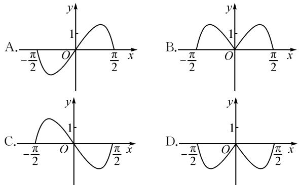

# 巧借特殊值法,妙解高考真题

# ●张家港高级中学 黄轶

摘要:巧妙利用特殊值法,借助特殊值的选取,有时可以更加简捷地求解客观题.本文中结合2022年高考真题,剖析特殊值法的巧妙应用,总结特殊值法的解题技巧与规律.

关键词: 高考; 特殊值; 客观题; 函数; 三角; 不等式

特殊值法破解数学客观题,有其特殊的优势与美妙的体验,它是数学基础知识、基本技能、基本思想、基本活动经验等“四基”落实并上升到一定高度的特殊“产物”,是特殊与一般思维的升华.特别在解决一些函数或方程、数列、三角函数或不等式等的选择题时,利用特殊值法,解题过程简洁明了,很好地提升解题速度与解题效益.下面结合2022年高考数学真题中一些客观题特殊值法的合理选用与巧妙应用加以剖析.

# 1 巧判函数图象

例 1 （2022 年高考数学全国甲卷理科·5）函数 $y=(3^{x}-3^{-x})\cos x$ 在区间 $\left[-\frac{\pi}{2},\frac{\pi}{2}\right]$ 的图象大致为（）.

分析: 解决此类题的常用思维就是先根据函数的解析式判定函数的奇偶性, 再借助特殊值的选取合理排除错误的选项. 而此题两次利用函数特殊值的选取, 即可将不满足函数值取值情况的图象完美地排除, 实现巧妙判定函数图象的目的.

解析:选取特殊值 x=1, 可得 $f(1)=(3^{1}-3^{-1})\cdot\cos1>0$ , 由此排除选项 C, D;

再选取特殊值 x = -1，得 $f(-1) = (3^{-1} - 3^{1}) \cdot \cos(-1) < 0$ ，由此排除选项 B.

故选择答案:A.

点评:巧妙选取特殊值来判断函数或方程所对应

的函数图象问题,将特殊值所对应的函数值情况与点的位置特征加以联系与对比,排除不合理的图象选项.对于单选题,在利用特殊值法巧判函数或方程所对应的函数图象问题时,经常要多次利用特殊值的巧妙选取来合理排除,直到剩下最后一个正确答案为止.

# 2 判定函数关系式

例 2 （2022 年高考数学北京卷·4）已知函数 $f(x)=\frac{1}{1+2^{x}}$ ，则对任意实数 x，有（）.

A. $f(-x)+f(x)=0$

B. $f(-x)-f(x)=0$

C. $f(-x) + f(x) = 1$

D. $f(-x)-f(x)=\frac{1}{3}$

分析: 解决此类题的常用思维就是利用题设给出的函数关系式, 结合选项中对应函数关系式代入, 通过指数运算与变形来转化与验证, 进而得以正确判定. 而此题选取特殊值加以验证即可正确判定, 从而减少数学运算量, 这也是一种不错的技巧方法.

解析:由函数 $f(x)=\frac{1}{1+2^{x}}$ ，选取特殊值 x=0，
可得 $f(0)=\frac{1}{1+2^{0}}=\frac{1}{2}$ ，代入各选项中进行验证，选项 B, C 成立；

又选取特殊值 x=1，可得 $f(1)=\frac{1}{1+2^{1}}=\frac{1}{3}$ ， $f(-1)=\frac{1}{1+2^{-1}}=\frac{2}{3}$ ，只有选项 C 成立.

故选择答案:C.

点评:在判定一些复杂函数关系式的成立问题时,为避免复杂的逻辑推理与繁杂的数学运算,经常借助一些特殊值的选取,代入函数关系式加以化简与求值,可以很好地优化解题过程,同时对于函数关系式的判定更加直接、有效.

# 3 求解相应函数值

例 3 （2022 年高考数学新高考Ⅱ卷·6）角 $\alpha, \beta$ 满足 $\sin(\alpha + \beta) + \cos(\alpha + \beta) = 2\sqrt{2}\cos\left(\alpha + \frac{\pi}{4}\right)\sin\beta$ ，则（）.

A. $\tan (\alpha +\beta) = 1$ B. $\tan (\alpha +\beta) = -1$

C. $\tan (\alpha -\beta) = 1$ D. $\tan (\alpha -\beta) = -1$

分析: 解决此类题的常用思维就是利用三角恒等变换公式对题设的三角函数方程加以变形与转化, 进而结合化简的结果来分析与求解对应的三角函数值问题. 而此题结合两次特殊值的选取, 即可合理排除不满足条件的选取, 简化公式变形与推理过程, 优化数学运算.

解析: $\sin(\alpha+\beta)+\cos(\alpha+\beta)=2\sqrt{2}\cos\left(\alpha+\frac{\pi}{4}\right)\cdot\sin\beta.$ ①

选取特殊值 $\beta=0$ ，代入①式，得 $\sin\alpha+\cos\alpha=0$ ，即 $\tan\alpha=-1$ ；再将 $\beta=0$ 分别代入四个选项，由此可以排除选项 A, C.

选取特殊值 $\alpha=0$ ，代入①式，可得 $\sin\beta-\cos\beta=0$ ，即 $\tan\beta=1$ ；再将 $\alpha=0$ 分别代入四个选项进行验证，由此可以排除选项 B.

故选择答案:D.

点评:这里很好地通过三角函数关系式中角的变化以及对应选项中的三角函数值不变的特征,利用两次特殊值的选取,结合选项中的三角函数值进行排除.借助特殊值法处理相关数学问题时,有时一次特殊值的选取不能直接达到目的,可以进行第二次特殊值的选取,直至剩下最后一个选项为止.

# 4 确定参数取值范围

例 4 （2022 年高考数学浙江卷·9）已知 $a, b \in R$ ，若对任意 $x \in R, a |x - b| + |x - 4| - |2x - 5| \geqslant 0$ ，则（）.

A. $a \leqslant 1, b \geqslant 3$ B. $a \leqslant 1, b \leqslant 3$

C. $a\geqslant1,b\geqslant3$ D. $a\geqslant1,b\leqslant3$

分析: 解决此类题的常用思维就是绝对值不等式的函数图象化处理思维、参数的分类讨论思维等, 过程复杂, 讨论繁多. 而此题利用特殊值的选取, 代入题设的绝对值不等式加以化简, 利用含参不等式恒成立的条件确定参数的取值情况, 结合各选项中的参数取值范围即可验证与确定.

解析:选取特殊值 x=4，由 $a|x-b|+|x-4|-|2x-5|\geqslant0$ ，可得 $a|4-b|-3\geqslant0$ .

显然 $a \neq 0$ 且 $b \neq 4$ ，观察各选项可知，只有 $a \geqslant 1$ ， $b \leqslant 3$ 符合这个结论.

故选择答案:D.

点评:借助含参绝对值不等式中特殊值的选取,简化不等式,减少变量,借助不等式恒成立等相关知识确定相关参数的取值情况,再结合选项合理验证.在具体借助特殊值法确定参数取值范围的问题时,经常不能直接得到对应参数的取值范围,而是借助选项中参数不同取值范围加以验证与判断,合理排除,巧妙确定.

# 5 判断不等式成立

例 5 （2022 年高考数学新高考Ⅱ卷·12）（多选题）对任意 x, y, $x^{2} + y^{2} - xy = 1$ ，则（）.

A. $x + y\leqslant 1$ $\mathrm{B}.x + y\geqslant -2$

C. $x^{2} + y^{2}\leqslant 2$ D. $x^{2} + y^{2}\geqslant 1$

分析: 解决此类题的常用思维就是不等式思维、配方思维或换元思维等, 利用条件中的二元方程, 结合基本不等式、完全平方公式或三角换元等方法来处理, 解题过程较为繁琐. 而此题利用特殊值法, 根据满足二元方程条件下的特殊值的两次合理选取, 即可正确排除对应的选项来达到正确判断的目的, 简单快捷.

解析:选取特殊值 x=y=1, 其满足方程 $x^{2}+y^{2}-xy=1$ , 则有 $x+y=2\leqslant1$ 不成立, 故选项 A 错误;

再选取特殊值 $x = -y = \frac{\sqrt{3}}{3}$ ，其满足方程 $x^{2} + y^{2} - xy = 1$ ，则有 $x^{2} + y^{2} = \frac{2}{3} \geqslant 1$ 不成立，故选项 D 错误；

根据多选题“至少有两个选项是正确”的特征,故选择答案:BC.

点评:利用特殊值法破解一些数学的综合与创新问题时,有一定的“秒杀”效果,但要注意一般“可遇而不可求”,不具有可推广性与普及性.如果一定要花大量时间去配凑特殊值,往往得不偿失.这里借助二元方程的结构特征,可以快速选取相应的特殊值来验证,综合多选题的特征,当确定其中两个选项为错误时,则另外两个选项肯定是正确答案.

巧借特殊值法,可以在很大程度上简化繁杂的逻辑推理过程与复杂的数学运算过程,但也不能盲目任意选取特殊值,要吻合数学问题中特殊与一般思维之间的联系与转化,才能达到正确使用特殊值法的目的.巧妙借助特殊值法,能很好降低知识复杂层次,弱化基础知识难度,强化数学思想方法,优化数学解题过程,提升数学解题效益,节省宝贵考试时间,真正达到“小题小做”“小题巧做”“小题快做”等良好解题效益.Z