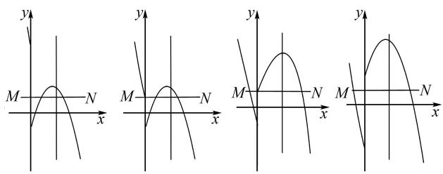

# 明算理 晰算法 提素养

陈小丽

(江苏省昆山市第一中学, 江苏 昆山 215300)

摘 要:培养学生数学运算意识是发展学生思维能力的一种有效路径. 教师可从试题结构分析、整体分析、分类讨论、数形结合和模型推理等视角培养学生的算理意识, 明晰算法; 引导学生依据试题结构, 通过重构知识体系、同化新信息、顺应解题思路, 优化算法, 进而提升运算素养和思维品质.

关键词: 算理; 算法; 运算能力; 思维能力; 素养

中图分类号：G632

文献标识码：A

文章编号:1008-0333(2025)15-0002-03

《普通高中数学课程标准(2017年版)》(以下简称《课标》)中提出了数学学科的六大核心素养，其中数学运算素养是指在明晰运算对象的基础上，根据运算法则解决数学问题的素养。数学运算的本质就是理解运算对象、掌握运算法则、探究运算方向、选择运算方法、设计运算程序、求得运算结果。数学运算贯穿于学生数学学习的始终，而课堂是学生形成、发展运算素养的主阵地，因此，要将运算素养的培养常抓不懈，一以贯之地落实到日常课堂教学中。本文结合课堂教学案例，谈谈如何培养学生运算能力，使其做到明算理、晰算法，进而提升运算素养。

# 1 培养结构分析意识

运算的本质是在理解算理基础上找出算法,在问题的分析中关注好逻辑点,在解答过程中建构内在逻辑转换关系.教学实践中,教师通过优化算理的探究,发现算法的简洁性,能够帮助学生以最快速的方式发现最佳解决问题的方案,突破学生思维的“盲点”和“漏洞”,进而使其在问题解决中逐步积累解题经验,不断优化思维方法.

例 1 应用因式分解, 讨论 $x + 1 - \frac{1}{x}$ 的符号, 并求不等式 $x + 1 > \frac{1}{x}$ 的解.

解析 分解因式得，

$$
\begin{array}{l} x + 1 - \frac {1}{x} = \frac {x ^ {2} + x - 1}{x} \\ = \frac {\left[ x - (- 1 - \sqrt {5}) / 2 \right] \left[ x - (- 1 + \sqrt {5}) / 2 \right]}{x}, \\ \end{array}
$$

当 $x = \frac{-1 - \sqrt{5}}{2}$ 或 $x = \frac{-1 + \sqrt{5}}{2}$ 时， $x + 1 - \frac{1}{x} = 0$

其他情况见表1:

表 1 分式不等式符号的分类讨论

<table><tr><td></td><td> $x < \frac{-1 - \sqrt{5}}{2}$ </td><td> $\frac{-1 - \sqrt{5}}{2} < x < 0$ </td><td> $0 < x < \frac{-1 + \sqrt{5}}{2}$ </td><td> $x > \frac{-1 + \sqrt{5}}{2}$ </td></tr><tr><td> $x - \frac{-1 - \sqrt{5}}{2}$ </td><td>负</td><td>正</td><td>正</td><td>正</td></tr><tr><td>x</td><td>负</td><td>负</td><td>正</td><td>正</td></tr><tr><td> $x - \frac{-1 + \sqrt{5}}{2}$ </td><td>负</td><td>负</td><td>负</td><td>正</td></tr><tr><td> $x + 1 - \frac{1}{x}$ </td><td>负</td><td>正</td><td>负</td><td>正</td></tr></table>

收稿日期:2025-02-25

作者简介:陈小丽,硕士,中小学高级教师,从事概率论与数理统计研究.

综上,不等式 $x+1>\frac{1}{x}$ 的解, 即 $x+1-\frac{1}{x}>0$ 时 x 的取值范围为 $\left\{x\mid\frac{-1-\sqrt{5}}{2}<x<0\text{ 或 }x>\frac{-1+\sqrt{5}}{2}\right\}$ .

评注 把解不等式问题转化为代数式符号判断问题,是解不等式的基本方法.通过分解因式,对不同取值范围各因式的符号进行讨论,进而确定整个代数式的符号,并求得不等式的解,这是因式分解在结构化题目分析中的一个重要应用.

# 2 培养整体分析意识

存在两种或两种以上结构的问题,常见于代数式、方程、不等式或函数中.教师可从代数式角度对问题进行等价转化,变成结构相同、形式一致的形式.其本质是将运算的某部分视作一个“小单元”,将这一“小单元”进行整体替换或直接代入运算,从而使复杂的数式运算变得巧妙、简单,进而获得问题解决的优化方案 $^{[1]}$ .

例 2 方程 $(x^{2}+2x)^{2}+6(x^{2}+2x)+5=0$ 不相等的实数根的个数为 \_\_\_\_.

解析 本题是一元二次方程复合结构, 解题时将 $x^{2} + 2x$ 作为一个整体, 由根的判别式进行判断, 可得出结果. 因为 $(x^{2} + 2x)^{2} + 6(x^{2} + 2x) + 5 = 0$ . 所以 $(x^{2} + 2x + 1)(x^{2} + 2x + 5) = 0$ . 所以 $x^{2} + 2x + 1 = 0$ 或 $x^{2} + 2x + 5 = 0$ . 当 $x^{2} + 2x + 1 = 0$ 时, $\Delta = 4 - 4 = 0$ , 方程有两个相等的实数根; 当 $x^{2} + 2x + 5 = 0$ 时, $\Delta = 4 - 4 \times 5 = -16 < 0$ , 方程没有实数根.

评注 在解题教学中,培养学生整体运算意识具体可从两方面入手,一是引导学生构建整体观察和思考的视角,形成新的运算思路、设计新的运算程序;二是引导学生熟练掌握数式结构的等价变换,进而建立起运算条件与目标式之间的内在逻辑关系.

# 3 培养分类讨论运算意识

在涉及基于运算目标构建的复杂数学结构时，常遇见复杂代数式或符号较多的综合运算。有些问题的结论并非唯一确定，教师需要把所有研究的问题结合题目特点和要求，分成若干类，并转化成若干个小问题来解决，按不同情况分类，然后再逐一研究解决,进而使原本复杂的数式运算得以简化.

例 3 已知 m, n 均为正实数, 试比较 a = $\frac{m^{2} - n^{2}}{m^{2} + n^{2}}$ 与 $b = \frac{m - n}{m + n}$ 的大小关系.

解析 通过作差法比较大小,然后分类讨论即可. 因为 $a=\frac{m^{2}-n^{2}}{m^{2}+n^{2}}, b=\frac{m-n}{m+n}$ ,

$$
\begin{array}{l} = \frac {\left(m ^ {2} - n ^ {2}\right) (m + n) - \left(m ^ {2} + n ^ {2}\right) (m - n)}{\left(m ^ {2} + n ^ {2}\right) (m + n)} \\ = \frac {2 m n (m - n)}{(m ^ {2} + n ^ {2}) (m + n)}. \\ \end{array}
$$

所以 $a - b = \frac{m^2 - n^2}{m^2 + n^2} - \frac{m - n}{m + n}$

又 $m, n$ 均为正实数, 所以 $mn > 0, m^2 + n^2 > 0, m + n > 0$ . 若 $m > n$ , 则 $m - n > 0$ . 所以 $a - b > 0$ . 则 $a > b$ . 若 $m = n$ , 则 $m - n = 0$ . 所以 $a - b = 0$ . 则 $a = b$ . 若 $m < n$ , 则 $m - n < 0$ . 所以 $a - b < 0$ . 则 $a < b$ .

综上, 当 m > n 时, a > b; 当 m = n 时 a = b; 当 m < n 时 a < b.

评注 代数运算出现多变量时,分类讨论可降低其运算和推理的难度,使条理清晰.

# 4 培养数形结合意识

数学家徐利治教授提出,几何直观是借助于见到的或想到的几何图形的位置关系对数量关系的直接感知.图形可以直观生动地表达意图,启发学生心智,激发学生想象力.学生能够通过画几何图形来思考问题、理解问题、启思明理、获得结论.

例 4 对于二次函数 $y = ax^{2} + bx + c$ ，规定函数 $y = \left\{\begin{aligned} ax^{2} + bx + c & (x \geqslant 0). \\ -ax^{2} - bx - c & (x < 0)\end{aligned}\right.$ 是它的相关函数。已知点 M, N 的坐标分别为 $(- \frac{1}{2}, 1)$ ， $(\frac{9}{2}, 1)$ ，连接 MN，若线段 MN 与二次函数 $y = -x^{2} + 4x + n$ 的相关函数的图象有两个公共点，则 n 的取值范围为 \_\_\_\_。

解析 如图1, 当线段 $MN$ 与二次函数 $y = -x^{2} + 4x + n$ 部分图象只有1个交点时, 由 $-4 + 8 + n = 1$ , 得 $n = -3$ .

如图2, 当线段 MN 与二次函数 $y = -x^{2} + 4x + n$ 部分图象有3个交点时, 由 -n = 1, 得 n = -1.

text_image

y
M-N
x
y
M-N
x
y
M-N
x
y
M-N
x

图1 情形1  
图2 情形2  
图3 情形3  
图4 情形4

由此可得,当 $-3 < n \leqslant -1$ 时,出现 2 个交点.

如图3, 当线段 MN 与二次函数 $y = -x^{2} + 4x + n$ 部分图象有 3 个交点时, 得 n = 1.

如图4, 当线段 $MN$ 与二次函数 $y = -x^{2} + 4x + n$ 部分图象有2个交点时, 由 $\frac{1}{4} + 2 - n = 1$ , 得 $n = \frac{5}{4}$ . 由此可得, 当 $1 < n \leqslant \frac{5}{4}$ 时, 出现2个交点.

综合, n 的取值范围 $-3 < n \leqslant -1$ 或 $1 < n \leqslant \frac{5}{4}$ .

评注 在数学解题中,学生缺乏借助图形分析问题的意识,就会使原本比较抽象的题目变得更难以下手,而一些题目画个图就可以很快得出思路,找到问题的结果,这样能增强学生优化思考的意识,避免繁琐计算.

# 5 培养模型推理意识

数学运算的本质建立在学生理解数学问题后的数学思维的表达上,数学模型(原理)是其“隐性”的数学思维的“外显”.因此,找到数学模型即找到解题思路,通过对数学运算思路进行分析,对方法进行尝试探索,有助于预测 $^{[2]}$ 后续过程与结果.

例 5 糖水不等式定理: 若 a > b > 0, m > 0, 则一定有 $\frac{b + m}{a + m} > \frac{b}{a}$ . 通俗的理解就是 a 克的不饱和糖水里含有 b 克糖, 往糖水里面加入 m 克糖, 则糖水更甜.

糖水不等式的倒数形式: 设 a > b > 0, m > 0, 则有: $\frac{a}{b} > \frac{a + m}{b + m}$ .

知识运用(多选)已知实数 a, b, c 满足 0 < a < b < c，则下列说法正确的是().

A. $\frac{1}{c-a}>\frac{1}{b-a}$

B. $\frac{b}{a}>\frac{b+c}{a+c}$

$$
\mathrm{C.} \frac {1}{a (c - a)} > \frac {1}{b (c - a)}
$$

$$
\mathrm{D.} a b + c ^ {2} > a c + b c
$$

解析 由糖水不等式的倒数形式, $b > a > 0$ , $c > 0$ , 则有 $\frac{b}{a} > \frac{b + c}{a + c} \Leftrightarrow b(a + c) > a(b + c) \Leftrightarrow bc > ac \Leftrightarrow b > a$ , 故 B 正确. 因为 $0 < a < b < c$ , 所以有 $c - a > b - a > 0$ . 所以 $\frac{1}{c - a} < \frac{1}{b - a}$ , 故 A 错误. $\frac{1}{a(c - a)} > \frac{1}{b(c - a)} \Leftrightarrow \frac{1}{a} > \frac{1}{b} \Leftrightarrow b > a$ , 故 C 正确. $ab + c^2 > ac + bc \Leftrightarrow c(c - b) - a(c - b) > 0 \Leftrightarrow (c - a)(c - b) > 0$ , 故 D 正确.

故选 BCD.

评注 为在解题教学中有效培养学生运用模型强化运算的能力,教师应从深入理解运算对象的特征入手,通过合情推理预测运算过程及结果,逐步逼近运算目标,进而建立起相应的数学模型.

# 6 结束语

史宁中教授认为学生数学核心素养的形成和发展,本质上是学生自己“悟”出来的,是学生通过自己的独立思考,以及和他人的讨论与反思,逐渐养成的一种思维习惯.因此,教师应依据学生的认知特点和《课标》学习要求,将数学运算放在数学知识的整体系统中,发展蕴含其中的数学基本思想方法来组织设计教学.课堂是提升运算素养的主阵地,教师的任务是引导学生形成良好的反思问题的习惯,让学生注重反思的关键点,例如运算过程的严谨性、方法的优越性、问题的延展性等.学生通过实践、反思和积累,能够丰富运算经验,进而提升运算素养.

# 参考文献：

[1] 冯维清, 朱胜强. 培养意识 优化算法 提升素养 [J]. 数学通报, 2024, 63(04): 32-35.  
[2] 李昌官. 数学运算素养及其培养 [J]. 数学通报, 2019(18): 1-5.

[责任编辑:李慧娇]