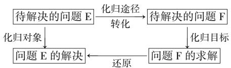
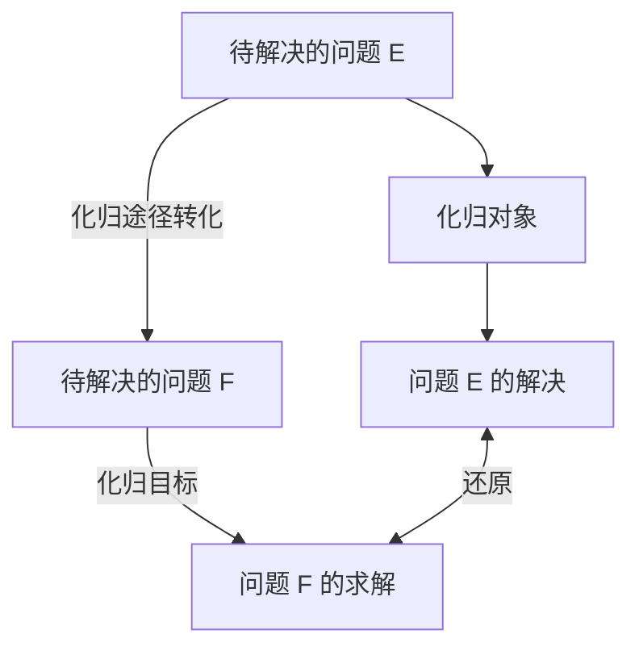

# 高中数学函数解题中化归思想的合理运用

于嘉曦

(山东省济南市平阴县实验高级中学, 山东 济南 250400)

摘 要:文章围绕高中数学课程教学,将人教A版教材内容作为举例依据,针对高中数学函数解题教学实践,在概述“化归思想”内涵的基础上,采取典型例题分析的论述方式,从“函数定义域问题”“函数值域问题”“函数解析式问题”“函数奇偶性问题”四个维度总结“化归思想”在函数解题中的具体运用.

关键词:高中数学;函数问题;解题教学;化归思想

中图分类号：G632

文献标识码:A

文章编号:1008-0333(2025)15-0005-03

在高中数学课程体系中,函数是四条主线之一,在高考试题里,函数部分也占据较大比例.函数类题型一般综合性很强,学生在解题时常常无从下手.在解题教学实践中,部分教师为提高学生解决函数问题的能力,常采用题海战术,帮助学生积累函数解题的经验与方法.然而,当学生面对新的函数题型时,却又会再度陷入无从下手的困境.究其根本原因,主要是学生始终未能掌握数学问题内在的规律和数学思想方法.在解决函数问题时,若能合理运用“化归思想”,则可帮助学生简化问题,提高解题的灵活性,同时促进学生数学逻辑思维的发展.因此,在高中数学函数解题教学中,教师应积极渗透“化归思想”,以此优化学生的函数解题体验,增强学生的函数解题信心与能力.

# 1 化归思想的内涵

主体认知的基本规律是化繁为简、化新为旧、化未知为已知，在面对一个新问题时，主体往往倾向于利用已有的经验去解决问题，这种解决问题的思维方式就是“化归”。在数学领域中，知识与知识之间是相互依存的关系，而“化归思想”则是通过将陌生的、复杂的问题转化为熟悉的、简单的问题，用以达成解决原问题的目的[1]. “化归思想”中的“化”主要是指将待解决的问题转化为熟悉的、简单的问题，“归”主要是指在解决问题的过程中有明确的对象和目的将问题进行转化。“化归思想”包括三个关键要素: 其一, 化归对象, 即待解决问题中需要变换和转化的部分; 其二, 化归目标, 即将待解决问题转化为既往所学习过的问题; 其三, 化归途径, 即在问题转化的过程中采取一定的措施和方法, 使待解决问题得到转化. 在解题过程中可供学生转化问题的方法较多, 所以函数解题中化归思想的合理运用能够提高学生解题的灵活性, 是学生高效、正确解题的一个关键途径. “化归思想”在问题解决中的运用过程如图1所示.

flowchart

图 1 化归过程示意图

由图 1 可知, 在化归过程中, 将 “待解决的问题 E” 转化为 “待解决的问题 F” 是化归思想实际运用的第一步骤, 也是关键步骤. 在将 “问题 E” 转化为 “问题 F” 的这一环节中, 学生需要结合题干信息思考和选择化归的方式方法, 将复杂的、陌生的、抽象的、特殊化的问题转化为简单的、熟悉的、直观的、一般化的问题 $^{[2]}$ ，从而通过求解“问题F”解决“问题E”。所谓“化归途径”，主要是指实现化归的方法。在高中数学解题中，可供学生应用的化归方法较多，包括换元法、直接转化法、反解法、配凑法和构造法等，其中“换元法”是最为常用的解题方法。同时，不同化归方法均有其各自的适用性，并非任何一种化归方法都适用于解决各类数学问题。所以在解题过程中，学生还需要结合待解决的问题，合理选择化归方法，由此才能够达成转化问题的目标。

# 2 高中数学函数解题中化归思想的运用

本节以高中数学人教 A 版必修一第三章《函数的概念与性质》教学内容为例,总结化归思想的具体运用.

# 2.1 定义域问题

# 2.1.1 给出具体函数解析式的情况

在求解函数定义域问题的过程中运用化归思想,通常是将待解决的问题转化为求不等式组的解集.

例 1 求函数 $g(x)=\frac{\sqrt{-x^{2}+3x+4}}{\ln x}$ 的定义域.

解析 观察该函数解析式能够发现,分子和分母上的代数式分别存在相应的限制条件.结合课堂所学,函数的定义域是使函数有意义的所有自变量组成的集合.对于此类函数,通常要求分母不等于0,若涉及偶次根式等情况还需考虑根号下的式子大于或等于0.基于这些条件,可以得到一个不等式组： $\left\{\begin{aligned}-x^{2}+3x+4&\geqslant0,\\ x&>0,\\ \ln x&\neq0,\end{aligned}\right.$ 解这个不等式组可以获得自

变量 $x$ 的取值范围, 即 $0 < x \leqslant 4, x \neq 1$ . 所以这个函数的定义域为 $(0,1) \cup (1,4]$ .

# 2.1.2 没有给出函数解析式的情况

在函数解题过程中,学生还有可能会遇见抽象函数,即并没有给出具体解析式的一类函数问题,那么在求解此类函数问题的过程中,学生需要将已知函数的定义域作为基础进行转化.以函数 $f(x)$ 与函数 $f[g(x)]$ 为例,学生要明确这两个函数定义域之

间的关系,假定函数 $f[g(x)]$ 的定义域是 $(n,m)$ ,那么学生求出函数 $g(x)$ 的值域,就是 $f(x)$ 的定义域;假定 $f(x)$ 的定义域是 $(a,b)$ ,那么求解不等式a< $g(x)<b$ ,就是函数 $f[g(x)]$ 的定义域.

例 2 已知函数 $g(2^{x})$ 的定义域为 $[-1,1]$ ，求函数 $g(\log_{2}x)$ 的定义域.

解析 根据上述转化的方法与题意, 设 $v = 2^{x}$ , 则有 $2^{-1} \leqslant 2^{x} \leqslant 2$ , 求解不等式可以获知函数 $g(v)$ 的定义域是 $\left[\frac{1}{2}, 2\right]$ . 若 $v = \log_{2} x$ , 则有 $\frac{1}{2} \leqslant \log_{2} x \leqslant 2$ , 求解不等式可以获得函数 $g(\log_{2} x)$ 的定义域 $\sqrt{2} \leqslant x \leqslant 4$ , 即 $[\sqrt{2}, 4]$ .

在求解抽象函数定义域问题时,教师还应引导学生率先确定所求的自变量是什么,在例2中,对于函数 $g(v)$ ,其自变量是v,对于函数 $g(2^{x})$ 与函数 $g(\log_{2}x)$ ,其自变量均是x,然后要求学生结合函数自变量的不同对实际的问题进行转化.本题中学生需要将函数 $g(v)$ 的定义域转化为 $y=2^{x}$ 的值域,然后再将 $g(\log_{2}x)$ 的定义域转化为求不等式解集的问题.这一过程中学生将陌生问题转化为熟悉的问题,用v分别替代了 $2^{x}$ 与 $\log_{2}x$ .

# 2.2 值域问题

关于函数值域问题的求解,若不能直接通过函数解析式求出函数的值域,解题过程中学生可以应用自变量与因变量对调的反解方式,(把 $y=f(x)$ 转化为 $x=g(y)$ ) 将求函数值域的问题转化为求函数定义域的问题.

例 3 求函数 $y=\frac{3x+1}{x-4}$ 的值域.

解析 观察函数解析式可以发现本题无法直接判断出这个函数的值域,但是这个函数的定义域可以轻松计算得出,即 $x \neq 4$ . 对此考虑应用反解的方式将自变量 x 用因变量 y 来表示,则有 $x = \frac{1 + 4y}{y - 3}$ , 将函数 $y = \frac{3x + 1}{x - 4}$ 的值域问题转化为反函数的定义域问题, 结合题意这个函数的定义域为 $\{x \mid x \neq 4\}$ , 则有 $\left\{\begin{aligned}\frac{1 + 4y}{y - 3} \neq 4, \\ y \neq 3,\end{aligned}\right.$ 解得 $y \neq 3$ . 由此可以求出函数 $y = \frac{3x + 1}{x - 4}$

的值域为 $\{y\mid y\neq3\}$ .

由上述例题可知,应用反解法求函数的值域,其关键在于自变量与因变量的对调.解题教学中,教师应强调此种方法适用于函数定义域明显,但值域较难求出的函数,则应鼓励学生在应对此种函数问题时运用反解法将陌生问题转化为熟悉的问题.除反解法外,如果自变量与因变量并不易于对调,教师还可以向学生渗透用换元法求函数的值域,将待求的函数转化为另一个自己熟悉的函数,如二次函数、三角函数等,从而将求解过程化难为易,快速求出函数的值域.

# 2.3 解析式问题

# 2.3.1 应用配凑法求函数解析式

在求解函数解析式的过程中,学生可以应用配凑法,在已知 $g[h(x)] = G(x)$ 的情况下,将解析式等号右侧的 $G(x)$ 通过加、减、乘、除等运算使之变形成为关于 $h(x)$ 的表达式,然后再将 $h(x)$ 看作一个整体,以 x 代之得到函数 $g(x)$ 的解析式.

例 4 若 $g(x + \frac{1}{x}) = x^{2} + \frac{1}{x^{2}}$ ，求函数 $g(x)$ 的解析式.

解析 观察解析式可以发现等号的两边都含有 $x + \frac{1}{x}$ 的形式, 所以可以考虑优先使用配凑法对函数解析式进行转化, 对解析式的右边进行配凑可以得出 $g(x + \frac{1}{x}) = (x + \frac{1}{x})^2 - 2$ . 设 $x + \frac{1}{x} = t$ , 则 $g(x) = t^2 - 2$ , 若 $x > 0$ , 则根据不等式可得出 $t \geqslant 2$ , 当 $x \in \mathbf{R}$ 时, $y = x + \frac{1}{x}$ 为奇函数, 所以当 $x < 0$ 时有 $t \leqslant -2$ , 故 $|t| \geqslant 2$ . 综上可得出函数 $g(x)$ 的解析式为 $g(x) = x^2 - 2, (|x| \geqslant 2)$ .

由上述解题过程可知,本题求解的难点主要在于自变量 t 的定义域,所以教师需要强调要求的定义域是 $y = x + \frac{1}{x}$ 的值域.

# 2.3.2 应用换元法求函数解析式

实质上,化归思想中换元法是一种应用较为广泛的方法,所以关于求函数解析式的问题,解题过程中如果无法应用配凑法转换解析式,那么学生可以应用换元法进行解析式的转换,将陌生的函数问题转化为熟悉的函数问题.

例 5 已知 $h(1 - \sin x) = \cos^{2}x$ ，求函数 $h(x)$ 的解析式.

解析 观察已知条件可以发现, $\sin x$ 与 $\cos x$ 之间存在一定的数量关系,即 $\sin^{2}x+\cos^{2}x=1$ ,将 $\sin^{2}x+\cos^{2}x=1$ 转换并代入已知条件中,则有 $h(1-\sin x)=1-\sin^{2}x$ .此时如果仍采取配凑法,则不能够凑出一个多项式“ $1-\sin x$ ”,所以考虑应用换元法引入新元“n”,令 $1-\sin x=n$ ,则 $\sin x=1-n$ ,将其代入 $h(1-\sin x)=\cos^{2}x$ 中,则有 $h(n)=1-(1-n)^{2}=2n-n^{2}$ ,其中 $\sin x$ 的取值范围为 $-1\leqslant\sin x\leqslant1$ ,则可以求出n的取值范围为 $0\leqslant n\leqslant2$ ,由此可以得出函数 $h(x)$ 的解析式为 $h(x)=2x-x^{2}(x\in[0,2])$ .

由例 5 可以看出,应用换元法求函数解析式的原理与用换元法求函数值域的原理相同,都是对函数的解析式进行转化.对于本题的解题教学,教师应引导学生引入新元,即令 $1 - \sin x = n$ ,同时还需要着重提醒学生在换元的过程中注意新元的取值范围.在本题中,新元 n 的取值范围就是 $y = 1 - \sin x$ 的值域.

# 3 结束语

综上所述,通过例题分析可以明确,在解决高中函数问题的过程中,学生可以基于“化归思想”采取反解法、配凑法、换元法、性质法等转化待解决的函数问题,从而实现高效解题.所以在函数解题教学中,教师应鼓励学生运用化归思想去转化所求问题,辅助规范学生化归的过程,并利用日常的变式训练提高学生各种化归思想方法的实际运用能力,从而使学生的函数解题能力得到有效提升.

# 参考文献：

[1] 代洪祥. 高中数学函数解题中化归思想的合理运用 [J]. 数理天地 (高中版), 2024(15): 54-55.

[2] 黄文钦. 化归思想在高中数学解题过程中的应用探究 [J]. 云南教育 (中学教师), 2021(10): 31-32.

[责任编辑:李慧娇]