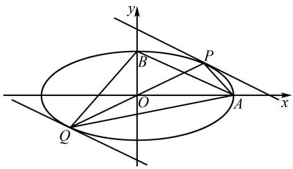

# 2025 年广东高职高考数学第 24 题的解析与反思

# 钟钦灵

(广州市黄埔职业技术学校, 广东 广州 510730)

摘 要:文章对2025年广东高职高考数学第24题进行多角度、多方法的深入探究与详细解析,旨在帮助教师更全面地把握命题规律,有效提升学生的解题能力,进而促进学生核心素养的全面发展.

关键词: 广东高职高考; 数学; 解题能力; 一题多解

中图分类号：G632

文献标识码: A

文章编号:1008-0333(2025)16-0045-03

广东高职高考是面向中等职业学校毕业生的选拔性考试,其试题设计注重在稳定中寻求创新,既强调对基础知识与重点内容的考查,又紧密贴合中职生的实际学情.同时,为确保考试的选拔精准性,试题还需兼顾合理的区分度.其中,数学试卷的第24题作为压轴题,是历年区分学生数学核心素养掌握程度的关键题目.本文以2025年广东省高职高考数学试卷第24题为例,对其解题思路和方法展开深入探究与分析.

# 1 试题重现

题目 已知椭圆 $C: \frac{x^{2}}{a^{2}} + \frac{y^{2}}{b^{2}} = 1 (a > b > 0)$ 经过点 A(2,0) 和 B(0,1)，点 P 是椭圆 C 位于第一象限的动点，点 Q 与点 P 关于原点对称.

(1) 求椭圆 C 的标准方程;  
(2)求四边形 PAQB 的面积最大值.

试题旨在检验考生对椭圆基础概念与性质的理解,涵盖椭圆方程、弦长计算、直线与椭圆的位置关系以及三角形面积计算等核心知识点.本题着重考

查解析几何的核心思想与方法,以及数学运算、逻辑推理和数学抽象等关键能力. 在试题设计方面,既提供了多元的解题切入点,又设置了适度的计算难度,尤其注重对考生思维过程、思维方法及创新能力的评估.

# 2 解法探究

第(1)问考查学生的椭圆的基本概念,依题意,a=2,b=1,故所求椭圆 C 的方程为 $\frac{x^{2}}{4}+y^{2}=1$ .本文着重探讨第(2)问的求解与反思.

解法 1 依题意,由椭圆对称性质设直线 PQ 的方程为 $y = kx (k > 0)$ , 若设点 P 坐标为 $(x_{1}, y_{1}) (x_{1} > 0, y_{1} > 0)$ , 则点 Q 坐标为 $(x_{2}, y_{2})$ .

联立方程得 $\left\{\begin{aligned}y&=kx,\\ \frac{x^{2}}{4}&+y^{2}=1.\end{aligned}\right.$

消元,得 $(4k^{2}+1)x^{2}-4=0.$

故由韦达定理知 $x_{1} + x_{2} = 0, x_{1}x_{2} = \frac{-4}{(4k^{2} + 1)}$ .

由弦长公式,得

收稿日期:2025-03-05

作者简介:钟钦灵,本科,讲师,从事中学数学教学研究.

$$
\begin{array}{l} \left| P Q \right| = \sqrt {1 + k ^ {2}} \cdot \sqrt {\left(x _ {1} + x _ {2}\right) ^ {2} - 4 x _ {1} x _ {2}} \\ = 4 \sqrt {\frac {1 + k ^ {2}}{4 k ^ {2} + 1}}. \\ \end{array}
$$

点 $A(2,0)$ 到直线 kx - y = 0 的距离

$$
d _ {A} = \frac {| 2 k - 0 |}{\sqrt {k ^ {2} + 1}} = \frac {2 k}{\sqrt {k ^ {2} + 1}};
$$

点 $B(0,1)$ 到直线 kx - y = 0 的距离

$$
d _ {B} = \frac {| 2 \times 0 - 1 |}{\sqrt {k ^ {2} + 1}} = \frac {1}{\sqrt {k ^ {2} + 1}},
$$

所以 $S_{\text{四边形}PAQB} = S_{\triangle PAQ} + S_{\triangle PBQ}$

$$
= \frac {1}{2} \times | P Q | d _ {A} + \frac {1}{2} \times | P Q | d _ {B}
$$

$$
= \frac {1}{2} \times | P Q | \left(d _ {A} + d _ {B}\right)
$$

$$
= \frac {1}{2} \times 4 \sqrt {\frac {1 + k ^ {2}}{4 k ^ {2} + 1}} \left(\frac {2 k}{\sqrt {k ^ {2} + 1}} + \frac {1}{\sqrt {k ^ {2} + 1}}\right)
$$

$$
= 2 \sqrt {\frac {4 k ^ {2} + 4 k + 1}{4 k ^ {2} + 1}}
$$

$$
= 2 \sqrt {1 + \frac {1}{k + 1 / 4 k}}
$$

$$
\leqslant 2 \sqrt {1 + 1} = 2 \sqrt {2},
$$

当且仅当 $k=\frac{1}{4k}$ 时, 即 $k=\frac{1}{2}$ 时, 等号成立, 此时四边形 PAQB 的面积最大, 为 $2\sqrt{2}$ .

解法 2 连接 AB, 由题意可以求解出直线 AB 的方程为 $x + 2y - 2 = 0$ , $|AB| = \sqrt{1 + 2^{2}} = \sqrt{5}$ .

设 P, Q 两点坐标分别为 $(2\cos, \sin\theta)$ , $(-2\cos\theta, -\sin\theta)$ , 其中 $\theta \in (0, \frac{\pi}{2})$ ,

则点 P 到直线 AB 的距离

$$
D _ {1} = \frac {\left| 2 \cos \theta + 2 \sin \theta - 2 \right|}{\sqrt {1 ^ {2} + 2 ^ {2}}} = \frac {2 \cos \theta + 2 \sin \theta - 2}{\sqrt {5}};
$$

点 Q 到直线 AB 的距离

$$
D _ {2} = \frac {\left| - 2 \cos \theta - 2 \sin \theta - 2 \right|}{\sqrt {1 ^ {2} + 2 ^ {2}}} = \frac {2 \cos \theta + 2 \sin \theta + 2}{\sqrt {5}}.
$$

所以 $S_{\text{四边形} PAQB} = S_{\triangle PAB} + S_{\triangle QAB}$

$$
= \frac {1}{2} \times | A B | d _ {1} + \frac {1}{2} \times | A B | d _ {2}
$$

$$
= \frac {1}{2} \times | A B | \left(d _ {1} + d _ {2}\right)
$$

$$
\begin{array}{l} = \frac {1}{2} \times \sqrt {5} \left(\frac {2 \cos \theta + 2 \sin \theta - 2}{\sqrt {5}} + \frac {2 \cos \theta + 2 \sin \theta + 2}{\sqrt {5}}\right) \\ = 2 \times (\cos \theta + \sin \theta) \\ = 2 \times \sqrt {2} \sin \left(\theta + \frac {\pi}{4}\right) \leqslant 2 \sqrt {2}, \\ \end{array}
$$

当且仅当 $\theta=\frac{\pi}{4}$ 时等号成立, 此时四边形 PAQB 的面积最大值为 $2\sqrt{2}$ .

解法 3 由椭圆的对称性知, $|OQ|=|OP|$ ,在 $\triangle PQA$ 中, $S_{\triangle QOA}=S_{\triangle POA}$ ,同理 $S_{\triangle QOB}=S_{\triangle POB}$ .

所以 $S_{四边形PAQB} = S_{\triangle PQA} + S_{\triangle PQB} = S_{\triangle QOA} + S_{\triangle POA} + S_{\triangle QOB} + S_{\triangle POB} = 2(S_{\triangle POA} + S_{\triangle POB})$ .

设点 P 坐标为 $(m, n)$ (m > 0, n > 0)，则 $\frac{m^{2}}{4} + n^{2} = 1$ ，即 $m^{2} + 4n^{2} = 4$ ，则

$$
S _ {\triangle P O A} = \frac {1}{2} \times | O A | y _ {p} = \frac {1}{2} \times 2 \times n = n,
$$

$$
S _ {\triangle P O B} = \frac {1}{2} \times | O B | x _ {p} = \frac {1}{2} \times 1 \times m = \frac {m}{2}.
$$

所以 $S_{四边形PAQB}=2n+m\leqslant\sqrt{2(m^{2}+4n^{2})}=2\sqrt{2}$ ，当且仅当 m=2n，即 $m=\sqrt{2}, n=\frac{\sqrt{2}}{2}$ 时等号成立，此时点 P 坐标为 $(\sqrt{2},\frac{\sqrt{2}}{2})$ ，四边形 PAQB 的面积最大值为 $2\sqrt{2}$ .

解法 4 由椭圆的对称性知, $|OQ|=|OP|$ ,在 $\triangle PQA$ 中, $S_{\triangle QOA}=S_{\triangle POA}$ ,同理 $S_{\triangle QOB}=S_{\triangle POB}$ .

所以 $S_{四边形PAQB} = S_{\triangle PQA} + S_{\triangle PQB} = S_{\triangle QOA} + S_{\triangle POA} + S_{\triangle QOB} + S_{\triangle POB} = 2(S_{\triangle POA} + S_{\triangle POB})$ .

设点 P 坐标为 $(2\cos\theta, \sin\theta)$ ，其中 $\theta \in (0, \frac{\pi}{2})$ ，则

$$
S _ {\triangle P O A} = \frac {1}{2} \times | O A | y _ {p} = \sin \theta ,
$$

$$
S _ {\triangle P O B} = \frac {1}{2} \times | O B | x _ {p} = \cos \theta .
$$

所以 $S_{四边形PAQB}=2\left(S_{\triangle POA}+S_{\triangle POB}\right)=\sin\theta+\cos\theta=\sqrt{2}\sin\left(\theta+\frac{\pi}{4}\right)\leqslant2\sqrt{2}$ ，当且仅当 $\theta=\frac{\pi}{4}$ 时等号成立，此时四边形 PAQB 的面积最大值为 $2\sqrt{2}$ .

解法 5 连接 AB, 由题意得图 1, 可以求解出直

线 AB 的方程为 $y = -\frac{x}{2} + 1$ .

text_image

y
B
P
O
A
x
Q

图 1 解法 5 示意图

设平行于直线 AB 的直线方程为 $y = -\frac{x}{2} + b$ ,联立方程得 $\left\{\begin{aligned}y&=-\frac{1}{2}x+b,\\ \frac{x^{2}}{4}&+y^{2}=1.\end{aligned}\right.$

消元, 得 $x^{2}-2bx+2b^{2}-2=0$ .

令判别式 $\triangle = (-2b)^{2} - 4 \times (2b^{2} - 2) = 0$ ，所以 $b = \pm \sqrt{2}$ . 即直线 $l_{1}: y = -\frac{x}{2} + \sqrt{2}$ 与直线 $l_{2}: y = -\frac{x}{2} - \sqrt{2}$ 分别平行于直线 $AB$ 与椭圆相切于 $P, Q$ 两点.

此时,四边形 PAQB 的面积最大.

直线 $l_{1}, l_{2}$ 到直线 AB 的距离之和为两平行直线 $l_{1}, l_{2}$ 之间的距离 d，

$$
d = \frac {\left| \sqrt {2} - (- \sqrt {2}) \right|}{\sqrt {1 + (1 / 2) ^ {2}}} = \frac {4 \sqrt {2}}{\sqrt {5}},
$$

线段 $|AB| = \sqrt{1 + 2^2} = \sqrt{5}$ .

所以 $S_{四边形PAQB}=S_{\triangle PAB}+S_{\triangle QAB}\leqslant\frac{1}{2}\times|AB|d=2\sqrt{2}.$

# 3 解法启示

圆锥曲线相关题目是历年高职高考中极具挑战性的内容,其涉及的轨迹方程、几何度量及最值问题往往情境复杂、计算量大,对考生的解题能力提出了严峻考验.在复习备考阶段,如何优化复习效果,深化学生对数学思想方法的理解,高效培养学生的数学核心素养与解题能力,成为教学中亟待解决的难题.基于教学实践,本文针对解析几何复习提出以下重点强化方向.

# 3.1 重视基础知识的学习,提升数学运算能力

只有对基础知识有深刻的理解,考生在面对复杂问题时才能迅速找到解题的突破口;只有数学运算能力达到一定水平,解题的准确性和效率才能得到保证.因此,教学中应将基础知识的学习与基本问题的解决置于首要位置,引导学生在对基础知识与基本问题形成正确认知、对各主干知识构建完整体系、对其中蕴含的思想方法准确领悟之后,再开展相关的拓展与综合性训练 $^{[1]}$ .

# 3.2 深入研读教材,构建完整的知识网络

在学习过程中,考生需熟读教材,不仅要透彻理解每个概念、定理及公式,更要深入挖掘其内涵与潜在规律.对于教材中的例题和习题,不能仅满足于熟练掌握解法,还应主动探究其背后蕴含的数学思想与解题方法.通过一题多解、多题一解等训练方式,拓宽解题思路,提升思维灵活性.此外,遇到难点疑点时,应及时查阅资料或向他人请教,确保知识掌握无死角,从而为后续学习筑牢基础.

# 3.3 挖掘题目背景,培养逻辑推理能力

这样的学习方式,不仅能深化对基础知识的理解,还能在考试中敏锐识别题型,精准抓住解题关键.反复钻研教材例题与习题,有助于熟悉各类题型的解题步骤和技巧,即便面对复杂问题,也能保持清晰思路,有条不紊地展开推理计算.与此同时,这种持续练习还能助力学生培养严谨的数学思维,显著提升解题效率与准确率.

# 3.4 强化几何直观能力,培养创新思维与综合应用能力

数学学习需超越公式定理的机械记忆,通过系统训练将其转化为问题解决的基石.几何直观与代数运算构成解题的双轨思维,前者通过空间想象构建问题模型,后者凭借严谨运算解构数量关系.在熟练掌握这些基本技能的基础上,我们还要勇于尝试新的思路和方法去分析和解决数学问题,这不仅能够拓宽解题视野,还能激发创新思维,提升综合应用能力.

# 参考文献：

[1] 朱贤良, 方明生. 一题多解感悟思想方法 变式拓展提升素养能力 [J]. 中学数学研究, 2024(13): 6-8.

[责任编辑:李慧娇]