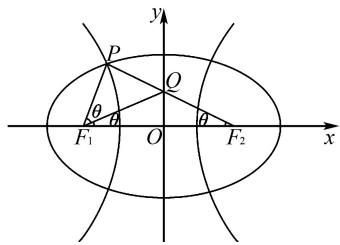

# 一道双曲线离心率问题的解法探究

李春明

(甘肃省天水市麦积区吴砦初级中学, 甘肃 天水 741035)

摘 要:文章从探究一道双曲线离心率问题的解法入手,从6个不同的角度进行深入探究,寻求不同的思路与解法,反思解题过程,对比研究各方法的优劣,挖掘各解法之间的内在联系,总结双曲线离心率问题的一般求解思路和方法,指导数学教学与解题研究.

关键词: 双曲线; 离心率; 解法

中图分类号：G632

文献标识码:A

文章编号:1008-0333(2025)16-0018-03

双曲线的离心率问题,一直是历年高考数学试卷中的一个重点与难点,题目背景新颖,形式变化多样,往往需要从不同思维视角切入,结合不同的技巧与方法来分析与解决.下面结合一道高考模拟题中双曲线离心率的求解,通过多角度思考,合理进行逻辑推理与数学运算,探究不同解法,并反思解题过程.

# 1 试题呈现

试题 已知椭圆 $C_1: \frac{x^2}{4} + \frac{y^2}{3} = 1$ 和双曲线 $C_2: \frac{x^2}{a^2} - \frac{y^2}{b^2} = 1$ 有公共焦点 $F_1, F_2$ , 它们在第二象限的公共点为点 $P$ , 点 $P$ 与右焦点 $F_2$ 的连线交 $y$ 轴于点 $Q$ , 且 $QF_1$ 平分 $\angle PF_1F_2$ , 则双曲线 $C_2$ 的离心率为 \_\_\_\_.

# 2 解法探究

解法 1 如图 1 所示，由题意可知， $F_{1}F_{2}=2$ ，

$$
P F _ {1} = r _ {1}, P F _ {2} = r _ {2}, \angle P F _ {1} Q = \angle Q F _ {1} F _ {2} = \angle P F _ {2} F _ {1} = \theta .
$$

text_image

y
P
Q
θ
θ
F₁ O F₂ x
θ

图 1 解法 1 示意图

所以 $\left\{\begin{aligned}r_{1}+r_{2}&=4,\\ r_{2}-r_{1}&=2a,\end{aligned}\right.$ 解得 $\left\{\begin{aligned}r_{1}&=2-a,\\ r_{2}&=2+a.\end{aligned}\right.$

在 $\triangle PF_{1}F_{2}$ 中，由正弦定理可知

$$
\frac {P F _ {1}}{\sin \angle P F _ {2} F _ {1}} = \frac {P F _ {2}}{\sin \angle P F _ {1} F _ {2}}.
$$

所以 $\frac{r_{1}}{\sin\theta}=\frac{r_{2}}{\sin2\theta}.$

所以 $\cos\theta=\frac{r_{2}}{2r_{1}}=\frac{2+a}{4-2a}.$

在 $\triangle PF_{1}F_{2}$ 中,由余弦定理可知

$$
r _ {2} ^ {2} + (2 c) ^ {2} - r _ {1} ^ {2} = 2 r _ {2} \cdot (2 c) \cdot \cos \theta .
$$

收稿日期:2025-03-05

作者简介: 李春明, 本科, 一级教师, 从事中学数学教学研究

基金项目:2023年甘肃省教育科学“十四五”规划课题“基于微专题思路的解析几何复习策略研究”(项目编号:GS[2023]GHB1025).

即 $a(5a-2)=0.$

解得 $a=\frac{2}{5}$ .

所以双曲线 $C_{2}$ 的离心率 $e=\frac{c}{a}=\frac{5}{2}$ .

点评 由双曲线、椭圆的定义得出 $\left\{\begin{aligned}r_{2}&=2+a,\\ r_{1}&=2-a,\end{aligned}\right.$ 再由正弦定理得出 $\cos\theta$ ，余弦定理得出 $a=\frac{2}{5}$ ，进而得出离心率.

解法2 由已知，记 $\angle PF_{2}F_{1} = \theta$ ，则 $|QF_{1}| = |QF_{2}|, \angle QF_{2}F_{1} = \angle QF_{1}F_{2} = \angle PF_{1}Q = \theta.$

椭圆的离心率

$$
\begin{array}{l} e = \frac {\left| F _ {1} F _ {2} \right|}{\left| P F _ {1} \right| + \left| P F _ {2} \right|} = \frac {\sin (\pi - 3 \theta)}{\sin \theta + \sin 2 \theta} = \frac {\sin (\theta + 2 \theta)}{\sin \theta + \sin 2 \theta} \\ = \frac {(2 \cos^ {2} \theta + \cos 2 \theta) \sin \theta}{(2 \cos \theta + 1) \sin \theta} = \frac {4 \cos^ {2} \theta - 1}{2 \cos \theta + 1} \\ = 2 \cos \theta - 1 = \frac {1}{2}, \\ \end{array}
$$

解得 $\cos\theta=\frac{3}{4}$ .

双曲线的离心率

$$
\begin{array}{l} e = \frac {\left| F _ {1} F _ {2} \right|}{\left| P F _ {2} \right| - \left| P F _ {1} \right|} = \frac {\sin (\pi - 3 \theta)}{\sin 2 \theta - \sin \theta} \\ = \frac {\sin 3 \theta}{\sin 2 \theta - \sin \theta} = \frac {\sin 2 \theta + \sin \theta}{2 (\sin 2 \theta - \sin \theta)} \\ = \frac {2 \sin \theta (2 \cos \theta + 1)}{2 \sin \theta (2 \cos \theta - 1)} = \frac {5}{2}. \\ \end{array}
$$

点评 在 $\triangle PF_{1}F_{2}$ 中, 利用正弦定理的边化角公式, 并结合离心率公式得出 $\cos\theta$ , 进而再由正弦定理的边化角公式结合离心率公式求出双曲线的离心率.

解法3 由已知，记 $\angle PF_{2}F_{1} = \theta$ ，则 $|QF_{1}| = |QF_{2}|, \angle QF_{2}F_{1} = \angle QF_{1}F_{2} = \angle PF_{1}Q = \theta.$

由 $\triangle PF_{1}Q\sim \triangle PF_{2}F_{1}$ ，得

$$
\frac {\left| Q F _ {1} \right|}{\left| F _ {1} F _ {2} \right|} = \frac {| P Q |}{\left| P F _ {1} \right|} = \frac {\left| P F _ {1} \right|}{\left| P F _ {2} \right|}.
$$

$$
\begin{array}{l} = \frac {\left| P Q \right| + \left| Q F _ {2} \right|}{\left| P F _ {1} \right| + \left| F _ {1} F _ {2} \right|} \\ = \frac {\left| P F _ {2} \right|}{\left| P F _ {1} \right| + \left| F _ {1} F _ {2} \right|} = \frac {\left| P F _ {1} \right|}{\left| P F _ {2} \right|}. \\ \end{array}
$$

则 $\frac{|QF_2|}{|F_1F_2|} = \frac{|PQ|}{|PF_1|}$

所以 $\left|PF_{2}\right|^{2}=\left|PF_{1}\right|\left(\left|PF_{1}\right|+\left|FF_{2}\right|\right)$ ,

$$
\left(4 - \left| P F _ {1} \right|\right) ^ {2} = \left| P F _ {1} \right| ^ {2} + 2 \left| P F _ {1} \right|.
$$

所以 $\left|PF_{1}\right|=\frac{8}{5}$ ,

$$
\left| P F _ {2} \right| - \left| P F _ {1} \right| = 4 - 2 \left| P F _ {1} \right| = \frac {4}{5}.
$$

双曲线的离心率 $e = \frac{|F_1F_2|}{|PF_2| - |PF_1|} = \frac{5}{2}$ .

点评 由 $\triangle PF_{1}Q\sim \triangle PF_{2}F_{1}$ ，根据相似性质构建方程组，求解得出 $|PF_1|, |PF_2|$ ，再由离心率公式求解即可.

解法 4 由已知, 设 $\left|PF_{1}\right|=x,\left|QF_{1}\right|=t$ , 则 $\left|PF_{2}\right|=4-x,\left|QF_{2}\right|=t.$

由三角形的内角平分线定理得

$$
\frac {\left| P F _ {1} \right|}{\left| F _ {1} F _ {2} \right|} = \frac {| P Q |}{\left| Q F _ {2} \right|}.
$$

即 $xt = 8 - 2x - 2t.$ ①

由已知易知 $\triangle PF_{1}Q\sim \triangle PF_{2}F_{1}$ ，则

$$
\frac {\left| P F _ {1} \right|}{\left| P F _ {2} \right|} = \frac {\left| Q F _ {1} \right|}{\left| F _ {1} F _ {2} \right|}.
$$

则 2x = 4t - xt. ②

由①②, 得 $2x = 4t - (8 - 2x - 2t)$ .

解得 $t=\frac{4}{3}, x=\frac{8}{5}$ ,

所以双曲线的离心率

$$
e = \frac {\left| F _ {1} F _ {2} \right|}{\left| P F _ {2} \right| - \left| P F _ {1} \right|} = \frac {2}{4 / 5} = \frac {5}{2}.
$$

点评 利用三角形的内角平分线定理得出 xt = 8 - 2x - 2t，由相似性质得出 2x = 4t - xt，联立方程解出 $t = \frac{4}{3}$ , $x = \frac{8}{5}$ ，最后由离心率公式求解.

解法 5 依题意, 设点 $P(x_{0}, y_{0})$ , 其中 $x_{0} < 0$ ,

$y_0 > 0$ ，则由三角形内角平分线定理，得 $\frac{|PF_1|}{|F_1F_2|} = \frac{|PQ|}{|QF_2|}$ 即 $\frac{2 + x_0 / 2}{2} = \frac{\sqrt{1 + k^2} \cdot (0 - x_0)}{\sqrt{1 + k^2} \cdot (1 - 0)}$ （其中 $k$ 是直线 $PF_2$ 的斜率），即 $2 + \frac{1}{2} x_0 = -2x_0$ ，解得 $x_0 = -\frac{4}{5}$

又由椭圆与双曲线的焦半径公式, 得 $\left|PF_{1}\right| = 2 + \frac{1}{2}x_{0} = 2 + \frac{1}{2} \times \left(-\frac{4}{5}\right) = -a - e \times \left(-\frac{4}{5}\right) = -\frac{1}{e} + \frac{4}{5}e$ , 其中 e 为双曲线的离心率, 由此解得 $e = \frac{5}{2}$ .

点评 利用三角形的内角平分线定理结合距离公式得出 $x_{0} = -\frac{4}{5}$ ，进而由椭圆和双曲线的焦半径公式建立方程得出双曲线离心率.

解法 6 如图 1 所示, 当 $PF_{1}$ 垂直于 x 轴时, 不符合题意. 所以 $PF_{1}$ 不垂直于 x 轴.

因为 $|F_{1}F_{2}|=2$ ，所以 $F_{1}(-1,0)$ ， $F_{2}(1,0)$ .

令 $P(x,y)$ ，所以 $k_{PF_2} = \frac{y}{x - 1} = -\tan \theta ,k_{PF_1}$ $= \frac{y}{x + 1} = \tan 2\theta .$

因为 $\tan 2\theta = \frac{2\tan\theta}{1 - \tan^2\theta},$

所以 $\frac{y}{x + 1} = \frac{-2y(x - 1)}{(x - 1)^2 - y^2}.$

又 $3x^{2}+4y^{2}=12$ ，整理，得 $15x^{2}-8x-16=0$ 。

所以 $-x = -\frac{4}{5}$ 或 $x = \frac{4}{3}$ (舍).

所以 $x_{p} = -\frac{4}{5}$ . 所以 $P(-\frac{4}{5}, \frac{3\sqrt{7}}{5})$ .

把 $P(-\frac{4}{5}, \frac{3\sqrt{7}}{5})$ 代入椭圆 $C_1: \frac{x^2}{4} + \frac{y^2}{3} = 1$ ，得 $\frac{16}{25a^2} - \frac{63}{25b^2} = 1$ .

又 $a^2 + b^2 = 1$ ，所以 $a^2 = \frac{4}{25}, b^2 = \frac{21}{25}, c^2 = 1$ .

所以 $e^{2}=\frac{c^{2}}{a^{2}}=\frac{25}{4}$ . 所以 $e=\frac{5}{2}$ .

点评 令 $P(x, y)$ , 由斜率公式结合二倍角公式得出 $\frac{y}{x + 1} = \frac{-2y(x - 1)}{(x - 1)^2 - y^2}$ , 再由 $3x^2 + 4y^2 = 12$ 求出点 $P$ 坐标, 代入双曲线方程求出 $a, b$ , 进而得出离心率.

# 3 结束语

离心率是双曲线的重要几何性质,是描述双曲线形状的重要参数. 双曲线的离心率的求法是历年高考、竞赛中比较常见的一类问题,涉及解析几何、平面几何、代数等多个知识点,综合性强,方法灵活. 双曲线的离心率问题,往往对学生的数学运算和逻辑推理能力要求较高,对大多数学生来说是一个很大的挑战,也是形成数学能力的一个分化点与机遇 $^{[1]}$ . 在解题过程中,要依据试题的实际情况,适当设置参数或点的坐标,借助坐标关系构建离心率的方程或不等式,或者从平面几何知识入手,寻找图形中的平行、垂直关系以及三角形的相似等,然后转化为离心率的方程或不等式问题 $^{[2]}$ . 总之,求解双曲线的离心率的值或取值范围的关键是建立恰当的等量或不等量关系,以过渡到含有离心率 e 的等式或不等式使问题获解. 离心率问题可以从利用几何性质和坐标运算两条研究路径入手,立足平面几何,强化数形结合,教学时可以通过一题多解发散思维,同时强调方法的选择,引导学生多思少算,建立先几何再代数的想法,通过对试题深入观察、比较、联想、分析等,进而找到简洁的解法.

# 参考文献：

[1] 王勇, 张华丽. 在新情境中探究双曲线的离心率 [J]. 数理天地(高中版), 2023(07): 21-23.

[2] 刘玉. 一道圆锥曲线题目的变式探究 [J]. 数理化解题研究, 2024(19): 54-56.

[责任编辑:李慧娇]