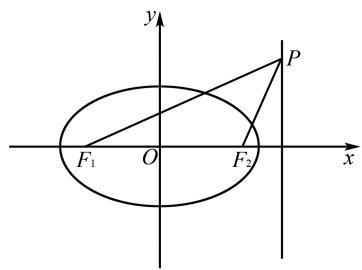
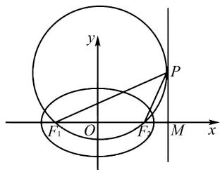

# 一道高三椭圆试题的解法与推广

# 张艳萍

(江苏省靖江高级中学, 江苏 靖江 214500)

摘 要:2024年2月福建百校联考高三正月开学考第8题是一道椭圆中角度最值的典型考题.经研究,该考题看似平朴,但实质上蕴含着丰富的数学思想方法,是一道反映解析几何本质的优质试题.

关键词: 椭圆; 角度最值; 解法探究

中图分类号：G632 文献标识码：A文章编号:1008-0333(2025)16-0064-04

解答圆锥曲线中角度最值考题的核心思路,在于巧妙利用三角函数的单调性,通过建立合理的关系式,反求角的取值范围.基于这一关键认识,我们将从代数运算、几何性质、向量工具等多个视角深入探究考题的解法,并进一步归纳总结,将结论推广到一般情形,挖掘问题本质规律.

# 1 考题呈现

题目 已知椭圆 $C: \frac{x^{2}}{a^{2}} + \frac{y^{2}}{b^{2}} = 1 (a > b > 0)$ 的左、右焦点分别为 $F_{1}, F_{2}$ ，椭圆的长轴长为 $2\sqrt{2}$ ，短轴长为 2, P 为直线 x = 2b 上的任意一点，则 $\angle F_{1}PF_{2}$ 的最大值为（）.

A. $\frac{\pi}{2}$

B. $\frac{\pi}{4}$

C. $\frac{\pi}{3}$

D. $\frac{\pi}{6}$

# 2 试题解答

分析 1 根据题意求出 a, b, c 的值, 设直线 x=2b 与 x 轴的交点 M, 并设 $\left|PM\right|=t$ , 利用直角三角形的边角关系将 $\angle PF_{1}M$ 和 $\angle PF_{2}M$ 的正切值分别表示为 t 的式子, 然后利用三角形外角定理, 把 $\angle F_{1}PF_{2}$ 表示为两个角的差角, 再运用差角的正切公式把 $\tan\angle F_{1}PF_{2}$ 表示为 t 的关系, 结合基本不等式并利用正切函数的单调性求解.

解法 1 根据题意可知 $2a = 2\sqrt{2}, 2b = 2$ .

所以 $a=\sqrt{2}$ , b=1, $c=\sqrt{a^{2}-b^{2}}=1$ .

设直线 x=2 与 x 轴的交点为 M，设 $\left|PM\right|=t(t>0)$ ，则有 $\tan\angle PF_{1}M=\frac{\left|PM\right|}{\left|F_{1}M\right|}=\frac{t}{3}$ ，

$$
\tan \angle P F _ {2} M = \frac {| P M |}{| F _ {2} M |} = t.
$$

所以 $\tan \angle F_{1}PF_{2} = \tan (\angle PF_{2}M - \angle PF_{1}M)$

$$
= \frac {\tan \angle P F _ {2} M - \tan \angle P F _ {1} M}{1 + \tan \angle P F _ {1} M \cdot \tan \angle P F _ {2} M}
$$

$$
= \frac {t - t / 3}{1 + t \cdot (t / 3)}
$$

收稿日期:2025-03-05

作者简介: 张艳萍, 硕士, 一级教师, 从事高中数学教学研究.

$$
\begin{array}{l} = \frac {2 t}{t ^ {2} + 3} \\ = \frac {2}{t + 3 / t} \\ \leqslant \frac {2}{2 \sqrt {t \cdot (3 / t)}} \\ = \frac {1}{\sqrt {3}} = \frac {\sqrt {3}}{3}, \\ \end{array}
$$

当且仅当 $t=\sqrt{3}$ 时取等号.

因为 $\angle F_{1}PF_{2}\in (0,\frac{\pi}{2})$

所以 $\tan\angle F_{1}PF_{2}$ 单调递增.

所以 $\angle F_{1}PF_{2}\leqslant \frac{\pi}{6}.$

可得 $\angle F_{1}PF_{2}$ 的最大值为 $\frac{\pi}{6}$ .

故选 D.

分析 2 设出点 P 的坐标,用其分别表示 $PF_{1}$ 与 $PF_{2}$ 的斜率,利用到角的正切公式,并用点 P 的坐标表示 $\tan\angle F_{1}PF_{2}$ ,再结合基本不等式求出正切值的取值范围,最后利用正切函数的单调性求解角度的最值.

解法 2 由解法 1 可得椭圆 $C: \frac{x^{2}}{2} + y^{2} = 1$ , $F_{1}(-1,0)$ , $F_{2}(1,0)$ , 点 P 为直线 x=2 上一点.

text_image

y
P
F₁ O F₂ x

图 1 解法 2 示意图

如图 1, 设 $P(2, y_{0})$ , 不妨设 $y_{0} > 0$ , 则

$$
k _ {P F _ {1}} = \frac {- y _ {0}}{- 1 - 2} = \frac {y _ {0}}{3}, k _ {P F _ {2}} = \frac {- y _ {0}}{1 - 2} = y _ {0}.
$$

所以 $\tan\angle F_{1}PF_{2}=\frac{k_{PF_{2}}-k_{PF_{1}}}{1+k_{PF_{1}}\cdot k_{PF_{2}}}$

$$
\begin{array}{l} = \frac {y _ {0} - y _ {0} / 3}{1 + \left(y _ {0} / 3\right) \cdot y _ {0}} \\ = \frac {2 y _ {0} / 3}{1 + y _ {0} ^ {2} / 3} \\ = \frac {2 y _ {0}}{y _ {0} ^ {2} + 3} \\ = \frac {2}{y _ {0} + 3 / y _ {0}} \\ \leqslant \frac {2}{2 \sqrt {y _ {0} \cdot (3 / y _ {0})}} \\ = \frac {1}{\sqrt {3}} = \frac {\sqrt {3}}{3}. \\ \end{array}
$$

结合椭圆的对称性可知当且仅当 $y_{0} = \pm \sqrt{3}$ 时取等号.

因为 $\angle F_{1}PF_{2}\in (0,\frac{\pi}{2})$

所以 $\tan\angle F_{1}PF_{2}$ 单调递增.

所以 $\angle F_{1}PF_{2}\leqslant \frac{\pi}{6}.$

可得 $\angle F_{1}PF_{2}$ 的最大值为 $\frac{\pi}{6}$ .

故选 D.

分析 3 设出点 P 的坐标, 然后构造向量, 再利用向量夹角公式将 $\cos \angle F_{1}PF_{2}$ 用点 P 的坐标表示出来, 通过合理变形后换元、配凑并运用基本不等式求出余弦值的取值范围, 最后利用余弦函数的单调性求解角度的最值.

解法 3 由解法 1 可得椭圆 $C: \frac{x^{2}}{2} + y^{2} = 1$ , $F_{1}(-1,0)$ , $F_{2}(1,0)$ , 点 P 为直线 x=2 上一点.

设 $P(2, y_0)$ , 则

$$
\overrightarrow {P F _ {1}} = (- 3, - y _ {0}), \overrightarrow {P F _ {2}} = (- 1, - y _ {0}).
$$

因此 $\cos \angle F_{1}PF_{2} = \frac{\overrightarrow{PF_{1}}\cdot\overrightarrow{PF_{2}}}{|\overrightarrow{PF_{1}}||\overrightarrow{PF_{2}} |}$

$$
= \frac {(- 3) \times (- 1) + (- y _ {0}) \times (- y _ {0})}{\sqrt {(- 3) ^ {2} + (- y _ {0}) ^ {2}} \cdot \sqrt {(- 1) ^ {2} + (- y _ {0}) ^ {2}}}
$$

$$
= \frac {3 + y _ {0} ^ {2}}{\sqrt {\left(9 + y _ {0} ^ {2}\right) \left(1 + y _ {0} ^ {2}\right)}}.
$$

令 $3 + y_0^2 = t(t \geqslant 3)$ , 则

$$
9 + y _ {0} ^ {2} = 6 + t,
$$

$$
1 + y _ {0} ^ {2} = - 2 + t.
$$

则 $\cos \angle F_{1}PF_{2} = \frac{t}{\sqrt{(6 + t)(-2 + t)}}\cdot \frac{\sqrt{3}t}{\sqrt{(6 + t)(-6 + 3t)}}$

$$
\geqslant \frac {\sqrt {3} t}{[ (6 + t) + (- 6 + 3 t) ] / 2}
$$

$$
= \frac {\sqrt {3} t}{2 t}
$$

$$
= \frac {\sqrt {3}}{2},
$$

当且仅当 $6 + t = -6 + 3t$ ，即 $t = 6$ ，结合椭圆的对称性可知当且仅当 $y_{0} = \pm \sqrt{3}$ 时取等号.

因为 $\angle F_{1}PF_{2}\in (0,\frac{\pi}{2})$

所以 $\cos\angle F_{1}PF_{2}$ 单调递减.

所以 $\angle F_{1}PF_{2}\leqslant \frac{\pi}{6}.$

可得 $\angle F_{1}PF_{2}$ 的最大值为 $\frac{\pi}{6}$ .

故选 D.

分析 4 设出点 P 的坐标, 然后构造向量, 利用向量夹角公式将 $\cos\angle F_{1}PF_{2}$ 用点 P 的坐标表示出来, 通过合理变形后换元、配凑并运用二次函数知识求出余弦值的取值范围, 最后利用余弦函数的单调性求解角度的最值.

解法4 由解法3可得

$$
\begin{array}{l} \cos \angle F _ {1} P F _ {2} = \frac {t}{\sqrt {(6 + t) (- 2 + t)}} \\ = \frac {t}{\sqrt {t ^ {2} + 4 t - 1 2}} \\ = \frac {1}{\sqrt {- 1 2 / t ^ {2} + 4 / t + 1}} \\ = \frac {1}{\sqrt {- 1 2 (1 / t - 1 / 6) ^ {2} + 4 / 3}} \\ \end{array}
$$

$$
\geqslant \frac {1}{\sqrt {4 / 3}} = \frac {\sqrt {3}}{2},
$$

当且仅当 $\frac{1}{t}=\frac{1}{6}$ ，即t=6，结合椭圆的对称性可知当且仅当 $y_{0}=\pm\sqrt{3}$ 时取等号。下同解法3。

分析 5 本题是求解最大角问题,这里挖掘试题中隐含的米勒定理模型,运用米勒定理及平面几何知识求解,则思路简洁,使考题获得快速求解 $^{[1]}$ .

米勒定理 已知 A, B 是 $\angle MON$ 的边 ON 上的两定点, C 是边 OM 上的一动点, 则当且仅当 $\triangle ABC$ 的外接圆与边 OM 相切于点 C 时, $\angle ACB$ 最大.

解法 5 由解法 1 可得椭圆 $C: \frac{x^{2}}{2} + y^{2} = 1$ , $F_{1}(-1,0), F_{2}(1,0)$ ，点 P 为直线 x=2 上一点.

如图2,设直线x=2与x轴的交点M,由米勒定理可知,当点P为过 $F_{1},F_{2}$ 的圆与直线x=2相切时的切点时, $\angle F_{1}PF_{2}$ 最大,此时根据圆的切割线定理可知 $|MP|^{2}=|MF_{1}|\cdot|MF_{2}|$ .

text_image

y
P
F₁ O F₂ M x

图 2 解法 5 示意图

因为 $\left|MF_{1}\right|=2-(-1)=3$ ,

$$
\left| M F _ {2} \right| = 2 - 1 = 1,
$$

所以 $|MP|^{2}=3\times1=3.$

即 $|MP|=\sqrt{3}$ .

所以在 Rt△F₁MP 中，

$$
\tan \angle F _ {1} P M = \frac {\left| M F _ {1} \right|}{\left| M P \right|} = \frac {3}{\sqrt {3}} = \sqrt {3},
$$

所以 $\angle F_{1}PM = \frac{\pi}{3}.$

在 Rt△F₂MP 中，

$$
\tan \angle F _ {2} P M = \frac {\left| M F _ {2} \right|}{\left| M P \right|} = \frac {1}{\sqrt {3}} = \frac {\sqrt {3}}{3},
$$

所以 $\angle F_{2}PM = \frac{\pi}{6}$

所以 $\angle F_{1}PF_{2} = \angle F_{1}PM - \angle F_{2}PM = \frac{\pi}{3} -\frac{\pi}{6} = \frac{\pi}{6}.$

由此 $\angle F_{1}PF_{2}$ 的最大值为 $\frac{\pi}{6}$ .

故选 D.

# 3 推广探究

把上述考题的结论推广到一般椭圆情形，可有：

结论 1 已知椭圆 $C: \frac{x^{2}}{a^{2}} + \frac{y^{2}}{b^{2}} = 1 (a > b > 0)$ 的左、右焦点分别为 $F_{1}, F_{2}, P$ 为直线 $x = m (m > a)$ 上的任意一点，则 $\tan \angle F_{1}PF_{2}$ 的最大值为 $\frac{c}{\sqrt{m^{2} - c^{2}}}$ .

证明过程可按上述考题解法 5 的思路, 利用米勒定理来证明.

证明 设 $F_{1}(-c,0)$ , $F_{2}(c,0)$ , $c=\sqrt{a^{2}-b^{2}}$ ，如图2，设直线 $x=m(m>a)$ 与 x 轴的交点 M，由米勒定理可知，当点 P 为过 $F_{1}$ , $F_{2}$ 的圆与直线 x=m 相切时的切点时， $\angle F_{1}PF_{2}$ 最大，此时根据圆的切割线定理可知 $\left|MP\right|^{2}=\left|MF_{1}\right|\cdot\left|MF_{2}\right|$ .

因为 $\left|MF_{1}\right|=m-(-c)=m+c,$

$$
\left| M F _ {2} \right| = m - c,
$$

所以 $|MP|^{2}=(m+c)(m-c)=m^{2}-c^{2}$ .

即 $|MP| = \sqrt{m^2 - c^2}$ .

在 Rt△F₁MP 中，

$$
\tan \angle F _ {1} P M = \frac {\left| M F _ {1} \right|}{\left| M P \right|} = \frac {m + c}{\sqrt {m ^ {2} - c ^ {2}}},
$$

在 Rt△F₂MP 中，

$$
\tan \angle F _ {2} P M = \frac {\left| M F _ {2} \right|}{\left| M P \right|} = \frac {m - c}{\sqrt {m ^ {2} - c ^ {2}}},
$$

所以 $\tan \angle F_{1}PF_{2} = \tan (\angle F_{1}PM - \angle F_{2}PM)$

$$
\begin{array}{l} = \frac {\tan \angle F _ {1} P M - \tan \angle F _ {2} P M}{1 + \tan \angle F _ {1} P M \cdot \tan \angle F _ {2} P M} \\ = \frac {(m + c) / \sqrt {m ^ {2} - c ^ {2}} - (m - c) / \sqrt {m ^ {2} - c ^ {2}}}{1 + (m + c) / \sqrt {m ^ {2} - c ^ {2}} \cdot (m - c) / \sqrt {m ^ {2} - c ^ {2}}} \\ = \frac {2 c / \sqrt {m ^ {2} - c ^ {2}}}{1 + (m ^ {2} - c ^ {2}) / (m ^ {2} - c ^ {2})} \\ = \frac {c}{\sqrt {m ^ {2} - c ^ {2}}}. \\ \end{array}
$$

根据椭圆的对称性,同样有:

结论2 已知椭圆 $C: \frac{x^2}{a^2} + \frac{y^2}{b^2} = 1 (a > b > 0)$ 的左、右焦点分别为 $F_1, F_2, P$ 为直线 $x = m (m < -a)$ 上的任意一点，则 $\tan \angle F_1PF_2$ 的最大值为 $\frac{c}{\sqrt{m^2 - c^2}}$ .

结论 2 的证明可仿照结论 1 的证明进行, 这里从略.

# 4 结束语

做题贵在少而精. 许多经典数学试题蕴含丰富的数学思想、方法与规律, 值得深入研究与发掘. 因此, 在日常解题教学中, 教师要引导学生从多个视角分析思考、展开联想, 让学生的数学思维保持灵动. 通过这样的训练, 学生能够感悟解题本质, 尝试不同路径解决问题. 长此以往, 不仅能培养学生灵活的思维品质, 激发其探索精神与创新意识, 还能切实提升数学学科能力与素养 $^{[2]}$ .

# 参考文献：

[1] 刘恒. 以米勒定理为背景的数学试题解析 [J]. 中学生理科应试, 2024(08): 19-20.  
[2] 朱彬, 胡晓静. 对一道椭圆联考题的解法与延伸 [J]. 中学数学研究, 2023(07): 56-58.

[责任编辑:李慧娇]