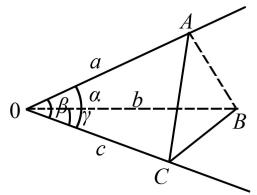
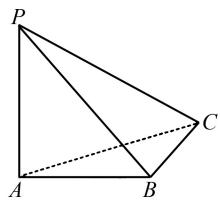
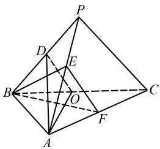

# 三面角余弦定理巧解立体几何

曹钰婷

(新疆师范大学数学科学学院, 新疆维吾尔自治区 乌鲁木齐 830013)

摘 要:立体几何问题是高考数学中的高频考点和难点,常常让学生感到棘手,尤其是在求解二面角问题时,许多学生更是倍感困惑.通过引入三面角余弦定理,一些立体几何中的二面角问题可以更加便捷地求解,为学生提供了一种新的解题思路.

关键词: 立体几何; 三面角余弦定理; 二面角

中图分类号：G632

文献标识码：A

文章编号:1008-0333(2025)16-0042-03

高考中的立体几何问题不仅着重考查学生的空间想象能力,还对其逻辑推理与数学运算能力提出较高要求.而二面角问题作为考查这三种能力的典型题型,常常让学生感到无从下手.本文引入三面角余弦定理,将其作为连接空间几何与三角函数的桥梁,通过揭示三个平面相交形成的面角之间的关系,实现二面角求解过程的化繁为简.

# 1 三面角余弦定理及推论

三面角余弦定理最早于20世纪80年代出现,当时被称为“三面角公式”[1].到了20世纪90年代初之后,该公式多被称作“三面角余弦定理”[2],其具体内容为:在三面角中,任意一个面角的余弦值,等于其余两个面角余弦值的乘积,加上这两个面角的正弦值与它们所夹二面角余弦值的连乘积.

为了凸显二面角与三面角的关系,这里给出其变体:

三面角 O-ABC 的三个面角 $\angle AOB = \alpha, \angle AOC = \beta, \angle BOC = \gamma$ ，设二面角 A-OC-B 的大小为 $\theta$ ，则 $\cos\theta = \frac{\cos\alpha - \cos\beta\cos\gamma}{\sin\beta\sin\gamma}$ .

证明 如图 1 所示, 设 OA = a, OB = b, OC = c, 作 $AC \perp OC$ , $BC \perp OC$ , 连接 AB.

text_image

0
a
b
c
F
α
γ
A
B
C

图 1 三面角余弦定理证明示意图

在 Rt $\triangle AOC$ 中, $\sin\beta = \frac{AC}{a}$ , 知 AC = a sin $\beta$ , 由 $\cos\beta=\frac{c}{a}$ ，知 $c=a\cos\beta, a=\frac{c}{\cos\beta}.$

在 Rt△BOC 中, 由 $\sin\gamma=\frac{BC}{b}$ , 知 $BC=b\sin\gamma$ , 由 $\cos\gamma=\frac{c}{b}$ , 知 $c=b\cos\gamma, b=\frac{c}{\cos\gamma}$ .

在 $\triangle AOB$ 中, $AB^{2}=a^{2}+b^{2}-2ab\cdot\cos\alpha,$

在 $\triangle ABC$ 中, $AB^{2}=AC^{2}+BC^{2}-2AC\cdot BC\cdot\cos\theta,$

则 $a^2 + b^2 - 2ab \cdot \cos \alpha = AC^2 + BC^2 - 2AC \cdot BC \cdot \cos \theta$ .

则 $a^2 + b^2 - 2ab \cdot \cos \alpha = (a\sin \beta)^2 + (b\sin \gamma)^2 - 2a\sin \beta \cdot b\sin \gamma \cdot \cos \theta.$

则 $a^2 + b^2 - 2ab \cdot \cos \alpha = a^2 \sin^2 \beta + b^2 \sin^2 \gamma - 2a \sin \beta \cdot b \sin \gamma \cdot \cos \theta$ .

则 $a^2 - a^2 \sin^2 \beta + b^2 - b^2 \sin^2 \gamma = 2ab \cdot \cos \alpha - 2a \sin \beta \cdot b \sin \gamma \cdot \cos \theta.$

则 $a^2\cos^2\beta + b^2\cos^2\gamma = 2ab(\cos \alpha - \sin \beta \cdot \sin \gamma \cdot \cos \theta)$ .

则 $c^2 + c^2 = 2 \cdot \frac{c}{\cos \beta} \frac{c}{\cos \gamma} (\cos \alpha - \sin \beta \cdot \sin \gamma \cdot \cos \theta)$ .

则 $2c^{2} = \frac{2c^{2}}{\cos\beta\cos\gamma} (\cos \alpha -\sin \beta \cdot \sin \gamma \cdot \cos \theta)$

则 $\cos \beta \cos \gamma = \cos \alpha -\sin \beta \cdot \sin \gamma \cdot \cos \theta .$

所以 $\cos\theta=\frac{\cos\alpha-\cos\beta\cos\gamma}{\sin\beta\cdot\sin\gamma}.$

推论 三面角 O-ABC 的三个面角 $\angle AOB = \alpha$ , $\angle AOC = \beta$ , $\angle BOC = \gamma$ , 若二面角 A-OC-B 的大小为 $\theta = 90^{\circ}$ , 则 $\cos\alpha = \cos\beta \cdot \cos\gamma$ .

证明 在三面角 $O - ABC$ 中，

$$
\cos \theta = \frac {\cos \alpha - \cos \beta \cos \gamma}{\sin \beta \cdot \sin \gamma}.
$$

又因为 $\theta = 90^{\circ}$

所以 $\frac{\cos\alpha - \cos\beta\cos\gamma}{\sin\beta \cdot \sin\gamma} = 0.$

故 $\cos\alpha=\cos\beta\cdot\cos\gamma.$

在运用三面角余弦定理解题时,有两个关键要点需重点关注.其一,需准确理解角 $\alpha$ 的定义,它是三面角中与二面角公共棱所在平面均不重合的第三个面所对应的面角;其二,在确定公共棱端点时,需选择便于计算三面角各角值的端点,虽然以公共棱的两个端点分别作为顶点进行计算,最终结果相同,但合理选择端点能够显著简化运算过程.

# 2 应用举例

接下来,我们将运用三面角余弦定理对两道高考立体几何真题进行求解,旨在拓宽学生的解题思路,同时让学生切实感受该定理在解决立体几何问题中的优越性.

例 1 如图 2 所示, 在三棱锥 P-ABC 中, $PA \perp$ 平面 ABC, $PA = AB = BC = 1$ , $PC = \sqrt{3}$ .

text_image

P
A
B
C

图2 例1图

求二面角 A - PC - B 的大小.

解析 设二面角 A - PC - B 的平面角大小为 $\theta$ ，则

$$
\cos \theta = \frac {\cos \angle A C B - \cos \angle A C P \cos \angle B C P}{\sin \angle A C P \sin \angle B C P}. \tag {①}
$$

由 $PA \perp$ 平面 ABC 可知 $PA \perp AC, PA \perp AB.$

在 Rt△PAC 中, PA = 1, PC = $\sqrt{3}$ , 得

$$
A C = \sqrt {P C ^ {2} - P A ^ {2}} = \sqrt {(\sqrt {3}) ^ {2} - 1 ^ {2}} = \sqrt {2}.
$$

在 Rt△PAB 中, PA = 1, AB = 1, 得

$$
P B = \sqrt {1 ^ {2} + 1 ^ {2}} = \sqrt {2}.
$$

$$
\cos \angle A C B = \frac {A C ^ {2} + B C ^ {2} - A B ^ {2}}{2 A C \cdot B C}
$$

$$
= \frac {(\sqrt {2}) ^ {2} + 1 ^ {2} - 1 ^ {2}}{2 \sqrt {2}}
$$

$$
= \frac {\sqrt {2}}{2},
$$

$$
\cos \angle A C P = \frac {A C ^ {2} + P C ^ {2} - A P ^ {2}}{2 A C \cdot P C}
$$

$$
= \frac {(\sqrt {2}) ^ {2} + (\sqrt {3}) ^ {2} - 1 ^ {2}}{2 \sqrt {2} \cdot \sqrt {3}}
$$

$$
= \frac {\sqrt {6}}{3}    , \text {则}   \sin \angle A C P = \frac {\sqrt {3}}{3}.
$$

$$
\cos \angle B C P = \frac {B C ^ {2} + P C ^ {2} - P B ^ {2}}{2 B C \cdot P C}
$$

$$
= \frac {1 ^ {2} + (\sqrt {3}) ^ {2} - (\sqrt {2}) ^ {2}}{2 \sqrt {3}} = \frac {\sqrt {3}}{3},
$$

则 $\sin\angle BCP=\frac{\sqrt{6}}{3}.$

将以上结果代入①,得

$$
\cos \theta = \frac {\sqrt {2} / 2 - (\sqrt {6} / 3) \times (\sqrt {3} / 3)}{(\sqrt {3}) / 3 \times (\sqrt {6} / 3)} = \frac {1}{2}.
$$

则 $\theta=\frac{\pi}{3}.$

例 2 如图 3 所示, 在三棱锥 P-ABC 中, $AB \perp BC$ , AB = 2, $BC = 2\sqrt{2}$ , $PB = PC = \sqrt{6}$ , BP, AP, BC 的中点分别为 D, E, O, $AD = \sqrt{5}DO$ , 点 F 在 AC 上, $BF \perp AO$ . 求二面角 D-AO-C 的正弦值.

text_image

Geometric diagram of a pyramid with labeled vertices and internal points, including dashed lines indicating hidden edges.

图3 例2图

解析 设二面角 D-AO-C 的平面角大小为 $\theta$ , 则

$$
\cos \theta = \frac {\cos \angle D O C - \cos \angle D O A \cos \angle A O C}{\sin \angle D O A \cdot \sin \angle A O C}. \tag {②}
$$

由 $AB \perp BC, AB = 2, BC = 2\sqrt{2}$ ，知

$$
A C = \sqrt {A B ^ {2} + B C ^ {2}} = 2 \sqrt {3}.
$$

由 BP, BC 的中点分别为 D, O, 知 DO 是 $\triangle BPC$ 的中位线.

即 $DO = \frac{PC}{2}, DO \parallel PC.$

由 $PC = \sqrt{6}$ ，知 $DO = \frac{\sqrt{6}}{2}$ .

由 $DO \parallel PC$ ，知 $\angle PCB = \angle DOB$ .

在 $\triangle BPC$ 中, $BP=PC=\sqrt{6}$ , $BC=2\sqrt{2}$ ,

则 $\cos \angle PCB = \frac{PC^2 + BC^2 - BP^2}{2PC\cdot BC}$

$$
= \frac {(\sqrt {6}) ^ {2} + (2 \sqrt {2}) ^ {2} - (\sqrt {6}) ^ {2}}{2 \sqrt {6} \times 2 \sqrt {2}} = \frac {\sqrt {3}}{3}.
$$

则 $\cos\angle PCB=\cos\angle DOB=\frac{\sqrt{3}}{3}.$

则 $\cos \angle DOC = \cos (\pi -\angle DOB) = -\cos \angle DOB$

$$
= - \frac {\sqrt {3}}{3}.
$$

由 $AB \perp BC$ ，点 O 是 BC 的中点，AB = 2，BC = $2\sqrt{2}$ ，知 $CO = BO = \frac{1}{2} BC = \sqrt{2}$ .

则 $AO = \sqrt{AB^2 + BO^2} = \sqrt{2^2 + (\sqrt{2})^2} = \sqrt{6}$ .

由 D, O 分别是 PB, BC 中点且 $PC = \sqrt{6}$ 知 DO $=\frac{1}{2}PC=\frac{\sqrt{6}}{2}.$

又由 $AD = \sqrt{5} DO$ 知 $AD = \frac{\sqrt{30}}{2}$ .

在 $\triangle AOD$ 中， $\cos \angle AOD = \frac{DO^2 + AO^2 - AD^2}{2DO \cdot AO}$

$$
= \frac {(\sqrt {6} / 2) ^ {2} + (\sqrt {6}) ^ {2} - (\sqrt {3 0} / 2) ^ {2}}{2 \times (\sqrt {6} / 2) \times \sqrt {6}} = 0,
$$

则 $\sin\angle AOD=1.$

在 $\triangle AOC$ 中, $CO=\sqrt{2}$ , $AO=\sqrt{6}$ , $AC=2\sqrt{3}$ ,

$$
\cos \angle A O C = \frac {A O ^ {2} + C O ^ {2} - A C ^ {2}}{2 A O \cdot C O}
$$

$$
= \frac {(\sqrt {6}) ^ {2} + (\sqrt {2}) ^ {2} - (2 \sqrt {3}) ^ {2}}{2 \times \sqrt {6} \times \sqrt {2}} = - \frac {\sqrt {3}}{3},
$$

则 $\sin\angle AOC=\frac{\sqrt{6}}{3}.$

将以上结果代入②, 得 $\cos\theta = -\frac{\sqrt{2}}{2}$ . 则 $\sin\theta = \frac{\sqrt{2}}{2}$ .

# 3 结束语

通过两道例题我们不难看出,三面角余弦定理为立体几何中的二面角问题提供了一种崭新的解题思路和方法,它不仅能够帮助学生更好地理解和分析空间几何关系,还能提高他们的数学素养和解题能力.

# 参考文献：

[1] 王振海. 一个广为应用的三面角公式 [J]. 中学数学杂志, 1984(02): 2-4, 8.  
[2] 叶国祥. 三面角的余弦定理及其应用 [J]. 中学数学, 1993(06): 17-19.

[责任编辑:李慧娇]