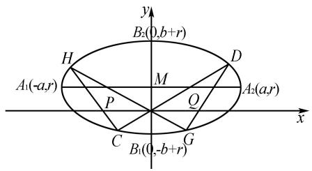
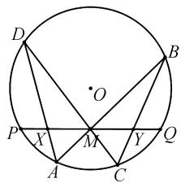
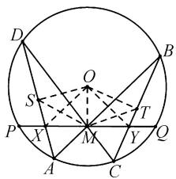
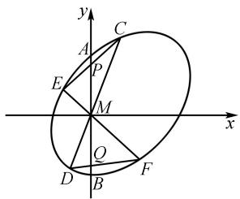

# 二次曲线中的蝴蝶定理及其简证

甘志国

(北京丰台二中, 北京 100071)

摘 要:蝴蝶定理是关于圆的一个美丽结论,实际上,还可把它推广到任意二次曲线中.文章由二次曲线系给出了该推广的简证,由该推广还可编拟出众多难度较大的平面解析几何题目,由推广的简证及平移还可给出所编拟题目的完整解答.

关键词: 数学史; 二次曲线; 蝴蝶定理; 二次曲线系

中图分类号：G632

文献标识码：A

文章编号:1008-0333(2025)16-0002-05

蝴蝶定理是一个在圆中成立的美妙结论,而实际上它能被推广到任意二次曲线. 在本文中,借助二次曲线,给出了这一推广的简洁证明. 基于该推广,能够编拟出许多具有较大难度的平面解析几何题目,同时本文也给出了这些题目的完整解答.

# 1 一道高考题及其解答

题 1 （2003 年高考北京卷理科第 18 题）如图 1, 椭圆的长轴 $A_{1}A_{2}$ 与 x 轴平行, 短轴 $B_{1}B_{2}$ 在 y 轴上, 中心为点 $M(0,r)(b>r>0)^{[1-2]}$ .

text_image

y
B₂(0,b+r)
H
D
A₁(-a,r)
M
Q
A₂(a,r)
x
C
G
B₁(0,-b+r)

图1 题1图

(1)写出椭圆的方程,求椭圆的焦点坐标及离心率；

(2) 设直线 $y = k_{1}x$ 交椭圆于两点 $C(x_{1}, y_{1})$ ， $D(x_{2}, y_{2})(y_{2} > 0)$ ；直线 $y = k_{2}x$ 交椭圆于两点 $G(x_{3}, y_{3}), H(x_{4}, y_{4})(y_{4} > 0)$ 。求证： $\frac{k_{1}x_{1}x_{2}}{x_{1} + x_{2}} = \frac{k_{2}x_{3}x_{4}}{x_{3} + x_{4}}$ ;  
(3) 对于(2)中的四点 C, D, G, H, 设线段 CH 交 x 轴于点 P, 线段 GD 交 x 轴于点 Q. 求证: $\left|OP\right| = \left|OQ\right|$ . (证明过程不考虑线段 CH 或 GD 垂直于 x 轴的情形)

解析 （1）所求椭圆的方程为 $\frac{x^{2}}{a^{2}} + \frac{(y - r)^{2}}{b^{2}} = 1$ ，左、右焦点的坐标分别为 $F_{1}(-\sqrt{a^{2} - b^{2}}, r)$ ， $F_{2}(\sqrt{a^{2} - b^{2}}, r)$ ，离心率 $e = \frac{\sqrt{a^{2} - b^{2}}}{a}$ .

(2) 将直线 CD 的方程 $y = k_{1}x$ 代入椭圆方程 $\frac{x^{2}}{a^{2}}+\frac{(y-r)^{2}}{b^{2}}=1$ , 得

收稿日期:2025-03-05

作者简介:甘志国,硕士,正高级教师,特级教师,从事高考研究和初等数学研究.

$$
b ^ {2} x ^ {2} + a ^ {2} \left(k _ {1} x - r\right) ^ {2} = a ^ {2} b ^ {2}.
$$

即 $(a^2 k_1^2 + b^2)x^2 - 2k_1a^2rx + (a^2 r^2 - a^2 b^2) = 0.$

由韦达定理,可得

$$
x _ {1} + x _ {2} = \frac {2 k _ {1} a ^ {2} r}{a ^ {2} k _ {1} ^ {2} + b ^ {2}}, x _ {1} x _ {2} = \frac {a ^ {2} r ^ {2} - a ^ {2} b ^ {2}}{a ^ {2} k _ {1} ^ {2} + b ^ {2}}.
$$

所以 $\frac{k_1x_1x_2}{x_1 + x_2} = \frac{r^2 - b^2}{2r}$

将直线 GH 的方程 $y = k_{2}x$ 代入椭圆方程 $\frac{x^{2}}{a^{2}}+\frac{(y-r)^{2}}{b^{2}}=1$ 后,同理可得

$$
\frac {k _ {2} x _ {3} x _ {4}}{x _ {3} + x _ {4}} = \frac {r ^ {2} - b ^ {2}}{2 r}.
$$

所以 $\frac{k_{1}x_{1}x_{2}}{x_{1}+x_{2}}=\frac{k_{2}x_{1}x_{2}}{x_{1}+x_{2}}.$

(3) 可设两点 $P(p,0)$ , $Q(q,0)$ .

由 C, P, H 三点共线, 可得

$$
\frac {x _ {1} - p}{x _ {4} - p} = \frac {k _ {1} x _ {1}}{k _ {2} x _ {4}},
$$

解得 $p=\frac{(k_{1}-k_{2})x_{1}x_{4}}{k_{1}x_{1}-k_{2}x_{4}}.$

由 D, Q, G 三点共线, 同理可得

$$
\frac {x _ {2} - p}{x _ {3} - p} = \frac {k _ {1} x _ {2}}{k _ {2} x _ {3}},
$$

解得 $q=\frac{(k_{1}-k_{2})x_{2}x_{3}}{k_{1}x_{2}-k_{2}x_{3}}.$

由第(2)问的结论 $\frac{k_{1}x_{1}x_{2}}{x_{1}+x_{2}}=\frac{k_{2}x_{3}x_{4}}{x_{3}+x_{4}}$ ，可得

$$
- \frac {\left(k _ {1} - k _ {2}\right) x _ {2} x _ {3}}{k _ {1} x _ {2} - k _ {2} x _ {3}} = \frac {\left(k _ {1} - k _ {2}\right) x _ {1} x _ {4}}{k _ {1} x _ {1} - k _ {2} x _ {4}}.
$$

所以 $|p|=|q|$ .

即 $|OP|=|OQ|$ .

# 2 高考题的背景分析

题 1 这道高考题的背景是蝴蝶定理. 蝴蝶定理最先是一个征解的证明问题, 刊载于 1815 年的一份通俗杂志《男士日记》第 39 \~ 40 页. 而“蝴蝶定理”这个名称最早出现在《美国数学月刊》1944年2月号,由于其几何图形形象奇特,貌似蝴蝶,便以此命名.

蝴蝶定理的内容是:如图2所示,圆O的弦PQ的中点为M,过点M任作两弦AB,CD,弦AD与BC分别交弦PQ于点X,Y,则M为线段XY的中点.

text_image

D
O
P X M Y Q
A C

图 2 蝴蝶定理图

有意思的是,直到1972年以前,人们对蝴蝶定理的证明都十分烦琐且非初等.至于初等数学的证法,在国外出现的资料中,一般都认为是由一位中学教师斯特温首先给出的面积法证明.1985年,在河南省《数学教师》创刊号上,山东大学杜锡录教授以“平面几何中的名题及其妙解”为题向国内介绍蝴蝶定理,从此蝴蝶定理在神州大地传开.

下面介绍一种较为简便的初等证法：

如图 3 所示, 作 $OS \perp AD$ 于点 S, $OT \perp BC$ 于点 T, 连接 OX, OY, MS, MT, OM.

text_image

D
O
B
S
P
X
M
Y
Q
A
C

图 3 蝴蝶定理证明图

由 $\triangle AMD\sim\triangle CMB$ 及垂径定理,可得

$$
\frac {A M}{C M} = \frac {A D}{C B} = \frac {A S}{C T}.
$$

再由 $\angle A = \angle C$ ，可得

$$
\triangle A M S \sim \triangle C M T, \angle M S X = \angle M T Y.
$$

由 $\angle OSX + \angle OMX = 90^{\circ} + 90^{\circ} = 180^{\circ}$ ，可得 O，

$S, X, M$ 四点共圆.

所以 $\angle MSX = \angle MOX$

同理可得 O, T, Y, M 四点共圆.

所以 $\angle MTY = \angle MOY.$

从而 $\angle MOX = \angle MOY.$

由 M 是弦 PQ 的中点, 可得 $OM \perp XY$ , 进而可得 M 为线段 XY 的中点.

实际上,还可把蝴蝶定理推广到任意的圆锥曲线中.

定理 （二次曲线中的蝴蝶定理）若过二次曲线 $\Gamma$ 的弦 AB 的中点 M 任作两条弦 CD, EF, 直线 CE, DF 与直线 AB 分别交于点 P, Q, 则 $|MP| = |MQ|$ .

# 3 定理的两种证明

证法 1 如图 4 所示, 以 M 为坐标原点, 直线 AB 为 y 轴, 建立平面直角坐标系 xMy.

text_image

y
A
C
P
E
M
x
Q
D
B
F

图 4 二次曲线中的蝴蝶定理证明图

可设二次曲线 $\Gamma$ 的方程为

$$
a x ^ {2} + b x y + c y ^ {2} + d x + e y + f = 0.
$$

再设两点 $A(0,t)$ , $B(0,-t)(t\neq0)$ ，可得 t, -t 是关于 y 的方程 $cy^{2} + ey + f = 0$ 的两个根.

所以 $cf \neq 0, e = 0.$

得二次曲线

$$
\Gamma : a x ^ {2} + b x y + c y ^ {2} + d x + f = 0.
$$

当直线 CD, EF 的斜率有不存在的情形时, 可得

$$
\mid M P \mid = \mid M A \mid = \mid M B \mid = \mid M Q \mid .
$$

当直线 CD, EF 的斜率均存在时, 可设 $C(x_{1},$ $k_{1}x_{1})$ , $D(x_{2}, k_{1}x_{2})$ , $E(x_{3}, k_{2}x_{3})$ , $F(x_{4}, k_{2}x_{4})$ , $P(0, p)$ , $Q(0, q)$ , 得直线

$$
C E: y = \frac {k _ {2} x _ {3} - k _ {1} x _ {1}}{x _ {3} - x _ {1}} (x - x _ {1}) + k _ {1} x _ {1},
$$

再得 $p=\frac{x_{1}x_{3}(k_{1}-k_{2})}{x_{3}-x_{1}}$ .

同理,可得

$$
q = \frac {x _ {2} x _ {4} (k _ {1} - k _ {2})}{x _ {4} - x _ {2}}.
$$

进而可得

$$
p + q = \frac {\left(k _ {1} - k _ {2}\right) \left[ x _ {3} x _ {4} \left(x _ {1} + x _ {2}\right) - x _ {1} x _ {2} \left(x _ {3} + x _ {4}\right) \right]}{\left(x _ {3} - x _ {1}\right) \left(x _ {4} - x _ {2}\right)}.
$$

由 $\left\{\begin{aligned}y&=k_{1}x,\\ ax^{2}&+bxy+cy^{2}+dx+f=0,\end{aligned}\right.$ 可得

$$
\left(a + b k _ {1} + c k _ {1} ^ {2}\right) x ^ {2} + d x + f = 0.
$$

所以 $x_{1} + x_{2} = -\frac{d}{a + bk_{1} + ck_{1}^{2}}$ ,

$$
x _ {1} x _ {2} = \frac {f}{a + b k _ {1} + c k _ {1} ^ {2}}.
$$

同理,可得

$$
x _ {3} + x _ {4} = - \frac {d}{a + b k _ {2} + c k _ {2} ^ {2}},
$$

$$
x _ {3} x _ {4} = \frac {f}{a + b k _ {2} + c k _ {2} ^ {2}}.
$$

所以

$$
\begin{array}{l} x _ {1} x _ {2} \left(x _ {3} + x _ {4}\right) = - \frac {d f}{\left(a + b k _ {1} + c k _ {1} ^ {2}\right) \left(a + b k _ {2} + c k _ {2} ^ {2}\right)} \\ = x _ {3} x _ {4} \left(x _ {1} + x _ {2}\right). \\ \end{array}
$$

进而可得 $p + q = 0$

即 $|MP| = |MQ|$ .

引理 设两条二次曲线 $f_{i}(x,y)=0(i=1,2)$ 有且仅有四个公共点，则过这四个公共点的二次曲线系方程为 $\sum_{i=1}^{2}\lambda_{i}f_{i}(x,y)=0$ ，其中常数 $\lambda_{1},\lambda_{2}\in\mathbf{R};|\lambda_{1}|+|\lambda_{2}|\neq0^{[3]}$ .

证法 2 如图 4 所示, 以 M 为坐标原点, 直线

AB 为 y 轴, 建立平面直角坐标系 xMy.

由定理的证法1知,可设二次曲线 $\Gamma$ 的方程为

$$
a x ^ {2} + b x y + c y ^ {2} + d x + f = 0.
$$

可设两条直线 CD, EF 的方程分别是

$$
\alpha_ {i} x + \beta_ {i} y = 0 (i = 1, 2),
$$

则由两条直线 CD, EF 组成的二次曲线是

$$
Y: \left(\alpha_ {1} x + \beta_ {1} y\right) \left(\alpha_ {2} x + \beta_ {2} y\right) = 0.
$$

由引理可得,过两条二次曲线 $\Gamma,Y$ 的四个公共点 C,D,E,F 的二次曲线系方程为

$$
\lambda_ {1} \left(a x ^ {2} + b x y + c y ^ {2} + d x + f\right) + \lambda_ {2} \left(\alpha_ {1} x + \beta_ {1} y\right) \cdot
$$

$$
\left(\alpha_ {2} x + \beta_ {2} y\right) = 0, \tag {①}
$$

其中常数 $\lambda_{1}, \lambda_{2} \in R; |\lambda_{1}| + |\lambda_{2}| \neq 0.$

设由两条直线 CE, DF 组成的二次曲线是 $\Psi$ , 因为四点 C, D, E, F 均在二次曲线 $\Psi$ 上, 所以存在 $\lambda_{1} = \lambda_{1}^{\prime}, \lambda_{2} = \lambda_{2}^{\prime} \in R; |\lambda_{1}^{\prime}| + |\lambda_{2}^{\prime}| \neq 0$ , 使得此时的方程①即

$$
\lambda_ {1} ^ {\prime} \left(a x ^ {2} + b x y + c y ^ {2} + d x + f\right) + \lambda_ {2} ^ {\prime} \left(\alpha_ {1} x + \beta_ {1} y\right) \cdot
$$

$$
\left(\alpha_ {2} x + \beta_ {2} y\right) = 0, \tag {②}
$$

表示二次曲线 $\Psi$ .

在②中令 x=0, 可得

$$
\left(\lambda_ {1} ^ {\prime} c + \lambda_ {2} ^ {\prime} \beta_ {1} \beta_ {2}\right) y ^ {2} + \lambda_ {1} ^ {\prime} f = 0.
$$

因为这个关于 y 的方程的两个根分别是两点 P, Q 的纵坐标, 所以由韦达定理可得

$$
y _ {P} + y _ {Q} = 0.
$$

因而 $|MP|=|MQ|$ .

# 4 蝴蝶定理的应用

题 2 过椭圆 $W: \frac{x^{2}}{2} + y^{2} = 1$ 的左焦点 F 作两条直线分别交椭圆于 A, B 两点和 C, D 两点, 其中点 A 的坐标是 $(0,1)$ . 再过点 F 作 x 轴的垂线分别交直线 AD, BC 于点 E, G.

(1) 求点 B 的坐标及直线 AB 的方程;

(2) 求证: $\left|EF\right| = \left|FG\right|$ .

解析 可得椭圆 W 的左焦点 $F(-1,0)$ .

(1)由直线 AB 经过两点 $(-1,0)$ ， $(0,1)$ ，可求得直线 AB 的方程是 $y = x + 1$ .  
将直线 AB 的方程与椭圆 W 的方程联立, 解此方程组可求得点 B 的坐标是 $(- \frac{4}{3}, -\frac{1}{3})$ .  
(2) 当直线 $CD \perp x$ 轴时, 由椭圆 W 关于 x 轴对称, 可得欲证结论成立.

当直线 $CD$ 与 $x$ 轴不垂直时, 可设直线 $CD: y = k(x + 1) (k \neq 1)$ 及两点 $C(x_1, k(x_1 + 1))$ , $D(x_2, k(x_2 + 1))$ .

联立 $\left\{\begin{aligned}y&=k(x+1),\\ \frac{x^{2}}{2}&+y^{2}=1,\end{aligned}\right.$ 可得

$$
(2 k ^ {2} + 1) x ^ {2} + 4 k ^ {2} x + (2 k ^ {2} - 2) = 0.
$$

由题设可得这个关于 x 的一元二次方程的判别式 $\Delta > 0$ ，且

$$
x _ {1} + x _ {2} = - \frac {4 k ^ {2}}{2 k ^ {2} + 1}, x _ {1} x _ {2} = \frac {2 k ^ {2} - 2}{2 k ^ {2} + 1}.
$$

可求得直线 AD:

$$
y = \frac {k (x _ {2} + 1) - 1}{x _ {2}} x + 1.
$$

令 x = -1，可求得点 $E(-1, \frac{(1-k)(x_{2}+1)}{x_{2}})$ .

还可求得直线 BC:

$$
y + \frac {1}{3} = \frac {3 k (x _ {1} + 1) + 1}{3 x _ {1} + 4} (x + \frac {4}{3}).
$$

令 $x = -1$ ，可求得点 $G(-1, \frac{(k - 1)(x_1 + 1)}{3x_1 + 4})$

所以

$$
\begin{array}{l} \frac {y _ {G} + y _ {E}}{k - 1} = \frac {x _ {1} + 1}{3 x _ {1} + 4} - \frac {x _ {2} + 1}{x _ {2}} \\ = \frac {- 2 x _ {1} x _ {2} - 3 (x _ {1} + x _ {2}) - 4}{x _ {2} (3 x _ {1} + 4)} \\ = \dots = \frac {0}{x _ {2} \left(3 x _ {1} + 4\right)} = 0. \\ \end{array}
$$

所以 $y_{G} + y_{E} = 0$ .

进而可得 $|EF|=|FG|$ .

综上所述,可得欲证结论成立.

(2)的另解由定理可得欲证结论成立,下面给出详细证明过程.

把题中的所有图形均沿向量 $\overrightarrow{FO}=(1,0)$ （其中O是坐标原点）平移，可得原题等价于下面的问题：

在平面直角坐标系 $x^{\prime}O^{\prime}y^{\prime}$ 中, 过椭圆 $W^{\prime}:\frac{(x^{\prime}+1)^{2}}{2}+y^{\prime2}=1$ 的左焦点即坐标原点 $O^{\prime}$ 作两条直线分别交椭圆于 $A^{\prime}, B^{\prime}$ 两点和 $C^{\prime}, D^{\prime}$ 两点, 其中 $A^{\prime}, B^{\prime}$ 两点的坐标分别是 $(1,1), (-\frac{1}{3}, -\frac{1}{3})$ . 设两条直线 $A^{\prime}D^{\prime}, B^{\prime}C^{\prime}$ 分别与 $y^{\prime}$ 轴交于点 $E^{\prime}, G^{\prime}$ , 求证: $|E^{\prime}F^{\prime}| = |F^{\prime}G^{\prime}|$ .

证明如下：

可求得直线 $A^{\prime}B^{\prime}:x^{\prime}-y^{\prime}=0.$

可设直线 $C^{\prime}D^{\prime}:\alpha x^{\prime}-\beta y^{\prime}=0$ ,

则由两条直线 $A'B'$ , $C'D'$ 组成的二次曲线是

$$
Y: \left(x ^ {\prime} - y ^ {\prime}\right) \left(\alpha x ^ {\prime} - \beta y ^ {\prime}\right) = 0.
$$

由引理可得, 过两条二次曲线 $W':(x'+1)^{2}+2y'^{2}-2=0$ 与 Y 的四个公共点 $A', B', C', D'$ 的二次曲线系方程为

$$
\begin{array}{r l} \lambda_ {1} \left[ \left(x ^ {\prime} + 1\right) ^ {2} + 2 y ^ {\prime 2} - 2 \right] + \lambda_ {2} \left(x ^ {\prime} - y ^ {\prime}\right) (\alpha x ^ {\prime} - \beta y ^ {\prime}) = 0, & \end{array} \tag {③}
$$

其中常数 $\lambda_{1}, \lambda_{2} \in R; |\lambda_{1}| + |\lambda_{2}| \neq 0.$

设由两条直线 $A^{\prime}D^{\prime}, B^{\prime}C^{\prime}$ 组成的二次曲线是 $\Psi$ . 因为四点 $A^{\prime}, B^{\prime}, C^{\prime}, D^{\prime}$ 均在二次曲线 $\Psi$ 上, 所以存在 $\lambda_{1} = \lambda_{1}^{\prime}, \lambda_{2} = \lambda_{2}^{\prime} \in R; |\lambda_{1}^{\prime}| + |\lambda_{2}^{\prime}| \neq 0$ , 使得此时的方程③即

$$
\begin{array}{r l} \lambda_ {1} ^ {\prime} \left[ \left(x ^ {\prime} + 1\right) ^ {2} + 2 y ^ {\prime 2} - 2 \right] + \lambda_ {2} ^ {\prime} \left(x ^ {\prime} - y ^ {\prime}\right) (\alpha x ^ {\prime} \\ - \beta y ^ {\prime}) = 0, \end{array} \tag {④}
$$

表示二次曲线 $\Psi$ .

在④中令 $x' = 0$ ，可得

$$
\left(2 \lambda_ {1} ^ {\prime} + \beta \lambda_ {2} ^ {\prime}\right) y ^ {\prime 2} - \lambda_ {1} ^ {\prime} = 0.
$$

因为这个关于 $y'$ 的方程的两个根分别是两点 $E', G'$ 的纵坐标, 所以由韦达定理可得

$$
y _ {E} ^ {\prime} + y _ {G} ^ {\prime} = 0.
$$

因而 $|E^{\prime}F^{\prime}|=|F^{\prime}G^{\prime}|$ .

# 5 结束语

认真钻研高考题是教师的重要教学研究活动 $^{[4]}$ ，包括追求本质、自然、规范、严谨、简洁、优雅的解题教学，发现、阐释高考题的背景等。教师要不断提高自身的解题素养，包括深入了解数学文化（比如数学家的钻研精神等）、钻研数学名题。在平面解析几何教学中，教师要熟练掌握二次曲线系、平移等知识、方法及其在解题中的应用。解答平面解析几何问题，不仅能很好地培养学生的数学运算核心素养，也能很好地培养学生的逻辑推理、直观想象、数学抽象等核心素养 $^{[5]}$ 。

# 参考文献：

[1] 甘志国. 数学文化高考题举隅(Ⅱ)[J]. 中学数学研究(华南师范大学版), 2017(05):3-9.  
[2] 甘志国. 数学文化高考研究 [M]. 哈尔滨: 哈尔滨工业大学出版社, 2018.  
[3] 李鸿昌. 二次曲线系在圆锥曲线四点共圆问题中的应用 [J]. 数理化解题研究, 2022 (07): 92-94.  
[4] 甘志国. 从解题教学谈高效课堂 [J]. 数学教学通讯 (下旬), 2018(03): 6-12.   
[5] 中华人民共和国教育部. 普通高中数学课程标准(2017年版2020年修订)[M]. 北京: 人民教育出版社, 2020.