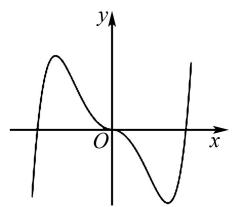
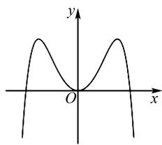
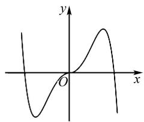
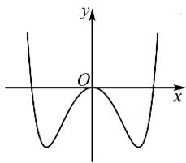
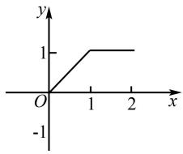
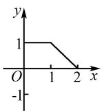
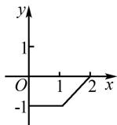
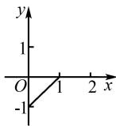
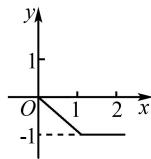

# 例谈函数对称性问题的题型和求解策略

殷宁

(南京市第十三中学, 江苏 南京 210008)

摘 要:函数的性质一直是近年来的热门考点,其重要性不言而喻.文章通过搜索资料,整理出了六种函数对称性问题的常考题型和解题策略.

关键词: 对称性; 解题研究; 求解策略

中图分类号：G632

文献标识码:A

文章编号:1008-0333(2025)16-0073-03

函数是高中数学的主线,是数学抽象思维的重要体现和教学载体,也是连接高中数学和高等数学的重要桥梁,多年来函数都是高考的热门考点 $^{[1]}$ .自2021年全国卷实施以来,函数的对称性作为考点频繁出现,其重要性不言而喻.笔者基于多年高中一线教学实践,整理了六种函数对称性问题的常考题型,并给出了解题思路和策略.

# 1 函数对称性问题的题型归纳

# 1.1 利用对称性识别函数解析式和图象

例 1 函数 $f(x) = -x^{2} + \left(\mathrm{e}^{x} - \mathrm{e}^{-x}\right)\sin x$ 在区间 $[-2.8, 2.8]$ 的图象大致为().

解析 找出解析式对应的函数图象或是根据函数图象找到匹配的函数解析式,体现了函数兼具“数”和“形”的特点. 因为 $f(-x) = -x^{2} + (\mathrm{e}^{-x} - \mathrm{e}^{x})\sin(-x) = -x^{2} + (\mathrm{e}^{x} - \mathrm{e}^{-x})\sin x = f(x)$ ，所以函数是偶函数，排除 A, C，再通过验证特殊值 $f(1)$

$$
= - 1 + \left(\mathrm{e} - \frac {1}{\mathrm{e}}\right) \sin 1 > - 1 + \left(\mathrm{e} - \frac {1}{\mathrm{e}}\right) \sin \frac {\pi}{6} = \frac {\mathrm{e}}{2} - 1
$$

$-\frac{1}{2e}>\frac{1}{4}-\frac{1}{2e}>0$ 排除 D, 故选 B.

text_image

y
O
x

A

text_image

y
O
x

B

text_image

y
x
O

C

text_image

y
O
x

D

# 1.2 已知某函数对称性求参数

例 2 若 $f(x)=\ln|a+\frac{1}{1-x}|+b$ 是奇函数, 则 a= \_\_\_\_, b= \_\_\_\_.

解法 1 （利用奇函数定义域的对称性）已知函数的对称性求参数,要先考虑函数的定义域也应当具有对称性,而根据解析式可以得出 $x \neq 1$ , 则必有 $x \neq -1$ .

若 a=0，则函数 $f(x)$ 的定义域为 $\{x \mid x \neq 1\}$ ，不关于原点对称，故 $a \neq 0$ .

要使奇函数 $f(x) = \ln |a + \frac{1}{1 - x}| + b$ 的解析式

收稿日期:2025-03-05

作者简介:殷宁,硕士,一级教师,从事中学数学教学研究.

基金项目: 江苏省南京市玄武区教育科学“十四五”规划 2022 年度课题“‘三教’理念指导下的高中数学学生‘说题’教学的实践研究”(项目编号: XL/2022/013).

有意义,则 $x \neq 1$ 且 $a + \frac{1}{1 - x} \neq 0$ .

即 $x \neq 1$ 且 $x \neq 1 + \frac{1}{a}$ .

则 $1 + \frac{1}{a} = -1$ ，解得 $a = -\frac{1}{2}$

由 $f(0)=0$ , 得 $\ln\frac{1}{2}+b=0$ .

故 $b = \ln 2$

解法 2 （利用奇函数定义构造代数恒等式）

$$
f (x) = \ln | a + \frac {1}{1 - x} | + b
$$

$$
= \ln | \frac {a - a x + 1}{1 - x} | + b
$$

$$
= \ln | \frac {a x - a - 1}{1 - x} | + b,
$$

$$
f (- x) = \ln | \frac {a x + a + 1}{1 + x} | + b,
$$

由函数 $f(x)$ 为奇函数可得

$$
\begin{array}{l} f (x) + f (- x) = \ln | \frac {a x - a - 1}{1 - x} | + \ln | \frac {a x + a + 1}{1 + x} | \\ + 2 b = 0. \\ \end{array}
$$

即 $\ln\left|\frac{a^{2}x^{2}-(a+1)^{2}}{x^{2}-1}\right|+2b=0$ 恒成立.

$$
\frac {a ^ {2}}{1} = \frac {(a + 1) ^ {2}}{1} \Rightarrow 2 a + 1 = 0 \Rightarrow a = - \frac {1}{2}.
$$

$$
- 2 b = \ln \frac {1}{4} = - 2 \ln 2 \Rightarrow b = \ln 2.
$$

评析 对初等函数的复合函数,已知对称性求参数时,我们可以抓住对称性的定义:如果一个函数的定义域关于 $x=\frac{a+b}{2}$ 对称,则若对定义域内的任意 x,有 $f(a+x)=f(b-x)$ ,则称 $f(x)$ 关于直线 $x=\frac{a+b}{2}$ 对称;若有 $f(a+x)+f(b-x)=c$ ,则称 $f(x)$ 关于点 $(\frac{a+b}{2},\frac{c}{2})$ 对称,来构造一个与 x 无关的恒等式.

# 1.3 利用对称性求值或函数解析式

例 3 已知函数 $f(x)=\frac{4}{2^{x}+2}+\sin\pi x$ ，则 $f(\frac{1}{1013})+f(\frac{2}{1013})+\cdots+f(\frac{2025}{1013})=(\quad)$ .

A. 2022 B. 2023 C. 2024 D. 2025

解析 由题可得

$$
\begin{array}{r l} f (x) + f (2 - x) & = \frac {4}{2 ^ {x} + 2} + \sin \pi x + \frac {4}{2 ^ {2 - x} + 2} \\ & + \sin [ \pi (2 - x) ] \end{array}
$$

$$
\begin{array}{l} = \frac {4}{2 ^ {x} + 2} + \frac {4 \cdot 2 ^ {x}}{4 + 2 \cdot 2 ^ {x}} \\ = \frac {4}{2 ^ {x} + 2} + \frac {2 \cdot 2 ^ {x}}{2 + 2 ^ {x}} = 2, \\ \end{array}
$$

所以 $f(\frac{1}{1013}) + f(\frac{2}{1013}) + \cdots + f(\frac{2025}{1013})$

$$
= f \left(\frac {1}{1 0 1 3}\right) + f \left(\frac {2 0 2 5}{1 0 1 3}\right) + f \left(\frac {2}{1 0 1 3}\right) + f \left(\frac {2 0 2 4}{1 0 1 3}\right) + \dots
$$

$$
+ f \left(\frac {1 0 1 2}{1 0 1 3}\right) + f \left(\frac {1 0 1 4}{1 0 1 3}\right) + f \left(\frac {2 0 1 3}{1 0 1 3}\right) = 2 \times 1 0 1 2
$$

$$
+ \frac {4}{2 ^ {1} + 2} + \sin \pi = 2 0 2 4 + 1 + 0 = 2 0 2 5.
$$

# 1.4 判断或证明某函数具有对称性

例 4 设函数 $f(x)=a^{x}+ka^{-x}(k\in\mathbf{R},a>0,a\neq1)$ . 讨论函数 $f(x)$ 的图象是否有对称中心. 若有, 请求出; 若无, 请说明理由;

解析 设点 $P(m,n)$ 为函数 $f(x)$ 的对称中心，则 $f(x)+f(2m-x)=2n$ ，代入得

$$
a ^ {x} + k a ^ {- x} + a ^ {2 m - x} + k a ^ {- 2 m + x} = 2 n.
$$

即 $a^x (1 + ka^{-2m}) + a^{-x}(k + a^{2m}) = 2n.$

整理, 得 $a^{2x}(1 + ka^{-2m}) - 2na^{x} + (k + a^{2m}) = 0.$

于是 $1 + ka^{-2m} = 0$ ，且 $k + a^{2m} = 0$ ，且 $2n = 0$ ，即 $a^{2m} = -k,n = 0.$

所以当 $k \geqslant 0$ 时, m 无解, 此时函数 $f(x)$ 的图象没有对称中心; 当 k < 0 时, $m = \frac{1}{2} \log_{a}(-k)$ , 此时函数 $f(x)$ 图象的对称中心为 $P\left(\frac{1}{2} \log_{a}(-k), 0\right)$ .

# 1.5 对称性与单调性、周期性结合的综合问题

例 5 已知函数 $f(x)$ 的定义域为 R, $f(x+1)$ 为奇函数, $f(x+2)$ 为偶函数, 且对任意的 $x_{1}, x_{2} \in (1, 2), x_{1} \neq x_{2}$ , 有 $(x_{1}-x_{2})[f(x_{1})-f(x_{2})] > 0$ , 则下列结论正确的是().

A. $f(x)$ 是偶函数

B. $f(2025) = 0$   
C. $f(x)$ 的图象关于 $(-1,0)$ 对称  
D. $f(-\frac{9}{5}) < f(\frac{21}{8})$

解法1（代数变换）由函数 $f(x + 1)$ 为奇函数知 $f(-x + 1) = -f(x + 1)$ .

所以 $f(1) = -f(1)$ ，可得 $f(1) = 0$ .

由函数 $f(x+2)$ 为偶函数,则 $f(2-x)=f(2+x)$ .

则 $f(2 + x) = f(2 - x) = f(1 + 1 - x) = -f[1 - (1 - x)] = -f(x)$ .

用 $x+2$ 替换 x 可得 $f(x+4)=-f(x+2)=f(x)$ .

所以 $f(x)$ 是周期函数,4 是它的一个周期.

$f(-x) = -f(2 + x) = -f(2 - x) = f[2 - (2 - x)] = f(x)$ , A 正确；

$$
f (- 1) = f (3) = f (2 + 1) = f (2 - 1) = f (1) = 0,
$$

故 $f(2025)=f(4\times506+1)=f(1)=0$ , B 正确;

$f(2-x)=-f(x)$ ，即 $f(x-2)=-f(-x)$ ，函数 $f(x)$ 的图象关于点 $(-1,0)$ 对称，C正确；

易得函数 $f(x)$ 在(1,2)单调递增，而 $f(-\frac{9}{5})=f(\frac{9}{5})$ ， $f(\frac{21}{8})=f(-\frac{21}{8})=f(-\frac{21}{8}+4)=f(\frac{11}{8})$ ，则 $f(\frac{9}{5})>f(\frac{11}{8})$ 。所以 $f(-\frac{9}{5})>f(\frac{21}{8})$ ，D错误。

解法 2 （图象变换） $f(x+1)$ , $f(x+2)$ 分别由 $f(x)$ 向左平移一个和两个单位而来，故 $f(x)$ 关于点 $(1,0)$ 对称，也关于直线 x=2 对称，因此具有周期性，4 是它的一个周期.

对任意的 $x_{1}, x_{2} \in (1, 2), x_{1} \neq x_{2}$ , 有 $(x_{1} - x_{2}) \cdot [f(x_{1}) - f(x_{2})] > 0$ , 说明函数 $f(x)$ 在 $(1, 2)$ 单调递增, 可以画出函数 $f(x)$ 在 $(1, 2)$ 的草图, 再根据对称性补全图象, 则问题迎刃而解.

对称性与周期性之间的常用结论有:(1)若函数 $f(x)$ 的图象关于直线x=a和x=b对称,则函数 $f(x)$ 的周期为 $T=2|a-b|$ ;(2)若函数 $f(x)$ 的图象关于点 $(a,0)$ 和点 $(b,0)$ 对称,则函数 $f(x)$ 的周期为 $T=2|a-b|$ ;(3)若函数 $f(x)$ 的图象关于直线 x=a 和点 $(b,0)$ 对称，则函数 $f(x)$ 的周期为 $T=4|a-b|$ .

# 1.6 两函数之间的对称关系

例 6 已知定义在区间 $[0,2]$ 上的函数 $y=f(x)$ 的图象如图 1 所示，则 $y=-f(2-x)$ 的图象为 \_\_\_\_. (填序号)

line

| x | y |
|---|---|
| 0 | 0 |
| 1 | 1 |
| 2 | 1 |

图1 例6图

  
①

  
②

  
③

  
④

解法 1 （特殊点验证法）由图象可知 $f(0)=0, f(1)=1, f(2)=1$ .

则当 x=0 时, $y=-f(2)=-1$ ;

当 x=1 时, $y=-f(1)=-1$ ;

当 x=2 时, $y=-f(0)=0$ .

故选②.

解法 2 （代数式判断法） $y = f(x)$ 和 $y = -f(2 - x)$ 的图象关于点 $(1,0)$ 对称，故选②.

# 2 结束语

本文通过教学实践归纳出以上六种函数对称性题型及其解题方法. 在教学过程中, 教师应强化基础训练, 引导学生掌握基本方法; 同时建议持续关注并强调函数数形结合的特点, 从多个角度开拓学生思维, 进而实现能力提升.

# 参考文献：

[1] 中华人民共和国教育部. 义务教育数学课程标准(2022年版)[M]. 北京: 北京师范大学出版社, 2022.