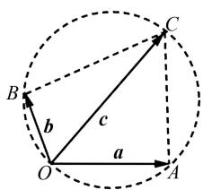
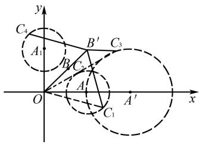
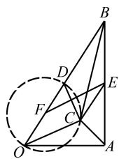
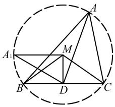

# 例谈高中数学平面向量中的隐圆问题

张梅

(江苏省南京市天印高级中学, 江苏 南京 211100)

摘 要:文章结合具体实例展示对角互补构圆、模长为定值构圆、两向量垂直构圆,以及对边对角构圆在解决平面向量习题中的具体应用,认为建立平面向量与圆的内在联系,准确画出图形是解题的关键,教学中应引起足够的重视.

关键词:高中数学;平面向量;隐圆;例谈

中图分类号：G632

文献标识码:A

隐圆问题指习题题干中并没有明确给出圆,需要对题干进行转化、运算,得出某点的运动轨迹符合圆以及圆的性质,依托圆的性质加以解决的一类问题.高中数学平面向量中涉及较多类型的隐圆问题,需要教师做好归纳,明确不同类型隐圆问题中构圆的方法与细节,并借助例题讲解,帮助学生理解、实现灵活运用.

# 1 对角互补构圆

在平面四边形中如果一组对角互补,则四边形的四个点在同一圆上 $^{[1]}$ ,这一原理在平面向量中同样适用.不同的是,解决平面向量问题需要先确定向量可以构成四边形,而后对对角的互补关系进行判定.其中,向量能否构成四边形可以运用平面向量的加法或减法法则作出判断,而对角的角度关系需要借助已知条件或者向量的数量积运算得出具体的值后作出分析.当然还应注意两个非零向量的夹角范围为 $[0,\pi\text{切}]$ ,计算时要注意结合图形,确定正确的角度.

例1 已知平面向量 $\pmb{a},\pmb{b},\pmb{c}$ 满足 $|\pmb{a}| = \sqrt{2} |\pmb{b}|$ 文章编号:1008-0333(2025)16-0007-04

$= \sqrt{2},\cos <  a,b > = -\cos <  c - a,c - b > = -\frac{\sqrt{2}}{2}$ ，则以 $|\pmb {c}|$ 为直径的圆的最大面积为

解析 由题意可知 $|\boldsymbol{a}| = \sqrt{2} |\boldsymbol{b}| = \sqrt{2}$ , 易得 $|\boldsymbol{b}| = 1$ . 又由 $\cos < \boldsymbol{a}, \boldsymbol{b} > = -\cos < c - \boldsymbol{a}, c - \boldsymbol{b} > = -\frac{\sqrt{2}}{2}$ 可以得到向量 $\boldsymbol{a}, \boldsymbol{b}$ 的夹角为 $\frac{3\pi}{4}$ , 向量 $c - a, c - b$ 的夹角为 $\frac{\pi}{4}$ .

根据题意作 $OA = a, OB = b, OC = c$ ，连接 $AC, BC$ ，则 $a - c = \overrightarrow{CA}, b - c = \overrightarrow{CB}$ ，则 $\angle ACB = \frac{\pi}{4}$ 。又由 $\angle AOB = \frac{3\pi}{4}$ ，则 $A, C, B, O$ 四点共圆，如图1所示，易得 $A = B = \frac{\pi}{2}$ 。由图可知当 $OC$ 为圆的直径时对应的 $|c|$ 最大。

在 Rt $\triangle BOC$ 和 Rt $\triangle AOC$ 中，可得 OC $=\frac{1}{\cos\angle BOC}=\frac{\sqrt{2}}{\cos\angle AOC}.$ 又由 $\angle BOC=\frac{3\pi}{4}$

收稿日期:2025-03-05

作者简介: 张梅, 本科, 一级教师, 从事高中数学教学研究.

text_image

B
O
A
C
b
c
a

图 1 A、C、B、O 四点共圆示意图

$-\angle AOC$ , 则 $\cos\angle AOC=\sqrt{2}\left(-\frac{\sqrt{2}}{2}\cos\angle AOC+\frac{\sqrt{2}}{2}\sin\angle AOC\right)$ . 整理, 得 $2\cos\angle AOC=\sin\angle AOC$ . 即 $\tan\angle AOC=2,\cos\angle AOC=\frac{\sqrt{5}}{5}$ . 则 $OC=\sqrt{10}$ . 则 $|c|$ 的最大值为 $\sqrt{10}$ . 则以 $|c|$ 为直径的圆的面积的最大值为 $S=\left(\frac{\sqrt{10}}{2}\right)^{2}\pi=\frac{5}{2}\pi$ .

点评 习题考查向量的数量积运算、对角互补构造隐圆、锐角三角函数值的计算等知识. 其中, 对角互补是隐含条件, 是整个解题的关键. 解题的过程中应具备通过对角互补构造隐圆的意识, 对照画出图形, 明确 OC 为隐圆直径时对应的 $|c|$ 最大, 以 $|c|$ 为直径的圆的面积也最大.

# 2 模长为定值构圆

向量的模是平面向量中非常重要的概念. 高中数学课本中指出向量是既有大小又有方向的量, 而向量的模只指向量的大小, 对应几何视角下向量所在线段的长度 $^{[2]}$ . 对于一个平面向量, 如果其头或尾是固定的点, 而模长确定, 则其尾或头的轨迹是一个圆. 基于此, 在解答平面向量问题中, 可以通过构造隐圆将平面向量问题转化为与圆相关的问题进行解决. 当然, 如果平面向量之间通过加法或减法运算得到向量的模是定值, 则得到向量的头或尾的轨迹也是一个圆. 例如, 已知平面向量 $\overrightarrow{AC}, \overrightarrow{AB}$ 是模长不等且均不为零的向量, 若 $|\overrightarrow{AC}-\overrightarrow{AB}|$ 为定值, 则点 C 的轨迹是以点 B 为圆心, 以 $|\overrightarrow{AC}-\overrightarrow{AB}|$ 为半径的圆. 教学中, 引导学生关注与理解这一重要关系, 有助于更好地解答平面向量相关问题.

例2 平面向量 $\pmb{a},\pmb{b},\pmb{c}_i(i = 1,2)$ 满足 $|\pmb {a}| = 2|\pmb {b}|$ $= \sqrt{2} \boldsymbol{a} \cdot \boldsymbol{b} = 2, |\boldsymbol{c}_i - \boldsymbol{a}| = 1$ ，则 $|\boldsymbol{c}_1 - 2\lambda \boldsymbol{b}| + 2|\boldsymbol{c}_2 - \lambda \boldsymbol{b}|$ ( $\lambda \in \mathbf{R}$ ) 的最小值为 \_\_\_\_.

解析 由 $|a|=2|b|=\sqrt{2}a\cdot b=2$ ，可以得到 $|a|=2,|b|=1,|a\cdot b|=\sqrt{2}$ 。又由 $a\cdot b=|a||b|\cos<a$ ，
b>, 易得 $\cos < a, b > = \frac{\sqrt{2}}{2}$ ，则向量 a, b 的夹角为 $\frac{\pi}{4}$ .

令 $\overrightarrow{OA}=\boldsymbol{a},\overrightarrow{OB}=\boldsymbol{b},\overrightarrow{OC_{1}}=\boldsymbol{c},\overrightarrow{OC_{2}}=\boldsymbol{c}_{2},\overrightarrow{OB^{\prime}}=2\lambda\boldsymbol{b},\overrightarrow{OC_{3}}=2\boldsymbol{c}_{2}$ . 又由 $|c_{i}-a|=1$ , 可知点 $C_{1},C_{2}$ 在以A为圆心, 半径为1的圆上, 点 $C_{3}$ 在以 $A^{\prime}$ 为圆心, 半径为2的圆上, 如图2所示, 则 $A(2,0),A^{\prime}(4,0)$ .

text_image

y
C₄
A₁
B'
C₃
B
C₂
A
O
x
A′
C₁

图 2 点 $C_{1}, C_{2}$ 以及点 $C_{3}$ 的轨迹示意图

由已知条件以及图2易知 $2|c_{2}-\lambda b|=|2c_{2}-2\lambda b|=|\overrightarrow{B'C_{3}}|$ ， $|c_{1}-2\lambda b|=|\overrightarrow{B'C_{1}}|$ .

作圆 A 关于直线 $OB_{1}$ 的对称圆 $A_{1}$ ，则 $B^{\prime}C_{1}=B^{\prime}C_{4}$ ，且 $A_{1}(0,2)$ .

问题转化为求 $B^{\prime}C_{3} + B^{\prime}C_{4}$ 的最小值问题. 当点 $C_{4}, A_{1}, B, A^{\prime}$ 四点共线时 $B^{\prime}C_{3} + B^{\prime}C_{4}$ 的值最小.

又由 $A_{1}A' = \sqrt{(0-4)^{2} + (2-0)^{2}} = 2\sqrt{5}$ ，则 $B'C_{3} + B'C_{4}$ 的最小值为 $2\sqrt{5} - 3$ .

即 $|\pmb{c}_1 - 2\lambda \pmb{b}| + 2|\pmb{c}_1 - \lambda \pmb{b}|$ 的最小值为 $2\sqrt{5} -3$

点评 该题考查转化思想、模长为定值构造隐圆,以及对称法求线段最短等内容. 解题中需要借助已知条件推理平面向量 a,b 的位置关系,同时借助 $\left|c_{i}-a\right|=1$ 构造隐圆. 画出对应的图形, 将求 $\left|c_{1}-2\lambda b\right|+2\left|c_{1}-\lambda b\right|$ 的最小值问题转化成求 $B^{\prime}C_{3}+B^{\prime}C_{1}$ 之和的最小值问题. 考虑到点 $C_{1}$ 和点 $C_{3}$ 均是动点, 运动轨迹均是圆, 解题中需要通过作其中一个圆的对称圆, 借助对称性质对线段进行等量代换, 便能直观确定 $B^{\prime}C_{3}+B^{\prime}C_{1}$ 之和的最小值.

# 3 两向量垂直构圆

“直径所对的圆周角是 $90^{\circ}$ ”是圆的一个非常重要的性质,说明构成圆周角的两条线段是垂直关系[3],而垂直关系与平面向量中两个向量的数量积为零对应.基于此,可以通过构造隐圆解决平面向量问题.在解题的过程中,如果已知条件给出或者能够推理出如下描述的内容,就能构造隐圆:已知平面向量 $\overrightarrow{AB}$ 的模为定值,且满足 $\overrightarrow{AC} \perp \overrightarrow{BC}$ ,则点 $C$ 的轨迹是以 $|\overrightarrow{AB}|$ 为直径的圆.可以通过建立平面直角坐标系,借助向量的坐标运算对其进行证明.通过向量坐标运算不难得知点 $C$ 的轨迹包含点 $A$ 和点 $B$ 两个点.教学中,应注重引导学生学习、运用两向量垂直关系构造隐圆解决平面向量问题.

例 3 已知平面向量 a, b 满足 $\left|a\right|=\frac{1}{2}\left|b\right|=\boldsymbol{a}\cdot\boldsymbol{b}=1,2\left|c\right|^{2}=\boldsymbol{b}\cdot\boldsymbol{c}$ ，则 $\left|c-a\right|^{2}+\left|c-b\right|^{2}$ 的最小值为 \_\_\_\_.

解析 由 $|\pmb{a}| = \frac{1}{2} |\pmb{b}| = \pmb{a} \cdot \pmb{b} = 1$ 可得

$$
\cos <   \boldsymbol {a}, \boldsymbol {b} > = \frac {\boldsymbol {a} \cdot \boldsymbol {b}}{| \boldsymbol {a} | | \boldsymbol {b} |} = \frac {1}{1 \times 2} = \frac {1}{2}.
$$

则向量 a, b 的夹角为 $60^{\circ}$ ，即 $\angle AOB = 60^{\circ}$ .

令 $\overrightarrow{OA} = a, \overrightarrow{OB} = b, \overrightarrow{OC} = c$ ，取 $OB, OD$ 以及 $AB$ 的中点分别为点 $D, F, E$ ，如图3所示，易得 $BF = \frac{3}{2}$ .

text_image

Geometric diagram with labeled points and a dashed circle, likely from a math problem or proof

图3 $a,b$ 以及 $c$ 示意图

在 $\triangle ABO$ 中, 可得 $AO = 1, OB = 2$ , 由余弦定理易得 $AB = \sqrt{AO^2 + OB^2 - 2AO \cdot OB \cos \angle AOB} = \sqrt{3}$ . 则 $AE = EB = \frac{\sqrt{3}}{2}, AO^2 + AB^2 = OB^2$ , 即 $\triangle AOB$ 为直角三角形, $\angle OAB=90^{\circ}$ . 易得 $\angle PBE=30^{\circ}$ .

则在 $\triangle BFE$ 中,由余弦定理得到:

$$
F E = \sqrt {B F ^ {2} + B E ^ {2} - 2 B F \cdot B E \cos \angle F B E} = \frac {\sqrt {3}}{2}.
$$

由 $2|c|^2 = b \cdot c$ ，则 $2\overrightarrow{OC} \cdot \overrightarrow{OC} - \overrightarrow{OB} \cdot \overrightarrow{OC}$ $= 2\overrightarrow{OC} \cdot (\overrightarrow{OC} - \frac{1}{2}\overrightarrow{OB}) = 2\overrightarrow{OC} \cdot (\overrightarrow{OC} - \overrightarrow{OD}) = 2\overrightarrow{OC}$ $\cdot \overrightarrow{DC} = 0.$ 则 $OC \perp DC.$ 则点 $C$ 的轨迹是以 $F$ 为圆心，以点 $OD$ 为直径的圆.

由 $|\pmb {c} - \pmb{a}|^2 = AC^2$ ， $|\pmb {c} - \pmb{b}|^2 = BC^2$ ，则

$$
\left| \boldsymbol {c} - \boldsymbol {a} \right| ^ {2} + \left| \boldsymbol {c} - \boldsymbol {b} \right| ^ {2} = A C ^ {2} + B C ^ {2}.
$$

在 $\triangle ACE$ 和 $\triangle BCE$ 中,由余弦定理可得

$$
A C ^ {2} = E C ^ {2} + E A ^ {2} - 2 E C \cdot E A \cos \angle A E C,
$$

$$
B C ^ {2} = E B ^ {2} + E C ^ {2} - 2 E B \cdot E C \cos \angle B E C,
$$

而 $\angle AEC+\angle BEC=180^{\circ},EB=EA$ ，两式相加，得

$$
\begin{array}{l} A C ^ {2} + B C ^ {2} = E A ^ {2} + E B ^ {2} + 2 E C ^ {2} \\ = 2 \times \left(\frac {\sqrt {3}}{2}\right) ^ {2} + 2 E C ^ {2} \\ = \frac {3}{2} + 2 E C ^ {2}. \\ \end{array}
$$

问题转化为求 $EC$ 长度的最小值. 显然当 $F, C$ , $E$ 三点共线时, $EC$ 的长度最小, 此时 $EC = FE - FC = FE - \frac{1}{2}OD = \frac{\sqrt{3} - 1}{2}$ , 则 $AC^2 + BC^2$ 的最小值为 $\frac{3}{2} + 2EC^2 = \frac{3}{2} + 2 \times \left(\frac{\sqrt{3} - 1}{2}\right)^2 = \frac{7 - 2\sqrt{3}}{2}$ .

即 $|\pmb {c} - \pmb{a}|^2 +|\pmb {c} - \pmb{b}|^2$ 的最小值为 $\frac{7 - 2\sqrt{3}}{2}$

点评 该题考查向量的数量积、余弦定理以及两向量垂直构造隐圆等知识,综合性较强.解题时,通过画出对应的图形将题干中所给的向量对应到图形之中,并通过向量间的加法、加法运算厘清图形中对应平面向量之间的位置关系.通过构造隐圆,运用余弦定理将问题转化为求 EC 的最小值,对照图形便可准确确定满足题意的点 C 的具体位置.

# 4 对边对角构圆

圆有一个非常重要的性质,即圆中弦所对的圆周角(弦非直径时需要满足在弦的同一侧)相等.这一性质实现了线段、角度相等之间的转化,为解决与之相关的问题提供重要依据.圆的这一性质,也可以通过平面向量之间的关系进行描述:已知平面向量 $\overrightarrow{AB}$ 的模是确定的,分别以点A、点B为首或尾(或过点A、点B)的两个向量所在的直线交于一点C且 $\angle ACB$ 的大小为定值( $0<\angle ACB<180^{\circ}$ ),则点C的轨迹是圆弧(不含点A、点B).如果 $\angle ACB\neq90^{\circ}$ ,则需要根据习题题干中的已知条件判断点C的轨迹是优弧还是劣弧.

例 4 已知在 $\triangle ABC$ 中, D 为 BC 的中点, BC = 2, $\angle BAC = \frac{\pi}{3}$ , 在 $\triangle ABC$ 所在的平面内存在一动点 P, 满足 $\overrightarrow{PB} \cdot \overrightarrow{PD} = \overrightarrow{PC} \cdot \overrightarrow{PD}$ , 则 $\overrightarrow{AP} \cdot \overrightarrow{BC}$ 的最大值为 \_\_\_\_.

解析 由 $\overrightarrow{PB} \cdot \overrightarrow{PD} = \overrightarrow{PC} \cdot \overrightarrow{PD}$ 可得 $\overrightarrow{PC} \cdot \overrightarrow{PD} - \overrightarrow{PB}$ $\cdot \overrightarrow{PD} = \overrightarrow{PD} \cdot (\overrightarrow{PC} - \overrightarrow{PB}) = \overrightarrow{PD} \cdot \overrightarrow{BC} = 0$ ，而 $\overrightarrow{AP} \cdot \overrightarrow{BC} = (\overrightarrow{AD} - \overrightarrow{PD}) \cdot \overrightarrow{BC} = \overrightarrow{AD} \cdot \overrightarrow{BC} - \overrightarrow{PD} \cdot \overrightarrow{BC} = \overrightarrow{AD} \cdot \overrightarrow{BC}$ .

由 $BC = 2, \angle BAC = \frac{\pi}{3}$ 可知，点 $A$ 的轨迹是以 $BC$ 为弦的优弧（不含端点）. 设优弧对应的圆心为点 $M$ ，连接 $MD, MB, MC, AD$ ，如图4所示.

text_image

Geometric diagram with labeled points A, B, C, D, M and intersecting lines within a dashed circle

图4 点 $A$ 轨迹示意图

$$
\begin{array}{l} M D \perp B C, B D = D C = 1, \angle B M C = \frac {2 \pi}{3}, \angle B M D \\ = \frac {\pi}{3}. \text {   在   Rt } \triangle B M D \text {   中,   圆   } M \text {   的半径   } r = B M = \frac {B D}{\sin \angle B M D} \\ = \frac {2 \sqrt {3}}{3}. \overrightarrow {A D} \cdot \overrightarrow {B C} = - \overrightarrow {D A} \cdot \overrightarrow {B C} = - 2 | \overrightarrow {D C} | \cdot \\ \end{array}
$$

由 $D$ 为 $BC$ 的中点, $BC = 2$ , $\angle BAC = \frac{\pi}{3}$ , 则

$|\overrightarrow{DA}|\cos\angle ADC$ , 其中 $|\overrightarrow{DA}|\cos\angle ADC$ 表示向量 $\overrightarrow{DA}$ 在向量 $\overrightarrow{DC}$ 上的投影, 显然投影的值越小, 对应的 $\overrightarrow{AD}\cdot\overrightarrow{BC}$ 的值越大. 由图 4 可知当点 A 运动到点 $A_{1}$ 的位置时满足题意, 此时 $|\overrightarrow{DA}|\cos\angle ADC = -r = -\frac{2\sqrt{3}}{3}$ , 则 $\overrightarrow{AD}\cdot\overrightarrow{BC} = -\overrightarrow{DA}\cdot\overrightarrow{BC} = -2\times1\times(-\frac{2\sqrt{3}}{3})=\frac{4\sqrt{3}}{3}$ .

即 $\overrightarrow{AP}\cdot\overrightarrow{BC}$ 的最大值为 $\frac{4\sqrt{3}}{3}$ .

点评 该题考查向量的减法运算法则、对边对角构造隐圆、向量的投影等知识. 解答该题需要先运用题干中所给的向量关系, 推理出平面向量 $\overrightarrow{PD}$ 和 $\overrightarrow{BC}$ 的关系. 借助向量的减法运算法则将求 $\overrightarrow{AP} \cdot \overrightarrow{BC}$ 的最大值问题转化为求 $\overrightarrow{AD} \cdot \overrightarrow{BC}$ 的最大值问题. 通过对边对角构造隐圆后, 结合图形将问题转化为求 $\overrightarrow{DA}\cos \angle ADC$ 的最小值.

# 5 结束语

综上所述,构造隐圆可以高效地解决平面向量中的最值问题.教学中,为使学生掌握构造隐圆的方法,提高解答平面向量问题的能力,教师应做好构造隐圆四类情境的总结与讲解,引导学生将圆的相关知识与平面向量知识衔接起来,借助平面向量的加法、减法法则构造对应的几何图形,尤其运用圆的性质将抽象问题直观化,将复杂问题简单化,有效规避烦琐的计算.

# 参考文献：

[1] 王中学, 李卉. 巧用“隐圆”破解平面向量问题 [J]. 中学生理科应试, 2023(03): 1-2.  
[2] 庞良绪. 借助隐圆解决向量问题直观想象彰显魅力 [J]. 中学数学, 2022(19): 53-54.  
[3] 郑艳.“隐圆”巧发现,问题妙破解[J].中学数学教学参考,2021(27):40-41.

[责任编辑:李慧娇]