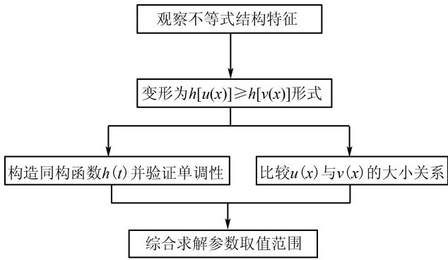

# 基于同构法的导数不等式解题策略探究

周仕敏

(南京市人民中学, 江苏 南京 210008)

摘 要:文章针对导数压轴题中一类特殊的不等式恒成立问题,通过6道高考真题与模拟题的变式分析,提炼出指对跨阶、代数变形、单调性判定三大操作要点,并建立“观察—变形—构造—验证”四步解题模型为破解同类问题提供标准化路径.

关键词: 同构法; 指对跨阶; 导数不等式; 单调性判定; 结构映射

中图分类号：G632

文献标识码：A

文章编号:1008-0333(2025)16-0030-03

同构一般表示结构或形式相同. 在处理导数压轴问题时, 笔者发现, 对于一类特定题目, 使用同构法能够高效解决. 具体而言, 在解答这类导数问题时, 通过变形将不等式两边构造成具有相同结构的代数式, 随后结合对应同构函数的单调性, 往往可简化不等式, 进而攻克压轴题. 这种通过构造相同结构、利用函数性质求解的解题思想, 便是 “同构法”.

# 1 方法模型建构

# 1.1 核心概念界定

定义 1 （同构法）将不等式 $f(x) \geqslant g(x)$ 通过代数变形转化为 $h[u(x)] \geqslant h[v(x)]$ ，其中 $h(t)$ 为严格单调函数。通过比较 $u(x)$ 与 $v(x)$ 的大小关系求解原问题。

定理 1 （结构映射定理 $^{[1]}$ ）若存在严格单调函数 $h(t)$ 使得 $f(x)=h[u(x)]$ , $g(x)=h[v(x)]$ ，则原不等式等价于：当 $h(t)$ 单调递增时， $u(x)\geqslant v(x)$ ; 当 $h(t)$ 单调递减时， $u(x)\leqslant v(x)$ .

# 1.2 操作流程图解

该流程图系统呈现了用同构法解决一类导数不等式压轴题的核心步骤(如图1).



<details>
<summary>flowchart</summary>

```mermaid
graph TD
    A["观察不等式结构特征"] --> B["变形为h[u(x)"]≥h["v(x)"]形式]
    B --> C["构造同构函数h(t)并验证单调性"]
    B --> D["比较u(x)与v(x)的大小关系"]
    C --> E["综合求解参数取值范围"]
    D --> E
```
</details>

图 1 同构法解题操作流程图

# 2 典型例题剖析

例 1 （指对跨阶型）已知函数 $f(x) = a \ln (x + 1) + (x + 1)^{2}$ , $g(x) = e^{2x} + ax$ , $a \in R$ . 若对任意的 $x \geqslant 0$ , $g(x) \geqslant f(x)$ 恒成立, 求实数 a 的取值范围.

解法 1 设 $\varphi(x)=g(x)-f(x)=\mathrm{e}^{2x}+ax- a\ln(x+1)-(x+1)^{2}, x\in[0,+\infty)$ ，则 $\varphi'(x)$

$$
\begin{array}{l} = 2 \mathrm{e} ^ {2 x} + a - 2 (x + 1) - \frac {a}{x + 1}, \varphi^ {\prime \prime} (x) = 4 \mathrm{e} ^ {2 x} - 2 \\ + \frac {a}{(x + 1) ^ {2}}, \varphi^ {\prime \prime \prime} (x) = 8 \mathrm{e} ^ {2 x} - \frac {2 a}{(x + 1) ^ {3}}. \\ \end{array}
$$

①当 $a \geqslant 0$ 时, $\varphi''(x) \geqslant 0$ , 则 $\varphi'(x)$ 在 $x \in [0, +\infty)$ 上单调递增. 所以 $\varphi'(x) \geqslant \varphi'(0) = 0$ . 则 $\varphi(x)$ 在 $x \in [0, +\infty)$ 上单调递增. 所以 $\varphi(x) \geqslant \varphi(0) = 0$ . 所以有 $g(x) \geqslant f(x)$ .

②当 a<0 时， $\varphi'''(x)\geqslant0$ ，则 $\varphi''(x)$ 在 $x\in[0,+\infty)$ 上单调递增。所以 $\varphi''(x)\geqslant\varphi''(0)=a+2$ 。

若 $a + 2 \geqslant 0$ ，即 $a \geqslant -2$ . 则 $\varphi''(x) \geqslant 0$ . 则 $\varphi'(x)$ 在 $x \in [0, +\infty)$ 上单调递增. 所以 $\varphi'(x) \geqslant \varphi'(0) = 0$ . 则 $\varphi(x)$ 在 $x \in [0, +\infty)$ 上单调递增. 所以 $\varphi(x) \geqslant \varphi(0) = 0$ . 所以有 $g(x) \geqslant f(x)$ .

若 $a + 2 < 0$ ，即 $a < -2.$ 则 $\varphi''(0) < 0.$

又 $-a - 1 > 1, \varphi''(-a - 1) = 4\mathrm{e}^{2(-a - 1)} - 2 + \frac{1}{a} > 4\mathrm{e}^2 - 2 - \frac{1}{2} > 0$ ，则存在 $n \in (0, +\infty)$ ，使得 $\varphi''(n) = 0$ ，且 $\varphi'(x)$ 在 $(0, n)$ 上单调递减， $\varphi'(x)$ 在 $(n, +\infty)$ 上单调递增。又由于 $\varphi'(0) = 0$ ，所以 $x \in (0, n)$ 时， $\varphi'(x) < 0$ ，则 $\varphi(x)$ 在 $(0, n)$ 上单调递减。所以 $\varphi(x) < \varphi(0) = 0$ ，不满足题意，舍去。

综上所述, $a \geqslant -2$ .

分析 上述解法基于分类讨论的数学思想研究含参数函数的单调性,同时借助“端点效应”的操作技巧简化讨论过程,进而解决问题.然而,这种传统解法存在以下缺陷:其一,需进行3次求导以验证端点效应;其二,存在临界点失效的风险;其三,分类讨论需书写冗长的逻辑链.

解法 2 由不等式 $\mathrm{e}^{2x} + ax \geqslant a\ln(x + 1) + (x + 1)^{2}$ ，变形得 $\mathrm{e}^{2x} + ax \geqslant a\ln(x + 1) + \mathrm{e}^{2\ln(x + 1)}$ 。发现同构函数为 $g(x) = \mathrm{e}^{2x} + ax$ ，原不等式等价于 $g(x) \geqslant g[\ln(x + 1)], x \geqslant 0$ 。

又可证 $\ln(x+1)\leqslant(x+1)-1=x$ , 原问题等价转化为当 $x\geqslant0$ 时, $g(x)=\mathrm{e}^{2x}+ax$ 单调递增, 可轻松得到 $a \geqslant -2$ .

分析 解法 2 通过结构观察、指对转换、同构构造、单调性判定、参数求解这五步操作解决问题. 与解法 1 相比, 存在明显优势.

例 2 （对称结构型）若 $2^{x}-2^{y}<3^{-x}-3^{-y}$ ，则（）.

A. $\ln(y-x+1)>0$

B. $\ln(y-x+1)<0$

C. $\ln|x-y|>0$

D. $\ln|x-y|<0$

解析 将不等式变形,使得两边各含一个变量 $2^{x}-3^{-x}<2^{y}-3^{-y}$ , 发现不等式两边的结构相同,且都为“ $2^{x}-3^{-x}$ ”的形式,故找到这个函数的原型,即同构函数 $f(x)=2^{x}-3^{-x}$ . 判断该函数为单调递增函数,化简原不等式为 x<y, 进而确定选项,答案为 A.

从这两个例题不难看出其共性:先通过变形将原不等式转化为两个同构式的不等式,再将原问题转化为研究对应同构函数的单调性,从而简化问题.这正是利用同构法解决不等式问题的核心要点.那么,在何种情形下适用“同构法”?又该如何构造“同构”函数?接下来,笔者将以相关题目为载体,深入解析“同构法”的原理、应用策略及拓展方向.

例 3 设 a, b 都为正数, e 为自然对数的底数, 若 $ae^{a+1} + b < b \ln b$ , 则().

A. ab > e

B. $b > e^{a+1}$

C. ab < e

D. $b < e^{a+1}$

分析 将不等式变形,使得两边各含一个变量,即 $ae^{a+1}<b\ln\frac{b}{e}$ , 进一步变形, 得 $ae^{a}<\frac{b}{e}\ln\frac{b}{e}$ . 不难发现其同构函数 $f(x)=x\cdot e^{x}, x>0$ , 原不等式等价于 $f(a)<f(\ln\frac{b}{e})$ . 由该函数单调递增, 得到 $a<\ln\frac{b}{e}$ , 即 $e^{a+1}<b$ , 答案为 B.

例 4 设函数 $f(x) = x^{a+1} \mathrm{e}^{x} + a \ln x$ ，若对任意的 $x \geqslant 1, f(x) \geqslant 0$ 恒成立，则实数 a 的取值范围是 \_\_\_\_.

分析 由不等式 $x^{a + 1}\mathrm{e}^x + a\ln x \geqslant 0$ ，变形得到 $x\mathrm{e}^x \geqslant -\frac{\ln x^a}{x^a}$ . 即 $x\mathrm{e}^x \geqslant x^{-a}\ln x^{-a} = \ln x^{-a} \cdot \mathrm{e}^{\ln x^{-a}}$ . 构造同

构函数 $g(x)=x\cdot\mathrm{e}^{x}(x\geqslant1)$ ，原不等式等价于 $g(x)\geqslant g(\ln x^{-a})$ 。由该函数单调递增，得到 $x\geqslant\ln x^{-a}$ 对任意的 $x\geqslant1$ 恒成立，得到答案 $[-e,+\infty)$ 。

例 5 已知函数 $f(x)=(x-1)\mathrm{e}^{x}+a\ln x$ (e 为自然对数的底数). 若 $\forall x\in(1,+\infty)$ , $f(x)>0$ , 求实数 a 的取值范围.

分析 $(x-1)\mathrm{e}^{x}+a\ln x=xe^{x}-\mathrm{e}^{x}+a\ln x>0$ 等价于 $e^{x+\ln x}+a(x+\ln x)>e^{x}+ax.$

发现同构函数为 $g(x) = \mathrm{e}^{x} + ax$ ，上述不等式等价于 $g(x + \ln x) > g(x)$ 。又因为 x > 1, $x + \ln x > x$ ，所以 $g(x)$ 在 $(1, +\infty)$ 为单调递增函数，得到实数 a 的取值范围为 $[-e, +\infty)$ 。

例 6 已知函数 $f(x) = ae^{x-1} - \ln x + \ln a$ . 若 $f(x) \geqslant 1$ , 求实数 a 的取值范围.

分析 $f(x) = a\mathrm{e}^{x - 1} - \ln x + \ln a = \mathrm{e}^{\ln a + x - 1} - \ln x + \ln a\geqslant 1$ 等价于 $\mathrm{e}^{\ln a + x - 1} + \ln a + x - 1\geqslant \ln x + x = \mathrm{e}^{\ln x} + \ln x.$ 发现同构函数为 $g(x) = \mathrm{e}^x +x$ ，上述不等式等价于 $g(\ln a + x - 1)\geqslant g(\ln x).$

因为 $g(x)$ 为单调递增函数, 所以不等式又等价于 $\ln a + x - 1 \geqslant \ln x$ . 即 $\ln a \geqslant \ln x - x + 1$ 对任意的 x > 0 恒成立. 得到实数 a 的取值范围为 $[1, +\infty)$ .

# 3 方法应用推广

# 3.1 变形技巧体系

以上不等式恒成立的问题有一个共性, 就是 $e^{x}$ 与 $\ln x$ 成对出现, 由指对数的互化关系, 不难理解: 同构式源于指对跨阶的问题, 如 $xe^{x}$ 与 $x\ln x$ 属于跨阶函数, 可通过指对跨阶函数进行同构, 即

$$
f (x) = \left\{ \begin{array}{l} x \mathrm{e} ^ {x}, \\ x + \mathrm{e} ^ {x}, \\ \mathrm{e} ^ {x} - x - 1, \end{array} \Rightarrow f (\ln x) = \left\{ \begin{array}{l} x \ln x, \\ \ln x + x, \\ x - \ln x - 1. \end{array} \right. \right.
$$

结合前面典型例题,归纳如下,见表1.

# 3.2 易错点预警

(1)伪同构陷阱:变形后函数 $h(t)$ 需单调;  
(2) 定义域偏移: 特别注意对数函数 $\ln x, x > 0$

限制；

(3)临界值检验:参数边界值需单独验证是否满足原不等式.

表 1 常见代数式变形策略归纳表

<table><tr><td>原式特征</td><td>变形策略</td><td>典型案例</td></tr><tr><td>含  $e^{x}$  与  $\ln x$  项</td><td>构造  $e^{x} - \lambda x$  型</td><td>2024 年江浙名校第 21 题</td></tr><tr><td>多项式与指数(对数混合)</td><td>利用  $x = e^{\ln x}$  进行指对转换</td><td>2020 年山东卷 21 题</td></tr><tr><td>双变量对称结构</td><td>分离变量构造  $h(u)$  $\geqslant h(v)$ </td><td>2021 年八省联考第 8 题</td></tr></table>

通过上述对 “同构法” 原理、应用及拓展的解析, 其本质已不再晦涩难懂. 在上述三个探究问题的实践中, 我们进一步发现, 对不等式进行恰当的等价变形是成功构建同构函数的关键, 该方法的难点恰恰在于变形环节, 需要学习者通过大量练习积累经验, 才能熟练掌握.

# 4 结束语

在掌握同构法解题的过程中,建议通过阶梯式训练,由显性同构逐步过渡到隐性同构 $^{[2]}$ ,搭建思维进阶的桥梁.在此基础上,教师可开展典型错例的对比教学,重点剖析忽略单调性验证这一共性误区,帮助学生建立严谨的解题规范.当学生熟练掌握同构法的核心要义后,可引导其尝试运用同构思想进行自主命题.在命题实践环节中,指导学生通过系数调整等方式自主构造同构式题目,既能深化其对函数结构本质的理解,又能有效培养学生的逆向思维能力,进一步夯实方法掌握与思维提升的双重目标.

# 参考文献：

[1] 李尚志. 导数压轴题的命题规律与破解策略 [M]. 北京: 高等教育出版社, 2022.  
[2] 符晓燕. 关于高中数学同构问题的思考 [J]. 数学之友, 2021(04): 80, 83.

[责任编辑:李慧娇]