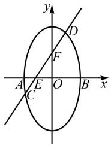
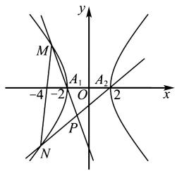
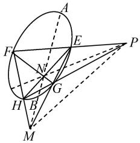

# 基于高观点下的圆锥曲线中的非对称问题研究

王佳

(西安高新第一中学,陕西 西安 710000)

摘 要:文章选取一道具有极点极线背景的圆锥曲线非对称问题,通过七种不同方法进行解答,旨在总结非对称问题的常见处理策略.同时,对一道非对称问题的高考真题进行赏析.在圆锥曲线教学中,教师应当精选教学题材,引导学生从多角度解题,真正提升学生的运算能力.

关键词：

中图分类号：G632

文献标识码: A

近年来,高考中极点、极线背景的解析几何题频繁出现,虽然利用极点、极线性质可快速得出答案,但该知识超出高考范围,实际作答需依托高中教材内知识.由于学生在解析几何运算中常遇困难,因此数学运算核心素养愈发受到重视.数学运算主要涵盖理解运算对象、掌握运算法则、探究运算思路、选择运算方法、设计运算程序及得出运算结果等方面 $^{[1]}$ ,这在圆锥曲线问题中,尤其体现在运算方法选择的重要性上.

# 1 问题提出

在处理直线与圆锥曲线之间的位置关系问题时,通常需要将直线与圆锥曲线的方程联立,将其中一个变量 x 或 y 消去,得到一个一元二次方程如 $Ax^{2} + Bx + C = 0 (A \neq 0)$ . 由韦达定理处理形如 $\left|x_{1} - x_{2}\right|$ , $\frac{1}{x_{1}} + \frac{1}{x_{2}}$ 之类的式子,这类式子通常具有 “轮换性”, 即把 $x_{1}, x_{2}$ 互换后结果不变. 此类问题称为 “对称型韦达定理问题”, 通常对所求式稍作变形, 就可以直接利用韦达定理整体代入, 实现平稳求解. 但有些问题中却会出现非对称的结构, 比如 $\frac{x_{2}}{x_{1}}, mx_{1} + nx_{2} (m \neq n), \frac{my_{1}y_{2} - y_{1}}{my_{1}y_{2} + 3y_{1}}$ 之类的问题, 则很

文章编号:1008-0333(2025)16-0053-04

难直接应用韦达定理求解,我们通常把这类问题称为“非对称韦达定理问题”.考生在遇到此类问题时,往往不知所措.那应该如何解决这类问题呢?

# 2 问题呈现

例 1 如图 1, 椭圆 $x^{2} + \frac{y^{2}}{4} = 1$ 短轴的左右两个端点分别为 A, B, 直线 $l: y = kx + 1$ 与 x 轴、y 轴分别交于 E, F 两点, 交椭圆于 C, D 两点. 设直线 AD, CB 的斜率分别为 $k_{1}, k_{2}$ , 若 $k_{1}: k_{2} = 2: 1$ , 求 k 的值.

text_image

y
D
F
A E O B x
C

图 1 椭圆示意图

# 3 多视角探求

视角 1 利用“极点极线”,从高观点出发解题.

解法 1 直线 $l: y = kx + 1$ 与 x 轴交于点 E，则点 $E(-\frac{1}{k}, 0)$ ，设直线 AC 与直线 BD 交于点 P，直

线 BC 与直线 DA 交于点 Q，则点 $E(-\frac{1}{k},0)$ 的极线为 PQ，且直线 PQ 的方程为 x = -k.

故可设点 Q 坐标为 $Q(-k,t)$ ,

所以 $\frac{k_{1}}{k_{2}}=\frac{k_{AD}}{k_{BC}}=\frac{(y_{Q}-y_{A})/(x_{Q}-x_{B})}{(y_{Q}-y_{B})/(x_{Q}-x_{B})}=\frac{k+1}{k-1}=2.$

故 k = 3.

视角 2 韦达定理代一半后,仅留 $x_{1}$ .

解法2 设 $C(x_{1},y_{1}),D(x_{2},y_{2})$ ，则

$$
\begin{array}{l} \frac {k _ {1}}{k _ {2}} = \frac {y _ {2} (x _ {1} - 1)}{(x _ {2} + 1) y _ {1}} = \frac {(k x _ {2} + 1) (x _ {1} - 1)}{(k x _ {1} + 1) (x _ {2} + 1)} \\ = \frac {k x _ {1} x _ {2} - k x _ {2} + x _ {1} - 1}{k x _ {1} x _ {2} + k x _ {1} + x _ {2} + 1} \\ \end{array}
$$

由 $\left\{\begin{aligned}x^{2}+\frac{y^{2}}{4}&=1,\\ y&=kx+1,\end{aligned}\right.$ 得 $(k^{2}+4)x^{2}+2kx-3=0.$

故 $x_{1} + x_{2} = \frac{-2k}{k^{2} + 4}, x_{1}x_{2} = \frac{-3}{k^{2} + 4}$ .

所以 $\frac{k_1}{k_2} = \frac{k[x_1x_2 - (x_1 + x_2)] + (k + 1)x_1 - 1}{kx_1x_2 + x_1 + x_2 + (k - 1)x_1 + 1}$

$$
= \frac {(k + 1) (k - 4) / (k ^ {2} + 4) + (k + 1) x _ {1}}{(k - 1) (k - 4) / (k ^ {2} + 4) + (k - 1) x _ {1}} = 2.
$$

由于上面分式为定值 2, 故 $\frac{k+1}{k-1}=2$ .

从而得 k=3.

评注 若 $\frac{a + bx_1}{c + dx_2} = p$ （其中 $p$ 为定值， $a, b, c, d$ 为参量， $x_1, x_2$ 为变量），则 $\frac{a}{c} = \frac{b}{d} = p$ .

视角 3 韦达定理代一半后,仅留 $x_{2}$ .

解法 3 接解法 2 得

$$
\begin{array}{l} \frac {k _ {1}}{k _ {2}} = \frac {\left[ k x _ {1} x _ {2} + \left(x _ {1} + x _ {2}\right) - 1 \right] - (k + 1) x _ {2}}{\left[ k x _ {1} x _ {2} + k \left(x _ {1} + x _ {2}\right) + 1 \right] - (k - 1) x _ {2}} \\ = \frac {- (k + 1) (k + 4) / (k ^ {2} + 4) - (k + 1) x _ {2}}{- (k - 1) (k + 4) / (k ^ {2} + 4) - (k - 1) x _ {2}} \\ = \frac {k + 1}{k - 1} = 2. \\ \end{array}
$$

从而得 $k = 3$

视角 4 平方策略.

解法4 由解法2知 $\frac{k_1}{k_2} = \frac{y_2(x_1 - 1)}{(x_2 + 1)y_1} = 2.$

对上式平方, 得 $\frac{k_{1}^{2}}{k_{2}^{2}} = \frac{y_{2}^{2}(x_{1}-1)^{2}}{(x_{2}+1)^{2}y_{1}^{2}} = 4.$

由点 C, D 坐标均满足椭圆方程, 故

$$
y _ {1} ^ {2} = 4 - 4 x _ {1} ^ {2}, y _ {2} ^ {2} = 4 - 4 x _ {2} ^ {2}.
$$

代入上式,化简得 $\frac{(1-x_{2})(1-x_{1})}{(1+x_{2})(1+x_{1})}=4.$

所以 $3x_{1}x_{2}+5(x_{1}+x_{2})+3=0.$

所以 $3k^{2}-10k+3=0.$

从而得 k=3 或 $\frac{1}{3}$ (舍)，故 k=3

视角 5 利用“第三定义”转化为斜率之积.

解法 5 设直线 BD 的斜率为 $k_{3}$ ，则由椭圆的第三定义知， $k_{1}k_{3} = -\frac{a^{2}}{b^{2}} = -4$ .

所以 $k_{1} = -\frac{4}{k_{3}}$ .

故 $\frac{k_{1}}{k_{2}}=\frac{-4}{k_{2}k_{3}}=\frac{-4(x_{1}-1)(x_{2}-1)}{y_{1}y_{2}}=\frac{(k+1)^{2}}{k^{2}-1}=2.$

所以 k=3.

视角 6 利用“求根公式”转化.

解法 6 由解法 2 知 $\frac{k_{1}}{k_{2}} = \frac{y_{2}(x_{1} - 1)}{(x_{2} + 1)y_{1}} = 2.$

又 $y_{1} = kx_{1} + 1, y_{2} = kx_{2} + 1$ ，代入得

$$
k x _ {1} x _ {2} + (2 k - 1) \left(x _ {1} + x _ {2}\right) - (k - 3) x _ {2} + 3 = 0.
$$

将 $x_{1} + x_{2} = \frac{-2k}{k^{2} + 4}, x_{1}x_{2} = \frac{-3}{k^{2} + 4}, x_{2}$ $= \frac{-k + 2\sqrt{k^2 + 3}}{4 + k^2}$ 代入上式，得

$$
1 2 - 4 k + (6 - 2 k) \sqrt {k ^ {2} + 3} = 0.
$$

从而得 $2(3-k)(2+\sqrt{k^{2}+3})=0.$

故 k = 3.

视角 7 “定比点差法”.

解法 7 设 $\overrightarrow{CE} = \lambda \overrightarrow{ED}$ ，设 $C(x_{1}, y_{1}), D(x_{2}, y_{2})$ ，则

$$
\left\{ \begin{array}{c} - \frac {1}{k} = \frac {x _ {1} + \lambda x _ {2}}{1 + \lambda}, \\ 0 = \frac {y _ {1} + \lambda y _ {2}}{1 + \lambda}. \end{array} \right.
$$

由定比点差法, 得 $\left\{\begin{aligned}x_{1}^{2}+\frac{y_{1}^{2}}{4}&=1,\\ \lambda^{2}x_{2}^{2}+\lambda^{2}\cdot\frac{y_{2}^{2}}{4}&=\lambda^{2}.\end{aligned}\right.$

两式作差,变形,得 $x_{1}-\lambda x_{2}=k(\lambda-1)$ . ①

又 $x_{1} + \lambda x_{2} = -\frac{1 + \lambda}{k},$ ②

①②两式联立,得

$$
x _ {1} = \frac {k ^ {2} (\lambda - 1) - 1 - \lambda}{2 k},
$$

$$
x _ {2} = \frac {- k ^ {2} (\lambda - 1) - 1 - \lambda}{2 k \lambda}.
$$

所以 $x_{1}-1=\frac{k^{2}(\lambda-1)-1-\lambda-2k}{2k}$ ,

$$
x _ {2} + 1 = \frac {- k ^ {2} (\lambda - 1) - 1 - \lambda + 2 k \lambda}{2 k \lambda}.
$$

故 $\frac{k_1}{k_2} = \frac{y_2(x_1 - 1)}{y_1(x_2 + 1)} = -\frac{1}{\lambda}\cdot \frac{(x_1 - 1)}{(x_2 + 1)}$

$$
= \frac {(k + 1) [ \lambda (k - 1) - (k + 1) ]}{(k - 1) [ \lambda (k - 1) - (k + 1) ]} = \frac {k + 1}{k - 1} = 2.
$$

所以 k=3.

# 4 一道非对称问题的真题解法赏析

例 2 （2023 年新课标Ⅱ卷第 21 题）已知双曲线 C 的中心为坐标原点，左焦点为 $(-2\sqrt{5},0)$ ，离心率为 $\sqrt{5}$ .

(1) 求 C 的方程;  
(2) 记 C 的左、右顶点分别为 $A_{1}, A_{2}$ ，过点 $(-4, 0)$ 的直线与 C 的左支交于 M, N 两点，M 在第二象限，直线 $MA_{1}$ 与 $NA_{2}$ 交于点 P。证明：点 P 在定直线上。

text_image

y
M
A₁
-4 -2 O A₂ 2 x
P
N

图2 双曲线示意图

解析 （1）设双曲线方程为 $\frac{x^{2}}{a^{2}} - \frac{y^{2}}{b^{2}} = 1 (a > 0, b > 0)$ ，由焦点坐标可知 $c = 2\sqrt{5}$ .

则由 $e = \frac{c}{a} = \sqrt{5}$ ，可得 $a = 2, b = \sqrt{c^2 - a^2} = 4.$

所以双曲线方程为 $\frac{x^{2}}{4}-\frac{y^{2}}{16}=1$ .

(2)思路1 直曲联立,非对称韦达定理.

设出直线方程,与双曲线方程联立,然后由点的坐标分别写出直线 $MA_{1}$ 与 $NA_{2}$ 的方程, 联立直线方程, 消去 y, 结合韦达定理计算可得 $\frac{x+2}{x-2} = -\frac{1}{3}$ , 即交点的横坐标为定值, 据此可证得点 P 在定直线 x = -1 上.

解法 1 非对称韦达定理之半配凑.

由(1)可得 $A_{1}(-2,0)$ , $A_{2}(2,0)$ . 设 $M(x_{1},y_{1})$ , $N(x_{2},y_{2})$ , 显然直线的斜率不为 0, 所以设直线 MN 的方程为 x=my-4, 且 $-\frac{1}{2}<m<\frac{1}{2}$ , 与 $\frac{x^{2}}{4}-\frac{y^{2}}{16}=1$ 联立可得 $(4m^{2}-1)y^{2}-32my+48=0$ , 且 $\Delta=64(4m^{2}+3)>0$ .

则 $y_{1} + y_{2} = \frac{32m}{4m^{2} - 1}, y_{1}y_{2} = \frac{48}{4m^{2} - 1}$ .

直线 $MA_{1}$ 的方程为 $y=\frac{y_{1}}{x_{1}+2}(x+2)$ ,

直线 $NA_{2}$ 的方程为 $y=\frac{y_{2}}{x_{2}-2}(x-2)$ ,

联立直线 $MA_{1}$ 与直线 $NA_{2}$ 的方程可得

$$
\begin{array}{l} \frac {x + 2}{x - 2} = \frac {y _ {2} (x _ {1} + 2)}{y _ {1} (x _ {2} - 2)} \\ = \frac {y _ {2} (m y _ {1} - 2)}{y _ {1} (m y _ {2} - 6)} \\ = \frac {m y _ {1} y _ {2} - 2 \left(y _ {1} + y _ {2}\right) + 2 y _ {1}}{m y _ {1} y _ {2} - 6 y _ {1}} \\ = \frac {4 8 m / \left(4 m ^ {2} - 1\right) - 2 \times 3 2 m / \left(4 m ^ {2} - 1\right) + 2 y _ {1}}{4 8 m / \left(4 m ^ {2} - 1\right) - 6 y _ {1}} \\ = \frac {- 1 6 m / (4 m ^ {2} - 1) + 2 y _ {1}}{4 8 m / (4 m ^ {2} - 1) - 6 y _ {1}} = - \frac {1}{3}. \\ \end{array}
$$

由 $\frac{x+2}{x-2}=-\frac{1}{3}$ 可得x=-1，即 $x_{P}=-1$ ，据此可得点P在定直线x=-1上运动.

解法 2 非对称韦达定理之和积转化.

由解法1知, $y_{1}+y_{2}=\frac{32m}{4m^{2}-1},y_{1}y_{2}=\frac{48}{4m^{2}-1}.$

所以 $my_{1}y_{2}=\frac{3}{2}(y_{1}+y_{2})$ .

所以 $\frac{x + 2}{x - 2} = \frac{y_2(x_1 + 2)}{y_1(x_2 - 2)}$

$$
= \frac {y _ {2} (m y _ {1} - 2)}{y _ {1} (m y _ {2} - 6)}
$$

$$
= \frac {3 \left(y _ {1} + y _ {2}\right) - 4 y _ {2}}{3 \left(y _ {1} + y _ {2}\right) - 1 2 y _ {1}}
$$

$$
= \frac {3 y _ {1} - y _ {2}}{- 3 (3 y _ {1} - y _ {2})} = - \frac {1}{3}.
$$

由 $\frac{x+2}{x-2}=-\frac{1}{3}$ 可得x=-1，即 $x_{P}=-1$ ，据此可得点P在定直线x=-1上运动 $^{[2]}$ .

解法 3 非对称韦达定理之求根公式计算.

由解法 1 知, 直线 MN 与曲线 C 联立得 $(4m^{2}-1)y^{2}-32my+48=0$ , 且 $\Delta=64(4m^{2}+3)>0$ .

则 $y_{1} + y_{2} = \frac{32m}{4m^{2} - 1},y_{1}y_{2} = \frac{48}{4m^{2} - 1}.$

又由求根公式,可得

$$
y _ {1} = \frac {3 2 m + \sqrt {\Delta}}{2 (4 m ^ {2} - 1)} = \frac {1 6 m + 4 \sqrt {4 m ^ {2} + 3}}{4 m ^ {2} - 1},
$$

$$
y _ {2} = \frac {3 2 m - \sqrt {\Delta}}{2 (4 m ^ {2} - 1)} = \frac {1 6 m - 4 \sqrt {4 m ^ {2} + 3}}{4 m ^ {2} - 1}.
$$

所以 $\frac{x + 2}{x - 2} = \frac{y_2(x_1 + 2)}{y_1(x_2 - 2)}$

$$
= \frac {m y _ {1} y _ {2} - 2 y _ {2}}{m y _ {1} y _ {2} - 6 y _ {1}}
$$

$$
= \frac {4 8 m / \left(4 m ^ {2} - 1\right) - 2 y _ {2}}{4 8 m / \left(4 m ^ {2} - 1\right) - 6 y _ {1}}
$$

$$
= \frac {4 8 m / (4 m ^ {2} - 1) - (3 2 m - \sqrt {\Delta}) / (4 m ^ {2} - 1)}{4 8 m / (4 m ^ {2} - 1) - 3 (3 2 m + \sqrt {\Delta}) / (4 m ^ {2} - 1)}
$$

$$
= \frac {1 6 m + 8 \sqrt {4 m ^ {2} + 3}}{- 4 8 m - 2 4 \sqrt {4 m ^ {2} + 3}} = - \frac {1}{3}.
$$

即 $x_{P} = -1$ ，据此可得点 P 在定直线 x = -1 上运动.

思路 2 从高观点出发,极点极限统领.

定义 1 （从几何角度看极点与极线）

如图 3, 设 P 是不在圆锥曲线上的点, 过点 P 引两条割线依次交圆锥曲线于四点 E, F, G, H, 连接 EH, FG 交于点 N, 连接 EG, FH 交于点 M, 则直线 MN 为点 P 对应的极线. 若 P 为圆锥曲线上的点, 则过点 P 的切线即为极线.

text_image

Geometric diagram with labeled points and lines, likely from a math problem or proof

图 3 极点极线示意图

由图 3 可知, 同理 PM 为点 N 对应的极线, PN 为点 M 对应的极线, $\triangle MNP$ 称为自极三点形. 若连接 MN 交圆锥曲线于点 A, B, 则 PA, PB 恰为圆锥曲线的切线.

定义 2 （从代数角度看极点与极线）

已知圆锥曲线 $\Gamma:Ax^{2}+Cy^{2}+2Dx+2Ey+F=0$ ，则称 $P(x_{0},y_{0})$ 和直线 $l:Ax_{0}x+Cy_{0}y+D(x+x_{0})+E(y+y_{0})+F=0$ 是圆锥曲线 $\Gamma$ 的一对极点和极线.

事实上,在圆锥曲线方程中,以 $x_{0}x$ 替换 $x^{2}$ , 以 $\frac{x_{0}+x}{2}$ 替换 x (另一变量也是如此), 即可得到点 $P(x_{0},y_{0})$ 的极线方程.

解法 4 （极点极线秒解）如图 2 所示，在凹四边形 $MA_{1}NA_{2}$ 中，直线过定点 $(-4,0)$ ，该点的极线即为点 P 的轨迹，该极线方程为： $\frac{-4x}{4}-\frac{0\cdot y}{b^{2}}=1$ ，即点 P 的轨迹方程为 x=-1.

2023 年新课标Ⅱ卷这道解析几何高考题是以极点极线为背景的题目,利用极点极线的定义,可以迅速得出题目的答案,也能确定题目运算的方向,然而具体的解答过程,还需要详细规范地呈现.

# 5 结束语

在高中数学教学中,教师若能以更宏观的视角进行教学设计,无疑可以大幅提升教学效果,尤其是在解析几何教学中,引导学生合理运用运算技巧尤为关键.因此,教师应当精选教学题材,优先选择经典且具有发散性、迁移性的素材,并深入挖掘题目的各个维度,在指导学生解题的过程中,切实提高学生的推理能力和数学运算素养.

# 参考文献：

[1] 中华人民共和国教育部. 普通高中数学课程标准 (2017 年版) [M]. 北京: 人民教育出版社, 2018.  
[2] 杨颖琪. 圆锥曲线综合题的三种解法呈现与教学建议 [J]. 福建教育学院学报, 2023, 24(09): 37-40.

[责任编辑:李慧娇]