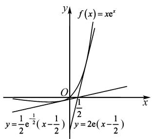
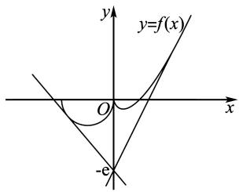

# 破解不等式恒成立问题的策略

姚振晖

(福建省永春美岭中学, 福建 泉州 362600)

摘 要:文章深入探讨解决不等式恒成立问题的多种策略,详细阐述主元法、数形结合法(含切线法)以及转化为函数最值问题的方法,同时对必要性探路、特殊性法、选择代入验证等特殊方法也进行了分析,最后通过丰富的实例展示了不同策略在不同情境下的运用.

关键词: 不等式恒成立; 主元法; 数形结合法; 函数最值

中图分类号：G632

文献标识码：A

文章编号:1008-0333(2025)16-0021-03

不等式恒成立问题综合考查函数、导数、不等式等知识,能有效检测学生的逻辑思维、运算求解和综合运用知识的能力.因其涉及知识面广、题型多变且思维难度大,成为高中数学教学与学习的难点.

深入研究不等式恒成立问题的解题策略,能为教学提供有效方法,助力学生突破学习瓶颈,提高数学素养 $^{[1]}$ .

# 1 主元法

主元法是指在一个多元数学问题中,以其中一个变量为“主元”,将问题转化为该主元的函数、方程或不等式等问题,其本质是函数与方程思想的应用.数学中的多元变量问题,若按常规思路确定主元,可能导致问题复杂化,此时,若能针对题目的结构特征,改变思考的角度,选择合适的主元切入问题,可以大大降低题目难度.

例 1 已知函数 $f(x)=x|x-a|-2a^{2}$ . 若当 x>2 时, $f(x)>0$ , 则 a 的取值范围是 \_\_\_\_.

分析 本题的研究对象为含参数 a 的函数 $f(x)=x|x-a|-2a^{2}$ . 若采用常规方法, 将其写成分段函数并绘制图象草图,进而求解 a 的取值范围,不仅运算量较大,还极易忽略 a 为负数的情况.实际上,本题考查学生的数学思维,体现了“多想少算”的命题理念.

解析 当 x > 2 时, $f(x) > 0$ 等价于 $x(x - a) - 2a^{2} > 0$ 或者 $x(a - x) - 2a^{2} > 0$ .

把 a 视作“主元”进行变形, 可得 $(a + x)(a - \frac{x}{2}) < 0$ 或者 $(a - \frac{x}{4})^{2} + \frac{7}{16}x^{2} < 0$ . 由此推出 -x < a < $\frac{x}{2}$ , 最终得出 a 的取值范围是 $-2 \leqslant x \leqslant 1$ .

点评 主元法关键在于根据不等式特点合理选择主元,通常选择次数较低、系数较为简单的变量为主元.当不等式中某个变量的范围已知时,常将该变量作为主元.主元法能有效降低问题维度,适用于多元不等式恒成立问题.

# 2 数形结合法

面对不等式恒成立问题时,我们能够将不等式两边的表达式分别视作两个独立函数,然后精准绘制出

收稿日期:2025-03-05

作者简介:姚振晖,本科,二级教师,从事高中数学教学研究.

它们的图象. 此时, 借助图象间的位置关系, 便能直观地判断出不等式恒成立所需满足的条件. 而切线法作为数形结合法的特殊情形, 是通过深度剖析函数图象的切线来精准确定不等式恒成立的边界条件.

例 2 已知函数 $f(x) = x \mathrm{e}^{x}$ ，若 $f(x) \geqslant ax - \frac{1}{2} a$ 恒成立，则实数 a 的最大值为 \_\_\_\_.

解析 由题意可得 $f'(x) = (x + 1)\mathrm{e}^x$ .

当 $x > -1$ 时， $f'(x) > 0$ ；当 $x < -1$ 时， $f'(x) < 0$ 。故 $f(x)$ 在 $(- \infty, -1)$ 上单调递减，在 $(-1, +\infty)$ 上单调递增。

若 $f(x) = x\mathrm{e}^{x}$ 的图象与直线 $y = a(x - \frac{1}{2})$ 相切时，设切点为 $(x_0, x_0\mathrm{e}^{x_0})$ ，则切线斜率 $a = f'(x_0) = (x_0 + 1)\mathrm{e}^{x_0}$ ，所以该切线方程为

$$
y - x _ {0} \mathrm{e} ^ {x _ {0}} = (x _ {0} + 1) \mathrm{e} ^ {x _ {0}} (x - x _ {0}).
$$

注意到切线过点 $\left(\frac{1}{2},0\right)$ ，则

$$
0 - x _ {0} \mathrm{e} ^ {x _ {0}} = (x _ {0} + 1) \mathrm{e} ^ {x _ {0}} (\frac {1}{2} - x _ {0}).
$$

整理, 得 $2x_{0}^{2}-x_{0}-1=0$ , 解得 $x_{0}=1$ 或 $-\frac{1}{2}$ .

当 $x_{0}=1$ 时, $a=f'(1)=2e;$

当 $x_0 = -\frac{1}{2}$ 时， $a = f'\left(\frac{1}{2}\right) = \frac{1}{2}\mathrm{e}^{-\frac{1}{2}}.$

结合图 1 可得实数 a 的取值范围为 $\left[\frac{1}{2}e^{-\frac{1}{2}},2e\right]$ ，即实数 a 的最大值为 2e.

text_image

f(x) = xe^x
y = \frac{1}{2}e^{-\frac{1}{2}}(x - \frac{1}{2})
y = 2e(x - \frac{1}{2})

图1 例2解析图

例3 已知函数 $f(x) = \begin{cases} -\sqrt{-x^2 - 2x}, & x \leqslant 0, \\ x \ln x, & x > 0, \end{cases}$ 若关

于 $x$ 的不等式 $f(x) > ax - \mathrm{e}(\mathrm{e}$ 是自然对数的底数）在 $\mathbf{R}$ 上恒成立，则 $a$ 的取值范围

解析 $f(x) > ax - \mathrm{e}$ 在 $\mathbf{R}$ 上恒成立, 等价于 $f(x)$ 的图象恒在直线 $y = ax - \mathrm{e}$ 的上方.

$$
y = - \sqrt {- x ^ {2} - 2 x} = - \sqrt {- (x + 1) ^ {2} + 1},
$$

两边平方后得 $(x+1)^{2}+y^{2}=1(y\leqslant0)$ .

所以 $y = -\sqrt{-x^{2} - 2x}$ 的图象是以 $(-1,0)$ 为圆心，半径为 1，并且在 x 轴的下半部分的半圆， $y = x \ln x (x > 0)$ ，由 $y' = \ln x + 1 = 0$ ，得 $x = \frac{1}{e}$ .

当 $x \in (0, \frac{1}{\mathrm{e}})$ 时, $y' < 0$ , 函数 $y = x \ln x$ 在 $(0, \frac{1}{\mathrm{e}})$ 单调递减, 当 $x \in (\frac{1}{\mathrm{e}}, +\infty)$ 时, $y' > 0$ , 函数 $y = x \ln x$ 在 $(\frac{1}{\mathrm{e}}, +\infty)$ 单调递增, 当 $x = \frac{1}{\mathrm{e}}$ 时, 函数 $y = x \ln x$ 取得最小值 $-\frac{1}{\mathrm{e}}$ .

如图 2 所示, 画出函数 $f(x)$ 的图象.

text_image

y
y=f(x)
O
x
-e

图2 例3解析图

直线 y = ax - e 恒过定点 $(0, -\mathrm{e})$ ，当直线 y = ax - e 与 $y = x \ln x (x > 0)$ 相切时，设切点 $P(x_{0}, x_{0} \ln x_{0})$ ，由 $y' = \ln x + 1$ ，可得 $k = 1 + \ln x_{0}$ 。由 $1 + \ln x_{0} = \frac{x_{0} \ln x_{0} + \mathrm{e}}{x_{0}}$ ，解得 $x_{0} = e$ ，则切线的斜率为 2。

当直线 $y = ax - \mathrm{e}$ 与 $y = -\sqrt{-(x + 1)^2 + 1} (x \leqslant 0)$ 相切时，直线 $y = ax - \mathrm{e}$ 与半圆 $(x + 1)^2 + y^2 = 1$ （ $y \leqslant 0$ ）相切，由 $\frac{|-a - \mathrm{e}|}{\sqrt{a^2 + 1}} = 1$ ，解得 $a = \frac{1 - \mathrm{e}^2}{2\mathrm{e}}$ .

由图2可知，a的取值范围是 $\left(\frac{1-\mathrm{e}^{2}}{2\mathrm{e}},2\right)$ .

点评 本题的关键是正确画出函数 $f(x)$ 的图

象,并会根据直线与曲线相切求直线的斜率.

# 3 转化为函数的最值问题

转化为函数最值问题,关键是构造合适的函数,利用导数求函数的最值.要注意函数的定义域和单调性对最值的影响.

例 4 已知正数 a, b 满足 $\frac{e^{2a}}{8} + 2b \leqslant a + \frac{1}{2}\ln b + 1$ ，则 $e^{a} + b =$ \_\_\_\_ .

解析 由 $\frac{\mathrm{e}^{2a}}{8} + 2b \leqslant a + \frac{1}{2}\ln b + 1$ ，得

$$
\mathrm{e} ^ {2 a} - 8 a \leqslant 4 \ln b - 1 6 b + 8.
$$

设 $f(x)=\mathrm{e}^{x}-4x(x>0)$ ，则 $f'(x)=\mathrm{e}^{x}-4$ 。当 $x>\ln 4$ 时， $f'(x)>0$ ，当 $0<x<\ln 4$ 时， $f'(x)<0$ ，所以 $f(x)$ 在 $(0,\ln 4)$ 上单调递减，在 $(\ln 4,+\infty)$ 上单调递增，则 $f(x)_{\min}=f(\ln 4)=4-8\ln 2$ 。故 $f(2a)=\mathrm{e}^{2a}-8a\geqslant4-8\ln 2$ ，当且仅当 $2a=\ln 4$ ，即 $a=\ln 2$ 时取等号。

设 $g(x)=4\ln x-16x+8$ ，则 $g'(x)=\frac{4(1-4x)}{x}$ ，
当 $0 < x < \frac{1}{4}$ 时 $g'(x) > 0$ ，当 $\frac{1}{4} < x$ 时 $g'(x) < 0$ ，所以 $g(x)$ 在 $(0, \frac{1}{4})$ 上单调递增，在 $(\frac{1}{4}, +\infty)$ 上单调递减，所以 $g(x)_{\max} = g(\frac{1}{4}) = 4 - 8\ln 2$ 。故 $g(b) = 4\ln b - 16b + 8 \leqslant 4 - 8\ln 2$ ，当且仅当 $b = \frac{1}{4}$ 时取等号。

又 $f(2a) \leqslant g(b)$ , 则 $f(2a) = g(b) = 4 - 8\ln 2$ , 此时 $a = \ln 2, b = \frac{1}{4}$ , 则 $\mathrm{e}^a + b = 2 + \frac{1}{4} = \frac{9}{4}$ .

# 4 一些特殊方法

# 4.1 必要性探路

先通过对不等式恒成立的必要条件进行探究,缩小参数的取值范围,再在此范围内证明充分性.通常取一些特殊值或对不等式进行初步放缩,得到参数的一个大致范围,然后在此基础上进行深入分析 $^{[2]}$ .

# 4.2 特殊值法

利用问题中的特殊情况、特殊值或特殊性质来解决不等式恒成立问题. 通过对特殊情形的分析, 找到一般性的规律或结论, 或者直接得出满足不等式恒成立的条件.

# 4.3 选项代入验证

对于一些给定参数取值范围,判断不等式是否恒成立的问题,可以在取值范围内选择一些具有代表性的值代入不等式进行验证.如果这些特殊值都满足不等式恒成立,再结合函数的性质或进一步的推理来确定整个取值范围是否满足不等式恒成立.

# 5 结束语

不等式恒成立问题作为高中数学的重要内容,考查形式多样,难度较大.本文介绍的主元法、数形结合法、转化为函数最值问题等方法为解决此类问题提供了多种途径.此外,破解恒成立问题的策略还有必要性探路、特殊性法、选择代入验证等特殊方法等,读者需根据具体问题选择恰当的策略来解决.

在教学中,教师应引导学生根据题目特点灵活选择方法,培养学生的数学思维和创新能力.同时,不等式恒成立问题与其他数学知识联系紧密,未来可进一步研究其与数列、解析几何等知识的综合应用,拓展解题策略,提升学生综合运用知识的能力.通过不断探索和总结,帮助学生更好地掌握不等式恒成立问题的解法,提高数学学习效果.

# 参考文献：

[1] 李鸿昌. 一道新高考导数压轴题的解法探究 [J]. 高中数学教与学, 2021(15): 22-23.  
[2] 李鸿昌. 破解一类导数压轴题的新思路 [J]. 中学数学杂志, 2019(05): 31-33.

[责任编辑:李慧娇]