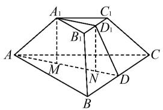
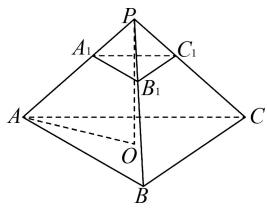

# 重视模型探究 提升数学素养

——以 2024 年新高考Ⅱ卷第 7 题为例

# 孙星星

(江苏省江安高级中学, 江苏 如皋 226500)

摘 要:立体几何作为高考重点考查的内容,主要以常规几何体模型(如棱台等)为载体,考查空间几何体结构特征的应用、空间线面位置关系的判定、空间度量(空间角、距离、面积、体积)的求法等,从而达到落实和提升直观想象、逻辑推理、数学建模及数学运算等数学核心素养的目的.

关键词:棱台;解法;探源;变式;素养

中图分类号：G632

文献标识码:A

文章编号:1008-0333(2025)16-0068-05

“棱台”在立体几何众多几何体模型中,并非传统意义上的核心考点.然而近年来,它却在新高考数学卷客观题中高频亮相且不断创新命题形式.2021—2024年间,八套新高考数学试卷的客观题中,棱台相关题目竟出现六次,考查频率之高,值得重点关注.从表1统计的这四年新高考数学卷对棱

表 1 2021—2024 年新高考数学试卷对棱台考查一览

<table><tr><td>年份</td><td>卷别</td><td>题号</td><td>棱台模型</td><td>考查内容</td><td></td></tr><tr><td>2021</td><td>II</td><td>5</td><td>正四棱台</td><td>求正四棱台的体积</td><td></td></tr><tr><td rowspan="2">2022</td><td>I</td><td>4</td><td>倒正四棱台</td><td>求倒正四棱台的体积</td><td>棱台应用题</td></tr><tr><td>II</td><td>7</td><td>正三棱台</td><td>求正三棱台外接球表面积</td><td></td></tr><tr><td rowspan="2">2023</td><td>I</td><td>14</td><td>正四棱台</td><td>求正四棱台的体积</td><td></td></tr><tr><td>II</td><td>14</td><td>正四棱锥截得正四棱台</td><td>求正四棱台的体积</td><td></td></tr><tr><td>2024</td><td>II</td><td>7</td><td>正三棱台</td><td>求侧棱与底面所成的角</td><td></td></tr></table>

台的考查试题中,其重要性可见一斑.

由此可以预测,在 2025 年乃至未来的新高考数学卷中,“棱台”仍将受到命题专家的青睐,持续作为高考数学命题的考查热点.基于此,本文选取 2024 年新高考Ⅱ卷第 7 题,将其融入高考数学专题复习的教学实践与训练环节,引导学生从多角度、深层次探究“棱台”模型,进而提升直观想象、数学建模及逻辑推理等数学核心素养.

# 1 题目呈现

题目（2024年新高考Ⅱ卷第7题）已知正三棱台 $ABC-A_{1}B_{1}C_{1}$ 的体积为 $\frac{52}{3}, AB=6, A_{1}B_{1}=2$ ，则 $A_{1}A$ 与平面ABC所成角的正切值为（）.

A. $\frac{1}{2}$

B. 1

C. 2

D. 3

收稿日期:2025-03-05

作者简介:孙星星,一级教师,从事高中数学教学研究.

# 2 题目解析

这是一道聚焦正三棱台空间结构特征的客观性试题,涉及空间线面角的求解,考查内容涵盖三角形面积公式、棱台体积公式、相似三角形对应边成比例定理以及空间线面角等核心知识.通常情况下,针对以棱台为背景的问题,主要存在两种求解思路:其一,直接剖析几何体的结构特点,通过引垂线等常规方法计算所需几何量,进而完成试题解答;其二,采用补形法,将棱台还原为棱锥.由于棱台本质上是由棱锥截去一个小棱锥所得,因此借助补形为棱锥的方式,同样能够有效解决问题.

分析 1 根据已知正三棱台的体积以及上、下底面边长,首先运用棱台体积公式求出棱台的高,然后依据空间线、面角的定义,确定线面角的平面角.通过找出上底顶点在下底面的投影,计算该投影与相关点构成的线段长度,得到平面角所在直角三角形的一条直角边,而棱台的高则为另一条直角边,进而计算 $A_{1}A$ 与平面 ABC 所成角的正切值.

解法 1 取 BC 的中点 D, $B_{1}C_{1}$ 的中点 $D_{1}$ ，所以在正 $\triangle ABC$ 中， $AD = \sqrt{AB^{2} - BD^{2}} = 3\sqrt{3}$ , $A_{1}D_{1} = \sqrt{3}$ .

所以 $S_{\triangle ABC} = \frac{1}{2}\times 6\times 3\sqrt{3} = 9\sqrt{3}.$

同理得 $S_{\triangle A_{1}B_{1}C_{1}}=\sqrt{3}$ .

设正三棱台的高为 h，则根据题意可得

$$
\begin{array}{l} V _ {\text {正三棱台} A B C - A _ {1} B _ {1} C _ {1}} = \frac {1}{3} (9 \sqrt {3} + \sqrt {3} + \sqrt {9 \sqrt {3} \times \sqrt {3}}) h \\ = \frac {5 2}{3}, \\ \end{array}
$$

解得 $h=\frac{4\sqrt{3}}{3}$ .

如图 1, 过点 $A_{1}, D_{1}$ 分别作底面 ABC 的垂线, 垂足分别为点 M, N, 并设 AM = a, 则有

$$
A A _ {1} = \sqrt {A M ^ {2} + A _ {1} M ^ {2}} = \sqrt {a ^ {2} + \frac {1 6}{3}},
$$

$$
N D = A D - A N = A D - A M - M N = 2 \sqrt {3} - a.
$$

于是 $DD_{1} = \sqrt{ND^{2} + ND_{1}^{2}} = \sqrt{(2\sqrt{3} - a)^{2} + \frac{16}{3}}.$

在侧面等腰梯形 $BCC_{1}B_{1}$ 中, 得

$$
B B _ {1} ^ {2} = \left(\frac {6 - 2}{2}\right) ^ {2} + D D _ {1} ^ {2}.
$$

所以 $a^2 + \frac{16}{3} = (2\sqrt{3} - a)^2 + \frac{16}{3} + 4.$

从而解得 $a=\frac{4\sqrt{3}}{3}$ .

因此 $A_{1}A$ 与平面 $ABC$ 所成角的正切值 $\tan \angle A_{1}AM = \frac{A_{1}M}{AM} = 1.$ 故选B.

text_image

A₁
C₁
B₁
D₁
A
M
N
D
B
C

图 1 解法 1 示意图

text_image

P
A₁ C₁
B₁
A O C
B

图2 解法2示意图

点评 该解法从正三棱台模型的结构特征出发,逆用正三棱台的体积公式建立等式,求出正三棱台的高.接着将问题转化到三角形中,借助勾股定理及三角函数的边角关系进行求解.这一过程有助于提升学生直观想象、数学建模等核心素养.

分析 2 把正三棱台 $ABC-A_{1}B_{1}C_{1}$ 补形成正三棱锥 P-ABC，可知 $A_{1}A$ 与平面 ABC 所成角就是 PA 与平面 ABC 所成角，然后根据锥体比例性质求得 $V_{P-ABC}$ ，从而根据体积公式求出正三棱锥 P-ABC 的高，进而求得结果.

解法 2 如图 2, 把正三棱台 $ABC - A_{1}B_{1}C_{1}$ 补形成为正三棱锥 P - ABC, 则可知 $A_{1}A$ 与平面 ABC 所成角就是 PA 与平面 ABC 所成角.

由于 $\frac{PA_1}{PA} = \frac{A_1B_1}{AB} = \frac{2}{6} = \frac{1}{3}$ ，则

$$
\frac {V _ {\text {三棱锥} P - A _ {1} B _ {1} C _ {1}}}{V _ {\text {三棱锥} P - A B C}} = \left(\frac {1}{3}\right) ^ {3} = \frac {1}{2 7}.
$$

可知 $V_{三棱台ABC-A_{1}B_{1}C_{1}} = V_{三棱锥P-ABC} - V_{三棱锥P-A_{1}B_{1}C_{1}}$ $=\frac{26}{27}V_{三棱锥P-ABC}=\frac{52}{3}$ . 所以 $V_{三棱锥P-ABC}=18$ .

设正三棱锥 P-ABC 高为 d, 可得

$$
\begin{array}{l} V _ {\text {三棱锥} P - A B C} = \frac {1}{3} S _ {\triangle A B C} \cdot d \\ = \frac {1}{3} \times \frac {1}{2} \times 6 \times 6 \times \frac {\sqrt {3}}{2} \cdot d = 1 8. \\ \end{array}
$$

于是 $d = 2\sqrt{3}$

取下底面 $\triangle ABC$ 中心为 O, 易知 $OP \perp$ 底面 ABC, 且 $OA = 2\sqrt{3}$ , 所以 PA 与平面 ABC 所成角的正切值 $\tan \angle PAO = \frac{OP}{OA} = 1$ . 故选 B.

点评 由于台体是由平行于底面的平面截锥体得到的,因此求解截面分台体的侧面积及体积比的问题时,可“还台为锥”进行求解.试题解法2就是通过补形,还台为锥,利用“体积比是相似比的立方”求得正三棱锥P-ABC的体积,然后利用三棱锥的体积公式求出正三棱锥的高,最后转化到三角形中利用三角函数的边角关系求得正三棱台 $ABC-A_{1}B_{1}C_{1}$ 的侧棱 $A_{1}A$ 与平面ABC所成角的正切值,补形法体现了化归转化思想的运用,可以简捷、快速地求解问题,提升直观想象、数学建模及逻辑推理等数学核心素养.

# 3 高考题探源

对高考试题追本溯源,探寻其出处与命题轨迹,有助于研究高考命题规律,精准把控复习备考方向,提高复习的针对性与效率,对提升学生数学核心素养具有积极的导向作用.

# 3.1 教材探源

上述试题包含两个考查重点:一是运用几何法确定线面角;二是将正三棱台转化为正三棱锥.从试题的两种解法可以看出,该试题是由教材中的两道题目整合改编而来.

教材题 1 （人教 A 版新教材必修第二册第 154 页例 6）推导棱台的体积公式 $V_{ABC-A_{1}B_{1}C_{1}} = \frac{1}{3} \cdot (S' + \sqrt{S'S} + S)$ ，其中 $S'$ ，S 分别是棱台的上、下底面面积, h 是高.

注意:在推导台体体积公式的过程中,运用了“面积比是相似比的平方”这一性质.

教材题 2 （人教 A 版新教材选择性必修第一册第 49 页第 14 题）在正四棱锥 S-ABCD 中，O 为顶点 S 在底面内的射影，P 为侧棱 SD 的中点，且 SO = OD. 求直线 BC 与平面 PAC 所成的角.

# 3.2 真题探源

许多高考试题往往由以往的高考真题改编延伸而来,上述试题也不例外,它与下面这道往年高考真题相关联,两道高考题堪称一对“姊妹题”.

(1991 年全国高考数学试题(理科)第 18 题)已知正三棱台上底面边长为 2, 下底面边长为 4, 且侧棱与底面所成角是 $45^{\circ}$ , 那么这个正三棱台的体积等于 \_\_\_\_.

由此可见,对高考数学复习而言,历届高考数学真题都堪称永恒的经典,在教学中需要引导学生深入研究与挖掘.

# 4 高考题变式

若将试题结论中所求出的线面角作为已知条件,将结论变为求正三棱台的体积,则有:

变式 1 已知正三棱台 $ABC - A_{1}B_{1}C_{1}$ 中, AB = 6, $A_{1}B_{1} = 2$ , 侧棱 $A_{1}A$ 与平面 ABC 所成角为 $45^{\circ}$ , 则正三棱台 $ABC - A_{1}B_{1}C_{1}$ 的体积为 \_\_\_\_.

解析 如图 1, 分别取 $BC, B_{1}C_{1}$ 的中点 $D, D_{1}$ ，则 $AD = 3\sqrt{3}, A_{1}D_{1} = \sqrt{3}$ .

所以 $S_{\triangle ABC}=9\sqrt{3},S_{\triangle A_{1}B_{1}C_{1}}=\sqrt{3}.$

设正三棱台 $ABC - A_{1}B_{1}C_{1}$ 的高为 h，因为侧棱 $A_{1}A$ 与平面 ABC 所成角为 $45^{\circ}$ ，则 $AM = A_{1}M = h$ 。

所以 $AA_{1}=\sqrt{2}h, DN=AD-AM-MN=2\sqrt{3}-h.$

所以 $DD_{1} = \sqrt{DN^{2} + D_{1}N^{2}} = \sqrt{(2\sqrt{3} - h)^{2} + \frac{16}{3}}.$

由等腰梯形 $BCC_{1}B_{1}$ 可得 $BB_{1}^{2} = \left(\frac{6 - 2}{2}\right)^{2} + DD_{1}^{2}$ .

即 $h^2 + \frac{16}{3} = (2\sqrt{3} - h)^2 + \frac{16}{3} + 4$

解得 $h=\frac{4\sqrt{3}}{3}$ .

所以正三棱台 $ABC-A_{1}B_{1}C_{1}$ 的体积为

$$
V _ {A B C - A _ {1} B _ {1} C _ {1}} = \frac {1}{3} (9 \sqrt {3} + \sqrt {3} + \sqrt {9 \sqrt {3} \times \sqrt {3}}) \times \frac {4 \sqrt {3}}{3} = \frac {5 2}{3}.
$$

点评 通过对变式 1 的探究,我们能够进一步掌握和运用台体的体积公式,更熟练地进行空间线面关系的几何推理.这一过程有助于提升直观想象、数学建模、逻辑推理等数学核心素养.

若将试题变为已知正三棱台的体积、高和上底面三角形的边长,求下底面正三角形的边长,则有:

变式 2 已知正三棱台 $ABC - A_{1}B_{1}C_{1}$ 的体积为 $\frac{52}{3}$ ，高为 $\frac{4\sqrt{3}}{3}$ ， $A_{1}B_{1} = 2$ ，则 AB = \_\_\_\_.

解析 如图1,设正三棱台的下底面正三角形的边长为 $AB = x,S_{\triangle A_1B_1C_1} = \sqrt{3},S_{\triangle ABC} = \frac{1}{2} x\cdot \frac{\sqrt{3}}{2} x = \frac{\sqrt{3}}{4} x^2,$

所以由棱台的体积公式得 $\frac{1}{3} \times \frac{4\sqrt{3}}{3} \times (\sqrt{3} + \sqrt{\sqrt{3} \times \frac{\sqrt{3}}{4} x^2} + \frac{\sqrt{3}}{4} x^2) = \frac{52}{3}$ , 解得 $x = 6$ .

点评 变式 2 通过引入参数,建立关于参数的方程求解,很好地促进数学建模、直观想象及数学运算等核心素养的发展.

若将试题中已知正三棱台体积的条件去掉,将结论中所求出的线面角作为已知,将结论变为求正三棱台的表面积,则有:

变式 3 已知正三棱台 $ABC - A_{1}B_{1}C_{1}$ 中, AB = 6, $A_{1}B_{1} = 2$ , 侧棱 $A_{1}A$ 与平面 ABC 所成角为 $45^{\circ}$ , 则正三棱台 $ABC - A_{1}B_{1}C_{1}$ 的表面积为 \_\_\_\_.

解析 由变式1可知， $S_{\triangle ABC} = 9\sqrt{3}, S_{\triangle A_1B_1C_1} = \sqrt{3}$ ，且正三棱台的斜高 $DD_{1} = \frac{2\sqrt{15}}{3}$ .

所以正三棱台 $ABC - A_{1}B_{1}C_{1}$ 的表面积为

$$
\begin{array}{l} S _ {\text {表}} = S _ {\triangle A _ {1} B _ {1} C _ {1}} + S _ {\triangle A B C} + S _ {\text {侧}} \\ = \sqrt {3} + 9 \sqrt {3} + \frac {2 + 6}{2} \times \frac {2 \sqrt {1 5}}{3} \times 3 \\ = 1 0 \sqrt {3} + 8 \sqrt {1 5}. \\ \end{array}
$$

点评 变式 3 通过求解台体的表面积,体现了基本数学模型的解题应用,有利于提升直观想象、数学建模及数学运算等数学核心素养.

若将试题中已知正三棱台体积的条件去掉,将结论中所求出的线面角作为已知,进而将棱台与圆台相结合,求以正三棱台的上、下底面三角形的外接圆分别为上、下底面圆的圆台侧面积,则有:

变式 4 已知正三棱台 $ABC - A_{1}B_{1}C_{1}$ 中, AB = 6, $A_{1}B_{1} = 2$ , 侧棱 $A_{1}A$ 与平面 ABC 所成角为 $45^{\circ}$ , 则以正三棱台的上、下底面三角形的外接圆分别为上、下底面圆的圆台侧面积为 \_\_\_\_.

解析 由题意知圆台的母线即为正三棱台的侧棱 $A_{1}A$ ，根据变式1，可得 $A_{1}A = \frac{4\sqrt{6}}{3}$

设圆台上、下底面圆半径分别为 $r_{1}$ 和 $r_{2}$ ，则由正弦定理可得 $2r_{1}=\frac{2}{\sin(\pi/3)}$ ， $2r_{2}=\frac{6}{\sin(\pi/3)}$ ，解得 $r_{1}=\frac{2\sqrt{3}}{3}$ ， $r_{2}=2\sqrt{3}$ .

所以圆台侧面积为 $S_{\text{圆台侧}} = \pi (r_1 + r_2) \cdot A_1A$ $= \pi \times (\frac{2\sqrt{3}}{3} + 2\sqrt{3}) \times \frac{4\sqrt{6}}{3} = \frac{32\sqrt{2}}{3}\pi.$

点评 变式 4 巧妙地将正三棱台与圆台相结合,让学生在解决问题的过程中,有效提升数学抽象、直观想象、逻辑推理和数学运算等核心素养.

若将试题中已知正三棱台体积的条件变为已知正三棱台的高,其他条件不变,求正三棱台外接球的表面积,则有:

变式 5 已知正三棱台 $ABC - A_{1}B_{1}C_{1}$ 的高为 $\frac{4\sqrt{3}}{3}, AB = 6, A_{1}B_{1} = 2$ ，正三棱台 $ABC - A_{1}B_{1}C_{1}$ 的顶点都在同一球面上，则该球的表面积为 \_\_\_\_.

解析 设正三棱台上、下底面所在圆的半径分别为 $r_{1}$ 和 $r_{2}$ ，则由变式4可知 $r_{1}=\frac{2\sqrt{3}}{3},r_{2}=2\sqrt{3}$ .

设球心到上、下底面的距离分别为 $d_{1}$ 和 $d_{2}$ ，球的半径为 $R$ ，所以 $d_{1} = \sqrt{R^{2} - \frac{4}{3}}$ , $d_{2} = \sqrt{R^{2} - 12}$ .

故 $|d_{1}-d_{2}|=\frac{4\sqrt{3}}{3}$ 或 $d_{1}+d_{2}=\frac{4\sqrt{3}}{3}$ .

故 $|\sqrt{R^2 - \frac{4}{3}} - \sqrt{R^2 - 12}| = \frac{4\sqrt{3}}{3}$ 或 $\sqrt{R^2 - \frac{4}{3}} + \sqrt{R^2 - 12} = \frac{4\sqrt{3}}{3}$ , 解得 $R^2 = 14$ .

故球的表面积为 $4\pi R^{2}=56\pi$ .

点评 本题首先设出正三棱台上、下底面所在圆的半径,再根据球心距、圆半径与球半径之间的关系,进而求出球的半径.多面体与球的组合问题,主要以“内切”和“外接”两类为主,是高考考查的热点.解题时需深入剖析图形关系:一是定位,即明确“切”或“接”的具体位置;二是定量,即确定相关元素的数量关系.通常需要作出包含各几何体主要元素且能体现元素位置与数量关系的截面图形,将立体问题转化为平面问题,以此实现降维求解.

若将试题中已知正三棱台体积的条件去掉,将结论中所求出的线面角作为已知,求正三棱台内半径最大的球的表面积,则有:

变式 6 已知正三棱台 $ABC - A_{1}B_{1}C_{1}$ 的侧棱长为 $\frac{4\sqrt{6}}{3}, AB = 6, A_{1}B_{1} = 2$ ，则该正三棱台内半径最大的球的表面积为 \_\_\_\_.

解析 根据题意可知,正三棱台内半径最大的球与正三棱台的三个侧面及下底面均相切,设球心为 O, 球的半径 R, 利用体积分割法求解.

由变式1可知 $S_{\triangle ABC} = 9\sqrt{3}, S_{\triangle A_1B_1C_1} = \sqrt{3}$ ，正三棱台的高为 $\frac{4\sqrt{3}}{3}$ ，正三棱台的体积为 $\frac{52}{3}$ .

又由变式 3 可知正三棱台 $ABC - A_{1}B_{1}C_{1}$ 的侧面积为 $8\sqrt{15}$ .

连接球心 O 与正三棱台的各个顶点,则有

$$
\begin{array}{r l} & {\frac {1}{3} \times S _ {\triangle A _ {1} B _ {1} C _ {1}} \cdot (\frac {4 \sqrt {3}}{3} - R) + \frac {1}{3} \times S _ {\triangle A B C} \cdot R + \frac {1}{3}} \\ & {\times S _ {\text {侧}} \cdot R = \frac {5 2}{3}.} \end{array}
$$

$$
\begin{array}{r l} & {\text {即} \frac {1}{3} \times \sqrt {3} (\frac {4 \sqrt {3}}{3} - R) + \frac {1}{3} \times 9 \sqrt {3} R + \frac {1}{3} \times 8 \sqrt {1 5} R} \\ & {= \frac {5 2}{3}, \text {解得} R = \frac {\sqrt {1 5} - \sqrt {3}}{2}.} \end{array}
$$

故该正三棱台内半径最大的球的表面积为 $4\pi R^{2}=(18-6\sqrt{5})\pi.$

点评 这里利用的是分割法求解,与几何体体积有关问题常运用这种方法,依据的规则是:①完全相同的几何体,它们的体积相等;②一个几何体的体积等于它的各部分体积的和.

# 5 结束语

对空间几何体模型的探究,其核心在于准确把握空间几何体的结构特征,并能够熟练进行长度、表面积、体积、空间角等度量计算.对于不规则的空间几何体,需灵活运用分割法(如试题变式6)、补形法(还台为锥,如试题解法2)、降维转化(如高考题解法1中利用等腰梯形求解)等方法.高考的终极目的是考查学生对数学知识的综合掌握程度与应用能力.尽管高考试题形式多变,但始终围绕基本知识、技能及思想方法展开考查.因此,在高考数学复习过程中,不应区分知识点的冷热,需对每个细节知识点都深入钻研.只有将基础知识融会贯通,熟练掌握各类解题方法与技巧,才能在高考中从容应对 $^{[1]}$ .

# 参考文献：

[1] 王方舟. 高考数学复习需强化的几种意识 [J]. 中学生理科应试, 2023(12): 1-4.

[责任编辑:李慧娇]