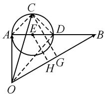

# “数”“形”切入,多解思维

# 安徽省合肥市第四中学 唐爱民

平面向量是“数”与“形”联系的典范模型,是二者的和谐统一体.在破解平面向量问题时,经常借助其“数”的性质,从代数的角度进行运算处理;或借助“形”的特征,从平面几何的角度进行直观分析.因而,在破解平面向量的相关问题时,应结合题目条件,从“数”的性质或从“形”的特征加以“两面性”思维与分析,巧妙处理,实现多角度思维,多方法处理,多层面拓展.

# 1 问题呈现

问题 在平面内, 若有 $\left|a\right|=a\cdot b=1,\left|b\right|=2$ , $(c-a)\cdot(2c-a-b)=0$ , 则 $c\cdot b$ 的最大值为 \_\_\_\_.

此题以两个确定的平面向量为问题背景,引入第三个平面向量,结合平面向量间关系的设置来确定平面向量的数量积的最值问题.具体破解时,可以从“数”的性质角度,通过坐标法来分析;或从“形”的特征角度,通过几何法来处理.

# 2 问题破解

思维视角一:坐标思维.

方法 1: 坐标 + 三角换元法. 设 $a = (1, 0)$ , $b = (1, \sqrt{3})$ , $c = (x, y)$ .

由 $(c-a)\cdot(2c-a-b)=0$ ，可得

$$
(x - 1, y) \cdot (2 x - 2, 2 y - \sqrt {3}) = 0.
$$

展开、配方，整理可得 $(x-1)^{2}+\left(y-\frac{\sqrt{3}}{4}\right)^{2}=\frac{3}{16}.$

三角换元，有

$$
x = \frac {\sqrt {3}}{4} \cos \alpha + 1, y = \frac {\sqrt {3}}{4} \sin \alpha + \frac {\sqrt {3}}{4}, \alpha \in [ 0, 2 \pi),
$$

那么 $c \cdot b = x + \sqrt{3} y = \frac{\sqrt{3}}{4} \cos \alpha + 1 + \frac{3}{4} \sin \alpha + \frac{3}{4} = \frac{\sqrt{3}}{2} \sin \left( \alpha + \frac{\pi}{6} \right) + \frac{7}{4} \leqslant \frac{\sqrt{3}}{2} + \frac{7}{4} = \frac{2\sqrt{3} + 7}{4}$ ，当且仅当 $\sin \left( \alpha + \frac{\pi}{6} \right) = 1$ ，即 $c = \left( \frac{\sqrt{3} + 8}{8}, \frac{2\sqrt{3} + 3}{8} \right)$ 时，等号成立，所以 $c \cdot b$ 的最大值为 $\frac{2\sqrt{3} + 7}{4}$ .

点评:根据平面向量的“数”的性质,建立平面直角坐标系,分别确定向量 a 与 b 的坐标,并设出向量 c的坐标,运用数量积的坐标公式加以转化,进而确定其对应的轨迹方程,通过配方借助圆的标准方程进行三角换元处理,结合数量积的坐标公式以及三角函数的辅助角公式,利用三角函数的图象与性质来确定相应的最值问题.通过坐标法借助三角换元处理,为进一步确定最值指明方向,是破解一次线性代数式最值问题中比较常用的技巧方法.

方法 2: 坐标 + 柯西不等式法. 设 $a = (1, 0)$ , $b = (1, \sqrt{3})$ , $c = (x, y)$ .

由 $(c-a)\cdot(2c-a-b)=0$ ，可得

$$
(x - 1, y) \cdot (2 x - 2, 2 y - \sqrt {3}) = 0.
$$

展开、配方、整理，得 $(x-1)^{2}+\left(y-\frac{\sqrt{3}}{4}\right)^{2}=\frac{3}{16}.$

根据柯西不等式,可得

$$
\boldsymbol {c} \cdot \boldsymbol {b} = x + \sqrt {3} y = (x - 1) + \sqrt {3} \left(y - \frac {\sqrt {3}}{4}\right) + \frac {7}{4} \leqslant
$$

$$
\sqrt {(1 + 3) \left[ (x - 1) ^ {2} + \left(y - \frac {\sqrt {3}}{4}\right) ^ {2} \right]} + \frac {7}{4} = \frac {2 \sqrt {3} + 7}{4}, \text {当}
$$

且仅当 $x - 1 = \frac{y - \frac{\sqrt{3}}{4}}{\sqrt{3}}$ ，即 $\pmb {c} = \left(\frac{\sqrt{3} + 8}{8},\frac{2\sqrt{3} + 3}{8}\right)$ 时，等号成立，所以 $\pmb {c}\cdot \pmb{b}$ 的最大值为 $\frac{2\sqrt{3} + 7}{4}$

点评:结合平面向量的“数”的性质,建立平面直角坐标系,同方法1构建向量c的轨迹方程,结合圆的标准方程的配方处理,通过数量积的坐标公式,借助柯西不等式来确定一次线性代数式的最值问题.

思维视角二:几何思维.

方法 3: 投影法. 根据条件, 可得 $a \cdot b = |a||b| \cdot \cos\langle a, b\rangle = 2\cos\langle a, b\rangle = 1$ , 则 $\cos\langle a, b\rangle = \frac{1}{2}$ , 可得 $\langle a, b\rangle = \frac{\pi}{3}$ .

如图1，作 $\overrightarrow{OA} = a, \overrightarrow{OB} = b$ ，则 $\angle AOB = \frac{\pi}{3}.$

连接 AB, 取 AB 的中点 D, 连接 OD, 则 $\overrightarrow{OD} = \frac{1}{2} (\boldsymbol{a} + \boldsymbol{b})$ .

由 $(c-a)\cdot(2c-a-b)=0$ ,可以得到 $(c - a) \cdot \left[c - \frac{1}{2}(a + b)\right] = 0$ ，则 $(c - a) \perp \left[c - \frac{1}{2}(a + b)\right]$ .

text_image

Geometric diagram with labeled points and lines, including a circle and triangle construction

图1

作 $\overrightarrow{OC} = c$ ，连接 $AC, CD$ ，则 $\overrightarrow{AC} = c - a, \overrightarrow{DC} = c - \frac{1}{2} (a + b)$ ，可知 $AC \perp DC$ .

所以点 C 在以 AD 为直径的圆 E 上.

在 $\triangle AOB$ 中， $OA=1,OB=2,\angle AOB=\frac{\pi}{3}$ ，由余弦定理，可得 $AB^{2}=1^{2}+2^{2}-2\times1\times2\times\cos\frac{\pi}{3}=3$ ，解得 $|AB|=\sqrt{3}$ ，此时 $\angle OAB=\frac{\pi}{2}$ .

此时有圆 E 的半径 $r = |AE| = \frac{\sqrt{3}}{4}$ .

设点 E, C 在 OB 上的射影分别为点 H, G.

结合平面向量的数量积的投影，可知 $c \cdot b = |OG| \cdot |OB| = 2 |OG| \leqslant 2 (|OH| + r) = 2 |OH| + \frac{\sqrt{3}}{2}$ ，当且仅当 $\overrightarrow{EC} = \frac{\sqrt{3}}{8} \overrightarrow{OB}$ 时，等号成立，此时 $|OH| = |OB| - |BH| = 2 - |BE| \cos \frac{\pi}{6} = \frac{7}{8}$ .

所以 $c \cdot b$ 的最大值为 $2|OH| + \frac{\sqrt{3}}{2} = \frac{2\sqrt{3} + 7}{4}$ .

点评:结合平面向量的“形”的特征,将众多的数学知识点加以合理交汇与融合.利用投影法处理平面向量中的数量积问题,关键就是合理构图,数形结合,综合应用平面几何、三角函数、平面向量等相关知识.

# 3 变式拓展

探究 1: 保留题目创新情境, 改变问题的求解方向, 从原来的确定“ $c \cdot b$ 的最大值”转变为“ $|c|$ 的最大值”, 使得问题更直接, 破解起来更简单. 整体考查的数学知识点、题目难度等与原来问题基本相当.

变式 1 在平面内, 若有 $\left|a\right|=a\cdot b=1,\left|b\right|=2$ , $(c-a)\cdot(2c-a-b)=0$ , 则 $\left|c\right|$ 的最大值为 \_\_\_\_.

解析:建立平面直角坐标系,不妨设 $\boldsymbol{a}=(1,0)$ , $\boldsymbol{b}=(1,\sqrt{3})$ , $\boldsymbol{c}=(x,y)$ .

由 $(c-a)\cdot(2c-a-b)=0$ ，可得

$$
(x - 1, y) \cdot (2 x - 2, 2 y - \sqrt {3}) = 0.
$$

展开、配方，整理可得 $(x-1)^{2}+\left(y-\frac{\sqrt{3}}{4}\right)^{2}=\frac{3}{16}$ ，
此时圆心 $E\left(1,\frac{\sqrt{3}}{4}\right)$ ，半径 $r=\frac{\sqrt{3}}{4}$ .

数形结合, 可知当 c 经过圆心 E 时, $|c|$ 最大, 此时最大值为 $OE + r = \sqrt{1 + \frac{3}{16}} + \frac{\sqrt{3}}{4} = \frac{\sqrt{19} + \sqrt{3}}{4}$ .

所以 $|c|$ 的最大值为 $\frac{\sqrt{19} + \sqrt{3}}{4}$ .

点评: 直接通过建立平面直角坐标系, 结合坐标法来处理, 通过点与圆的位置关系来确定相应的最值问题, 比较简单直接. 当然也可以借助几何法, 数形结合来处理, 具体可以参考以上问题的方法 3.

探究 2: 保留题目创新情境, 改变问题的求解方向, 从原来的确定“ $c \cdot b$ 的最大值”转变为“ $|c + b|$ 的最大值”, 从另一个角度来探究平面向量问题中的最值, 使得问题更综合. 考查的数学知识点、题目难度等与原来问题基本相当.

变式 2 在平面内, 若有 $\left|a\right|=a\cdot b=1,\left|b\right|=2$ , $(c-a)\cdot(2c-a-b)=0$ , 则 $\left|c+b\right|$ 的最大值为 \_\_\_\_.

解析:建立平面直角坐标系,不妨设 $\boldsymbol{a}=(1,0)$ , $\boldsymbol{b}=(1,\sqrt{3})$ , $\boldsymbol{c}=(x,y)$ .

由 $(c-a)\cdot(2c-a-b)=0$ ，可得

$$
(x - 1, y) \cdot (2 x - 2, 2 y - \sqrt {3}) = 0.
$$

展开、配方，整理可得 $(x-1)^{2}+\left(y-\frac{\sqrt{3}}{4}\right)^{2}=\frac{3}{16}$ ，
此时圆心 $E\left(1,\frac{\sqrt{3}}{4}\right)$ ，半径 $r=\frac{\sqrt{3}}{4}$ .

而 $|\mathbf{c} + \mathbf{b}| = \sqrt{(x + 1)^2 + (y + \sqrt{3})^2}$ ，其最大值的几何意义是圆 $E$ 上任意一点到定点 $P(-1, -\sqrt{3})$ 的距离的最大值.

结合圆的几何性质可知， $|c + b|$ 的最大值为圆心 $E\left(1,\frac{\sqrt{3}}{4}\right)$ 到定点 $P(-1, - \sqrt{3})$ 的距离，即为 $d + r =$ $\sqrt{(1 + 1)^2 + \left(\frac{\sqrt{3}}{4} + \sqrt{3}\right)^2} +\frac{\sqrt{3}}{4} = \frac{\sqrt{139} + \sqrt{3}}{4}.$

所以 $\left|c+b\right|$ 的最大值为 $\frac{\sqrt{139}+\sqrt{3}}{4}$ .

点评:通过平面直角坐标系的建立与坐标法的应用,利用点的轨迹方程的确定,结合所求结论的几何意义,将问题转化为圆上的点到定点的距离最大值问题,结合两点间的距离来分析与处理,拓展思维,交汇知识.

# 4 教学启示

根据平面向量独特的性质——既有“数”的性质，又有“形”的特征，合理结合条件，挖掘平面向量的本质内涵，破解问题时可以从“数”的性质或“形”的特征进行“两面性”思维展开，全面拓展用“数”、解“数”思维，提高识“形（图)”、用“形（图）”能力，从而真正充分强化与实现函数与方程思想、数形结合思想等，以及代数运算、直观想象等核心素养在平面向量问题中的巧妙融合与创新应用. Z