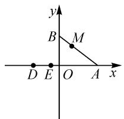
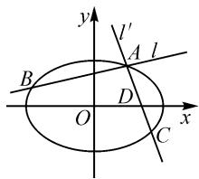
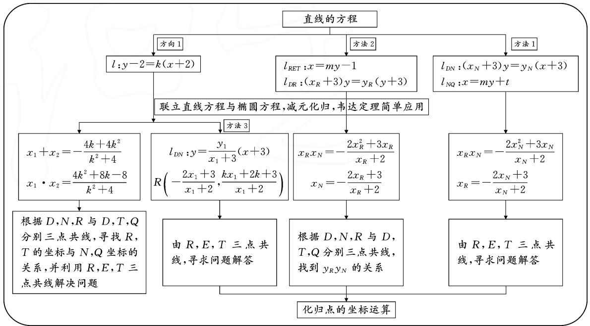
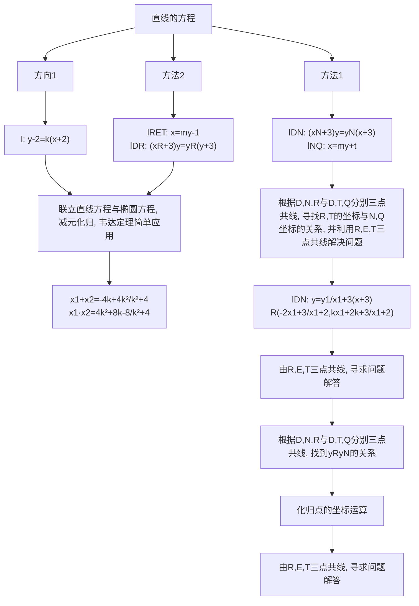

2023年命题比赛获奖论文之十一：

# 一类涉及坐标运算的解析几何问题的 解析与思考

# ● 浙江省诸暨市海亮高级中学 江中勤

摘要: 数学运算是高中数学六大核心素养之一, 解决直线与圆锥曲线的相关问题时, 学生处理点、线的方法通常比较单一, 不能有效结合点的坐标与曲线的方程优化运算, 尤其是圆锥曲线中出现多点问题时, 往往常规联立直线与圆锥曲线方程, 应用韦达定理解决问题, 导致数学运算复杂、甚至无法解答, 本文中从点的坐标参与直线方程求解的角度出发, 编制一道椭圆上多点问题并解答, 探索坐标背后的密码.

关键词: 多点问题; 坐标运算; 减元化归

原创 如图 1 所示, 长度为 $3\sqrt{3}$ 的线段 AB 的端点 A, B 分别在 x 轴、y 轴上滑动, 其上动点 $M(x,y)$ 满足 $\overrightarrow{AM}=2\overrightarrow{MB}$ , 设动点 M 的轨迹为 C, 定点 $E(-1,0)$ , $D(-3,0)$ .

text_image

y
B M
D E O A x

图1

(1) 求 C 的方程;

(2)设点 $P(-2,2)$ , 过点 $P$ 的直线 $l$ 与 $C$ 相交于 $N, Q$ 两点, 直线 $DN$ 与 $C$ 的另一交点为 $R$ , 直线 $DQ$ 与 $C$ 的另一交点为 $T$ , 若 $R, E, T$ 三点共线, 求直线 $l$ 的方程.

# 1 问题提出与思考

# 1.1 问题的提出

数学运算是高中数学六大核心素养的关键性素养.教学中发现,学生的运算能力不足与运算方法的单一性相关[1].高中教学内容与考试内容中的解析几何有时作为压轴题出现,学生在解题时虽然容易发现解题的切入点,但受思维定势和解题模式的影响,往往首选常规解题路径.在解析几何部分的试题设计与学生解题中,笔者发现学生的解题基本就是“设线、联立、韦达定理”三件套,或者是“设点、作差、构造斜率”,将直线方程的运算与点的坐标运算分离,遇到圆锥曲线上的多点问题,容易陷入复杂的多变量运算,再加上在长期的运算过程中形成的整理算式不规范的叠加影响,因而很难完成最后的计算[2].近几年的高考试题中,圆锥曲线上的多点问题出现的频率上升,如2019年浙江卷、2020年全国卷I、2021年全国卷I、2022年全国甲卷.最近有幸拜读了文[3]中关于圆锥曲线求解方法中坐标运算的几种方法,同时联想到教育部最新发布的通知的精神,2023年高考数学要求加入复杂情境,强调数学思维方法,比以往考试难度更大.根据这样的背景,笔者尝试探索一类圆锥曲线多点问题中点的坐标参与直线方程求解的问题,促成了这道量身打造的试题的命制.

直线与圆锥曲线相交的问题是解析几何中的基本问题,由过交点的直线与圆锥曲线再次相交产生新的交点,如何处理新的交点 $^{[4]}$ ?把原交点的坐标作为参量参与到直线方程的运算中.比如:

text_image

y
l'
A l
B
D
O
C
x

图2

如图 2 所示, 直线 l 与椭圆 $E: \frac{x^{2}}{a^{2}} + \frac{y^{2}}{b^{2}} = 1$ 相交于 A, B 两点, 过点 A 的直线 $l'$ 与椭圆交于另一个点 C, 如何处理这类问题? 笔者给出一种处理方式如下:

设 $A(x_{1},y_{1}), B(x_{2},y_{2})$ ，直线 $l'$ 与 x 轴的交点设为 $D(t,0)$ ，则 $l': (x_{1}-t)y=y_{1}(x-t)$ 。根据

$$
\left\{ \begin{array}{l} (x _ {1} - t) y = y _ {1} (x - t), \\ \frac {x ^ {2}}{a ^ {2}} + \frac {y ^ {2}}{b ^ {2}} = 1, \\ y _ {1} ^ {2} = b ^ {2} \left(1 - \frac {x _ {1} ^ {2}}{a ^ {2}}\right), \end{array} \right.
$$

由韦达定理可以得到 $x_{c} =$ $\frac{2a^{2}b^{2}t-b^{2}t^{2}x_{1}-a^{2}b^{2}x_{1}}{a^{2}b^{2}+b^{2}t^{2}-2b^{2}x_{1}t}$ ，从而实现用 $x_{1}$ 表示 $x_{c}$ ，达到减元 $x_{c}$ ，化归为 $x_{1}$ 的目的。解决圆锥曲线中多点问题可以考虑这种方法。基于此，量身打造命制试题。

# 1.2 命题的思考

联想中国传统工匠(木工、白铁工、金银饰等行业)使用椭圆规画图的情形,充分体现中国传统数学文化的育人价值,可用于考查平面中动点轨迹方程的求解及直线与椭圆相交的问题.以椭圆中蝴蝶定理相关知识为背景,侧重考查圆锥曲线上的多点坐标运算,将坐标参与到直线方程中解决问题.

# 2 试题设计、修正过程与实测情况分析

在设计本题时,第(2)小题最初的想法是以极点极线知识为背景,题目是:

过点 $E(-1,0)$ 的两条直线分别与 C 相交于 N, Q, R, T 四点，若直线 NR, QT 相交于点 $D(x_{0}, y_{0})$ . 求证: $x_{0}$ 是定值.

从学生的解答中,笔者发现,由于学生已经掌握了极点极线知识与相关结论,因此在解决这题时,很多学生的解答过程是不全面的,但结论却是确定的.究其原因是,他们先利用极点极线知识得到 $x_{0}$ 的值,再把过程补充出来,基本有两种解题过程,分别如下:

(1)坐标运算法

设 $N(x_{1},y_{1}), Q(x_{2},y_{2}), R(x_{3},y_{3}), T(x_{4},y_{4})$ ，根据三点共线可以得到

$$
\left\{ \begin{array}{l} \frac {y _ {1}}{x _ {1} + 1} = \frac {y _ {2}}{x _ {2} + 1}, \\ \frac {y _ {3}}{x _ {3} + 1} = \frac {y _ {4}}{x _ {4} + 1}, \\ \frac {y _ {1}}{x _ {1} + 3} = \frac {y _ {3}}{x _ {3} + 3}, \\ \frac {y _ {4}}{x _ {4} + 3} = \frac {y _ {2}}{x _ {2} + 3}. \end{array} \right.
$$

又 $\left\{ \begin{array}{l} y_{1}^{2} = 12 - 4x_{1}^{2}, \\ y_{2}^{2} = 12 - 4x_{2}^{2}, \\ y_{3}^{2} = 12 - 4x_{3}^{2}, \\ y_{4}^{2} = 12 - 4x_{4}^{2}, \end{array} \right.$ 得

$$
x _ {0} = \frac {(y _ {3} - y _ {1}) (x _ {4} - x _ {2}) x _ {1} - (y _ {4} - y _ {2}) (x _ {3} - x _ {1}) x _ {2}}{(y _ {3} - y _ {1}) (x _ {4} - x _ {2}) - (y _ {4} - y _ {2}) (x _ {3} - x _ {1})}, \text {然后展开，化简，得到} x _ {0} = - 3.
$$

(2) 直线相交法

设 $l_{NQ}:y = k_1x + k_1;l_{RT}:y = k_2x + k_2$ ，由 $\left\{ \begin{array}{ll}y = k_{1}x + k_{1},\\ \frac{y^{2}}{12} +\frac{x^{2}}{3} = 1, \end{array} \right.$ 得 $(k_1^2 +4)x^2 +2k_1^2 x + k_1^2 -12 = 0$ ，则

$$
x _ {1} + x _ {2} = - \frac {2 k _ {1} ^ {2}}{4 + k _ {1} ^ {2}}, x _ {1} x _ {2} = \frac {k _ {1} ^ {2} - 1 2}{4 + k _ {1} ^ {2}}.
$$

同理，得 $x_{3} + x_{4} = -\frac{2k_{2}^{2}}{4 + k_{2}^{2}}, x_{3}x_{4} = \frac{k_{2}^{2} - 12}{4 + k_{2}^{2}}.$

由 $\left\{\begin{aligned}l_{NR}:y&=\frac{y_{3}-y_{1}}{x_{3}-x_{1}}(x-x_{1})+y_{1},\\ l_{TQ}:y&=\frac{y_{4}-y_{2}}{x_{4}-x_{2}}(x-x_{2})+y_{2},\end{aligned}\right.$ 可以解得 $x_{0}=$

$\frac{(y_{3}-y_{1})(x_{4}-x_{2})x_{1}-(y_{4}-y_{2})(x_{3}-x_{1})x_{2}}{(y_{3}-y_{1})(x_{4}-x_{2})-(y_{4}-y_{2})(x_{3}-x_{1})}$ ，然后展开，化简，得到 $x_{0}=-3$ .

看到学生的解答与了解的情况,笔者做了深刻的反思.由于问题设置的结论太明显,使得学生有可乘之机,失去了编制本题考查的目的,再观察学生的解答,依然是利用单一的点的坐标运算解决问题,或利用相交法结合韦达定理化简,没有达到预想的将坐标参与到直线的方程中解决问题.为了达到考查的目的,转变方向,提升难度,将问题改为过点 $P(-2,2)$ 的直线与曲线 C 相交的问题,便有了本题的最终形式.

改编后,学生首选的解答方法依然是设点,然后

根据三点共线解决,但遇到了 $\left\{\begin{aligned}\frac{y_{1}-2}{x_{1}+2}&=\frac{y_{2}-2}{x_{2}+2},\\ y_{1}^{2}&=12-4x_{1}^{2},\\ y_{2}^{2}&=12-4x_{2}^{2},\end{aligned}\right.$ 无法消

元,或利用相交法最后也出现没有办法化简的结果,导致所选的解法失败.

于是学生转变方向,尝试利用“设直线方程、联立方程、韦达定理”三件套来解决问题.具体如下:

方向1:由 $\left\{\begin{aligned}y-2&=k(x+2),\\ \frac{y^{2}}{12}&+\frac{x^{2}}{3}=1,\end{aligned}\right.$ 消元,得

$$
(4 + k ^ {2}) x ^ {2} + 4 k (k + 1) x + 4 k ^ {2} + 8 k - 8 = 0,
$$

则 $x_{1} + x_{2} = -\frac{4k(k + 1)}{4 + k^{2}}, x_{1}x_{2} = \frac{4k^{2} + 8k - 8}{4 + k^{2}}.$

又 $\left\{\begin{aligned}\frac{y_{1}}{x_{1}+3}&=\frac{y_{3}}{x_{3}+3},\\ \frac{y_{4}}{x_{4}+3}&=\frac{y_{2}}{x_{2}+3},\end{aligned}\right.$ 且 $\left\{\begin{aligned}y_{1}^{2}&=12-4x_{1}^{2},\\ y_{3}^{2}&=12-4x_{3}^{2},\end{aligned}\right.$ 解得

$$
x _ {3} = - \frac {2 x _ {1} + 3}{x _ {1} + 2}, y _ {3} = \frac {y _ {1} (x _ {3} + 3)}{x _ {1} + 3} = \frac {y _ {1}}{x _ {1} + 2}.
$$

同理可得，

$$
x _ {4} = - \frac {2 x _ {2} + 3}{x _ {2} + 2}, y _ {4} = \frac {y _ {2} (x _ {4} + 3)}{x _ {2} + 3} = \frac {y _ {2}}{x _ {2} + 2}.
$$

再由 R, E, T 三点共线，可得 $\frac{\frac{y_{1}}{x_{1}+2}}{-\frac{2x_{1}+3}{x_{1}+2}+1}=$

$\frac{\frac{y_{2}}{x_{2}+2}}{-\frac{2x_{2}+3}{x_{2}+2}+1}$ ，整理得 $\frac{y_{1}}{x_{1}+1}=\frac{y_{2}}{x_{2}+1}$ ，所以 $k_{EN}=k_{EQ}$ ，

即 E, N, Q 三点共线，故 $k_{l} = k_{PE} = -2$ .

方向 2: 设 $l_{DN}: x = t_{1}y - 3$ ，由 $\left\{\begin{aligned} x &= t_{1}y - 3, \\ \frac{y^{2}}{12} + \frac{x^{2}}{3} &= 1, \end{aligned}\right.$ 可得

$(1+4t_{1}^{2})y^{2}-24t_{1}y+24=0$ ，则

$$
y _ {1} + y _ {3} = \frac {2 4 t _ {1}}{1 + 4 t _ {1} ^ {2}}, y _ {1} y _ {3} = \frac {2 4}{1 + 4 t _ {1} ^ {2}}.
$$

同理设 $l_{DT}: x = t_{2}y - 3$ ，可得

$$
y _ {2} + y _ {4} = \frac {2 4 t _ {2}}{1 + 4 t _ {2} ^ {2}}, y _ {2} y _ {4} = \frac {2 4}{1 + 4 t _ {2} ^ {2}}.
$$

再根据 R, E, T 三点共线，得 $\frac{y_{3}}{x_{3}+1} = \frac{y_{4}}{x_{4}+1}$ ，希望将运算转化为 $t_{2}, t_{1}$ 的关系并求出 $t_{2}, t_{1}$ ，但宣告失败。

方向 1 的解答根据点的坐标运算可以解决问题，方向 2 从直线方程的角度出发，由于参数运算的复杂性宣告失败.

对于方向1，还可引导学生设直线 $DN$ 的方程，让 $x_{1},y_{1}$ 参与运算，得 $y = \frac{y_1}{x_1 + 3} (x + 3)$ ，即 $(x_{1} + 3)y =$

$y_{1}(x+3)$ ，则有 $y_{3}=\frac{y_{1}(x_{3}+3)}{x_{1}+3}=\frac{kx_{1}+2k+2}{x_{1}+3}\cdot\frac{x_{1}+3}{x_{1}+2}=\frac{kx_{1}+2k+2}{x_{1}+2},R\left(-\frac{2x_{1}+3}{x_{1}+2},\frac{kx_{1}+2k+2}{x_{1}+2}\right)$ ，问题得以解决.

# 3 命题分析

本题首先以向量的坐标运算为工具,考查动点轨迹方程的求解,利用相关点法求解,得到动点 M 的轨迹为焦点在 y 轴上的椭圆 $\frac{y^{2}}{12} + \frac{x^{2}}{3} = 1$ , 根据题设条件,过点 P 的直线 l 与椭圆交于 N, Q, 直线 DN, DQ 与

椭圆分别交于另外一个点 R, T, 在 R, E, T 三点共线的条件下, 不失常规思维, 现将求直线 l 的方程的思维导图(图 3)呈现如下。(详细解答请读者扫码看.)

flowchart

图3

本题在设计时侧重考查椭圆中多点坐标之间的转化,常规的点差法与相交法在处理多点的坐标转化时运算复杂,而利用思维导图中的设直线方程与椭圆方程联立并进行消元时,让交点坐标参与到直线方程中进行坐标间的转化是非常合适和有效的,简化了运算过程.

# 4 结束语

六大数学核心素养之数学抽象、逻辑推理、数学建模、数学运算、数据分析在圆锥曲线这一数学知识体系的学习与研究中都可以得到具体的体现.对圆锥曲线问题的研究能提升学生对数学学习的兴趣与乐趣.

在设计相关问题时,能将点的坐标与直线方程相结合,解决圆锥曲线中的多点问题,将复杂的代数运算简化,探寻坐标背后的密码,必然达到事半功倍的效果.

# 参考文献：

[1] 杨平飞. 高中数学教学中核心素养培养策略探究 [J]. 数学学习与研究, 2023(7): 101-103.  
[2] 张可忻. 高二学生解析几何认知结构与问题提出能力的关系研究 [D]. 南京: 南京师范大学, 2021: 44-60.  
[3]骆银海,李红庆.解析几何中一类需要优先考虑用字母运算的问题及其解法[J].数学通讯,2023(1):32-34,37.  
[4]毛浙东.解析几何教学要注重对学生进行“算法”的引导[J].数学通报,2023(3):29-34.Z