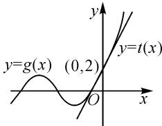

# 三角函数综合问题解题策略分析与反思\*

# 南京市金陵中学 于 健 郭建华

摘要:近年来,以三角函数为背景的导数综合题是高考命题的亮点之一,可谓常考常新.本文中通过对典型试题进行解法探究,揭示本质,形成解题策略.

关键词:三角函数;导数;解题反思;策略分析

以三角函数为背景的导数综合题是近几年高考命题的一大亮点,它不仅丰富了高中数学教学的素材,有效引导教学,而且体现了高考在核心价值引领下对知识的交叉、能力的复合、素养的融合的全方位考查.由于考题中常含有三角函数与其他函数的综合,以至于问题的后续处理困难较多,但三角函数具有周期性、有界性等显著的性质,使问题解决又丰富多样,有益于问题考查的宽度和深度,这也必将会成为以后高考试题命制的生长点,因此,有必要对以三角函数为背景的导数综合题进行策略分析,以期提高教学有效性,发展学生关键能力.

# 1 策略分析

以三角函数为背景的导数题,注重考查学生利用导数工具分析问题、解决问题、推理论证、运算求解等能力,以及分类讨论、转化与化归、数形结合等数学思想,对思维的灵活性、严谨性、创新性提出了较高的要求,符合“四翼”中综合性、创新性的考查要求.其求解策略和方法归纳如下:

策略一 利用构造新函数求解

根据函数与导数的思维特征,当面临一个难以求解的函数问题时,其中一个行之有效的方法就是构造一个辅助函数,分析函数解析式的结构,利用导数研究函数的图象与性质(定义域、单调性、最值、极值、零点等),体会其中蕴含的函数与方程、数形结合、转化与化归等数学思想.

案例 1 （2014 年高考数学北京卷理科 · 18）

已知 $f(x) = x\cos x - \sin x, x \in \left[0, \frac{\pi}{2}\right]$ .

(1) 求证: $f(x) \leqslant 0$ ;

(2) $a<\frac{\sin x}{x}<b$ 在 $\left(0,\frac{\pi}{2}\right)$ 上恒成立，求a的最大值与b的最小值.

解析:(1)略.

(2) 当 x > 0 时， $\frac{\sin x}{x} > a$ 等价于 $\sin x - ax > 0$ ，

$\frac{\sin x}{x}<b$ 等价于 $\sin x-bx<0.$

令 $g(x)=\sin x-cx$ ，则 $g'(x)=\cos x-c$ 。

当 $c \leqslant 0$ 时, $g(x) > 0$ 对任意 $x \in \left(0, \frac{\pi}{2}\right)$ 恒成立.

当 $c \geqslant 1$ 时，对任意 $x \in \left(0, \frac{\pi}{2}\right), g'(x) = \cos x - c < 0$ ，则 $g(x)$ 在区间 $\left(0, \frac{\pi}{2}\right)$ 上单调递减，所以 $g(x) < g(0) = 0$ 任意 $x \in \left(0, \frac{\pi}{2}\right)$ 恒成立.

所以当 $0 < c < 1$ 时，存在唯一的 $x_0 \in \left(0, \frac{\pi}{2}\right)$ ，使 $g'(x_0) = \cos x_0 - c = 0$ . 列表如表1所示.

表 1

<table><tr><td> $x$ </td><td> $(0,x_0)$ </td><td> $x_0$ </td><td> $\left( x_0,\frac{\pi}{2} \right)$ </td></tr><tr><td> $g'(x)$ </td><td>+</td><td>0</td><td>-</td></tr><tr><td> $g(x)$ </td><td>单调递增</td><td>0</td><td>单调递减</td></tr></table>

由表 1 易知, $g(x)$ 在 $(0, x_0)$ 上单调递增. 在 $\left( x_0, \frac{\pi}{2} \right)$ 上单调递减, 又因为 $g(0) = 0$ , 若 $g(x) > 0$ 对任意 $x \in \left( 0, \frac{\pi}{2} \right)$ 恒成立, 则当且仅当 $g\left( \frac{\pi}{2} \right) = 1 - \frac{\pi}{2} c \geqslant 0$ , 即 $0 < c \leqslant \frac{2}{\pi}$ .

所以当且仅当 $c \leqslant \frac{2}{\pi}, g(x) > 0$ 对任意 $x \in \left(0, \frac{\pi}{2}\right)$ 恒成立；当且仅当 $c \geqslant 1$ 时， $g(x) < 0$ 对任意 $x \in \left(0, \frac{\pi}{2}\right)$ 恒成立.

所以，若 $a < \frac{\sin x}{x} < b$ 对任意 $x \in \left(0, \frac{\pi}{2}\right)$ 恒成立，

则 a 的最大值为 $\frac{2}{\pi}$ , b 的最小值为 1.

点评:对于第(2)问,若令函数 $g(x)=\frac{\sin x}{x}$ , 则 $g'(x)=\frac{x\cos x-\sin x}{x^{2}}=\frac{f(x)}{x^{2}}$ , 根据第(1)问易得 $g'(x)\leqslant0$ 在 $\left(0,\frac{\pi}{2}\right)$ 上恒成立, 故 $g(x)$ 在 $\left(0,\frac{\pi}{2}\right)$ 上单调递减, 于是 $g(x)>g\left(\frac{\pi}{2}\right)=\frac{2}{\pi}$ , 所以 a 的最大值为 $\frac{2}{\pi}$ , 但是无法用同样的方式求 b 的最小值. 观察式子的结构, 将分式实施恒等变形化为整式, 即只要研究 $y=\sin x-ax$ 与 $y=\sin x-bx$ 在 $\left(0,\frac{\pi}{2}\right)$ 上的最值情况, 于是合理构造新函数 $g(x)=\sin x-cx$ , 讨论 c 的取值, 探究函数 $g(x)$ 的单调性进而求解.

# 策略二 利用正余弦函数有界性求解

有界性是正余弦函数的主要性质之一.在处理以三角函数为背景的导数题时,除了运用参变量分离、分类讨论等方法外,还需结合三角函数的有界性求解,可以快速找到讨论的“分界点”,有效突破解题困境,使问题得以顺利解决.

案例 2 （2016 年高考数学全国卷Ⅲ理科·21）设函数 $f(x)=a\cos2x+(a-1)(\cos x+1)$ ，其中 a>0，记 $|f(x)|$ 的最大值为 A.

(1) 求 $f'(x)$ ;   
(2) 求 A;   
(3) 证明: $|f'(x)| \leqslant 2A$ .

解析:(1) $f'(x)=-2a\sin2x-(a-1)\sin x.$

(2) 当 $a \geqslant 1$ 时，

$$
\begin{array}{c} \mid f (x) \mid = \mid a \cos 2 x + (a - 1) \cdot (\cos x + 1) \mid \leqslant \\ a + 2 (a - 1) = 3 a - 2 = f (0). \end{array}
$$

所以 A=3a-2.

当 0 < a < 1 时，将 $f(x)$ 变形为

$$
f (x) = 2 a \cos^ {2} x + (a - 1) \cos x - 1.
$$

令 $t = \cos x, t \in [-1, 1]$ , 则

$$
g (t) = 2 a t ^ {2} + (a - 1) t - 1.
$$

所以， $g(-1)=a$ ， $g(1)=3a-2$ ， $g\left(\frac{1-a}{4a}\right)=-\frac{(a-1)^{2}}{8a}-1=-\frac{a^{2}+6a+1}{8a}$ .

令 $-1 < \frac{1 - a}{4a} < 1$ ，得 $a < -\frac{1}{3}$ （舍去），或 $a > \frac{1}{5}$ .

作如下讨论：

① 当 $0 < a \leqslant \frac{1}{5}$ 时， $|g(-1)| = a, |g(1)| = 2 - 3a$ 此时 $|g(-1)| < |g(1)|$ ，所以 $A = 2 - 3a$ .  
②当 $\frac{1}{5}<a<1$ 时，由 $g(-1)-g(1)=2(1-a)>0$ ，

知 $g(-1) > g(1) > g\left(\frac{1-a}{4a}\right)$ .

又 $\left|g\left(\frac{1-a}{4a}\right)\right|-\left|g(-1)\right|=\frac{(1-a)(1+7a)}{8a}>0,$ 所以 $A=\left|g\left(\frac{1-a}{4a}\right)\right|=\frac{a^{2}+6a+1}{8a}.$

综上， $A = \left\{ \begin{array}{ll}2 - 3a, & 0 < a \leqslant \frac{1}{5},\\ \frac{a^2 + 6a + 1}{8a}, & \frac{1}{5} < a < 1,\\ 3a - 2,a\geqslant 1. \end{array} \right.$

(3) 由(1)得 $|f'(x)| = |-2a\sin 2x - (a - 1)\sin x| \leqslant 2a + |a - 1|$ .

当 $0 < a \leqslant \frac{1}{5}$ 时，

$$
\mid f ^ {\prime} (x) \mid \leqslant 1 + a \leqslant 2 - 4 a <   2 (2 - 3 a) = 2 A.
$$

当 $\frac{1}{5} < a < 1$ 时， $A = \frac{a}{8} + \frac{1}{8a} + \frac{3}{4} \geqslant 1$ ，所以 $|f'(x)| \leqslant 1 + a < 2A$ .

当 $a \geqslant 1$ 时， $|f'(x)| \leqslant 3a - 1 \leqslant 6a - 4 = 2A$ .

综上， $|f'(x)| \leqslant 2A.$

点评:利用分类讨论分析和求解问题,关键是要准确找到讨论的分界点,本题第(2)(3)问都是根据正余弦函数的有界性找到了讨论的分界点,突破了难点.过程中还结合不等式 $|a+b|\leqslant|a|+|b|$ 将等式进行了合理放缩,体现了高考在知识交汇处命题的思想 $^{[1]}$ .

# 策略三 利用必要性探路求解

在处理含参数不等式恒成立问题时,大多时候会优先考虑参数与变量分离并构造函数,但往往解题受阻,那么也可以换个视角思考,先利用必要条件探路,再验证其充分性,这就是必要性探路解题的思想.利用必要性探路解题不仅能够简化思维程序,而且也能为难点的突破提供一种很好的解题思路.

案例 3 （2023 年高考数学全国甲卷·21）已知函数 $f(x)=ax-\frac{\sin x}{\cos^{3}x}, x\in\left(0,\frac{\pi}{2}\right)$ .

(1) 当 a=8 时, 讨论 $f(x)$ 的单调性;  
(2) 若 $f(x) < \sin 2x$ ，求 a 的取值范围.

解析:(1)略.

(2) 令 $g(x) = f(x) - \sin 2x = ax - \frac{\sin x}{\cos^3 x} - \sin 2x, x \in \left(0, \frac{\pi}{2}\right)$ ，则

$$
g ^ {\prime} (x) = a - \frac {3 - 2 \cos^ {2} x}{\cos^ {4} x} - 2 \cos 2 x.
$$

又 $g(0)=0$ ，若 $g(x)<0$ 在 $\left(0,\frac{\pi}{2}\right)$ 恒成立，其必要条件为 $g'(0)\leqslant0$ ，即 $a-3\leqslant0$ ，解得 $a\leqslant3$ ，若 $g'(0)>0$ ，则一定存在 $x_{0}\in\left(0,\frac{\pi}{2}\right)$ ，使得 $g'(x)>0$ 在 $(0,x_{0})$ 上成立，即 $g(x)$ 在 $(0,x_{0})$ 上单调递增，所以 $g(x)>$ $g(0)=0$ , 与题设矛盾, 故不成立.

下面，证明其充分性.

$$
\begin{array}{r l} & {\text {当} a \leqslant 3 \text {时}, g ^ {\prime} (x) \leqslant 3 - \frac {3 - 2 \cos^ {2} x}{\cos^ {4} x} - 2 \cos 2 x =} \\ & {- \frac {(\cos x - 1) ^ {2} (\cos x + 1) ^ {2} (4 \cos^ {2} x + 3)}{\cos^ {4} x} \leqslant 0,} \end{array}
$$

所以 $g(x)$ 在 $\left(0, \frac{\pi}{2}\right)$ 上单调递减.

所以 $g(x) < g(0) = 0.$

故当 $x \in \left(0, \frac{\pi}{2}\right)$ 时， $f(x) < \sin 2x$ .

综上，a 的取值范围为 $(-∞,3]$ .

点评:第(2)问巧妙地应用“必要性探路”的方法求解,在一定程度上优化了解题路径.当然在解决问题的过程中,仍然要密切关注正余弦函数的有界性.

# 策略四 利用设而不求法求解

在数学解题中,有时需要设立题目中没有直接给出的中间变量,从而构建“未知”和“已知”的关系,为问题的解决起到纽带的作用,这就是“设而不求”的数学思想.函数“隐零点”是近几年高考的热点也是难点,对于与三角结合的导数题,“设而不求”将是处理这类问题的一个较好的策略.即通过形式上的虚设,实现运算上代换、策略上等价转化、方法上引导分类等,从而达到优化解题的目的.

案例 4 已知函数 $f(x)=a\mathrm{e}^{x}-\ln(1+x)-\cos(a-1), a \in \mathbb{R}.$

(1) 当 a=1 时, 求函数 $f(x)$ 的零点;

(2) 若 $f(x) \geqslant 0$ ，求实数 a 的取值范围.

解析:(1)略.

(2)求导,得 $f'(x)=a\mathrm{e}^{x}-\frac{1}{1+x}$ .

当 a<1 时， $f(0)=a-\cos(a-1)$ .

令 $h(a)=a-\cos(a-1)$ .

因为 $h'(a)=1+\sin(a-1)\geqslant0$ ，所以 $h(a)$ 在区间 $(-∞,1)$ 上单调递增，则 $h(a)<h(1)=0$ ，即 $f(0)<0$ 。所以 a<1 不合题意。

当 $a \geqslant 1$ 时，令 $m(x) = f'(x)$ ，则 $m'(x) = a e^{x} + \frac{1}{(1 + x)^{2}} > 0$ ，所以 $m(x)$ 在 $(-1, +\infty)$ 上单调递增.

又 $m(0) = a - 1 \geqslant 0, m\left(\frac{1}{a} - 1\right) = a \mathrm{e}^{\frac{1}{a} - 1} - a \leqslant a - a = 0$ ，所以存在 $x_0 \in (-1, 0]$ ，使得 $m(x_0) = 0$ ，即 $a \mathrm{e}^{x_0} - \frac{1}{1 + x_0} = 0$ ，即 $\ln (1 + x_0) = -x_0 - \ln a$ .

所以当 $x \in (-1, x_0)$ 时， $f'(x) < 0$ ， $f(x)$ 单调递减；当 $x \in (x_0, +\infty)$ 时， $f'(x) > 0$ ， $f(x)$ 单调递增。所以 $f(x) \geqslant f(x_0) = a e^{x_0} - \ln(1 + x_0) - \cos(a - 1) = \frac{1}{1 + x_0} + x_0 + \ln a - \cos(a - 1) = \frac{1}{1 + x_0} + 1 + x_0 + \ln a - \cos(a - 1) - 1 \geqslant 1 + \ln a - \cos(a - 1) \geqslant 0$ ，当$a = 1, x_{0} = 0$ 时取等号.

综上,实数 a 的取值范围为 $[1, +\infty)$ .

点评: 第(2)问中既有指数、对数形式, 又有三角形式, 让学生望而生畏. 运用前后联系的观点审视问题, 第(1)问中, 当 a=1 时, 可证 $f(x) \geqslant 0$ 在 $(-1, +\infty)$ 上恒成立 (当且仅当 x=0 时, $f(x)=0$ ), 那么第(2)问中对参数 a 的分类讨论应有分界点 a=1, 这将对讨论带来启发. 对于零点不可求问题, 可以虚设零点得到一个含零点的超越方程, 通过变形实现部分代换或整体代换, 将超越式变成非超越式, 从而简化运算.

# 2 策略反思

以正余弦函数与指对数函数的复合形式为背景考查不等式的证明、不等式恒成立求参数的值或范围，此类问题在高考中常考常新。问题解决过程中常需要构造新函数、运用必要条件探路、结合正余弦函数的有界性、设而不求隐零点等多种方法的综合运用。

案例 5 （2021 年普通高等学校招生全国统一考试模拟演练——八省联考·22）

已知函数 $f(x)=\mathrm{e}^{x}-\sin x-\cos x$ , $g(x)=\mathrm{e}^{x}+\sin x+\cos x$ .

(1)求证:当 $x \geqslant -\frac{5\pi}{4}$ 时, $f(x) \geqslant 0$ ;   
(2) 若 $g(x) \geqslant 2 + ax$ ，求实数 a 的值.

(1) 证明: 由 $f(x) = \mathrm{e}^{x} - \sin x - \cos x = \mathrm{e}^{x} - \sqrt{2}\sin \left(x + \frac{\pi}{4}\right)$ , 得 $f'(x) = \mathrm{e}^{x} + \sqrt{2}\sin \left(x - \frac{\pi}{4}\right)$ .

① 当 $x \in \left[-\frac{5\pi}{4}, -\frac{\pi}{4}\right]$ 时， $x + \frac{\pi}{4} \in [-\pi, 0]$ ，则 $\sin \left(x + \frac{\pi}{4}\right) \leqslant 0$ ，又 $\mathrm{e}^x > 0$ ，所以 $f(x) > 0$ 。

②当 $x \in \left(-\frac{\pi}{4}, 0\right)$ 时， $x - \frac{\pi}{4} \in \left(-\frac{\pi}{2}, -\frac{\pi}{4}\right)$ ，则 $\sin \left(x - \frac{\pi}{4}\right) \in \left(-1, -\frac{\sqrt{2}}{2}\right)$ ，又 $0 < \mathrm{e}^{x} < 1$ ，所以 $f'(x) < 0$ 。于是函数 $f(x)$ 在 $\left(-\frac{\pi}{4}, 0\right)$ 上单调递减，又 $f(0) = 0$ ，所以 $f(x) > f(0) = 0$ 。

③当 $x \in [0, +\infty)$ 时，可证 $\sin x \leqslant x, e^{x} \geqslant x + 1$ ，(过程略)，则 $f(x) = e^{x} - \sin x - \cos x \geqslant e^{x} - x - 1 \geqslant 0.$

综上，当 $x \geqslant -\frac{5\pi}{4}$ 时， $f(x) \geqslant 0$

(2) 解: 当 $x \geqslant -\frac{5\pi}{4}$ 时, 令 $h(x) = g(x) - ax - 2$ , 即

$$
h (x) = \mathrm{e} ^ {x} + \sin x + \cos x - a x - 2.
$$

求导, 得 $h'(x)=\mathrm{e}^{x}+\cos x-\sin x-a$ .

令 $m(x)=h'(x)$ ，则 $m'(x)=\mathrm{e}^{x}-\sin x-\cos x$ .

由(1)得, $m'(x)\geqslant0$ 在 $\left[-\frac{5\pi}{4},+\infty\right)$ 上恒成立,
所以 $h'(x)$ 在 $\left[-\frac{5\pi}{4},+\infty\right)$ 上单调递增.

① 当 $a > 2$ 时， $h'(0) = 2 - a < 0, h'(\ln(a + 2)) = 2 - \sqrt{2}\sin\left[\ln(a + 2) - \frac{\pi}{4}\right] > 0$ ，则存在 $x_1 \in (0, \ln(a + 2))$ ，使得 $h'(x_1) = 0$ ，当 $0 < x < x_1$ 时， $h'(x) < 0, h(x)$ 单调递减， $h(x) < h(0) = 0$ 不符合题意.

所以 a > 2 不满足题意.

②当 a<2 时， $h'(0)>0$ .

若在 $x \in \left(-\frac{5\pi}{4}, 0\right)$ 上，总有 $h'(x) \geqslant 0$ （不恒为零），则 $h(x)$ 在 $\left(-\frac{5\pi}{4}, +\infty\right)$ 上为增函数，且 $h(0) = 0$ ，所以当 $x \in \left(-\frac{5\pi}{4}, 0\right)$ 时， $h(x) < 0$ ，不符合题意；

若在 $x \in \left(-\frac{5\pi}{4}, 0\right)$ 上， $h'(x) < 0$ 有解，且函数 $h'(x)$ 的图象不间断，所以存在 $x_2 \in \left(-\frac{5\pi}{4}, 0\right)$ ，使 $h'(x_2) = 0$ ，且当 $x_2 < x < 0$ 时， $h'(x) > 0, h(x)$ 单调递增，故当 $x \in (x_2, 0)$ 时， $h(x) < h(0) = 0$ ，不符合题意。

所以 a<2 不满足题意.

③ 当 a=2 时， $h'(x)=\mathrm{e}^{x}+\cos x-\sin x-2.$

由以上分析可知 $h'(x)$ 在区间 $\left[-\frac{5\pi}{4}, +\infty\right)$ 单调递增，且 $h'(0)=0$ 。所以当 $-\frac{5\pi}{4} \leqslant x < 0$ 时， $h'(x) < 0$ ，则 $h(x)$ 在区间 $\left[-\frac{5\pi}{4}, 0\right)$ 单调递减；当 x > 0 时， $h'(x) > 0$ ，则 $h(x)$ 单调递增。

又当 x=0 时， $h(0)=0$ ，所以 $h(x)\geqslant h(0)=0$ 。

当 $x < -\frac{5\pi}{4}$ 时，有 $h(x) = \mathrm{e}^x + \sin x + \cos x - 2x - 2 > -\sqrt{2} - 2 \times \left(-\frac{5\pi}{4}\right) - 2 > 0.$

所以当 a=2 时， $h(x)\geqslant0$ 在 R 上恒成立.

综上，得 a=2。

# 2.1 疑点反问

（Ⅰ）案例 5 第（1）问的解答中，为何要将 $\left[-\frac{5}{4}, +\infty\right)$ 分段为 $\left[-\frac{5\pi}{4}, -\frac{\pi}{4}\right], \left(-\frac{\pi}{4}, 0\right), [0, +\infty)$ 进行讨论，还有别的方法吗？

（Ⅱ）案例 5 第(2)问的解答中,为何先要对 $x \geqslant -\frac{5\pi}{4}$ 时进行讨论研究?为何要分 a > 2, a < 2, a = 2 进行讨论?(a 的分界点 a = 2 是怎么想到的?)

# 2.2 释疑解惑

（Ⅰ）第(1)问解答中，主动将 x 的范围分段，主要是源自于三角函数的周期性和有界性，这样便于确定三角函数值的符号。但若将 $x \in \left(-\frac{\pi}{4}, 0\right)$ 放宽到 $x \in$

$\left(-\frac{\pi}{4},\frac{3\pi}{4}\right)$ 时，即 $x+\frac{\pi}{4}\in(0,\pi),f'(x)>0$ 仍然成立；与此同时当 $x\in\left[\frac{3\pi}{4},+\infty\right)$ 时， $x+\frac{\pi}{4}\in[\pi,+\infty)$ ， $f'(x)>\mathrm{e}^{\frac{3\pi}{4}}-\sqrt{2}>0.$ 所以函数 $f'(x)$ 在 $\left(-\frac{\pi}{4},+\infty\right)$ 上单调递增，从而解答得到优化（过程略）.

（Ⅱ）对于形如“ $y=e^{x}+h(x)$ ”的函数，其中 $h(x)$ 是含有 $\sin x$ 或 $\cos x$ 的函数，可以优先考虑将其变形为“ $y=e^{x}\left[1+\frac{h(x)}{e^{x}}\right]$ ”，于是可将 $y=e^{x}+h(x)$ 的单调性或零点问题，转化为 $y=1+\frac{h(x)}{e^{x}}$ 的单调性或零点问题，接着研究 $y=1+\frac{h(x)}{e^{x}}$ 的图象和性质，这样可避开 $e^{x}$ ，让三角函数“承担更大的责任”（过程略）.

（Ⅲ）第(2)问中，函数的自变量 x 的取值集合为 R, $f(x)$ 与 $g(x)$ 表达式结构相似，且 $[f'(x)]' = g(x)$ ，于是，与第(1)问建立联系。对于分界点 a = 2，可从以下思路探究：

思路 1 从式子的结构入手, 令 $F(x) = \mathrm{e}^{x} + \sin x + \cos x - ax - 2$ , 则 $F(0) = 0$ , 由题设得 $F(x) \geqslant 0$ , 即 $F(x) \geqslant F(0)$ 在 R 上恒成立, 这将是我们解题的 “题眼”, 再结合导数的几何意义, 易得 x = 0 为 $F(x)$ 的极小值点, 于是 $F'(0) = 0$ , 解得 a = 2.

思路 2 如图 1, 令 $t(x)=ax+2$ , 发现 $t(0)=g(0)=2$ , 即曲线 $y=t(x)$ , $y=g(x)$ 均过点 $(0,2)$ , 且 $g(x)\geqslant2+ax$ 恒成立, 于是直线 $y=t(x)$ 与曲线 $y=g(x)$ 相切于点 $(0,2)$ , 根据导数的几何意义得 $a=g'(0)=2$ ，再验证其充分性即可.

text_image

y=g(x) (0,2)
O
x
y=t(x)

图1

所以说 a=2 不是求出来的, 而是探究分析得到的.

通过对以三角函数为背景的导数综合题解题策略的分析与反思，梳理发现高考导数压轴题越来越重视“四翼”的考查，突出数学问题本质的回归，试题立意高但不“冷”，落点低但不“俗”。同时具有“反套路”的味道，突出关键能力的考查，区分度高，实现“以考促教、以考促学”的目的 $^{[2]}$ ，对高校人才选拔和高中数学教与学的改革起到积极的引导作用。因此，加强对典型试题解题规律的研究是十分必要的。

# 参考文献：

[1]蓝云波.与三角函数交汇的导数压轴题的解法探究[J].中学数学研究(华南师范大学版),2019(1):20-23.

[2]教育部考试中心.中国高考评价体系[M].北京:人民教育出版社,2019:12.Z