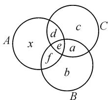
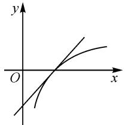
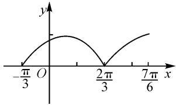
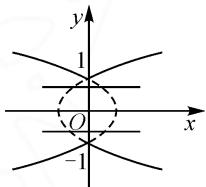

# 例析数形结合思想在高中数学中的应用

# ● 江苏省郑集高级中学 高擎

数形结合是指将研究对象中存在的数量关系、数学语言与直观的图象有机地结合在一起，通过以数辅形或以形助数等方式，将一些抽象、复杂的问题变得简洁、具体化，实现优化解题的目的[1].数形结合思想的应用十分广泛，如在方程与不等式、集合、三角函数、数列、线性规划等问题中，使用频率均很高.为此，本文中以它的应用类型为起点，引用几个实例具体谈谈如何以形助数，优化解题.

# 1 数形结合的类型

# 1.1 以形助数

将抽象的数量问题转化为直观的图形,是解决问题的一种常用方法.在高中数学中,转化途径主要有平面几何、立体几何与解析几何三大类.以形助数遵循的一般规律为:首先分析问题的结构,将已知条件与待求目标进行分解,比较、分析条件与目标之间存在怎样的内在联系 $^{[2]}$ .鉴于此,解题时首先要明确问题的条件与结论,并以二者作为观察的出发点,分析其的表达方式,找出“数”所对应的“形”,以构造出合适的图形,从而解决问题.

# 1.2 以数辅形

虽然图形具备直观形象的视觉优势,但其在定量方面远远不如数的计算来得准确.尤其是一些复杂的图形,在将它转化为数的过程中,要特别关注它所蕴含的隐含条件,只有找准图形的实质,才能进行精确的分析与计算.以数辅形的主要解题思路为:首先要明确问题的条件与结论,分析图形特征与所表达的意义,构造与之对应的代数关系式,从而获得结论.

# 1.3 数形互通

数形互通是指在一些问题中,不能单纯地依靠以形助数或以数辅形来解决问题,而需通过数与形的互相转化来解决问题.数形互通常从问题的条件和结论同时出发,找出“数”与“形”相互对应的关系,达到见形思数、见数获形的目的.数形互通的本质,即前两种类型的结合.

# 2 以形助数的应用

# 2.1 解决集合问题

集合是高中数学教学的基础与重点,不少数学概念都是建立在集合的基础上而形成,深度掌握集合知识对提高数学学习效率具有重要影响.尤其是遇到集合的定义、交并补等至关重要的知识,一般我们以平面直角坐标系、韦恩图与数轴等来表达其中的关系,让学生从图形中更直观地理解问题,达到事半功倍的解题效果.

例 1 一个小书店有三种数学参考书 A, B, C, 现有 28 位同学购买了这三种参考书中的至少一种. 在没有购买 A 书的人中, 购买 B 书的人数是购买 C 书的人数的 2 倍; 在购买 A 书的人中, 只购买 A 书的人数比除了购买 A 书外, 同时还购买其他两种书的人数多 1; 在只购买一种书的人中, 有一半购买 A 书, 则只购买 B 书的同学人数是( ).

A.7

B.6

C.5

解析:如图1所示,设只购买A书的人数为x则购买A书同时还购买其他书的人数为x-1(图中 $d+e+f$ 的和).因为只购买一种书的人中,有一半没购买B或C书,则只购买B或C书的

D.4

text_image

A
x
d
c
e
a
f
b
B
C

图 1

人数和为 $x$ ，即 $b + c = x$ .假设只同时购买 $B$ 或 $C$ 书的人数为 $a$ ，那么 $x + x - 1 + x + a = 28$ ，即 $3x + a = 29$ 则 $x$ 的取值可能是9,8,7,6,5,4,3,2,1，与之对应的 $a$ 值为2,5,8,11,14,17,20,23,26.因为不购买 $A$ 书的人中，购买 $B$ 书的人数是购买 $C$ 书的人数的2倍，得 $b + a = 2(c + a)$ ，即 $x - a = 3c$ ，故 $x = 8,a = 5$ 时满足题意，所以 $c = 1,b = 7$ ，所以只购买 $B$ 书的同学人数是7.故选：A.

本题考查利用 venn 图解决实际问题,也是数形结合的典型例题之一.利用图形来解决集合问题,可让结论变得更加直观.学生一旦掌握了用数形结合思想来解决集合问题,对后期更为深入的学习具有很大的帮助.集合作为高中阶段的开篇教学,对建立学生学习的信心,以及后期的学习都有深远的影响.为此,教师在本章节的教学,应尤其关注学生对数学思想和方法的掌握情况,让每个学生都能从课堂中掌握数形结合思想,为整个高中阶段的数学学习奠定坚实的基础.

# 2.2 解决函数问题

教学中,我们常用数形结合的方法来解决函数类问题,将函数的数量特征与其几何特征有机地融合在一起,不仅能体现出数形结合得天独厚的优势,还能启发学生的思维,让学生感知函数的本质与图形特征,为解决综合性的问题夯实基础.

例2 已知函数 $f(x) = (1 + x)\ln x - x + 1$ ，若 $xf'(x) \leqslant x^2 + ax + 1$ ，求 $a$ 的取值范围.

解析：由 $f(x)=(1+x)\ln x-x+1$ ，可得 $f'(x)=\ln x+\frac{1+x}{x}-1=\ln x+\frac{1}{x}$ 。根据 $xf'(x)\leqslant x^{2}+1+ax$ ，可知 $x\ln x\leqslant ax+x^{2}$ 。因为 x>0，所以 $\ln x\leqslant x+a$ 。

在同一个坐标系中,分别作出 $y=x+a$ 与 $y=\ln x$ 的图象.如图2所示,当点在(1,0)时,所作出的两函数图象相切,此时 a=-1,所以 $a\in[-1,+\infty)$ .

text_image

y
O
x

图2

观察本题,不难发现数形结合思想在解决函数问题中具有简化

问题难度的作用.若单纯用计算的方式来求 a 的取值范围,繁琐且容易出错,甚至有些学生会毫无头绪,而将问题用图形的方式来表达,则让人一目了然.学生通过对图象的观察,很快就能获得正确的结论.

因此,数形结合法在解决函数问题中,具有简化问题难度、迅速求解的功能.教学中,我们发现不少函数问题都是以图形的形式呈现,观察这些图形,不仅能发现丰富的代数知识,还能从直观的图形中一眼看出重要的信息,为解决问题提供帮助.

# 2.3 解决三角函数问题

遇到求解三角函数的定义域问题,需在确保函数式有意义的情况下,通过列不等式的方式,取得相应的交集.常见的解题方法有函数图象法与单位圆法.函数图象法是在函数图象中找到与条件相符的边界角,由此写出集合;而单位圆法则是在单位圆中画出相应的角,据此标示边界三角函数.

关于三角函数单调区间所涉及到的大小比较及最值等问题,一般都选择将函数转化为基本的三角函数模型,转化后借助图象或单位圆等来解决问题.此过程是一个典型的数形结合的过程,这种转化模式能让学生快速抓住问题的核心,从图形的表达中获得待求的结论.

例 3 如果函数 $f(x)=\left|\sin\left(\frac{\pi}{3}+x\right)\right|(x\in\mathbf{R})$ ，那么下列关于 $f(x)$ 的说法，正确的是（）.

A. $f(x)$ 在区间 $\left[\frac{2\pi}{3},\frac{7\pi}{6}\right]$ 上为增函数  
B. $f(x)$ 在区间 $\left[-\pi, -\frac{\pi}{2}\right]$ 上为减函数  
C. $f(x)$ 在区间 $\left[\frac{\pi}{8},\frac{\pi}{4}\right]$ 上为增函数

D. $f(x)$ 在区间 $\left[\frac{\pi}{3},\frac{5\pi}{6}\right]$ 上为减函数

解析:如图3所示,首先作出函数 $f(x)=\left|\sin\left(x+\frac{\pi}{3}\right)\right|$ 的图象,观察图象特征,即可获得正确答案为选项A.

line

| x | y |
|---|---|
| -π/3 | O |
| 2π/3 | 0 |
| 7π/6 | > 0 |

图3

三角函数是高中数学教学的一个难点,不少学生遇到比较函数值的大小或函数解析式的问题就感到畏惧.通过本题不难发现,若能灵活地将数形结合思想应用到此类问题中,则可将复杂的函数问题用简洁的图形表达出来,学生通过对图象的观察与分析,解题思路则豁然开朗.

# 2.4 解决解析几何问题

纵观近些年的高考试卷,会发现立体几何试题与解析几何试题出现的频次较高.由此我们也能看出它们的重要性.解决此类问题的基本思想即数形结合思想,就是要将图象的特征与相关定义有机地结合在一起,进行综合性的研究与分析.这就要求学生要深度了解各类图形,如椭圆、抛物线、双曲线、圆和一些空间图形的几何意义与相关性质,从而在知此知彼的状态下,达到灵活应用的地步.

例4 如果直线 $y = kx + b$ 与曲线 $y^{2} = |x| + 1$ 没有公共点，那么 $k$ 与 $b$ 应分别满足什么条件？

解析:本题难度并不大,只要能作出相应的图象,问题也就迎刃而解了.作出函数 $y^{2}=|x|+1=\left\{\begin{aligned}&1+x,x\geqslant0,\\ &1-x,x<0\end{aligned}\right.$ 的图象(如图4),观察图象可确定 $k=0,b\in(-1,1)$ .

text_image

y
1
O
x
-1

图4

由本题来看,代数与几何有着密不可分的联系,解析几何终究是研究几何问题.因此,我们在强调代数方法的同时也要注重几何图形本身的性质与内涵.

总之，数形结合法不仅具有分析问题的数量关系、表达图象性质与意义等作用，还具有启发思维、激发兴趣、拓展思路、化繁为简等重要作用[3].因此，我们在教学中应引导学生熟练掌握数形结合思想，在提高学生解题能力的同时，能有效地提升学生的数学核心素养.

# 参考文献：

[1]钱建良,张菁.例说数形结合思想的应用[J].中学生数学,2014(9):15-18.   
[2]徐慈平.重视数形结合培养学生能力[J].初中数学教与学,2014(6):21-23.  
[3]波利亚.怎样解题[M].涂泓,冯承天,译.上海:上海科技教育出版社,2007.Z