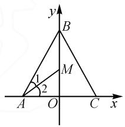
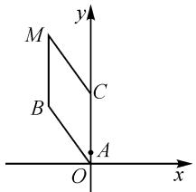
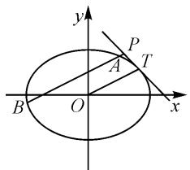

# 借助向量载体,促进学生数学素养快速提升

# ● 江苏省金湖中学 陈万斌

向量含有丰富的内涵和广阔的外延,其本身就是形与数的一个结合体,更是交叉知识之间联系的重要载体和纽带,同时也是解决数学问题的一个重要数学工具.正因为向量的这种特殊性,所以学好向量不仅可以让学生掌握和理解一些相关的数学方法和数学思想,还可以快速提高思维发散能力、联想意识,提升数学素养.

# 1 深入研究向量,培养逻辑推理素养

# 1.1 先看图再建系

例 1 △ABC 中, AB = BC = 6, AC = 9, M 是 △ABC 的内心, 若 $\overrightarrow{AM} = P \overrightarrow{AB} + q \overrightarrow{AC}$ , 求 $\frac{p}{q}$ 值.

解析: 如图 1, 以 AC 所在直线为 x 轴, 线段 AC 的中点 O 为原点建立平面直角坐标系.

text_image

y
B
M
1
2
A O C x

图1

所以 $AO=\frac{9}{2}$ .

由三角形内心的性质知 $\angle 1 = \angle 2$ ，再由角平分线定理知 $\frac{BM}{MO} = \frac{4}{3}$

所以 $4 \overrightarrow{OM} = 3 \overrightarrow{MB}$ .

所以 $4(\overrightarrow{AM}-\overrightarrow{AO})=3(\overrightarrow{AB}-\overrightarrow{AM})$ .

所以 $7 \overrightarrow{AM}=4 \overrightarrow{AO}+3 \overrightarrow{AB}=2 \overrightarrow{AC}+3 \overrightarrow{AB}.$

所以 $\overrightarrow{AM} = \frac{2}{7}\overrightarrow{AC} +\frac{3}{7}\overrightarrow{AB}$ ，则 $p = \frac{2}{7},q = \frac{3}{7}.$

故 $\frac{p}{q}=\frac{2}{3}.$

评议:抓住图形特点,恰当建系.

# 1.2 先研数再寻法

例 2 如图 2, 已知点 A(0,1), B(-3,4), 求 $\angle AOB$ 的角平分线所在的直线方程.

解析:由角平分线联想到菱形的对角线平分对角,因为 $|\overrightarrow{OB}|=5$ , $|\overrightarrow{OA}|=1$ , 可设 $C(0,5)$ , $M(-3,9)$ ,所以四边形 OBMC 为菱形, OM 即为 $\angle AOB$ 的对角

text_image

y
M
C
B
A
O
x

图2

线. 易求得 $l_{OM}: y = -3x$ ，所以 $\angle AOB$ 的角平分线在直线方程为 y = -3x.

评议:分析数据的内涵,探索解法.

# 1.3 先审式再处理

例 3 已知 $\triangle ABC$ 的三个内角分别为 A, B, C，且其内心为点 O，证明： $\sin A \cdot \overrightarrow{OA} + \sin B \cdot \overrightarrow{OB} + \sin C \cdot \overrightarrow{OC} = 0.$

证明:设 $\triangle ABC$ 的内角A,B,C所对的边分别为a,b,c.由正弦定理知,本题即要证

$$
a \cdot \overrightarrow {O A} + b \cdot \overrightarrow {O B} + c \cdot \overrightarrow {O C} = 0.
$$

设 BO 的延长线交 AC 于点 E.

由 $\angle ABE = \angle EBC$ ，可得 $\frac{AE}{EC} = \frac{c}{a}$ 则 $\frac{AE}{AC} = \frac{c}{a + c}$

同理，由 $\angle BAO = \angle EAO$ ，可得

$$
\frac {E O}{O B} = \frac {A E}{A B} = \frac {\frac {c}{a + c} \cdot A C}{A B} = \frac {c}{a + c} \cdot \frac {b}{c} = \frac {b}{a + c}.
$$

所以， $\overrightarrow{AO}=\overrightarrow{AE}+\overrightarrow{EO}=\frac{c}{a+c}\overrightarrow{AC}+\frac{b}{a+c}\overrightarrow{OB}.$

整理，得 $(a + c)\overrightarrow{OA} +c\overrightarrow{AC} +b\overrightarrow{OB} = 0.$

于是， $(a + c)\overrightarrow{OA} +c(\overrightarrow{OC} -\overrightarrow{OA}) + b\overrightarrow{OB} = 0$ ，化简得 $a\cdot \overrightarrow{OA} +b\cdot \overrightarrow{OB} +c\cdot \overrightarrow{OC} = 0$

故 $\sin A \cdot \overrightarrow{OA} + \sin B \cdot \overrightarrow{OB} + \sin C \cdot \overrightarrow{OC} = 0.$

评议:研究式子的特征进行转化,寻求突破.

# 1.4 先挖掘再突破

例 4 已知 O 是 $\triangle ABC$ 所在平面内一点，且 $2\overrightarrow{OA} + 3\overrightarrow{OB} + 4\overrightarrow{OC} = 0$ ，求 $S_{\triangle AOB}: S_{\triangle ABC}$ 的值.

解析：由奔驰定理，知 $S_{\triangle OBC}\overrightarrow{OA} + S_{\triangle AOC}\overrightarrow{OB} + S_{\triangle AOB}\overrightarrow{OC} = 0.$ 不妨设 $S_{\triangle OBC} = 2, S_{\triangle AOC} = 3, S_{\triangle AOB} = 4$ 则 $\frac{S_{\triangle AOB}}{S_{\triangle ABC}} = \frac{4}{2 + 3 + 4} = \frac{4}{9}.$

评议:挖掘习题信息中隐含的二级结论.

# 1.5 先转化再计算

例 5 直线 l 过圆 $M: (x-5)^{2} + y^{2} = 1$ 的圆心，且与圆相交于 A, B 两点，P 为双曲线 $C: \frac{x^{2}}{9} - \frac{y^{2}}{16} = 1$ 右支上一点，求 $\overrightarrow{PA} \cdot \overrightarrow{PB}$ 的最小值.

解析:由题意可知,圆心为线段 AB 的中点,设 M

为双曲线的右焦点,则有 $\overrightarrow{PA}+\overrightarrow{PB}=2\overrightarrow{PM}$ .

所以， $\overrightarrow{PA} \cdot \overrightarrow{PB} = \frac{(\overrightarrow{PA} + \overrightarrow{PB})^2 - (\overrightarrow{PA} - \overrightarrow{PB})^2}{4} = \frac{(\overrightarrow{PA} + \overrightarrow{PB})^2 - 4}{4} = \overrightarrow{PM}^2 - 1.$ 又 $|\overrightarrow{PM}| \geqslant 5 - 3 = 2$ ，因此 $\overrightarrow{PA} \cdot \overrightarrow{PB} \geqslant 3.$

故 $\overrightarrow{PA}\cdot\overrightarrow{PB}$ 的最小值为3.

评议:利用向量关系减少运算量.

# 2 巧妙添置向量,培养数学建模素养

例 6 已知椭圆 $E: \frac{x^{2}}{a^{2}} + \frac{y^{2}}{b^{2}} = 1 (a > b > 0)$ 的两个焦点与短轴的一个端点构成直角三角形，直线 $l: y = -x + 3$ 与椭圆 E 有且只有一个公共点 T.

(1)求椭圆 E 的方程及点 T 的坐标.

(2) 设 O 是坐标原点, 直线 $l'$ 平行于直线 OT, 与椭圆 E 交于不同的两点 A, B, 且与直线 l 交于点 P. 证明: 存在常数 $\lambda$ , 使得 $|PT|^{2} = \lambda |PA| \cdot |PB|$ , 并求 $\lambda$ 值.

解析:(1)易求得,椭圆 $E:\frac{x^{2}}{6}+\frac{y^{2}}{3}=1,T(2,1)$ .

(2) 由 $k_{l} \cdot k_{OT} = -\frac{b^{2}}{a^{2}} = -\frac{1}{2}$ , 得 $k_{OT} = \frac{1}{2}$ , 设直线 $AB$ 方程为 $y = \frac{1}{2} x + m$ .

联立 $\left\{\begin{aligned}y&=\frac{1}{2}x+m,\\ y&=-x+3,\end{aligned}\right.$ 解得 $P\left(2-\frac{2m}{3},1+\frac{2m}{3}\right).$

又 $T(2,1)$ ，所以 $PT^{2}=\frac{8m^{2}}{9}$ .

如图 3, 由 P, A, B 三点共线, 得

$$
\mid P A \mid \cdot \mid P B \mid = \overrightarrow {P A} \cdot \overrightarrow {P B}.
$$

设 $A(x_{1},y_{1}),B(x_{2},y_{2})$ ，则

$$
y _ {1} = \frac {x _ {1}}{2} + m, y _ {2} = \frac {x _ {2}}{2} + m.
$$

text_image

y
P
A T
B O x

图3

联立 $\left\{\begin{aligned}x^{2}+2y^{2}-6=0,\\ y=\frac{1}{2}x+m.\end{aligned}\right.$ 消去y，得

$$
\frac {3}{2} x ^ {2} + 2 m x + 2 m ^ {2} - 6 = 0.
$$

所以 $\Delta=4m^{2}-4\times\frac{3}{2}(2m^{2}-6)>0,$

$$
x _ {1} + x _ {2} = - \frac {4 m}{3},
$$

$$
x _ {1} x _ {2} = \frac {4 m ^ {2} - 1 2}{3}.
$$

又 $\overrightarrow{PA} = \left(x_{1} - 2 + \frac{2m}{3},y_{1} - 1 - \frac{2m}{3}\right),$

$$
\overrightarrow {P B} = \left(x _ {2} - 2 + \frac {2 m}{3}, y _ {2} - 1 - \frac {2 m}{3}\right),
$$

于是可得所以 $\overrightarrow{PA} \cdot \overrightarrow{PB} = \left(x_{1} - 2 + \frac{2m}{3}\right) \times \left(x_{2} - 2 + \frac{2m}{3}\right) + \left(y_{1} - 1 - \frac{2m}{3}\right)\left(y_{2} - 1 - \frac{2m}{3}\right)$ .

整理, 得 $\overrightarrow{PA} \cdot \overrightarrow{PB} = \frac{10}{9} m^{2}$ .

所以 $\frac{8m^{2}}{9}=\lambda\cdot\frac{10m^{2}}{9}.$

故 $\lambda=\frac{4}{5}$ .

评议:建立向量模型,把原题转化成向量问题.

# 3 凸显工具向量,培养数学抽象素养

例 7 已知 $A(-\sqrt{3},0)$ , $B(\sqrt{3},0)$ ，点 P 是圆 C: $x^{2}+(y-1)^{2}=4$ 上任一点（点 P 与点 A, B 不重合），求证： $\angle APB$ 是定值.

证明: 设 $P(x_{0}, y_{0})$ ，不妨设 $y_{0} > 0$ ，则可得 $x_{0}^{2} + (y_{0} - 1)^{2} = 4$ ，即 $x_{0}^{2} + y_{0}^{2} - 2y_{0} - 3 = 0$ ，且

$$
\overrightarrow {P A} = \left(- \sqrt {3} - x _ {0}, - y _ {0}\right),
$$

$$
\overrightarrow {P B} = \left(\sqrt {3} - x _ {0}, - y _ {0}\right).
$$

所以 $\overrightarrow{PA} \cdot \overrightarrow{PB} = x_0^2 - 3 + y_0^2 = 2y_0$ .

$$
\begin{array}{l} \text { 又 } \mid \overrightarrow {P A} \mid \cdot \mid \overrightarrow {P B} \mid \\ = \left[ \sqrt {(- \sqrt {3} - x _ {0}) ^ {2} + (- y _ {0}) ^ {2}} \cdot \sqrt {(\sqrt {3} - x _ {0}) ^ {2} + (- y _ {0}) ^ {2}} \right. \\ = \sqrt {2 \sqrt {3} x _ {0} + 2 y _ {0} + 6} \cdot \sqrt {2 y _ {0} + 6 - 2 \sqrt {3} x _ {0}} \\ = \sqrt {(2 y _ {0} + 6) ^ {2} - (2 \sqrt {3} x _ {0}) ^ {2}} \\ = \sqrt {4 y _ {0} ^ {2} + 2 4 y _ {0} + 3 6 - 1 2 x _ {0} ^ {2}} \\ = \sqrt {4 y _ {0} ^ {2} + 2 4 y _ {0} + 3 6 - 1 2 \left(- y _ {0} ^ {2} + 2 y _ {0} + 3\right)} \\ = \sqrt {1 6 y _ {0} ^ {2}} = 4 y _ {0}, \\ \end{array}
$$

所以 $\cos\angle APB=\frac{\overrightarrow{PA}\cdot\overrightarrow{PB}}{|\overrightarrow{PA}||\overrightarrow{PB}|}=\frac{2y_{0}}{4y_{0}}=\frac{1}{2}.$

故 $\angle APB = 60^{\circ}$

评议:例 7 是初中常见结论,但难以严谨证明,这里体现了向量工具的特别效能.

在平时的教学中,教师要立足“大单元”教学的理念,如在开展向量内容教学时,对向量的内容进行整体设计,不仅有助于学生掌握向量的基本内容、基本方法,更是通过向量的教学培养学生敢于联想、善于联系的思考习惯和意识;让学生在解决数学问题的过程中巩固了数学方法、强化了数学思想,培养了数学推理、数学建模、数学抽象等数学核心素养. Z