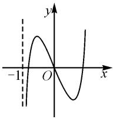

# 函数零点所在区间问题的探究

# ● 福建省厦门集美中学 刘延平

摘要:以导数为背景的函数零点问题,是高考命题的常考题型,且多以压轴题形式出现,题目灵活性大,综合性强.问题的处理,要明确解题思维、清楚解题策略、有效破解难点.本文中以一道高考零点所在区间问题为例,对题型方法进行归纳总结.

关键词: 零点; 区间; 导数

函数零点问题是高考考查函数内容的重要题型，既有选择、填空题，也有压轴题，难度大，对考生的基本功要求较高。零点问题的考查视角主要有三种：求零点，判断零点的个数，判断零点所在区间。本文中以2022年全国高考卷中的一道零点所在区间的判断问题为例，探究此类问题的处理策略。

# 1 命题呈现

例1（2022年全国高考数学乙卷）已知函数 $f(x) = \ln (1 + x) + \frac{ax}{\mathrm{e}^x}$

(1) 当 a=1 时, 求曲线 $y=f(x)$ 在点 $(0,f(0))$ 处的切线方程;  
(2) 若 $f(x)$ 在区间 $(-1,0)$ ， $(0,+\infty)$ 内各恰有一个零点，求 a 的取值范围.

本题是以指数与对数综合的函数为背景,导数为工具,零点所在区间为命题视角,求参数范围的一道综合题.第(1)问考查了导数几何意义的应用,较为基础,下面对第(2)问解题思维策略进行探究.

# 2 策略分析

判断函数零点所在的区间,要结合函数的单调情况,以及零点存在定理.

求函数的单调区间需要用到导数工具,利用导函数的正负判断原函数的增减性.其中难点是导函数符号的判断.若导函数为常规函数,可直接利用其性质判断.若导函数为超越函数型,常用的方法主要有二次求导、分区间讨论、设而不求、放缩法等.本题所给的函数中就含有超越函数模型 $y=\frac{x}{e^{x}}$ ,因此我们不仅要熟悉相应的方法,还要明确这些超越函数的性质.

函数 $f(x) = \frac{x}{\mathrm{e}^x}$ 的定义域为 $\mathbf{R}, f'(x) = \frac{1 - x}{\mathrm{e}^x}$ ，由 $f'(x) = 0$ 得 $x = 1$ . 当 $x \in (-\infty, 1)$ 时， $f'(x) > 0$ ， $f(x)$ 单调递增；当 $x \in (1, +\infty)$ 时， $f'(x) < 0, f(x)$ 单调递减. 易知 $f(0)=0$ ; 当 $x\in(-\infty,0)$ 时, $f(x)<0$ ;
当 $x \in (0, +\infty)$ 时, $f(x) > 0$ . $f_{\text{极大值}}(x) = f(1) = \frac{1}{\mathrm{e}}$ .

类似地, 常见的超越函数, 还有 $y = \frac{e^{x}}{x}$ , $y = \frac{\ln x}{x}$ , $y=\frac{x}{\ln x}$ 等.

零点存在定理的应用,需借助函数在区间端点处的函数值,或区间内某些特殊点的函数值,特殊值的选择要结合函数的结构特征,或先对函数进行放缩,再取点.而放缩除了常用到切线不等式 $e^{x} \geqslant x + 1, x + 1 \geqslant \ln x (x > 0)$ 及其变形之外,还常用到我们熟悉的函数在某单调区间内函数值的大小关系.

此类问题大多含有参数,需要对参数的可能取值进行讨论,分类讨论要明确分类标准,讨论要不重不漏.

明确了问题的常用处理策略,也就明确了解题的方向,问题的求解也就变得心中有数了.下面展示例1的探究历程.

# 3 探究历程

# 3.1 以形定数, 明确方向

函数 $f(x)$ 的定义域为 $(-1, +\infty)$ ，且在区间 $(-1, 0), (0, +\infty)$ 内各恰有一个零点，那么函数 $f(x)$ 的图象应具有什么样的特征？

我们不妨先来探究一下：

由函数 $f(x)=\ln(1+x)+\frac{ax}{\mathrm{e}^{x}}$ 的结构式，易得 $f(0)=0$ ，即 x=0 为函数 $f(x)$ 的一个零点.

当 x 趋近于 -1 时， $f(x)$ 趋近于 $-\infty$ ; 当 x 趋近于 $+\infty$ 时， $f(x)$ 趋近于 $+\infty$ .

若函数 $f(x)$ 在区间 $(-1,0)$ ， $(0,+\infty)$ 内各恰有一个零点，则 $f(x)$ 的大致图象可能如图 1 所示的形状.

那么函数 $f(x)$ 的图象形状是

text_image

-1
O
x
y

图1

否如此,则需要我们进一步判断.

# 3.2 多想少算,先猜后证

若函数 $f(x)$ 的大致图象如图1所示，不难发现 $f(x)$ 在 $x = 0$ 的导数值为负数，即 $f^{\prime}(0) <   0.$ 对函数 $f(x)$ 求导，可以得到 $f^{\prime}(x) = \frac{1}{x + 1} +\frac{a(1 - x)}{\mathrm{e}^{x}} =$ $\frac{\mathrm{e}^x + a(1 - x^2)}{(x + 1)\mathrm{e}^x}$ ，则 $f^{\prime}(0) = a + 1 <   0$ ，即 $a <   - 1.$ 至此我们初步猜想得出了 $a$ 的可能范围.

我们所想是否正确,还需要进一步证明.

先来说明 $a \geqslant -1$ 时不符合题意.

设 $g(x)=\mathrm{e}^{x}+a(1-x^{2})$ .

当 $-1\leqslant a<0$ 时，若 $x\in(0,1)$ ，则 $e^{x}>1,-1<a(1-x^{2})<0$ ，所以 $g(x)>0$ ；若 $x\in(1,+\infty)$ ，则 $e^{x}>0,a(1-x^{2})>0$ ，所以 $g(x)>0$ 。

所以，当 $-1\leqslant a<0$ 时，在 $x\in(0,+\infty),g(x)>0$ ，即 $f'(x)>0,f(x)$ 单调递增，所以 $f(x)>f(0)=0$ ，即函数 $f(x)$ 在区间 $(0,+\infty)$ 内不存在零点，不符合题意.

当 $a \geqslant 0$ 时，若 $x \in (-1, 0)$ ，则 $e^{x} > 0, a(1 - x^{2}) > 0$ ，于是 $g(x) > 0$ ，即 $f'(x) > 0, f(x)$ 单调递增，所以 $f(x) > f(0) = 0$ ，即函数 $f(x)$ 在区间 $(-1, 0)$ 内不存在零点，不符合题意.

探索出 a 的范围,也就明确了讨论的方向,以及分类标准.欲说明上述两种情况不符合题意,只要能够说明函数 $f(x)$ 在区间 $(-1,0)$ 或 $(0,+\infty)$ 内不存在零点即可.在判断 $g(x)=\mathrm{e}^{x}+a(1-x^{2})$ 的正负时,采用了分区间讨论法.

# 3.3 把握关键,突破难点

下面我们只要判断 a<-1 符合题意即可.

对函数 $g(x)=\mathrm{e}^{x}+a(1-x^{2})$ 求导，得 $g'(x)=\mathrm{e}^{x}-2ax$ .

当 $a < -1$ 时，若 $x \in (0, +\infty)$ ，则 $g'(x) > 0$ ，所以 $g(x)$ 在 $(0, +\infty)$ 上单调递增。又 $g(0) = 1 + a < 0$ ， $g(1) = e > 0$ ，所以存在 $x_1 \in (0, 1)$ ，使得 $g(x_1) = 0$ ，即 $f'(x_1) = 0$ 。

于是在 $x \in (0, x_{1})$ 时， $f'(x) < 0, f(x)$ 单调递减；在 $x \in (x_{1}, +\infty)$ 时， $f'(x) > 0, f(x)$ 单调递增.

所以，在 $x \in (0, x_1)$ 时， $f(x) < f(0) = 0$ ， $f(x)$ 无零点。又 $x$ 趋近于 $+\infty$ 时， $f(x)$ 趋近于 $+\infty$ ，所以 $f(x)$ 在区间 $(x_1, +\infty)$ 上有唯一零点。

所以,函数 $f(x)$ 在 $(0,+\infty)$ 上有唯一零点.

若 $x \in (-1,0)$ ，设 $h(x) = g'(x) = e^{x} - 2ax$ ，求导得 $h'(x) = e^{x} - 2a > 0$ ，所以 $g'(x)$ 在 $(-1,0)$ 单调递增，且 $g'(-1) = \frac{1}{e} + 2a < 0, g'(0) = 1 > 0$ ，所以存

在 $x_{2}\in(-1,0)$ ，使得 $g'(x_{2})=0$ 。

在 $x \in (-1, x_{2})$ , $g'(x) < 0$ , $g(x)$ 单调递减; 在 $x \in (x_{2}, 0)$ , $g'(x) > 0$ , $g(x)$ 单调递增, 所以 $g(x) < g(0) = 1 + a < 0$ .

又 $g(-1)=\frac{1}{e}>0$ ，所以存在 $x_{3}\in(-1,x_{2})$ $g(x_{3})=0$ ，即 $f'(x_{3})=0$ 。

所以，在 $x \in (-1, x_3)$ ， $f(x)$ 单调递增；在 $x \in (x_3, 0)$ ， $f(x)$ 单调递减，且 $x$ 趋近-1时， $f(x)$ 趋近于 $-\infty$ 。又 $f(0) = 0$ ，所以当 $x \in (x_3, 0)$ ， $f(x) > 0$ 。所以 $f(x)$ 在区间 $(-1, x_3)$ 内有唯一零点，在区间 $(x_3, 0)$ 内无零点，即 $f(x)$ 在 $(-1, 0)$ 上有唯一零点。

所以 a<-1, 符合题意.

综上,满足条件的 a 的取值范围为 $(-∞,-1)$ .

# 4 解后反思

上述解答中在判断导函数的符号,以及原函数变化趋势时,利用了二次求导、设而不求、极限思想等.在我们找不到特殊点的情况下才选择极限思想,那么本题是否能找到相应的特殊点?例如:当 $x \in (-1,0)$ 时, $f(x) = \ln(1+x) + \frac{ax}{\mathrm{e}^{x}}$ 中的 $y = \frac{x}{\mathrm{e}^{x}}$ 是我们熟悉的超越函数之一,由策略分析中的探究可知,该函数在区间 $(-1,0)$ 内单调递增,因为 a < -1,则 $y = \frac{ax}{\mathrm{e}^{x}}$ 在 $(-1,0)$ 内单调递减,所以 $f(x) = \ln(1+x) + \frac{ax}{\mathrm{e}^{x}} < \ln(1+x) + \left(\frac{-a}{\mathrm{e}^{-1}}\right) = \ln(1+x) - ae$ ,当 $x = e^{ae} - 1$ 时, $\ln(1+x) - ae = 0$ ,进而找到满足条件的特殊点.用类似的放缩法,我们也可得到在区间 $(0,+\infty)$ 内相应的特殊点,读者不妨一试.

# 5 牛刀小试

例 2 已知函数 $f(x)=ax-\frac{1}{x}-(a+1)\ln x$ .

(1) 当 a=0 时, 求函数 $f(x)$ 的最大值;

(2) 若函数 $f(x)$ 恰有一个零点, 求 a 的取值范围.

答案:(1)当 a=0 时, $f_{\max}(x)=f(1)=-1$ .

(2) 当函数 $f(x)$ 恰有一个零点时, a 的取值范围是 $(0, +\infty)$ .

例 2 没有另给区间, 即在函数 $f(x)$ 的定义域 $(0, +\infty)$ 内进行判断. 难度较例 1 有所降低, 但解题中所涉及的思维方法相近, 在此不再赘述, 供读者演练.

综上所述,此类问题难度虽然较大且常考常新,但并非无规律可循,只要我们能明确命题原理,熟练掌握处理方法,积累难点的处理策略,即可以不变应万变.Z