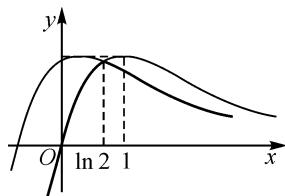
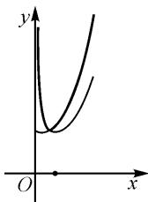
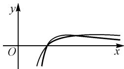

# 创新定义巧应用,数形结合妙直观

# 山东省青岛第六十七中学 马燕丽

摘要:创新定义与创新应用问题,是“三新”背景下高考改革下创新意识与创新应用的一个重要动向.本文中结合一道函数最值的求解,以创新定义的形式来设置,从不同思维来发散与切入,剖析问题的内涵与实质,探求问题的突破与求解,合理变式拓展与创新应用,有效指导数学教学与复习备考.

关键词: 创新定义; 函数; 最值; 数形结合; 变式

创新意识与创新应用是新时代的一个主要特征，也是高中数学教学与学习中不断加以渗透与培养的一种基本素养与能力。而借助“创新定义”与创新应用，可以在数学基础知识中的概念类比、公式设置、性质应用、知识拓展与创新应用等方面巧妙交汇与融合，很好地融入创新意识与创新应用，成为高中数学试题命制与创新中的一道亮丽风景线，合理创设情境，巧妙创新应用。

# 1 问题呈现

问题（2024年江苏省南京市、盐城市高三年级第一次模拟考试·8)用 $\min \{x,y\}$ 表示 $x,y$ 中的最小值.已知函数 $f(x) = \frac{x}{\mathrm{e}^x}$ ，则 $\min \{f(x),f(x + \ln 2)\}$ 的最大值为（ ）.

A. $\frac{2}{e^{2}}$

B. $\frac{1}{e}$

C. $\frac{\ln 2}{2}$

D. $\ln 2$

此题以创新定义——最小值(min)为问题场景，借助超越函数的创设，进而确定与创新定义下的最值问题.

这里以两个辩证的形式来设置,通过创新定义“minM”来创设,而求解与之相应的最大值问题,形成对立的对比状态来优化问题场景,开拓创新性应用.

在实际解题过程中,抓住创新定义的内涵与本质,结合超越函数的图象与性质,以及函数图象的平移与直观,数形结合,直观想象,是解决问题的根本所在;而依托问题的创新场景,估算法应用与秒杀法处理,也是一个不错的选择.

# 2 问题破解

解法 1: 数形结合法.

依题可得函数 $f(x)$ 的定义域为 R, $f'(x)=\frac{1-x}{\mathrm{e}^{x}}$ .
令 $f'(x)=0$ ，得 x=1，则知函数 $f(x)$ 在 $(-∞,1)$ 上单调递增，在 $(1,+\infty)$ 上单调递减，所以 $f(x)_{\max}=f(1)=\frac{1}{e}$ .

而函数 $f(x + \ln 2)$ 的图象是将 $f(x)$ 的图象向左平移 $\ln 2$ 个单位长度后的图象, 如图 1 所示.

由新定义可知,两函数图象中较低的位置部分,即图中的粗线部分为 $y=\min\{f(x),f(x+\ln2)\}$ ，数形结合可知，当 y 取得最大值时， $f(x)=f(x+\ln2)$ ，即 $\frac{x}{e^{x}}=\frac{x+\ln2}{e^{x+\ln2}}=\frac{x+\ln2}{2e^{x}}$ ，解方程可得 $x=\ln2$ ，此时 $y_{\max}=\frac{\ln2}{e^{\ln2}}=\frac{\ln2}{2}$ 。故选：C.

line

| x    | y (solid) | y (dashed) |
| ---- | --------- | ---------- |
| 0    | 0         | 0          |
| ln 2 | Peak      | 0          |
| 1    | Decreasing | 1          |

图 1

点评:熟悉一些基本初等函数,借助导数法确定一些对应的超越函数的图象以及图象的平移变换等,是数形结合思维解决涉及函数综合问题中最为常用的一种基本技巧方法.数形结合思维是探究并突破问题解决的一种简捷方法.数形结合思维,可以更加直观形象地观察函数图象的变化情况,给问题的切入与求解提供直观依据,成为解决函数综合问题中的“通性通法”.

解法 2: 估算法.

依题可得函数 $f(x)$ 的定义域为 R, $f'(x)=\frac{1-x}{\mathrm{e}^{x}}$ . 令 $f'(x)=0$ , 得 x=1, 则知函数 $f(x)$ 在 $(-∞,1)$ 上单调递增, 在 $(1,+∞)$ 上单调递减, 所以 $f(x)_{\max}=f(1)=\frac{1}{\mathrm{e}}$ .

令 $m=\min\{f(x),f(x+\ln2)\}$ ，则有 $2m\leqslant f(x)+f(x+\ln2)\leqslant f(x)_{\max}+f(x+\ln2)_{\max}<\frac{1}{\mathrm{e}}+\frac{1}{\mathrm{e}}=\frac{2}{\mathrm{e}}$ 解得 $m < \frac{1}{e}$ .

而各选项中， $\frac{2}{e^{2}}\approx0.270\ 7,\frac{1}{e}\approx0.367\ 9,\frac{\ln\ 2}{2}\approx0.346\ 6,\ln\ 2\approx0.693\ 1$ ，显然满足 $m<\frac{1}{e}$ 的最接近的答案为 $\frac{\ln\ 2}{2}$ .故选：C.

点评:估算法作为解决一些选择题的一种基本技巧方法,是基于熟悉一些基本数值的情况下而加以合理判断与估算的.这里各选项中的数值,只能借助计算器来实现,直接记忆存在一定的困难,只是作为一个基本的思维方向加以介绍与应用.当然各选项中的数值可以通过计算来突破,只是计算量不小.

解法 3: 秒杀法.

依题,借助函数 $f(x)=\frac{x}{\mathrm{e}^{x}}$ 的图象的连续性,结合创新定义,可知当满足 $f(x)=f(x+\ln2)$ 时,函数 $\min\{f(x),f(x+\ln2)\}$ 取得最大值.

而由 $f(x) = f(x + \ln 2)$ ，可得 $\frac{x}{\mathrm{e}^x} = \frac{x + \ln 2}{\mathrm{e}^{x + \ln 2}} = \frac{x + \ln 2}{2\mathrm{e}^x}$ ，解得 $x = \ln 2$ 。

所以函数 $\min \{f(x), f(x + \ln 2)\}$ 的最大值为 $f(\ln 2) = \frac{\ln 2}{\mathrm{e}^{\ln 2}} = \frac{\ln 2}{2}$ . 故选: C.

点评:借助函数图象的连续性以及相应的变化规律,只有当两个函数的图象相交时,才是最值的取值点,进而直接构建两函数相等,通过求解方程来确定目的.“秒杀法”是基于解题经验的积累而投机取巧的一种方法,解题不具有严谨性,但效益性极佳,是考试中初步解题时经常用到的,具有一定的技巧性与灵活性.但此方法有时又具有盲目性,要不断提升解题的准确性.

# 3 变式拓展

基于原创新定义问题的设置与解析,进行深度学习与探究,加以创新应用与深入学习,得到以下相应的变式应用问题.

变式 1 用 $\max\{x,y\}$ 表示 x,y 中的最大值. 已知函数 $f(x)=\frac{\mathrm{e}^{x}}{x}(x>0)$ ，则 $\max\{f(x),f(x+\ln2)\}$ 的最小值为 \_\_\_\_.

解析:依题可得 $f'(x)=\frac{(x-1)\mathrm{e}^{x}}{x^{2}}$ ，令 $f'(x)=0$ ，得 x=1，则知函数 $f(x)$ 在 $(0,1)$ 上单调递减，在 $(1,+\infty)$ 上单调递增，所以 $f(x)_{\min}=f(1)=\mathrm{e}$ .

而函数 $f(x+\ln2)$ 的图象是将 $f(x)$ 的图象向左平移 $\ln2$ 个单位长度后的图象，如图2所示.

根据新定义可知,两函数图象中较高的位置部分,即图中的粗线部分为 $y=\max\{f(x),f(x+\ln2)\}$ , 数形结合可知,当 y 取得最小值时,则有$f(x) = f(x + \ln 2)$ ，即 $\frac{\mathrm{e}^x}{x} = \frac{\mathrm{e}^{x + \ln 2}}{x + \ln 2} = \frac{2\mathrm{e}^x}{x + \ln 2}$ 解得 $x = \ln 2$ ，此时 $y_{\min} = \frac{\mathrm{e}^{\ln 2}}{\ln 2} = \frac{2}{\ln 2}.$

  
图 2

故填答案: $\frac{2}{\ln 2}$ .

变式 2 用 $\min\{x,y\}$ 表示 x,y 中的最小值. 已知函数 $f(x)=\frac{\ln x}{x}(x>1)$ ，则 $\min\{f(x),f(x^{2})\}$ 的最大值为 \_\_\_\_.

解析:依题可得 $f'(x)=\frac{1-\ln x}{x^{2}}$ . 令 $f'(x)=0$ , 得 x=e, 则知函数 $f(x)$ 在 $(1,\mathrm{e})$ 上单调递增, 在 $(\mathrm{e},+\infty)$ 上单调递减, 所以 $f(x)_{\max}=f(\mathrm{e})=\frac{1}{\mathrm{e}}$ .

作出函数 $f(x)$ 与 $f(x^{2})$ 的图象, 如图 3 所示.

由新定义可知,两图象中较低的位置部分,即图中的粗线部分为 $y=\min\{f(x),f(x^{2})\}$ ,数形结合可知，当 y 取得最大值时，有 $f(x)=f(x^{2})$ ，即 $\frac{\ln x}{x}=\frac{\ln x^{2}}{x^{2}}=\frac{2\ln x}{x^{2}}$ ，解得 x=2，此时 $y_{\max}=\frac{\ln 2}{2}$ .

  
图3

故填答案: $\frac{\ln 2}{2}$ .

# 4 教学启示

基于创新定义与创新应用,借助创新问题的设置,合理引导高中数学教学重心从重结果回到重过程,让学生的思维能力培养、探究能力培养和做事能力培养等方面成为最重要的教学任务.

同时,要关注高考改革对高中数学教学的明确指导,注重数学思维品质的培养,发展学生的关键能力,全面培养学生的学科核心素养,引导育人本位,引导基础教育扎实实施素质教育.在问题解决和知识体系构建过程中,促使学生不断积累数学思维活动的经验,从数量关系和几何特征的视角描述和理解事物的规律等.Z