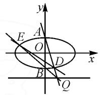

# 在动点的“变”中寻求定值的“不变”

# ● 江苏省邗江中学 陈晓丹

摘要:本文中以“一道蝴蝶模型中的定点问题”为例,引导学生对解析几何中的定点定值问题进行多角度思考;通过小组合作探究的方式,引导学生正确处理解析几何中的非对称性结构问题,并尝试将所得结论进行拓展与推广.授课中,以培养学生的数学学科素养为目标,提高学生处理问题、分析问题及解决问题的能力,促进学生自主全面发展.

关键词: 定点定值问题; 非对称性结构; 自主合作; 数学学科素养

在高考评价体系中，理性思维、数学应用、数学探究、数学文化构成了数学学科的四大学科素养[1].历年来，解析几何在高考卷中都占有一席之地，考核的难度与深度对学生的运算求解能力、逻辑思维能力提出了高要求.本文中从求解“一道圆锥曲线的定点问题”出发，通过学生自主合作、互动交流，探究在非对称性结构情景下的多种求解策略，发掘试题中“变”与“不变”之间的联系，从而不断归纳总结、拓展创新，逐步实现数学学科育人的目的.

# 1 试题的呈现与解法探究

题目 如图 1, 已知椭圆 $C: \frac{x^2}{a^2} + \frac{y^2}{b^2} = 1 (a > b > 0)$ 的离心率为 $\frac{\sqrt{3}}{2}, M\left(\frac{a}{4}, b\right)$ 为焦点是 $\left(\frac{1}{2}, 0\right)$ 的抛物线上一点, $Q$ 为直线 $y = -a$ 上任一点, $A, B$ 分别为椭圆 $C$ 的上、下顶点, 且 $A, B, Q$ 三点的连线可以构成三角形.

  
图 1

(1)求椭圆 C 的方程;

(2) 直线 QA, QB 与椭圆 C 的另一个交点分别为点 D, E, 求证: 直线 DE 过定点 P, 并求出点 P 的坐标.

此题的第(1)问比较简单,求得
椭圆 C 的方程为 $\frac{x^{2}}{4} + y^{2} = 1$ , 过程略. 下面重点探究第(2)问的证法.

策略 1: 主动点为 Q, 通过设点 Q 的坐标来求解点 D, E 的坐标, 再利用“交轨法”求之.

方法1: 设 $Q(m, -2)$ , $m \neq 0$ ，则直线 QA 的方程为 $y = -\frac{3}{m}x + 1$ ，将直线 QA 与曲线 C 的方程联立，可得到 $D\left(\frac{24m}{m^{2} + 36}, \frac{m^{2} - 36}{m^{2} + 36}\right)$ 。同理， $E\left(\frac{-8m}{m^{2} + 4}, \frac{4 - m^{2}}{m^{2} + 4}\right)$ 。

故直线 DE 的斜率为 $k=\frac{m^{2}-12}{16m}$ .

所以直线 DE 的方程为 $y - \frac{4 - m^{2}}{m^{2} + 4} = \frac{m^{2} - 12}{16m} \cdot \left(x - \frac{-8m}{m^{2} + 4}\right)$ ，即 $y = \frac{m^{2} - 12}{16m} x - \frac{1}{2}$ .

故直线 DE 过定点 $P\left(0, -\frac{1}{2}\right)$ .

策略 2: 通过设点 Q 的坐标求解点 D, E 的坐标, 先利用特殊值求出点 P, 再证明 D, E, P 三点共线.

方法 2: 由证法 1 可得到, $D\left(\frac{24m}{m^{2}+36}, \frac{m^{2}-36}{m^{2}+36}\right)$ , $E\left(\frac{-8m}{m^{2}+4},\frac{4-m^{2}}{m^{2}+4}\right)$ .

令 m=2，则直线 DE 的方程为 $y=-\frac{1}{4}(x+2)$ ;
再令 m = -2，则直线 DE 的方程为 $y=\frac{1}{4}(x-2)$ .

通过 $m=\pm2$ 两种特殊情况, 求解定点 $P\left(0,-\frac{1}{2}\right)$ , 再利用 $k_{DP}=k_{EP}$ 证 D, E, P 三点共线, 则直线 DE 过定点 $P\left(0,-\frac{1}{2}\right)$ .

评注:上述两种方法均从条件出发,通过设点Q的坐标来确定点D,E的坐标.方法1由两点式求解直线DE的方程,解题方向明确,但要求学生具有较强的计算能力;方法2通过特殊值进行探究,再历经严格的证明,此方法的计算量减少了,但要求学生具备转化化归、分析问题及解决问题的理性能力.

策略 3: 本题中直线 DE 的斜率必存在, 可通过设直线 DE 的方程及韦达定理来求解.

方法 3: 设直线 DE 的方程为 $y = kx + m$ ，将直线 DE 方程与曲线 C 的方程联立，得

$$
(1 + 4 k ^ {2}) x ^ {2} + 8 k m x + 4 m ^ {2} - 4 = 0.
$$

当 $\Delta >0$ 时，设 $D(x_{1},y_{1}), E(x_{2},y_{2})$ ，则有

$$
x _ {1} + x _ {2} = \frac {- 8 k m}{1 + 4 k ^ {2}}, x _ {1} x _ {2} = \frac {4 m ^ {2} - 4}{1 + 4 k ^ {2}}.
$$

由题意,可得直线 DA 的方程为 $y=\frac{y_{1}-1}{x_{1}}x+1$ ;
直线 BE 的方程为 $y=\frac{y_{2}+1}{x_{2}}x-1$ .

由直线 DA 与直线 BE 得交点为 Q, 可得

$$
\frac {3 x _ {1}}{y _ {1} - 1} = \frac {x _ {2}}{y _ {2} + 1}. \tag {①}
$$

方法 3 从目标出发,通过珠联璧合的方法得到非对称性①式.学生对于非对称性问题的求解是存在困惑的.基于这一学情,教师引导学生进行小组讨论、合作探究并分享成果.

第一小组: 将①式化简整理后, 尝试通过直线消元处理.

将①式变形,得

$$
3 x _ {1} \left(k x _ {2} + m + 1\right) = x _ {2} \left(k x _ {1} + m - 1\right),
$$

即 $2kx_{1}x_{2}+3(m+1)x_{1}-(m-1)x_{2}=0.$

解得 $x_{1}=\frac{-4k(2m^{2}-m-1)}{(1+4k^{2})(2m+1)}$ .

评注: 此方法在理论上可以通过计算求得结果, 而实际操作过程中发现, 计算极其繁琐, 学生没有信心与毅力去完成接下来的计算.

第二小组：将 ① 式左右两边同时平方，得 $\frac{9x_1^2}{(y_1 - 1)^2} = \frac{x_2^2}{(y_2 + 1)^2}$ ，由点 $D, E$ 在曲线 $C$ 上，得 $x_1^2 = 4(1 - y_1^2), x_2^2 = 4(1 - y_2^2)$ ，则 $4y_1y_2 + 5(y_1 + y_2) + 4 = 0$ .

于是有 $4(kx_{1} + m)(kx_{2} + m) + 5[(kx_{1} + m) + (kx_{2} + m)] + 4 = 0$ ，化简整理，结合韦达定理解得 $m = -2$ （不符，舍）或 $m = -\frac{1}{2}$

所以直线 DE 的方程为 $y = kx - \frac{1}{2}$ ，因此直线 DE 恒过定点 $P\left(0, -\frac{1}{2}\right)$ .

第三小组: 将①式右边分子、分母同乘 $x_{2}$ (左侧同乘 $x_{1}$ 也可达到相同效果), 即

$$
\frac {3 x _ {1}}{y _ {1} - 1} = \frac {x _ {2} ^ {2}}{x _ {2} (y _ {2} + 1)} = \frac {4 (1 - y _ {2} ^ {2})}{x _ {2} (y _ {2} + 1)} = \frac {4 (1 - y _ {2})}{x _ {2}},
$$

整理得 $3x_{1}x_{2}+4(y_{1}-1)(y_{2}-1)=0$ ，将 $y_{1}=kx_{1}+m$ ， $y_{2}=kx_{2}+m$ 代入，得 $(4k^{2}+3)x_{1}x_{2}+4k(m-1)\cdot(x_{1}+x_{2})+4(m-1)^{2}=0$ 。结合韦达定理，解得 m=1 （不符，舍）或 $m=-\frac{1}{2}$ 。

所以直线 DE 的方程为 $y = kx - \frac{1}{2}$ ，故直线 DE恒过定点 $P\left(0,-\frac{1}{2}\right)$ .

评注:针对非对称性问题的处理,学生主要利用“消元法”来求解.由于第二、三小组的计算过程中没有进行等价转换,因此出现了增根的情况.本题由直线、曲线消元或部分消元均可达到“减元”的目的,解题方向比较明确,但需要强大的计算处理能力.采用小组合作探究的方式,可以锻炼学生的合作能力,培养他们的语言表达能力,提高分析问题及解决问题的能力,促发学生数学探究素养的形成.

# 2 拓展探究与归纳创新

从上述解答过程可以看出,学生主要从两大方向(条件与目标)去处理圆锥曲线的定点、定值问题.在分析处理问题时,学生获得新的认知:由①式可知,直线AD的斜率与直线BE的斜率的比值是定值,即 $\frac{k_{AD}}{k_{BE}}=3$ .然而题中的条件是灵活多变的,教师应利用GeoGebra软件绘制图形,让学生更直观地体会图形中的“不变”量与“变”量,恰当引导学生开放思维,大胆猜测并合作验证,将结论得以推广.扎实的基础和稳定的操作实践才能使学生将知识融会贯通,学以致用,促发学生的创新意识.

结论 1.1 设 A, B 分别为椭圆 C: $\frac{x^{2}}{a^{2}} + \frac{y^{2}}{b^{2}} = 1$ (a > b > 0) 的上、下顶点，Q 为直线 y = t 上任一点，过点 Q 作直线 QA, QB 与椭圆 C 分别交于点 D, E，则 $\frac{k_{QA}}{k_{QB}} = \frac{t - b}{t + b}$ ，且直线 DE 恒过定点 $\left(0, \frac{b^{2}}{t}\right)$ .

证明: 设直线 DE 的方程为 $y = kx + m$ ，将直线 DE 方程与曲线 C 的方程联立，得

$$
\left(b ^ {2} + a ^ {2} k ^ {2}\right) x ^ {2} + 2 k m a ^ {2} x + a ^ {2} \left(m ^ {2} - b ^ {2}\right) = 0.
$$

当 $\Delta >0$ 时，设 $D(x_{1},y_{1}), E(x_{2},y_{2})$ ，则有

$$
x _ {1} + x _ {2} = \frac {- 2 k m a ^ {2}}{b ^ {2} + a ^ {2} k ^ {2}}, x _ {1} x _ {2} = \frac {a ^ {2} (m ^ {2} - b ^ {2})}{b ^ {2} + a ^ {2} k ^ {2}}.
$$

由题意, 可得直线 DA 的方程为 $y=\frac{y_{1}-b}{x_{1}}x+b$ ;
直线 BE 的方程为 $y=\frac{y_{2}+b}{x_{2}}x-b$ .

由直线 DA 与 BE 的交点为 Q，则有 $\frac{(t-b)x_{1}}{y_{1}-b}=\frac{(t+b)x_{2}}{y_{2}+b}$ ，即 $\frac{k_{QA}}{k_{QB}}=\frac{(y_{1}-b)x_{2}}{x_{1}(y_{2}+b)}=\frac{t-b}{t+b}$ .

两边平方, 同时再结合 $x_{1}^{2}=a^{2}\left(1-\frac{y_{1}^{2}}{b^{2}}\right)$ , $x_{2}^{2}=a^{2}\left(1-\frac{y_{2}^{2}}{b^{2}}\right)$ , 可得

$$
2 t y _ {1} y _ {2} - \left(t ^ {2} + b ^ {2}\right) \left(y _ {1} + y _ {2}\right) + 2 t b ^ {2} = 0,
$$

即 $2t(kx_{1}+m)(kx_{2}+m)-(t^{2}+b^{2})[k(x_{1}+x_{2})+2m]+2tb^{2}=0.$

结合韦达定理, 可解得 $m=\frac{b^{2}}{t}$ 或 m=t (不符, 舍).

所以直线 DE 的方程为 $y=kx+\frac{b^{2}}{t}$ ，故直线恒过定点 $\left(0,\frac{b^{2}}{t}\right)$ .

由圆锥曲线的对称性,可得下列结论.

结论 1.2 设 A, B 分别为椭圆 C: $\frac{x^{2}}{a^{2}} + \frac{y^{2}}{b^{2}} = 1$ (a > b > 0) 的左、右顶点，Q 为直线 x = t 上任一点，过点 Q 作直线 QA, QB 与椭圆 C 分别交于点 D, E，则 $\frac{k_{QA}}{k_{QB}} = \frac{t - a}{t + a}$ ，且直线 DE 恒过定点 $\left(\frac{a^{2}}{t}, 0\right)$ .

若将条件“点 Q 的轨迹为直线”与结论“ $\frac{k_{QA}}{k_{QB}}$ 为定值、直线 DE 恒过定点”之一互换，开启辩证的思维模式，推广至逆命题，结论也成立.

结论 1.3 设 A, B 分别为椭圆 C: $\frac{x^{2}}{a^{2}} + \frac{y^{2}}{b^{2}} = 1$ (a > b > 0) 的上、下顶点，若动点 Q 满足 $\frac{k_{QA}}{k_{QB}} = \lambda (\lambda \neq \pm 1)$ ，过点 Q 作直线 QA, QB 与椭圆 C 分别交于点 D, E，则点 Q 的轨迹为直线 $y = \frac{b(1 + \lambda)}{1 - \lambda}$ ，且直线 DE 恒过定点 $\left(0, \frac{b(1 - \lambda)}{1 + \lambda}\right)$ .

结论 1.4 设 A, B 分别为椭圆 C: $\frac{x^{2}}{a^{2}} + \frac{y^{2}}{b^{2}} = 1$ (a > b > 0) 的左、右顶点，若动点 Q 满足 $\frac{k_{QA}}{k_{QB}} = \lambda (\lambda \neq \pm 1)$ ，过点 Q 作直线 QA, QB 与椭圆 C 分别交于点 D, E，则点 Q 的轨迹为直线 $x = \frac{a(1 + \lambda)}{1 - \lambda}$ ，且直线 DE 恒过定点 $\left(\frac{a(1 - \lambda)}{1 + \lambda}, 0\right)$ .

教师补充,通过极点极线法可证:

由于四边形 ABDE 四个顶点 A, B, D, E 均在椭圆上，且对角线 AB 与 DE 交于 $P\left(\frac{a^{2}}{t}, 0\right)$ ，所以点 P 可以看成椭圆的一个极点，直线 AD 与 BE 的交点 Q 在点 P 对应的极线 x = t 上.

由此可见，“ $\frac{k_{QA}}{k_{QB}}$ 的值、Q的轨迹、直线DE恒过定

点”这三个条件是相辅相成、相互制约的，知一可求二.

类比椭圆的结论,将其推广至双曲线,可得下列一些结论.

结论 2.1 设 A, B 分别为双曲线 $C: \frac{y^{2}}{a^{2}} - \frac{x^{2}}{b^{2}} = 1$ (a > 0, b > 0) 的上、下顶点，Q 为直线 y = t 上任一点，过点 Q 作直线 QA, QB 与双曲线 C 分别交于点 D, E，则 $\frac{k_{QA}}{k_{QB}} = \frac{t - a}{t + a}$ ，且直线 DE 恒过定点 $\left(0, \frac{a^{2}}{t}\right)$ .

结论 2.2 设 A, B 分别为双曲线 $C: \frac{x^{2}}{a^{2}} - \frac{y^{2}}{b^{2}} = 1$ (a > 0, b > 0) 的左、右顶点，Q 为直线 x = t 上任一点，过点 Q 作直线 QA, QB 与双曲线 C 分别交于点 D, E，则 $\frac{k_{QA}}{k_{QB}} = \frac{t - a}{t + a}$ ，且直线 DE 恒过定点 $\left(\frac{a^{2}}{t}, 0\right)$ .

结论 2.3 设 A, B 分别为双曲线 $C: \frac{y^{2}}{a^{2}} - \frac{x^{2}}{b^{2}} = 1$ (a > 0, b > 0) 的上、下顶点，若动点 Q 满足 $\frac{k_{QA}}{k_{QB}} = \lambda (\lambda \neq \pm 1)$ ，过点 Q 作直线 QA, QB 与双曲线 C 分别交于点 D, E，则点 Q 的轨迹为直线 $y = \frac{a(1 + \lambda)}{1 - \lambda}$ ，且直线 DE 恒过定点 $\left(0, \frac{a(1 - \lambda)}{1 + \lambda}\right)$ .

结论 2.4 设 A, B 分别为双曲线 $C: \frac{x^{2}}{a^{2}} - \frac{y^{2}}{b^{2}} = 1$ (a > 0, b > 0) 的左、右顶点，若动点 Q 满足 $\frac{k_{QA}}{k_{QB}} = \lambda (\lambda \neq \pm 1)$ ，过点 Q 作直线 QA, QB 与双曲线 C 分别交于点 D, E，则点 Q 的轨迹为直线 $x = \frac{a(1 + \lambda)}{1 - \lambda}$ ，且直线 DE 恒过定点 $\left(\frac{a(1 - \lambda)}{1 + \lambda}, 0\right)$ .

高考数学的考查载体即试题情境,以解析几何中定点、定值为出发点,引导学生从多维度探究解题的思路并付诸行动;从课程学习情境出发,通过观察比较,追求一题多解,培养学生理性思维能力;着眼于探究创新情境的开发,引导学生发掘动点的“变”与定点、定值中的“不变”量之间的紧密联系.以此类比归纳、融会贯通、学以致用,这样才能有效激发学生的创新思维.

# 参考文献：

[1]任子朝,赵轩.基于高考评价体系的数学科考试内容改革实施路径[J].中国考试,2019(12):27-32.Z