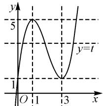

# 基于代数基本定理中的三次方程及其应用\*

# ● 江苏省口岸中学 杨 翠

高考数学命题及其应用中,经常有一些涉及三次方程或三次函数的“三次”问题,其是基于“二次”方程、函数、不等式等的深入与拓展,也是数学思维的升华与应用.而高中数学教材中的“阅读与思考”板块,设置了与“三次”有关的数学问题,借助代数基本定理中有关三次方程根与系数的关系(韦达定理)来深入分析与转化处理,解决问题更加直接有效,简化数学运算,优化逻辑推理.

# 1 依托教材本质

阅读与思考 江苏凤凰教育出版社 2019 年国家教材委员会专家委员会审核通过的《数学》(必修第二册)第十二章“复数”第 134 页阅读——复数系是怎样建立的？

复数概念的深入与推广,其实质就是代数基本定理,概念主要是基于16世纪上半叶来应用,最早的记录出现在荷兰数学家吉拉尔的论著《代数新发现》(1629)中,他大胆推测并断言“n次多项式方程有n个根”,但在论著中并没有给出相应的推理与证明.

随着数学的发展,1637年笛卡儿也提出了代数基本定理,只是其表述形式与现代的代数基本定理的表述不尽相同.后来数学家马克劳林和欧拉使得该定理的表述更为精确,数学家达朗贝尔于1746年第一次给出了代数基本定理的证明.直到18世纪后半叶,数学家欧拉、拉普拉斯、拉格朗日等对代数基本定理相继给出了一些相应的推理与证明.

这里通过教材中“阅读”板块来介绍代数基本定理，在二次方程的基础上巧妙地加以拓展与应用。关键是介绍三次方程根与系数的关系（韦达定理），并在此基础上，进一步加以深度学习与创新应用。

# 2 三次方程之韦达定理

设实系数一元三次方程

$$
a _ {3} x ^ {3} + a _ {2} x ^ {2} + a _ {1} x + a _ {0} = 0 (a _ {3} \neq 0) \tag {①}
$$

在复数集 C 内的根分别为 $x_{1}, x_{2}, x_{3}$ ，可以得到，方程①可变形为 $a_{3}(x-x_{1})(x-x_{2})(x-x_{3})=0.$

展开,得

$$
a _ {3} x ^ {3} - a _ {3} \left(x _ {1} + x _ {2} + x _ {3}\right) x ^ {2} + a _ {3} \left(x _ {1} x _ {2} + x _ {1} x _ {3} + \right.
$$

$$
\left. x _ {2} x _ {3}\right) x - a _ {3} x _ {1} x _ {2} x _ {3} = 0. \tag {②}
$$

比较①②可以得到 $\left\{\begin{aligned}x_{1}+x_{2}+x_{3}&=-\frac{a_{2}}{a_{3}},\\ x_{1}x_{2}+x_{1}x_{3}+x_{2}x_{3}&=\frac{a_{1}}{a_{3}},\\ x_{1}x_{2}x_{3}&=-\frac{a_{0}}{a_{3}}.\end{aligned}\right.$

以上公式就是对应的三次方程根与系数的关系，即三次方程的韦达定理。三次方程的韦达定理，是对初中数学中二次方程的韦达定理的深入与拓展，成为初中数学、高中数学与高考数学之间自然过渡的桥梁，也是高考数学、高中竞赛等命题中比较常见的考查场景与综合应用。

# 3 问题场景创设

借助“三次”场景应用,结合三次方程根与系数的关系,即三次方程的韦达定理,在解决一些涉及“三次”问题中有奇效,可以有效提供切入视角,更好地优化解题过程,提升解题效益.

# 3.1 复数场景

例 1 若 $x_{1}=1, x_{2}=1-i, x_{3}=1+i$ (i 为虚数单位) 为方程 $x^{3}+ax^{2}+bx+c=0$ 的三个解，则 $a+b-c=$ \_\_\_\_.

解析:依题意可直接利用三次方程根与系数的关系,即三次方程的韦达定理,可得

$$
\left\{ \begin{array}{l} x _ {1} + x _ {2} + x _ {3} = 1 + 1 - \mathrm{i} + 1 + \mathrm{i} = - a, \\ x _ {1} x _ {2} + x _ {1} x _ {3} + x _ {2} x _ {3} = 1 \times (1 - \mathrm{i}) + 1 \times (1 + \mathrm{i}) + \\ (1 - \mathrm{i}) (1 + \mathrm{i}) = b, \\ x _ {1} x _ {2} x _ {3} = 1 \times (1 - \mathrm{i}) (1 + \mathrm{i}) = - c. \end{array} \right.
$$

解得 a = -3, b = 4, c = -2，则有 $a + b - c = -3 + 4 + 2 = 3$ 。故填答案：3。

点评:代数基本定理的适应范围是复数范围,在解决一些复杂的复数场景问题时,特别是与“三次”有关的数学综合与应用问题时,经常通过回归“三次”问题,借助三次方程的韦达定理,结合对应的公式应用,构建相应根或零点之间的关系式,为进一步分析与应用创造条件.

# 3.2 方法创设

例 2 波斯诗人奥马尔·海亚姆于 11 世纪发现了一元三次方程 $x^{3} + a^{2}x = b (a \neq 0, b > 0)$ 的几何求解方法. 在直角坐标系 xOy 中, P, Q 两点在 x 轴上, 以 OP 为直径的圆与抛物线 C: $x^{2} = ay$ 交于点 R, $RQ \perp OQ$ . 已知 $x = |OQ|$ 是方程 $x^{3} + a^{2}x = b$ 的一个解, 则点 P 的坐标为().

A. $\left(\frac{b}{a^2},0\right)$ B. $\left(\frac{b}{a},0\right)$ C. $\left(\frac{a^2}{b},0\right)$ D. $\left(\frac{a}{b},0\right)$

解析:依题意可设 $P(t,0)$ ，则 OP 的中点为 $\left(\frac{t}{2},0\right)$ ，则以 OP 为直径的圆的方程为 $\left(x-\frac{t}{2}\right)^{2}+y^{2}=\frac{t^{2}}{4}$ 。将圆的方程与抛物线 C:x²=ay 联立，可得 $\left(x-\frac{t}{2}\right)^{2}+\frac{x^{4}}{a^{2}}=\frac{t^{2}}{4}$ ，整理化简可得 $x^{2}-tx+\frac{x^{4}}{a^{2}}=0$ 。而 $RQ\perp OQ$ ，可得 R,Q 的横坐标相等，则方程 $x^{3}+a^{2}x=b$ 和方程 $x-t+\frac{x^{3}}{a^{2}}=0$ 有相同的解，则有 $b=a^{2}t$ ，解得 $t=\frac{b}{a^{2}}$ ，即 $P\left(\frac{b}{a^{2}},0\right)$ 。故选：A。

点评:这里以解题方法的形式给出对应的三次方程及其应用问题.将高次(这里是三次)方程的求解与应用问题转化为平面解析几何的直观法来分析与处理,有“图”有真相,处理起来更加直观形象.关键是从阅读理解视角来展开,合理挖掘方法的实质与内涵来分析与应用.

# 3.3 公式应用

例 3 已知函数 $f(x)=x^{3}-2x^{2}-3x+4$ ，若 $f(a)=f(b)=f(c)$ ，其中 a<b<c，则 $a^{2}+b^{2}+c^{2}=$ \_\_\_\_.

解析:依题意可设 $f(a)=f(b)=f(c)=t$ ，则知 a,b,c 是三次方程 $x^{3}-2x^{2}-3x+4-t=0$ 的实根.

由三次方程的韦达定理, 可得 $\left\{\begin{aligned}a+b+c=2,\\ ab+bc+ca=-3.\end{aligned}\right.$ 结合代数式的变形, 可得 $a^{2}+b^{2}+c^{2}=(a+b+c)^{2}-2(ab+bc+ca)=2^{2}-2\times(-3)=10.$ 故填答案: 10.

点评:根据题设条件引入参数,化“三次”函数问题为“三次”方程问题,合理进行等价变形与转化.在此基础上,借助三次方程的构建,利用三次方程的韦达定理来转化与应用,设而不求,巧妙变形与转化,实现代数式的求值与应用,是解决此类问题最为常用的一种技巧方法.

# 3.4 综合应用

例 4 （多选题）已知函数 $f(x)=x^{3}-6x^{2}+9x+1$ ，若满足 $f(a)=f(b)=f(c)$ ，其中 a<b<c，则以下结论正确的是（）.

A.1<a<2 B. $a+b+c=6$

C. $2 < a + b < 3$ D. $abc$ 的取值范围是 $(0,4)$

解析:依题意,由函数 $f(x)=x^{3}-6x^{2}+9x+1$ , 求导可得 $f'(x)=3x^{2}-12x+9=3(x-3)(x-1)$ .

令 $f'(x)=0$ ，解得 x=1 或 x=3。由 $f'(x)>0$ ，解得 x<1 或 x>3，则函数 $f(x)$ 的单调递增区间为 $(-∞,1)$ 和 $(3,+∞)$ ；由 $f'(x)<0$ ，解得 1<x<3，则函数 $f(x)$ 的单调递减区间为 $(1,3)$ 。

而 $f(3)=1, f(1)=f(4)=5$ ，则函数 $f(x)$ 的大致图象如图 1 所示.

设 $f(a)=f(b)=f(c)=t$ ，可得 1<t<5,0<a<1<b<3<c<4，则选项 A 错误；

而 $f(x) - t = (x - a)(x - b)$ $(x - c) = x^{3} - 6x^{2} + 9x + 1 - t$ ，利

line

| x | y |
|---|---|
| 0 | 1 |
| 1 | 5 |
| 3 | 1 |

图 1

用三次方程的韦达定理，有 $a + b + c = -\frac{a_2}{a_3} = -\frac{-6}{1} = 6, abc = -\frac{a_0}{a_3} = -\frac{1 - t}{1} = t - 1 \in (0,4)$ ，则选项B，D正确；

又 3<c<4，可得 $3<6-(a+b)<4$ ，解得 $2<a+b<3$ ，则选项 C 正确。

综上分析,故选:BCD.

点评:在解决一些涉及“三次”的综合问题中,特别是三次方程或函数的综合应用问题中,合理恒等变形,巧妙等价转化,将对应问题巧妙化归为相应的三次方程或函数问题,进而利用三次方程根与系数的关系来综合应用,这是解决问题的关键所在,也是问题的重要切入点之一.

在新教材、新课程、新高考的“三新”背景下，合理依托高中数学教材中的相关板块，巧妙融入数学文化与史话知识，介绍一些相关知识的来龙去脉，剖析数学文化的内涵本质，成为深度学习一个重要方面。

同时,依托高中数学教材中对应板块的应用,结合数学文化的融入与渗透,进而创设更多的应用场景,对于提升数学思维品质与关键能力,养成良好的数学阅读习惯与培养数学核心素养等方面都是十分有益的.Z