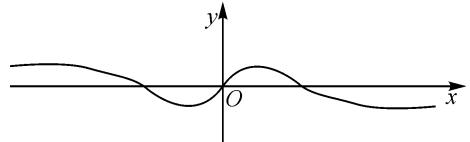

# 对一道全国高中数学联赛预赛题的研究

# ● 浙江省淳安中学 仇夜生

摘要: 涉及函数的性质与应用问题,一直是高考与联赛的一个基本考点,结合一道联赛有关函数的值域求解问题,从不同思维角度切入,利用不同的技巧方法破解,在此基础上加以变式与拓展,总结规律,引领并指导解题研究.

关键词：函数；值域；三角换元；基本不等式；导数

函数是贯穿高中数学的一条主线与灵魂,渗透于高中数学基本知识的角角落落,是历年高考与联赛数学试卷中的基本点之一,变化多端,形式各样.破解此类函数问题,关键是正确把握函数的基本概念以及自身性质,结合函数的解析式、基本性质等,分析、理解、思考、研究、应用并总结函数问题,形成并强化高效的数学解题思维,有效应用所学的数学基本知识、数学思想方法和数学能力等,多层面结合来解决相应的函数问题.

# 1 试题呈现

联赛试题 （2021年全国高中数学联赛江西省预赛试题第7题）函数 $f(x)=\frac{x-x^{3}}{(1+x^{2})^{2}}$ 的值域是 \_\_\_\_.

# 2 赛题剖析

此联赛试题,以高次分式函数解析式为背景创设函数问题,结合函数的值域的求解来设置,题目简单明了,言简意赅.题目场景熟知,只是函数解析式比较复杂新颖,无法直接利用比较熟悉的基本初等函数的图象与性质,而是将相关知识相互融合渗透,关键考查函数的解析式、基本性质、值域等相关知识.

破解此类复杂函数的值域问题,关键是挖掘函数解析式中所蕴含的本质属性,确定函数的基本性质以及最值问题,从复杂的函数解析式这一已知条件出发,结合解析式的特征,或三角换元处理,或基本不等式应用,或导数法破解等,都可以达到非常好的解题效果,巧妙有效.

# 3 试题破解

方法 1: 三角换元法.

解析:由题意可知,函数 $f(x)$ 的定义域为 R, 不妨设 $x = \tan \alpha, \alpha \in \left(-\frac{\pi}{2}, \frac{\pi}{2}\right)$ , 则由 $\sin 2\alpha = \frac{2\tan \alpha}{1 + \tan^{2} \alpha}$ , $\cos 2\alpha = \frac{1 - \tan^{2} \alpha}{1 + \tan^{2} \alpha}$ 可知,

$$
\begin{array}{l} y = \frac {x - x ^ {3}}{(1 + x ^ {2}) ^ {2}} = \frac {x}{1 + x ^ {2}} \times \frac {1 - x ^ {2}}{1 + x ^ {2}} = \frac {\tan \alpha}{1 + \tan^ {2} \alpha} \times \\ \frac {1 - \tan^ {2} \alpha}{1 + \tan^ {2} \alpha} = \frac {1}{2} \times \frac {2 \tan \alpha}{1 + \tan^ {2} \alpha} \times \frac {1 - \tan^ {2} \alpha}{1 + \tan^ {2} \alpha} = \frac {1}{2} \sin 2 \alpha \cos 2 \alpha = \\ \frac {1}{4} \sin 4 \alpha . \\ \end{array}
$$

由 $\alpha \in \left(-\frac{\pi}{2},\frac{\pi}{2}\right)$ ，可得 $4\alpha \in (-2\pi ,2\pi)$

所以 $\sin 4\alpha \in [-1,1]$ .

所以函数 $f(x)$ 的值域是 $\left[-\frac{1}{4},\frac{1}{4}\right]$ .

故填答案： $\left[-\frac{1}{4},\frac{1}{4}\right]$ .

点评:结合题目条件,通过三角换元转化,结合三角恒等式的变形,借助万能公式、二倍角公式,以及三角函数的图象与性质,进而确定对应函数的值域.三角换元处理是破解一些函数值域或代数式最值等相关问题中比较常用的技巧方法,关键是合理三角换元,巧妙恒等变换.

方法 2: 基本不等式法.

解析:依题意, $|f(x)|=\left|\frac{x-x^{3}}{(1+x^{2})^{2}}\right|=\frac{1}{2}\times$

$$
\left| \frac {2 x}{1 + x ^ {2}} \right| \left| \frac {1 - x ^ {2}}{1 + x ^ {2}} \right| \leqslant \frac {1}{2} \times \frac {\left| \frac {2 x}{1 + x ^ {2}} \right| ^ {2} + \left| \frac {1 - x ^ {2}}{1 + x ^ {2}} \right| ^ {2}}{2} = \frac {1}{4},
$$

则有 $-\frac{1}{4} \leqslant f(x) \leqslant \frac{1}{4}$ .

所以函数 $f(x)$ 的值域是 $\left[-\frac{1}{4},\frac{1}{4}\right]$ .

故填答案: $\left[-\frac{1}{4},\frac{1}{4}\right]$ .

点评:结合函数解析式的绝对值处理,通过代数式的拆分,利用基本不等式加以放缩与应用,结合含有绝对值的不等式的求解,进而确定对应函数的值域.基本不等式法是在处理绝对值与拆分代数式的基础上进行合理放缩的技巧,为最值的求解提供依据,也是破解一些涉及函数、代数式等最值问题或取值范围问题中比较常用的一种方法技巧.

方法 3: 导数法.

解析:由题意可知,函数 $f(x)=\frac{x-x^{3}}{(1+x^{2})^{2}}$ 的定义域为 R,且 $f(x)$ 是定义域 R 上的奇函数,零点为 x=0, $x=\pm1$ .

下面先讨论 $f(x)$ 的单调性.

求导，可得

$$
\begin{array}{l} f ^ {\prime} (x) \\ = \frac {\left(1 - 3 x ^ {2}\right) \left(1 + x ^ {2}\right) ^ {2} - 2 \left(x - x ^ {3}\right) \left(1 + x ^ {2}\right) \cdot 2 x}{\left(1 + x ^ {2}\right) ^ {4}} \\ = \frac {x ^ {4} - 6 x ^ {2} + 1}{(1 + x ^ {2}) ^ {3}}. \\ \end{array}
$$

由 $f'(x)=0$ , 可得 $x=\sqrt{2}\pm1$

故函数 $f(x)$ 在区间 $(0, \sqrt{2}-1)$ 上单调递增，在区间 $(\sqrt{2}-1, \sqrt{2}+1)$ 上单调递减，在 $(\sqrt{2}+1, +\infty)$ 上单调递增，且 $x \to +\infty$ 时 $f(x) \to 0$ ，如图 1 所示.

text_image

y
O
x

图1

所以当 $x \in (0, +\infty)$ 时， $f(x)_{\text{极大值}} = f(\sqrt{2} - 1) = \frac{1}{4}, f(x)_{\text{极小值}} = f(\sqrt{2} + 1) = -\frac{1}{4}$ .

结合奇函数的性质可知，当 $x \in (-\infty, 0)$ 时，

$$
f (x) _ {\text {极小值}} = f (- \sqrt {2} + 1) = - \frac {1}{4},
$$

$$
f (x) _ {\text {极大值}} = f (- \sqrt {2} - 1) = \frac {1}{4}.
$$

综上分析,函数 $f(x)$ 的值域是 $\left[-\frac{1}{4},\frac{1}{4}\right]$ .

故填答案: $\left[-\frac{1}{4},\frac{1}{4}\right]$ .

点评: 导数法是解决函数最值、值域等相关问题中最常用的一种技巧方法, 也是破解函数问题的一种基本方法. 通过求导处理, 结合导函数的正负取值情况确定函数的单调性, 进而确定在对应区间上的最大值与最小值, 即可确定函数的最值、值域等相关问题. 导数法处理函数问题, 往往是函数问题的最后一道防线, 只是有时运算量比较大, 过程比较繁杂.

# 4 变式拓展

探究 1: 保留函数背景, 结合函数解析式的特征, 通过对原来函数的解析式进行取绝对值处理, 同样求解对应函数的值域, 得到以下相应的变式问题. 考查的知识点保持一致, 难度与原题基本相当.

变式1 函数 $f(x) = \left|\frac{x - x^3}{(1 + x^2)^2}\right|$ 的值域是

解析：由已知得 $f(x) = \left|\frac{x - x^3}{(1 + x^2)^2}\right| = \frac{1}{2}\times$ $\left|\frac{2x}{1 + x^2}\right|\left|\frac{1 - x^2}{1 + x^2}\right|\leqslant \frac{1}{2}\times \frac{\left|\frac{2x}{1 + x^2}\right|^2 + \left|\frac{1 - x^2}{1 + x^2}\right|^2}{2} = \frac{1}{4},$ 则有 $0\leqslant f(x)\leqslant \frac{1}{4}.$

故填答案: $\left[0,\frac{1}{4}\right]$ .

探究 2: 保留函数背景, 结合函数解析式的特征, 改变原来求解“值域”为求解“最大值与最小值的和”, 以函数解析式来确定对应函数的奇偶性, 利用奇函数的性质来求解. 考查的知识点不一样, 难度比原题小.

变式 2 函数 $f(x)=\frac{x-x^{3}}{(1+x^{2})^{2}}$ 的最大值为 M，最小值为 m，则 $M+m=$ \_\_\_\_.

解析:由题知函数= $\frac{x-x^{3}}{(1+x^{2})^{2}}$ 的定义域为R.

由于函数 $f(x) = \frac{x - x^3}{(1 + x^2)^2} = x\cdot \frac{1 - x^2}{(1 + x^2)^2}$ ，则有 $f(x) + f(-x) = 0.$

所以函数 $f(x)$ 是定义域 $\mathbf{R}$ 上的奇函数，则有 $f(x)_{\mathrm{max}} + f(x)_{\mathrm{min}} = 0$ ，即 $M + m = 0$

故填答案:0.

# 5 教学启示

(1)敢于尝试,方法归纳

涉及函数的最值问题、代数式的最值问题以及相应的值域问题等，要敢于尝试，借助函数解析式、代数式的代数运算与变形，结合通分、因式分解、配凑、平方、配方、构造等运算手段加以辅助处理，通过特殊函数（以基本初等函数类型为主）的图象与性质、基本不等式或柯西不等式、三角换元以及三角函数的图象与性质、导数方法等对应的数学工具知识来分析与处理，全面促进数学知识的交汇融合、理解掌握.

(2)抓住本质,优选策略

在破解函数的相关问题中,要充分合理把握函数自身的概念与本质属性,从函数概念、解析式、基本性质、方法梳理、数学运算等思维角度切入,有效培养、形成、发展和拓展解题思维,形成正确分析问题、处理问题与解决问题的能力,分析比较不同的问题背景与解题的技巧方法,有效选择,快速解题,提高解题效率,提升数学能力,形成良好数学品质,培养数学核心素养.Z