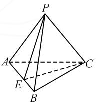
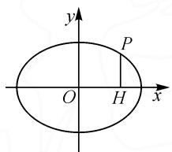
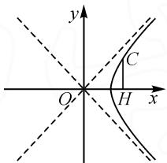
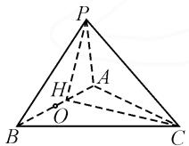
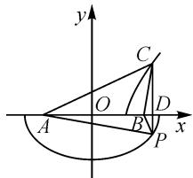

# 思维与技巧比翼,几何与代数融合

——对一道二面角取值范围试题的探究

# ● 江苏省海安市李堡中学 季宜红

立体几何中的位置、距离、角度等要素的最值(或取值范围)问题,一直是高考中的基本考点与热点问题之一.此类问题中,往往离不开动点的变化与应用,借助动点的变化情况来确定对应的位置、距离、角度等要素,为解决相应立体几何中的最值(或取值范围)问题提供条件.

此类立体几何中的最值(或取值范围)问题,可以交汇并融合众多的知识点,具有较强的综合性和技巧性,很好考查学生的数学基础知识与基本能力,有较好的选拔性与区分度,成为考试中的一个重点与难点,备受各方关注.

# 1 问题呈现

问题（2024届湖北省武汉市高中毕业生二月调研考试数学试卷·8)在三棱锥P-ABC中， $AB=2\sqrt{2}$ ，PC=1， $PA+PB=4$ ，CA-CB=2，且 $PC\perp AB$ ，则二面角P-AB-C的余弦值的最小值为（ ）.

A. $\frac{\sqrt{2}}{3}$

B. $\frac{3}{4}$

C. $\frac{1}{2}$

D. $\frac{\sqrt{10}}{5}$

此题以三棱锥为载体,已知一组对棱的长度和位置关系来创设场景,通过两个不同平面内对应动点的变化情况,引起二面角的变化,进而确定对应二面角的余弦值的最小值.

借助立体几何问题,巧妙融入平面几何、平面解析几何、三角函数、平面向量以及不等式等相关知识,实现不同知识点之间的交汇与融合,是一道集综合性、创新性、应用性与交汇性的模拟题,值得好好品味与深入探究.

# 2 问题破解

解法 1: 向量转化法.

如图1,作 $PE \perp AB$ 于点E,连接CE,由 $PC \perp AB,PC \cap PE = P,PC,PE \subset$ 平面PCE,可得 $AB \perp$ 平面PCE.又 $CE \subset$ 平面PCE,则 $AB \perp CE$ ,故 $\angle PEC$ 是二面角P-AB-C的平面角.

设 PA = x, PB = y, CA = m,

text_image

P
A
C
E
B

图 1

$CB = n$ ，则有 $x + y = 4, m - n = 2.$ 由 $\overrightarrow{PC} \cdot \overrightarrow{AB} = 0$ ，即 $\frac{1}{2} (\overrightarrow{PC} + \overrightarrow{PC}) \cdot \overrightarrow{AB} = 0$ ，则有 $(\overrightarrow{PB} - \overrightarrow{CB} + \overrightarrow{PA} - \overrightarrow{CA}) \cdot \overrightarrow{AB} = 0$ ，可得 $(\overrightarrow{PB} + \overrightarrow{PA}) \cdot \overrightarrow{AB} - (\overrightarrow{CB} + \overrightarrow{CA}) \cdot \overrightarrow{AB} = 0$ 则 $(\overrightarrow{PB} + \overrightarrow{PA}) \cdot (\overrightarrow{PB} - \overrightarrow{PA}) - (\overrightarrow{CB} + \overrightarrow{CA}) \cdot (\overrightarrow{CB} - \overrightarrow{CA}) = 0$ ，亦即 $\overrightarrow{PB^2} - \overrightarrow{PA^2} + \overrightarrow{CA^2} - \overrightarrow{CB^2} = 0, \overrightarrow{PA^2} - \overrightarrow{PB^2} = \overrightarrow{CA^2} - \overrightarrow{CB^2}$ ，即 $x^2 - y^2 = m^2 - n^2$ ，所以 $m + n = 2(x - y)$ . 而由 $y = 4 - x, m - n = 2$ ，可得 $m = 2x - 3$ ， $n = 2x - 5$ ，其中 $\frac{5}{2} < x < 4$ .

在 $\triangle PAB$ 中，半周长 $p = \frac{1}{2} (x + y + 2\sqrt{2}) = 2 + \sqrt{2}$ ，则有 $p - x = 2 + \sqrt{2} - x, p - y = x + \sqrt{2} - 2, p - 2\sqrt{2} = 2 - \sqrt{2}$ . 所以，由海伦公式可得 $S_{\triangle PAB} = \frac{1}{2} AB \cdot PE = \sqrt{(2 + \sqrt{2})(2 - \sqrt{2})(2 + \sqrt{2} - x)(x + \sqrt{2} - 2)}$ ，整理得 $PE^2 = 2 - (x - 2)^2$ .

同理, 可得 $CE^{2}=2(x-2)^{2}-1$ .

所以 $PE^{2}+CE^{2}-PC^{2}=(x-2)^{2}$ .

所以，在 $\triangle PEC$ 中，由余弦定理可得

$$
\begin{array}{l} \cos \angle P E C \\ = \frac {P E ^ {2} + C E ^ {2} - P C ^ {2}}{2 P E \cdot C E} \\ = \frac {(x - 2) ^ {2}}{2 \sqrt {[ 2 - (x - 2) ^ {2} ] [ 2 (x - 2) ^ {2} - 1 ]}} \\ = \frac {(x - 2) ^ {2}}{\sqrt {2} \cdot \sqrt {[ 2 - (x - 2) ^ {2} ] [ 4 (x - 2) ^ {2} - 2 ]}} \\ \geqslant \frac {(x - 2) ^ {2}}{\sqrt {2} \times \frac {2 - (x - 2) ^ {2} + 4 (x - 2) ^ {2} - 2}{2}} = \frac {\sqrt {2}}{3}, \\ \end{array}
$$

当且仅当 $2 - (x - 2)^2 = 4(x - 2)^2 - 2$ ，即 $(x - 2)^2 = \frac{4}{5}$ 时，等号成立.

所以二面角 $P - AB - C$ 的余弦值的最小值为 $\frac{\sqrt{2}}{3}$ .

故选：A.

点评:在该解法中,借助空间向量之间的关系与转化,合理构建对应边长之间的关系是解决问题的关键,也为问题的进一步解决提供条件.立体几何的应用场景,综合等面积法、余弦定理以及基本不等式的应用等,实现对应二面角余弦值的最小值的求解.该解法融合几何思维与代数思维,综合逻辑推理与数学运算等素养,协力合作来巧妙完成最值问题的探求.

解法 2: 轨迹法 1.

因为 $PA + PB = 4 = 2a > AB = 2\sqrt{2}$ ，所以 a = 2， $c = \sqrt{2}$ ，点 P 的轨迹方程为 $\frac{x^{2}}{4} + \frac{y^{2}}{2} = 1$ （椭圆除去左、右顶点），如图 2；又因为 CA - CB = 2 < AB = $2\sqrt{2}$ ，所以点 C 的轨迹方程为 $u^{2} - v^{2} = 1$ （双曲线的一支），如图 3.

text_image

y
P
O H x

图2

text_image

y
C
O
H
x

图3

过点 P 作 $PH \perp AB$ ，因为 $AB \perp PC$ ，而 $PH \cap PC = P, PH, PC \subset$ 平面 PCH，所以 $AB \perp$ 平面 PHC。又 $CH \subset$ 平面 PCH，所以 $AB \perp CH$ ，则 $\angle PHC$ 为二面角 P-AB-C 的平面角，如图 4.

  
图 4

设 O 为 AB 的中点, 不妨设 $OH = 2 \cos \theta, \theta \in \left(0, \frac{\pi}{2}\right]$ , 则由椭圆的方程可得 $PH = \sqrt{2} \sin \theta$ , 所以 $CH = \sqrt{4 \cos^{2} \theta - 1}$ .

所以 $\cos\angle PHC=\frac{2\sin^{2}\theta+4\cos^{2}\theta-1-1}{2\sqrt{2}\sin\theta\times\sqrt{4\cos^{2}\theta-1}}=$ $\frac{2\cos^{2}\theta}{2\sqrt{2}\sin\theta\times\sqrt{4\cos^{2}\theta-1}}=\frac{\sqrt{2}}{2}\times\frac{1-\sin^{2}\theta}{\sin\theta\times\sqrt{3-4\sin^{2}\theta}}$ 则有 $\cos^{2}\angle PHC=\frac{1}{2}\times\frac{(1-\sin^{2}\theta)^{2}}{\sin^{2}\theta(3-4\sin^{2}\theta)}$ .

令 $1 - \sin^2\theta = t\in (0,1)$ ，则 $\cos^2\angle PHC = \frac{1}{2}\times$ $\frac{t^2}{(1 - t)(4t - 1)}\geqslant \frac{1}{2}\times \frac{t^2}{\left(\frac{1 - t + 4t - 1}{2}\right)^2} = \frac{2}{9}$ ，当且仅当 $1 - t = 4t - 1$ ，即 $t = \frac{2}{5} = 1 - \sin^2\theta$ 时，等号成立.所以当且仅当 $\sin \theta = \frac{\sqrt{15}}{5},\cos \theta = \frac{\sqrt{10}}{5}$ 时，二面角 $P - AB - C$ 的余弦值最小，最小值为 $\frac{\sqrt{2}}{3}$ .故选：A.

点评:在该解法中,利用题设条件确定在各自已平面对应动点的轨迹问题,进而结合立体几何中二面角的概念确定对应的角,综合三角函数、余弦定理以及基本不等式的应用等,实现对应二面角余弦值的最小值的求解.巧妙引入角参,利用轨迹情况合理构建对应边长的关系式,为利用余弦定理构建关系式,并通过基本不等式的应用来确定最值提供条件.

解法 3: 轨迹法 2.

过点 P 作 AB 的垂线，交 AB 于点 D，连接 CD，因为 $PC \perp AB$ ，而 $PD \cap PC = P$ ，所以 $AB \perp$ 平面 PCD，从而 $AB \perp CD$ ，则 $\angle PDC$ 是二面角 P-AB-C 的

平面角. 剪开 PC, 将 $\triangle PAB$ 与 $\triangle CAB$ 放置在同一个平面内, 以线段 AB 的中点为坐标原点, 直线 AB 所在的直线为 x 轴建立平面直角坐标系, 如图 5 所示.

text_image

y
C
O
D
A
B
P
x

图5

由于 $PA + PB = 4 > 2\sqrt{2} = AB$ ，可知点 P 在以点 A，B 为焦点的椭圆上运动，其对应的椭圆方程为 $\frac{x^2}{4} +\frac{y^2}{2} = 1$ $(y\neq 0)$ ，考虑点 $P$ 在 $x$ 轴下方的椭圆上；又由 $CA-$ $CB = 2 <   2\sqrt{2} = AB$ ，可知点 $C$ 在以点 $A,B$ 为焦点的双曲线的右支上运动，其对应的双曲线方程为 $x^{2}-$ $y^{2} = 1$ ，考虑点 $C$ 在 $x$ 轴上方的双曲线上.

设 $D(t,0)$ ，则 1<t<2，可知 $\frac{t^{2}}{4}+\frac{PD^{2}}{2}=1$ 且 $t^{2}-CD^{2}=1$ ，消去参数 t 并整理得 $2PD^{2}+CD^{2}=3$ 。

由余弦定理，得 $\cos\angle PDC=\frac{PD^{2}+CD^{2}-1}{2PD\times CD}=$ $\frac{3PD^{2}+3CD^{2}-3}{6PD\times CD}=\frac{3PD^{2}+3CD^{2}-(2PD^{2}+CD^{2})}{6PD\times CD}=$ $\frac{PD^{2}+2CD^{2}}{6PD\times CD}\geqslant\frac{2\sqrt{2}PD\times CD}{6PD\times CD}=\frac{\sqrt{2}}{3}$ ，当且仅当 PD= $\sqrt{2}CD$ ，即 $CD^{2}=\frac{3}{5}, t=\frac{2\sqrt{2}}{\sqrt{5}}<\sqrt{2}$ 时，二面角 P-AB-C 的余弦值取得最小值 $\frac{\sqrt{2}}{3}$ . 故选：A.

点评:在该解法中,通过“裁剪”展开降维策略,基于立体几何中的空间角的构建,合理将空间几何体中不同平面内的点的性质的“三维”问题,通过展开转化,回归到平面解析几何的“二维”问题,利用平面解析几何中椭圆、双曲线的定义与方程,结合参数的引入与变形转化,综合基本不等式的应用,实现立体几何问题的突破.由“三维”问题,从不同视角转化为“二维”问题,实现问题的降维处理.

# 3 教学启示

涉及立体几何中的位置、距离、角度等要素的最值(或取值范围)问题,基于动点的变化情况,正确剖析题目条件,把握问题的内涵与实质,借助“动”来合理转化,巧妙化“动”为“静”,引入参数或相关的变量,通过“静”态思维,结合相关的函数或方程、三角函数、不等式、几何直观等来分析与应用,实现问题的巧妙解决. Z