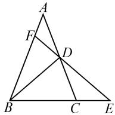
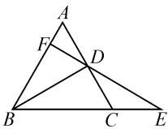
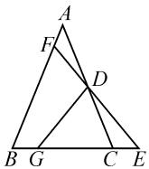
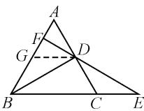
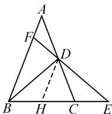
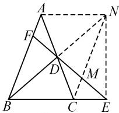
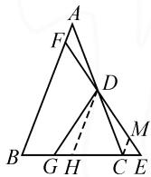
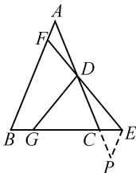
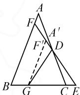

# 析题设 寻思路 探本质

# ● 武汉市恒大嘉园学校中学 武汉市华师临空港实验学校 封磊

摘要:通过对一道2022年武汉市中考题的分析,搭建问题的条件与结论之间的“桥梁”,得出多种解法,并探究问题的本质.

关键词: 解题反思; 一题多解; 几何压轴题

# 1 引言

2022年武汉市初中毕业生学业考试数学试卷的几何压轴题，采用“问题提出—问题探究—问题拓展”的形式，从特殊到一般地解决问题，重点考查学生的数学核心素养。本文中借助于此题的多种解法，总结解题思路、探究本质，望能有助于提升学生分析、解决问题的能力。

# 2 试题呈现

问题提出:如图1,在 $\triangle ABC$ 中,AB=AC,D是AC的中点,延长BC至点E,使DE=DB,延长ED交AB于点F,探究 $\frac{AF}{AB}$ 的值.

  
图1

  
图2

  
图3

问题探究:(1)先将问题特殊化.如图2,当 $\angle BAC=60^{\circ}$ 时,直接写出 $\frac{AF}{AB}$ 的值;

(2)再探究一般情形.如图1,证明(1)中的结论仍然成立.

问题拓展:如图 3, 在 $\triangle ABC$ 中, AB = AC, D 是 AC 的中点, G 是边 BC 上一点, $\frac{CG}{BC} = \frac{1}{n} (n < 2)$ , 延长 BC 至点 E, 使 DE = DG, 延长 ED 交 AB 于点 F. 直接写出 $\frac{AF}{AB}$ 的值(用含 n 的式子表示).

问题探究的(1)(2)问结论是一致的,共性条件为两个等腰三角形和一个中点,问题是求两条线段的比值.问题拓展,可看作问题探究(2)中的点B移动至点G,条件仍然不变.

解题思路的重点应该放在如何运用中点条件及如何构造出两条线段的比值.对于线段的中点,在初中学段的相关知识点主要有三角形中位线、中线倍长、等腰三角形的“三线合一”和“直角三角形斜边上的中线等于斜边的一半”等,两条线段的比值可通过相似三角形来求解.学生可以从两个维度去思考解题思路,教师在教学过程中,应该培养学生从基本知识点和基本方法分析问题的能力.

# 3 解法思路

问题探究的解法如下：

(1) 解: (中位线 + 全等)

如图 4 所示, 取 AB 的中点 G, 连接 DG.

通过证明 $\angle DBG = \angle EDC$ , $\angle DGB = \angle ECD, BD = DE$ , 可以
得到 $\triangle DBG\cong\triangle EDC$ , 所以 CE=DG.

  
图 4

再根据 $\triangle FDG\sim \triangle FEB$ ，得到 $\frac{FG}{FB} = \frac{GD}{BE} = \frac{1}{3}$

因为 G 是 AB 的中点, 所以 $\frac{FB}{AB} = \frac{3}{4}$ .

所以 $\frac{AF}{AB}=\frac{1}{4}.$

(2) 解法 1: (中位线 + 全等)

如图 5 所示, 取 BC 的中点 H, 连接 DH.

类似地, 可以证明 $\triangle DBH \cong \triangle DEC$ , 所以 CE = BH.

再根据 $\triangle EDH\sim \triangle EFB$ ，得到 $\frac{DH}{FB} = \frac{EH}{BE} = \frac{2}{3}.$

  
图 5

因为 DH 是中位线, 所以 $\frac{FB}{AB} = \frac{3}{4}$ , 则 $\frac{AF}{AB} = \frac{1}{4}$ .

说明: 此解法运用中位线和三角形全等将线段 CE 转换到等腰三角形 ABC 内部, 再根据三角形中位

线所得到的线段比值,进而求出 $\frac{AF}{AB}$ 的值.

解法 2: (中线倍长 + 直角三角形斜边上的中线等于斜边的一半)

如图 6 所示, 延长 BD 至点 N, 使得 DN = BD, 连接 AN, CN, EN, CN 与 EF 交于点 M. 由此, 图形中出现平行四边形 ABCN 及一些常见的结论, 可得 CM = AF, 再证明 $\triangle BDC \sim \triangle EMC$ , 则 $\frac{CM}{CD} = \frac{CE}{CB}$ , 因此只要求出 $CE$ 和 $CB$ 的数量关系，问题就解决了.

text_image

Geometric diagram of triangle ABC with internal points D, E, F, M, N and connecting lines forming smaller triangles and dashed auxiliary lines

图6

由 BD=DE=DN，可得出 $\triangle NBE$ 是直角三角形，且 $\angle BEN=90^{\circ}$ . 又 $\triangle ABC$ 是等腰三角形，由“三线合一”可知，BC 边上的高平分 BC，再结合 BD=DE，可推出 $CE=\frac{1}{2}BC, \frac{CM}{CD}=\frac{1}{2}$ ，则 $\frac{AF}{AB}=\frac{1}{4}$ .

从以上两种解法,不难看出线段 CE 与 BC 的比值对最后结果起到了很关键的作用.

由此可得题目中问题拓展的如下解法：

解法 1: 如图 7, 分别过点 D 和点 C 作 $DH \parallel AB$ 交 BC 于点 H, $CM \parallel AB$ 交 EF 于点 M, 根据 $\triangle DGH \cong \triangle DEC$ , 得 GH = CE, 即 CG = EH.

  
图 7

根据 $\frac{CG}{BC} = \frac{1}{n}$ , 不妨令 $BC = n$ ,

$$
C G = 1 \text {, 则} C E = G H = 1 - \frac {n}{2} \text {, 所以}
$$

$$
\frac {C M}{D H} = \frac {C E}{E H} = 1 - \frac {n}{2} = \frac {2 - n}{2}.
$$

因为 $DH=\frac{1}{2}AB$ ，所以 $\frac{AF}{AB}=\frac{CM}{2DH}=\frac{2-n}{4}$ .

为了进一步探究问题的本质,我们再次审视问题本身,此题探究一组线段的比值,题目除了给出“D 是 AC 的中点”条件外,并没有其他可以转换为线段比值的条件,可以将“D 是 AC 的中点”条件一般化,进而来研究问题的本质.

思路 1: (双 X 型)

如图 8, 过点 E 作 $EP \parallel AB$ 交 AC 的延长线于点 P, 通过 $\angle A = \angle P, \angle ADB = \angle DEP, BD = DE$ , 可以证明 $\triangle ABD \cong \triangle PDE$ , 所以 AD = PE = PC. 由 $\triangle ADF \sim \triangle PDE$ , 可得 $\frac{AF}{PE} = \frac{AD}{DP} = \frac{AD}{AC}$ ; 由 $\triangle ABC \sim$

text_image

A
F
D
B G C E
P

图8

$\triangle PEC$ ，可得 $\frac{PE}{AB} = \frac{PC}{AC} = \frac{AD}{AC}$ 故 $\frac{AF}{PE} \cdot \frac{PE}{AB} = \left(\frac{AD}{AC}\right)^2$ 即 $\frac{AF}{AB} = \left(\frac{AD}{AC}\right)^2.$

思路 2: (子母型)

如图8,通过两组等腰三角形的角度相等,可证明 $\angle ADF = \angle ABD$ ,进而可以证明 $\triangle ADF \sim \triangle ABD$ ,可得 $\frac{AF}{AD} = \frac{AD}{AB}$ ,由等式性质,得 $\frac{AF}{AD} \times \frac{AD}{AB} = \left( \frac{AD}{AB} \right)^2$ ,即 $\frac{AF}{AB} = \left( \frac{AD}{AC} \right)^2$ .

通过上述证明,可以知道此题的核心就是这个结论,问题也都是由此延伸出来的,所以在问题拓展中也可以往这个方向上去解答.

解法 2: 如图 9, 过点 G 作 $A^{\prime}G \parallel AB$ 交 FD 于点 $F^{\prime}$ , 交 AC 于点 $A^{\prime}$ , 则 $\frac{A^{\prime}F^{\prime}}{A^{\prime}G} = \left( \frac{A^{\prime}D}{A^{\prime}C} \right)^{2} = \frac{(2-n)^{2}}{4}$ , 再由 $\frac{A^{\prime}F^{\prime}}{AF} = \frac{DA^{\prime}}{DA} = \frac{2-n}{n}$ , $\frac{A^{\prime}G}{AB} = \frac{CG}{BC} = \frac{1}{n}$ ,

  
图 9

可得到 $\frac{AF}{AB}=\frac{2-n}{4}.$

# 4 教学启示

(1)引导学生搭建问题的条件与结论之间的“桥梁”

美国著名教育心理学家奥苏伯尔曾经说过：“假如让我把全部教育心理学仅仅归纳为一条原理的话，那么，我将一言以蔽之曰：影响学习的唯一最重要的因素，就是学习者已经知道了什么，要探明这一点，并应据此进行教学 $^{[1]}$ 。”当学生遇到一个问题时，教师应该引导学生认真分析题设条件，通过条件能够联想到一些已学的知识，从而搭建条件与结论之间的“桥梁”，由此找到解决问题的思路和方法。

(2)注重解题后的反思,不断探索问题的本质

追根溯源反思解题过程中问题的本质,做到闻一知十 $^{[2]}$ .比如,本题实质是通过条件给的一组线段比值求另一组线段比值.因此,在实际教学中,要注意锻炼学生的数学思维,适当拓展高阶思维.同时注重对基本概念、基本方法的渗透,无论数学问题以何种形式出现,学生都能做到有的放矢,触及本质.

# 参考文献：

[1]奥苏伯尔.教育心理学:认知观点[M].佘星南,宋钧,译.
北京:人民教育出版社,2012.

[2]蓝文英.追根溯源 直击本质——一道中考题的典型错解及教学思考[J].中学数学,2018(22):85-87.Z