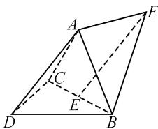
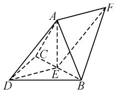
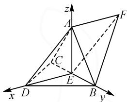

# 空间向量在立体几何中应用的误区

# ● 江苏省阜宁中学 李新军

# 1 问题提出

2023年全国高考Ⅱ卷的立体几何题:如图1,三棱锥A-BCD中, $DA=DB=DC$ , $\angle ADC=\angle ADB=60^{\circ}$ , $DB\perp DC$ ,E为BC的中点.

text_image

Geometric diagram of a quadrilateral with labeled vertices A, B, C, D, E, F and solid/dashed edges

图 1

(1) 求证: $DA \perp BC$ ;

(2) 若点 F 满足 $\overrightarrow{DA} = \overrightarrow{EF}$ ，求二面角 D-AB-F 的正弦值.

笔者从几个民间公众号中发现,本题绝大部分解答是先用综合法证出 $AE \perp BC$ , 然后建立空间直角坐标系, 通过坐标运算来解决. 为什么会出现这种千篇一律的处理方式呢? 如果 $\angle ADC = 45^{\circ}, \angle ADB = 60^{\circ}$ 又是怎样的呢? 是因为这种处理方式很好还是其他原因呢? 无独有偶, 笔者在最近一次优课比赛的听课学习中也发现了这个问题, 本次赛课的课题是“空间向量与立体几何复习课”, 很多选手处理问题的角度惊人地相似, 基本都是选择运用空间直角坐标系解决空间角与距离问题. 从学生的回答来看, 坐标法也是首选, 当老师给出的图形不太适合建立坐标系时, 学生立刻就想到了综合几何法, 让人感觉到空间向量在立体几何中的运用就是坐标法. 笔者认为, 这可能是教者在处理空间向量在立体几何中应用时思维上的一个误区. 那么, 这种固化的思维是怎么形成的呢?

# 2 误区形成的原因

# 2.1 先入为主,思维误导

运用空间直角坐标系解决立体几何问题,最初出现在教师和学生的视线里是在2008年高考之前,当时苏教版教材中没有空间向量这一章,部分教师为了应对高考中的立体几何计算问题,额外给学生作了补充,结果在高考中取得了非常好的效果,于是乎很多教师跟风效仿这一行为.当新教材中出现空间向量时,教师们在教学过程中出现了轻空间向量基本定理重坐标运算的现象,直到近两年高考中坐标法不“香”了时,大家才开始重视“综合几何法”.那是不是当题目已知条件不方便建系时就只能用“综合几何法”呢?

笔者在一些关于“空间向量”的教学建议的文章中也发现更多的是在讲如何建系,如何求法向量,如“教学时应当采用最基本的长方体或正方体模型进行方法教学与练习，暂时撇开建系难度。待学生掌握好基本求解方法后，再进行建系训练，逐步让学生接触仅有两边垂直、需要找第三边垂直便能顺利建系的模型，或是三边均不相互垂直，寻找建系基础的锻炼”[1]。类似的教学建议有很多，侧重点都是坐标法的运用。这在某种程度上是对教学的一种误导，也是现在教学中误区形成的一个原因。

# 2.2 缺乏创新,经验主义

新高考的改革为原有数学教学体系进行了针对性优化，并且《普通高中数学课程标准（2017年版2020年修订）》（以下简称《课标》）也顺应新高考改革作了相应调整。但就“空间向量与立体几何”的教学情况来看，教师在教学中依然存在难以落实新高考要求的现象，缺乏创新性的数学思维，错误地认为将空间向量应用在立体几何中就是坐标法的运用，用多年来的“经验”来指导教学，只关心“法”不关心“基”，导致了教学误区的形成。

# 3 如何走出误区

# 3.1《课标》引领,立足课本

《课标》提出,空间向量与立体几何的教学中,应重视以下两个方面:第一,引导学生运用类比的方法,经历向量及其运算由平面向空间的推广过程,探索空间向量与平面向量的共性和差异,引发学生思考维度增加所带来的影响;第二,鼓励学生灵活选择向量方法和综合几何法,从不同角度解决立体几何问题(如距离问题),通过对比体会向量方法的优势.在上述过程中,引导学生理解向量基本定理的本质,感悟“基”的思想,并运用它解决立体几何的问题 $^{[2]}$ .但在一线教学过程中主要体现在正交基底状态下的坐标法,这是对课标的解读出现了偏差.教师在教学过程中凭借经验总结的“坐标法不行就综合法”的解题“策略”,事实上也不完全正确.

# 3.2 重视基本理论,追本溯源

首先我们需了解空间向量中的两条基本理论：

(1)共面向量定理:如果两个向量 a, b 不共线,那么向量 p 与向量 a, b 共面的充要条件是存在唯一有序实数组 $(x, y)$ , 使得 $p = xa + yb$ .

(2)空间向量基本定理:如果三个向量 $e_{1}, e_{2}, e_{3}$ 不共面,那么对空间任意一向量 p, 存在唯一的有序实数对 $(x, y, z)$ , 使得 $p = xe_{1} + ye_{2} + ze_{3}$ . 其中 $e_{1}, e_{2}, e_{3}$ 为空间中的一组基底.

借助这两个定理,我们可以解决立体几何中的位置关系的证明与判断和角与距离的计算问题.而坐标法只是在基底为正交状态下的特殊情况.下面我们从两个角度来解决2023年全国高卷Ⅱ卷的立体几何题,感受被忽视的基底法的魅力.

方法一: 综合几何法结合坐标法.

(1)证明:如图2,连接AE,DE,因为 $DA=DB=DC,\angle ADB=\angle ADC=60^{\circ}$ ,所以 $\triangle ACD$ 与 $\triangle ABD$ 都是等边三角形,所以AC=AB.

text_image

Geometric diagram of a tetrahedron with labeled vertices A, B, C, D, E, F and solid/dashed edges indicating 3D perspective.

图 2

因为 E 为 BC 的中点, 所以$AE \perp BC, DE \perp BC.$ 又 $AE \cap DE = E$ ，所以 $BC \perp$ 平面 ADE，又 $AD \subset$ 平面 ADE，所以 $BC \perp DA.$

(2) 解: 设 DA = DB = DC = a，所以 $BC = \sqrt{2}a$ ， $DE=AE=\frac{\sqrt{2}a}{2}$ ，则 $AE^{2}+DE^{2}=a^{2}=AD^{2}$ ，所以 $AE\perp DE.$ 又 $AE\perp BC, DE\cap BC=E$ ，所以 $AE\perp$ 平面 BCD.

以 $\{\overrightarrow{ED},\overrightarrow{EB},\overrightarrow{EA}\}$ 为基底建立如图3所示的空间直角坐标系，则 $E(0,0,0)$ ， $A\left(0,0,\frac{\sqrt{2}a}{2}\right),B\left(0,\frac{\sqrt{2}a}{2},0\right),$ $D\left(\frac{\sqrt{2}a}{2},0,0\right).$

text_image

z
A
F
C
E
x
D
B
y

图3

设 $F(x,y,z)$ ，由 $\overrightarrow{EF} = \overrightarrow{DA}$ ，得 $(x,y,z) =$ $\left(-\frac{\sqrt{2}a}{2},0,\frac{\sqrt{2}a}{2}\right)$ .故点 $F$ 的坐标为 $\left(-\frac{\sqrt{2}a}{2},0,\frac{\sqrt{2}a}{2}\right)$

设平面 ADB 的一个法向量为 $\overrightarrow{n_{1}}=(x_{1},y_{1},z_{1})$ ，又 $\overrightarrow{AD}=\left(\frac{\sqrt{2}a}{2},0,-\frac{\sqrt{2}a}{2}\right),\overrightarrow{BD}=\left(\frac{\sqrt{2}a}{2},-\frac{\sqrt{2}a}{2},0\right)$ ，所以 $\left\{\begin{aligned}\frac{\sqrt{2}a}{2}x_{1}-\frac{\sqrt{2}a}{2}z_{1}&=0,\\ \frac{\sqrt{2}a}{2}x_{1}-\frac{\sqrt{2}a}{2}y_{1}&=0.\end{aligned}\right.$ 取 $x_{1}=1$ ，得 $y_{1}=z_{1}=1$ ，所以 $\overrightarrow{n_{1}}=(1,1,1)$ .

设平面 $ABF$ 的一个法向量为 $\overrightarrow{n_2} = (x_2, y_2, z_2)$ ，又 $\overrightarrow{AB} = \left(0, \frac{\sqrt{2}a}{2}, -\frac{\sqrt{2}a}{2}\right), \overrightarrow{BF} = \left(-\frac{\sqrt{2}a}{2}, -\frac{\sqrt{2}a}{2}, \frac{\sqrt{2}a}{2}\right)$ ，所以 $\left\{ \begin{array}{l} \frac{\sqrt{2}a}{2}y_2 - \frac{\sqrt{2}a}{2}z_2 = 0, \\ -\frac{\sqrt{2}a}{2}x_2 - \frac{\sqrt{2}a}{2}y_2 + \frac{\sqrt{2}a}{2}z_2 = 0. \end{array} \right.$ 取 $y_2 = 1$ ，可得

$z_{2}=1,x_{2}=0$ ,所以 $\overrightarrow{n_{2}}=(0,1,1)$ .

所以 $\cos \langle \overrightarrow{n_1},\overrightarrow{n_2}\rangle = \frac{\overrightarrow{n_1} \cdot \overrightarrow{n_2}}{|\overrightarrow{n_1}| |\overrightarrow{n_2}|} = \frac{\sqrt{6}}{3}$ .

故二面角 D-AB-F 的正弦值为 $\frac{\sqrt{3}}{3}$ .

方法二: 基底法.

(1) 证明: 因为 $\overrightarrow{BC} = \overrightarrow{DC} - \overrightarrow{DB}$ , 所以 $\overrightarrow{BC} \cdot \overrightarrow{DA} = (\overrightarrow{DC} - \overrightarrow{DB}) \cdot \overrightarrow{DA} = \overrightarrow{DC} \cdot \overrightarrow{DA} - \overrightarrow{DB} \cdot \overrightarrow{DA} = \frac{1}{2} a^2 - \frac{1}{2} a^2 = 0$ (其中 $DA = DC = DB = a$ ). 所以, $BC \perp AD$ .

(2) 解: 设平面 ABD 的法向量为 $\overrightarrow{n_{1}} = x \overrightarrow{DA} + y \overrightarrow{DB} + z \overrightarrow{DC}$ ，则

$$
\begin{array}{l} \overrightarrow {D A} \cdot \overrightarrow {n _ {1}} = \overrightarrow {D A} \cdot (x \overrightarrow {D A} + y \overrightarrow {D B} + z \overrightarrow {D C}) = 0, \\ \overrightarrow {D B} \cdot \overrightarrow {n _ {1}} = \overrightarrow {D B} \cdot (x \overrightarrow {D A} + y \overrightarrow {D B} + z \overrightarrow {D C}) = 0. \\ \end{array}
$$

取 x=2，得 y=-1, z=-3.

所以 $\overrightarrow{n_{1}}=2\overrightarrow{DA}-\overrightarrow{DB}-3\overrightarrow{DC}.$

同理, 平面 ABF 的一个法向量为 $\overrightarrow{n_{2}} = \overrightarrow{DA} - \overrightarrow{DC}$ .

所以 $\overrightarrow{n_1^2} = (2\overrightarrow{DA} -\overrightarrow{DB} -3\overrightarrow{DC})^2 = \sqrt{6} a^2$

$$
\overrightarrow {n _ {1}} ^ {2} = (\overrightarrow {D A} - \overrightarrow {D C}) ^ {2} = a ^ {2}.
$$

又 $\vec{n_1} \cdot \vec{n_2} = (2\overrightarrow{DA} - \overrightarrow{DB} - 3\overrightarrow{DC}) \cdot (\overrightarrow{DA} - \overrightarrow{DC}) = 2a^2$ ，所以 $\cos \langle \vec{n_1}, \vec{n_2} \rangle = \frac{\vec{n_1} \cdot \vec{n_2}}{|\vec{n_1}| |\vec{n_2}|} = \frac{\sqrt{6}}{3}$ .

故二面角 D-AB-F 的正弦值为 $\frac{\sqrt{3}}{3}$ .

方法一依赖于正交基底,想方设法寻找正交基底,然后建立直角坐标系;方法二不需要寻找正交基底,给出一组已知模和夹角的基底就可以解决空间角与距离问题.全国Ⅰ卷的立体几何题,建系特征明显,两套试卷充分体现了课标的精神:鼓励学生灵活选择运用向量方法和综合几何方法,从不同角度解决立体几何问题,通过对比体会向量方法的优势.

# 4 结束语

空间向量在立体几何中的应用,应站在空间向量基本定理的本质上看问题,而不应该将向量的应用局限在坐标运算这样的思维误区.

# 参考文献：

[1] 黄华胜, 招毅峰. 对空间向量教学方法的理解 [J]. 新课程 (中旬), 2013(1): 96-97.

[2]中华人民共和国教育部.普通高中数学课程标准(2017年版2020年修订)[S].北京:人民教育出版社,2020.Z