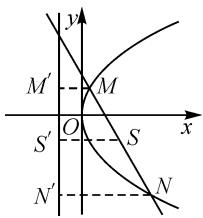
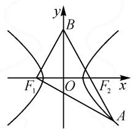
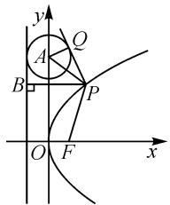
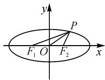

# 解析几何客观试题求解中的一般观念

● 安徽省淮北市第二中学 薛 涛  
● 安徽省濉溪县第二中学 祝峰

具有数学基本特征的思维品质、关键能力以及情感、态度与价值观的综合谓之数学学科核心素养，集中体现在学习和应用数学过程中所持的数学学科一般观念。一般观念是对数学学习和研究具有广泛、持久、深刻影响的基本思维策略和基本数学思想。高考备考的课堂教学中，结合具体试题，引领学生在明确考查内容和要求的基础上，进一步凝练相关学科一般观念，有助于学生学科核心素养的有效发展。下文以2023与2024年高考全国卷中的解析几何客观试题为例，结合试题特征，提炼出包括“概念观、构图观、转化观、严谨运算观”在内的四种解析几何学科一般观念，旨在为解析几何备考教学的效率提升提供一个参考视角。

# 1 课标要求及“考势”

《普通高中数学课程标准(2017年版2020年修订)》(下简称《课标》)中，“平面解析几何”被置于选择性必修课程，主题二，几何与代数，第二单元.内容包括：直线与方程、圆与方程、圆锥曲线与方程.《课标》要求帮助学生学会运用代数的方法进一步认识圆锥曲线的性质及它们的位置关系；运用平面解析几何的方法解决简单的数学问题，感悟平面解析几何中蕴含的数学思想.重点提升学生的直观想象、数学运算、数学建模、逻辑推理和数学抽象素养.

数学高考全国卷中，三道客观题，一道解答题，是解析几何内容常见的设置形式。客观试题除具有“简明扼要、信息丰富、涵盖广泛、灵活多变、解法多样”等一般数学客观题的基本特征外，还有着“重概念、尚推理、无图化、巧运算”等独有特征。这样的试题特征使得概念观、构图观、转化观、严谨运算观在问题解决过程中有着不容忽视的强大力量。它们无法在“题型+套路”的机械刷题中获得，只有在数学学习和研究过程中不断体会、反思、凝练、构建而来。

# 2 与解析几何客观试题相关的一般观念

# 2.1 概念观

数学根本上是玩概念的,不是玩技巧.技巧不足道也！数学解题中，概念最有力量，这一观念在解析几何客观试题的求解中尤为关键。概念及其所蕴含的方法和思想本来就是解析几何客观试题考查的重点。解析几何客观试题求解过程中，从概念出发，基于概念的内涵和外延，借助概念直观的几何背景，理解、分析、解决问题的思维策略叫做概念观。

例 1 （2023 年全国卷Ⅱ第 10 题）设 O 为坐标原点，直线 $y = -\sqrt{3}(x - 1)$ 过抛物线 $C: y^{2} = 2px (p > 0)$ 的焦点，且与 C 交于 M, N 两点，l 为 C 的准线，则（）.

A. $p = 2$   
B. $|MN| = \frac{8}{3}$   
C. 以 $MN$ 为直径的圆与 $l$ 相切  
D. $\triangle OMN$ 为等腰三角形

解析: 直线 $y = -\sqrt{3}(x - 1)$ 与 x 轴的交点为 $(1,0)$ ，所以 $\frac{p}{2} = 1$ ，则 p = 2，故选项 A 正确.

设 $M(x_{1},y_{1}), N(x_{2},y_{2})$ . 将直线方程与抛物线方程联立，得 $3x^{2}-10x+3=0$ ，则 $x_{1}+x_{2}=\frac{10}{3}$ .

如图1, 分别过点 $M, N$ 作 $l$ 的垂线, 垂足为 $M', N'$ . 由抛物线定义知, $|MN| = |MM'| + |NN'| = x_1 + x_2 + p = \frac{16}{3}$ , 故选项B错误.

设线段 MN 中点为 S，作 $SS' \perp l$ ，垂足为 $S'$ ，则 $|SS'| = \frac{1}{2} (|MM'| + |NN'|) = \frac{1}{2} |MN|$ ，

故选项 C 正确.

text_image

y
M'
M
S'
O
S
x
N'
N

图1

结合方程 $3x^{2} - 10x + 3 = 0$ ，易得 $M\left(\frac{1}{3},\frac{2\sqrt{3}}{3}\right)$ $N(3, - 2\sqrt{3})$ ，则 $\vert OM\vert = \frac{\sqrt{13}}{3},\vert ON\vert = \sqrt{21}.$ 所以 $\triangle OMN$ 不是等腰三角形，故选项D错误.

评析: $|MN|=|MM'|+|NN'|$ 是解答这个问题的核心.这一发现的思维源泉是抛物线的概念,只有从概念视角审视问题,才会有这样的结论.

相关试题 1 （2024 年全国卷Ⅰ第 12 题）设双曲线 $C: \frac{x^{2}}{a^{2}} - \frac{y^{2}}{b^{2}} = 1 (a > 0, b > 0)$ 的左、右焦点分别为 $F_{1}, F_{2}$ ，过 $F_{2}$ 作平行于 y 轴的直线交 C 于 A, B 两点，若 $|F_{1}A| = 13, |AB| = 10$ ，则 C 的离心率为 \_\_\_\_.

概念观引领下，结合双曲线对称性，在直角三角形 $AF_{1}F_{2}$ 中，借助双曲线概念及勾股定理，求出 a=4, c=6，进而利用离心率定义即可解决问题.

# 2.2 构图观

解析几何的研究对象是几何图形,研究方法为代数法,这一学科特征决定了代数运算在问题求解中举足轻重,而图形作用在这一理念下常被弱化.舍弃图形几何性质的深度挖掘,追求程序化代数运算的现象,在解析几何问题的求解中司空见惯.值得关注的是,解析几何的研究对象是几何图形,依据问题情境,作出形象、直观且能够揭示问题本质的图形,对解析几何客观题的求解至关重要.在图形的助力下,几何要素才能得以彰显,几何性质才能被充分挖掘,所学知识才能被充分调用.积极作图、研图、用图的“构图观”在解析几何的备考中值得关注.

例 2 （2023 年全国卷Ⅰ第 16 题）已知双曲线 C： $\frac{x^{2}}{a^{2}}-\frac{y^{2}}{b^{2}}=1(a>0,b>0)$ 的左、右焦点分别为 $F_{1}, F_{2}$ ，点 A 在 C 上，点 B 在 y 轴上， $\overrightarrow{F_{1}A} \perp \overrightarrow{F_{1}B}, \overrightarrow{F_{2}A} = -\frac{2}{3}\overrightarrow{F_{2}B}$ ，则 C 的离心率为 \_\_\_\_.

解析:如图2所示,令 $|F_{2}B|=3t=|F_{1}B|$ ,则 $|F_{2}A|=2t,|F_{1}A|=2a+2t.$

text_image

y
B
F₁ O F₂ x
A

在直角三角形 $F_{1}AB$ 中，

$$
\sin \angle F _ {1} A B = \frac {| F _ {1} B |}{| A B |} = \frac {3}{5},
$$

则 $\cos\angle F_{1}AB=\frac{4}{5}=\frac{|F_{1}A|}{|AB|}=\frac{2a+2t}{5t}$ ，所以 t=a。

在 $\triangle F_{1}AF_{2}$ 中，由余弦定理知

$\left|F_{1}F_{2}\right|^{2}=\left|F_{1}A^{2}\right|+\left|F_{2}A^{2}\right|-2\left|F_{1}A\right|\cdot\left|F_{2}A\right|\cdot\cos\angle F_{1}AB,$

即 $(2c)^{2} = (4a)^{2} + (2a)^{2} - 2\times 4a\times 2a\times \frac{4}{5}$

化简得 $5c^{2}=9a^{2}$ ，所以离心率 $e=\frac{3\sqrt{5}}{5}$ .

评析: 构图观有两层内涵, 一方面是把图形的代数和几何特征转化为几何直观, 是作图的过程, 由条件作出图 2; 另一方面则是借助已构建的几何图形, 通过几何要素的性质构建数量关系, 是用图的过程, 如依据相关比例关系设出 $\left|F_{2}A\right|,\left|F_{2}B\right|$ ，依据对称性获得 $\left|F_{1}A\right|$ ，由双曲线定义获得 $\left|F_{1}A\right|=2a+2t$ 等。整个求解过程建立在构图和用图的基本观念之上。

相关试题 2 （2024 年全国卷Ⅱ第 10 题）抛物线 $C: y^{2} = 4x$ 的准线为 l, P 为 C 上的动点，过 P 作 $\odot A: x^{2} + (y - 4)^{2} = 1$ 的一条切线，Q 为切点，过 P 作 l 的垂线，垂足为 B，则（）

text_image

y
Q
A
B
P
O
F
x

图3

A. $l$ 与 $\odot A$ 相切  
B. 当 P, A, B 三点共线时， $|PQ| = \sqrt{15}$   
C. 当 $\left|PB\right|=2$ 时, $PA \perp AB$   
D. 满足 $\left|PA\right|=\left|PB\right|$ 的点 P 有且仅有 2 个

试题涉及两曲线,关系复杂,条件冗长,如果没有恰当图形的辅助,很难厘清表象背后的问题本质,依据题设条件,构建图3所示几何图形,以打开问题解决的思路.

# 2.3 转化观

转化与化归是数学问题解决的基本思想.解析几何客观试题的特征,决定了其解决过程中转化思维有着自身的特殊性.最显著的是图形几何特征与数量关系的相互转化,即图形特征和方程特征之间的关联.虽然解析几何客观试题求解中代数运算非常重要,但运算过程中需时刻关注运算表达式的几何意义是什么,充分挖掘图形的几何特征并恰时恰点渗透到代数运算中去,同时关注代数运算结果所反映的图形的几何特征,二者兼顾,时刻转化,才能使数与形相得益彰.当然,常见的熟悉化、简单化、直观化、特殊化、具体化、类比化也是解决这类问题常见的转化观念.

例 3 （2023 年全国甲卷第 12 题）已知椭圆 $\frac{x^{2}}{9} + \frac{y^{2}}{6} = 1, F_{1}, F_{2}$ 为两个焦点，O 为坐标原点，P 为椭圆上一点， $\cos \angle F_{1} PF_{2} = \frac{3}{5}$ ，则 $|PO| = (\quad)$ .

A. $\frac{2}{5}$

B. $\frac{\sqrt{30}}{2}$

C. $\frac{3}{5}$

D. $\frac{\sqrt{35}}{2}$

解析: 如图 4 所示, 设 $\left|PF_{1}\right|=r_{1},\left|PF_{2}\right|=r_{2}$ , 则 $r_{1}+r_{2}=6$ . 在 $\triangle PF_{1}F_{2}$ 中, 有

$\overrightarrow{PO} = \frac{1}{2} (\overrightarrow{PF_1} +\overrightarrow{PF_2})$

$$
\begin{array}{l} \overrightarrow {O P} ^ {2} = \frac {1}{4} \left(r _ {1} ^ {2} + r _ {2} ^ {2} + 2 r _ {1} r _ {2} \times \frac {3}{5}\right) \\ = \frac {1}{4} \left[ \left(r _ {1} + r _ {2}\right) ^ {2} - \frac {4}{5} r _ {1} r _ {2} \right] \\ \overrightarrow {O P} ^ {2} = \frac {1}{4} \left(r _ {1} ^ {2} + r _ {2} ^ {2} + 2 r _ {1} r _ {2} \times \frac {3}{5}\right) \\ = \frac {1}{4} \left[ \left(r _ {1} + r _ {2}\right) ^ {2} - \frac {4}{5} r _ {1} r _ {2} \right] \\ \end{array}
$$

  
图4

$$
\begin{array}{l} \overrightarrow {O P} ^ {2} = \frac {1}{4} \left(r _ {1} ^ {2} + r _ {2} ^ {2} + 2 r _ {1} r _ {2} \times \frac {3}{5}\right) \\ = \frac {1}{4} \left[ \left(r _ {1} + r _ {2}\right) ^ {2} - \frac {4}{5} r _ {1} r _ {2} \right] \\ \overrightarrow {O P} ^ {2} = \frac {1}{4} \left(r _ {1} ^ {2} + r _ {2} ^ {2} + 2 r _ {1} r _ {2} \times \frac {3}{5}\right) \\ = \frac {1}{4} \left[ \left(r _ {1} + r _ {2}\right) ^ {2} - \frac {4}{5} r _ {1} r _ {2} \right] \\ \end{array}
$$

$$
= 9 - \frac {1}{5} r _ {1} r _ {2}.
$$

在 $\triangle PF_{1}F_{2}$ 中，由余弦定理知

$$
\left| F _ {1} F _ {2} \right| ^ {2} = r _ {1} ^ {2} + r _ {2} ^ {2} - 2 r _ {1} r _ {2} \times \frac {3}{5},
$$

即 $12=(r_{1}+r_{2})^{2}-2r_{1}r_{2}-2r_{1}r_{2}\times\frac{3}{5}.$

解得 $r_{1}r_{2}=\frac{15}{2}$ .

所以 $\overrightarrow{OP^2} = 9 - \frac{1}{5}\times \frac{15}{2} = \frac{15}{2}$ 即 $|PO| = \frac{\sqrt{30}}{2}$

评析:试题聚焦椭圆 $\frac{x^{2}}{9}+\frac{y^{2}}{6}=1$ 中的三角形 $PF_{1}F_{2}$ ，它有着一系列显著的几何特征——顶点P在椭圆上，顶点 $F_{1},F_{2}$ 为椭圆的焦点且关于原点O对称， $\cos\angle F_{1}PF_{2}=\frac{3}{5}$ .把这些几何特征转化为数量关系是问题解决的关键.首先将点P在椭圆上转化为 $r_{1}+r_{2}=6$ ，线段 $F_{1}F_{2}$ 中点为O转化为向量关系 $\overrightarrow{PO}=\frac{1}{2}\left(\overrightarrow{PF_{1}}+\overrightarrow{PF_{2}}\right)$ ，余弦值则联系了余弦定理.试题求解过程中渗透着几何直观和代数运算之间的相互化归，这种化归的思维方式在解析几何客观试题求解中有着统摄性功能.

相关试题3（2024年全国甲卷第12题）已知 $b$ 是 $a, c$ 的等差中项，直线 $ax + by + c = 0$ 与圆 $x^{2} + y^{2} + 4y - 1 = 0$ 交于 $A, B$ 两点，则 $|AB|$ 的最小值为（）

A.2

B. 3

C. 4

D. $2\sqrt{5}$

三个数成等差数列转化为 c=2b-a，代入直线方程，能够发现直线恒过点 $P(1,-2)$ ，注意到该点在圆内，问题转化为过圆内一点的动直线被圆截得弦长的最小值问题.

# 2.4 严谨运算观

《课标》把平面解析几何解决问题的基本过程阐述为:根据具体问题情境特点,建立平面直角坐标系;根据几何问题特点,用代数语言把几何问题转化为代数问题;根据对几何问题(图形)的分析,探索问题思路;运用代数方法得到结论,给代数结论合理的几何解释,解决几何问题.这样的界定明确了解析几何的研究对象、研究策略和研究手段.基于研究对象我们提出了概念观和构图观,聚焦研究策略提出了转化观,若关注解析几何的研究手段,则“严谨运算观”必不可少.代数运算是解决解析几何问题的基本手段,解析几何客观题的求解当然也不例外.结合客观试题的特征,严谨运算观更关注借力几何直观、注重系统分析、重视

比较优化、扎根方程思想、遵循等价转化、倡导路径自然等方面.

例 4 （2023 年乙卷第 11 题）设 A, B 为双曲线 $x^{2}-\frac{y^{2}}{9}=1$ 上两点，下列四个点中，可为线段 AB 中点的是（）.

A.(1,1)

B. $(-1,2)$

C.(1,3)

D. $(-1,-4)$

解析: 设 $A(x_{1}, y_{1}), B(x_{2}, y_{2}), x_{1} \neq x_{2}$ ，则 AB 的中点 $M\left(\frac{x_{1} + x_{2}}{2}, \frac{y_{1} + y_{2}}{2}\right)$ ，注意到 $k_{AB} = \frac{y_{1} - y_{2}}{x_{1} - x_{2}}$ ,

$$
k _ {O M} = \frac {\frac {y _ {1} + y _ {2}}{2}}{\frac {x _ {1} + x _ {2}}{2}} = \frac {y _ {1} + y _ {2}}{x _ {1} + x _ {2}}.
$$

由 $\left\{ \begin{array}{l} x_{1}^{2} - \frac{y_{1}^{2}}{9} = 1, \\ x_{2}^{2} - \frac{y_{2}^{2}}{9} = 1, \end{array} \right.$ 得 $(x_{1}^{2} - x_{2}^{2}) - \frac{y_{1}^{2} - y_{2}^{2}}{9} = 0$ ，则

$$
k _ {A B} \cdot k _ {O M} = \frac {y _ {1} ^ {2} - y _ {2} ^ {2}}{x _ {1} ^ {2} - x _ {2} ^ {2}} = 9.
$$

对于选项 A, 可得 $k_{OM}=1, k_{AB}=9$ , 直线 AB 方程为 y=9x-8, 联立方程 $\left\{\begin{aligned}y&=9x-8,\\ x^{2}&-\frac{y^{2}}{9}=1,\end{aligned}\right.$ 消去 y, 得

$$
7 2 x ^ {2} - 2 \times 7 2 x + 7 3 = 0.
$$

因为 $\Delta=(-2\times72)^{2}-4\times72\times73=-288<0$ ，所以直线 AB 与双曲线没有交点，故选项 A 错误.

同理,能够得到选项 B,C 错误,故选项 D 正确.

评析:试题聚焦运用代数运算解决图形几何性质的问题,系统分析下,通过比较优化、合理运算获得 $k_{AB}\cdot k_{OM}=9$ .结合选择支,在方程思想的引领下,对四个选项的正误作出判断.

相关试题 4 （2024 年全国卷Ⅱ第 10 题）参见前文相关试题 2.

抛物线与圆关联的综合问题,需在构图观、概念观、转化观基础上,借助坐标法思想,进行详尽的代数运算才能对四个选项的正误作出判断.

概念观、构图观、转化观及严谨运算观是契合解析几何客观试题特征，蕴含于解析几何知识背后的思维策略和思想方法。它们对解析几何客观试题求解有着持续、稳定、有效的影响，是策略性知识。高考备考的课堂教学中，聚焦学科一般观念，远离“题型+技巧”，是一种值得尝试的既“育分”又“育人”的有效之举。Z